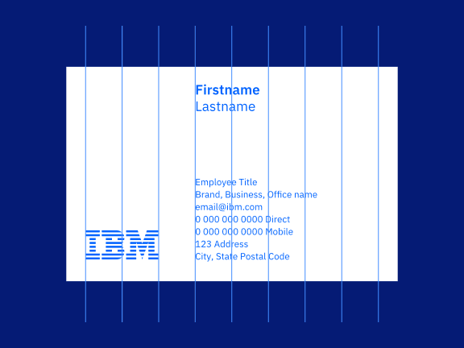
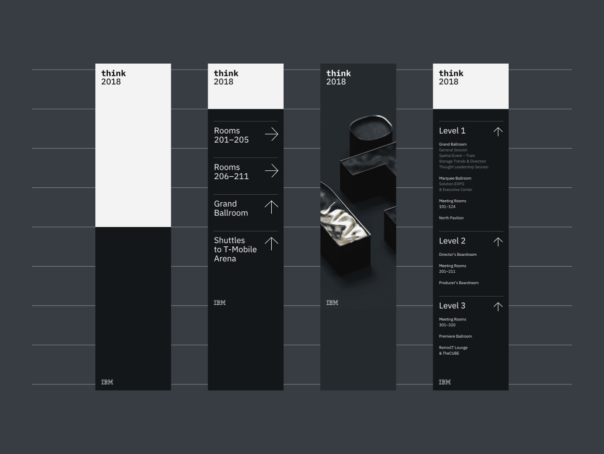
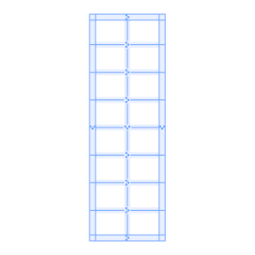
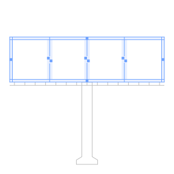
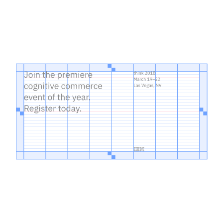

<PageDescription>

The IBM grid is the framework for all the visual elements and typography. It’s
fundamental to everything we design. No matter what device or medium you’re
working with, the grid gives you just enough structure and guidance so you can
focus on your creative idea.

</PageDescription>

<AnchorLinks>
  <AnchorLink>Divisions of two</AnchorLink>
  <AnchorLink>Constructing the 2x grid</AnchorLink>
  <AnchorLink>Base unit</AnchorLink>
  <AnchorLink>Spatial relationships</AnchorLink>
  <AnchorLink>2x Grid in UI</AnchorLink>
  <AnchorLink>2x Grid for video</AnchorLink>

</AnchorLinks>

<Video vimeoId="337387156" />

## Divisions of two

At the core of the 2x Grid concept is the idea of divisions of two. This can be
applied to most surfaces, 3-D objects, and architecture as a means to divide
space into a helpful grid system. Dividing your space into 2, 4, 8, 16, 32, or
64 columns gives you the basis of the system with the purpose of helping you
make decisions and organize your content.

<Video src="/videos/divisions-of-two.mp4" poster="/images/divisions.jpg" />

<ImageGallery>

<ImageGalleryImage alt="watson chatbot" title="Watson chatbot" col={8}>

</ImageGalleryImage>

<ImageGalleryImage alt="business card" title="Business card" col={4}>

</ImageGalleryImage>

<ImageGalleryImage alt="cloud high performance" title="Cloud high performance" col={4}>

</ImageGalleryImage>

<ImageGalleryImage alt="icon grid" title="Icon grid" col={4}>

<GifPlayer>

</GifPlayer>

</ImageGalleryImage>

<ImageGalleryImage alt="grid example" title="Grid example" col={4}>

</ImageGalleryImage>

<ImageGalleryImage alt="street with rain" title="street with rain" col={4}>

</ImageGalleryImage>

<ImageGalleryImage alt="think schedule" title="Think schedule" col={8}>

</ImageGalleryImage>

<ImageGalleryImage alt="tote bag" title="Tote bag" col={4}>

</ImageGalleryImage>

<ImageGalleryImage alt="watson cloud" title="Watson cloud" col={4}>

<GifPlayer color="dark">

</GifPlayer>

</ImageGalleryImage>

<ImageGalleryImage alt="water thing example" title="Water thing example" col={4}>

</ImageGalleryImage>

</ImageGallery>

## Constructing the 2x grid

Each application of the grid can require a different grid structure. When
constructing the grid, keep in mind these different types of grids and choose
which one best serves your need.

<Row className="mock-gallery">
<Column colMd={2} colLg={4}>

<Caption>No margin or gutter</Caption>

</Column>
<Column colMd={2} colLg={4}>

<Caption>Margin with no gutter</Caption>

</Column>
<Column colMd={2} colLg={4}>

<Caption>Margin and gutter</Caption>

</Column>
</Row>

### Margins

Add margins to your canvas when you need separation of content from the canvas
boundaries. In some cases, margins are specified by the production method.

<Video src="/videos/margins.mp4" poster="/images/margins.jpg" />

<Row className="mock-gallery">
<Column colMd={4} colLg={6}>

<Caption>2x Grid constructed with margins</Caption>

</Column>
<Column colMd={4} colLg={6}>

<Caption>2x Grid without margins</Caption>

</Column>
</Row>

### Columns and rows

Within the grid, columns and rows are especially important—they give layouts
their structure. You can choose between 1, 2, 4, 8, and 16 divisions. Stick to
your choice throughout your design to maintain structure.

<Video
  src="/videos/columns-and-rows.mp4"
  poster="/images/columns-and-rows.jpg"
/>

<Caption>Columns only</Caption>

<Row className="mock-gallery">
<Column colMd={4} colLg={6}>

<Caption>Rows only</Caption>

</Column>
<Column colMd={4} colLg={6}>

<Caption>Columns and rows</Caption>

</Column>
</Row>

<DoDontRow>
<DoDont caption="Always divide the live area to ensure equal column and row widths.">

</DoDont>
<DoDont type="dont" caption="Never divide from the canvas boundary when using a margin.">

</DoDont>
</DoDontRow>

### Gutters

Add gutters to columns and rows when additional space is needed to separate
content. When using gutters, always align type to the gutters rather than the
canvas divisions. Columns and rows must always remain equal.

<Video src="/videos/gutters.mp4" poster="/images/gutters.jpg" />

<Row className="mock-gallery">
<Column colMd={4} colLg={6}>

<Caption>With gutters</Caption>

</Column>
<Column colMd={4} colLg={6}>

<Caption>Without gutters</Caption>

</Column>
</Row>

<DoDontRow>
<DoDont caption="Distribute gutters evenly to achieve equal columns and rows.">

</DoDont>
<DoDont type="dont" caption="Never add gutter to the canvas divisions without redistributing.">

</DoDont>
</DoDontRow>

## Base unit

If the 2x grid gives your designs structure, base units give them precision.
Using a base unit will establish relationships between your grid proportions,
typography, dimensions of shapes, and space between elements. You can choose
either the mini unit or a baseline unit to build your grid and spatial
relationships.

<Video src="/videos/base-unit.mp4" poster="/images/base-unit.jpg" />

### The mini unit

The mini unit can vary in size depending on the media. When choosing an
appropriate unit for your application, consider the viewing distance. Each mini
unit in the scale below has a type scale pairing and was determined by
legibility over distance.

Mini unit sizes based on viewing distance:

| View distance | Mini unit | Media                             | Minimum Type Size (caption) |
| ------------- | --------- | --------------------------------- | --------------------------- |
| 0–0.5m        | 2mm       | Handheld print                    | 6pt                         |
| 0.5–1m        | 4mm       | Print viewed within arm’s reach   | 12pt                        |
| 1–2m          | 8mm       | Posters and small signage         | 24pt                        |
| 2–4m          | 16mm      | Human-scale print                 | 48pt                        |
| 4–8m          | 32mm      | Print viewed from across a room   | 96pt                        |
| 8–16m         | 64mm      | Print viewed from across a street | 192pt                       |

<Row className="mock-gallery">
<Column colMd={2} colLg={4}>

<Caption>Handheld card—2mm mini unit</Caption>

</Column>
<Column colMd={2} colLg={4}>

<Caption>Standing banner—16mm mini unit</Caption>

</Column>
<Column colMd={2} colLg={4}>

<Caption>Billboard—256mm mini unit</Caption>

</Column>
</Row>

<ArtDirection>

</ArtDirection>

<Caption>
  Grids above viewed at intended distance—all mini units have the same apparent
  size.
</Caption>

#### Mini unit for product and web

The 8px mini unit guides everything in both software product and web
environments, from the construction of the grid to all the elements that live
within it.

<Row className="resource-card-group">
<Column colMd={4} colLg={4} noGutterSm>
    <ResourceCard
      subTitle="2x Grid in UI: The mini unit"
      aspectRatio="2:1"
      href="https://www.carbondesignsystem.com/guidelines/2x-grid/overview#mini-unit" 
      >

  </ResourceCard>
</Column>

</Row>

### Baseline unit

For advanced typographic layouts, consider creating a base unit from the leading
of your document. You can use the leading size or a fraction of it to determine
the baseline unit. Although this method requires finer tuning of margins,
gutters, and type specs, it can help establish vertical rhythm and typographic
harmony throughout your design.

The baseline unit can be used to construct all of the grid proportions, or you
can take a hybrid approach by using the mini unit to create your grid and a
baseline grid to guide your content.

<Row className="mock-gallery">
<Column colMd={4} colLg={6}>

<Caption>Baseline unit grid</Caption>

</Column>
<Column colMd={4} colLg={6}>

<Caption>Hybrid mini unit grid with baseline</Caption>

</Column>
</Row>

<Row className="resource-card-group">
<Column colMd={4} colLg={4} noGutterSm>
    <ResourceCard
      subTitle="IBM type scale"
      aspectRatio="2:1"
      href="/typography/type-specs-ui/#scales"
      actionIcon="arrowRight"
      >

  </ResourceCard>
</Column>
<Column colMd={4} colLg={4} noGutterSm>
    <ResourceCard
      subTitle="Thinking with type: baseline grid"
      aspectRatio="2:1"
      href="http://thinkingwithtype.com/grid/#baseline-grid"
      ></ResourceCard>
</Column>
<Column colMd={4} colLg={4} noGutterSm>
    <ResourceCard
      subTitle="Grid systems in graphic design"
      aspectRatio="2:1"
      href="https://www.amazon.com/Grid-Systems-Graphic-Design-Communication/dp/3721201450"
      ></ResourceCard>
</Column>
</Row>

## Spatial relationships

All spacing between elements can be defined by the base unit. Use the following
multiples of your base unit to construct your layout: 1x, 2x, 3x, 4x, 6x, 8x,
10x, 12x. Consistent and replicated use of spacing ensures spatial rhythm
between all content.

<ArtDirection>

</ArtDirection>

<Row className="mock-gallery">
<Column colMd={4} colLg={6}>

<Caption>Standing Banner (mini unit)</Caption>

</Column>
<Column colMd={4} colLg={6}>

<Caption>IBM Letterhead (baseline unit)</Caption>

</Column>
</Row>

### Aspect relationships

Use common aspect ratios, such as 16:9, 4:3, 3:2, 2:1, and 1:1 for images and
containers. Always measure the width to the columns; the height is determined by
it.

<Video src="/videos/aspect-ratios.mp4" poster="/images/aspect-ratios.jpg" />

## 2x Grid in UI

For detailed guidance on how to apply the 2x Grid system to products and user
interfaces, please visit
[Carbon Design System](https://carbondesignsystem.com/).

<Row className="resource-card-group">
<Column colMd={4} colLg={4} noGutterSm>
    <ResourceCard
      subTitle="2x Grid in UI: Overview"
      aspectRatio="2:1"
      href="https://www.carbondesignsystem.com/guidelines/2x-grid/overview"
      actionIcon="launch"
      >

  </ResourceCard>
</Column>
<Column colMd={4} colLg={4} noGutterSm>
    <ResourceCard
      subTitle="2x Grid in UI: Implementation"
      aspectRatio="2:1"
      actionIcon="launch"
      href="https://www.carbondesignsystem.com/guidelines/2x-grid/implementation"
      >

  </ResourceCard>
</Column>
</Row>

## 2x Grid for video

A unique application of the 2x Grid has been derived for the standard 1920x1080
video format. Due to these fixed dimensions and aspect ratio, there is a
fundamental mini unit of 7.5px which allows for perfectly even divisions of the
grid at 30px intervals.

The 8 column structure pictured below will be sufficient for most layouts. If
required, the canvas can be futher subdivided into 16 columns. It is recommended
to have all elements ‘snap to grid’ with 30px increments in order to ensure
proper alignments within the overall layout.

<Row>
<Column colMd={4} colLg={4} noGutterSm>
    <ResourceCard
      download
      subTitle="2x Grid template for video"
      aspectRatio="2:1"
      actionIcon="download"
      href="/files/2x_video_grid.ai"
      >

  </ResourceCard>
</Column>
</Row>

