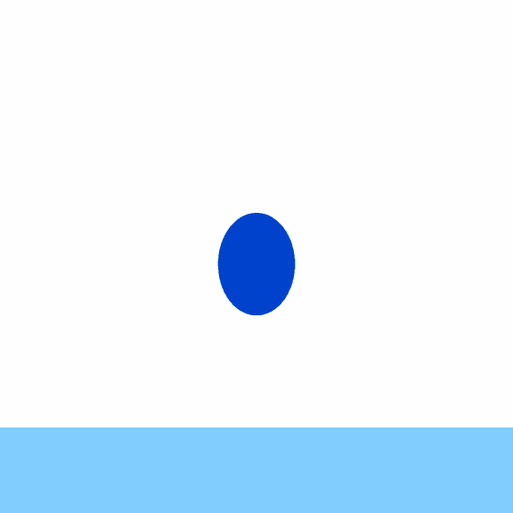
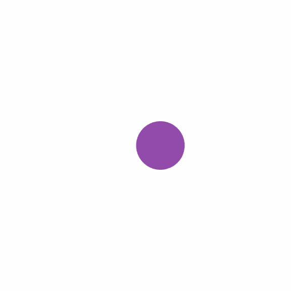
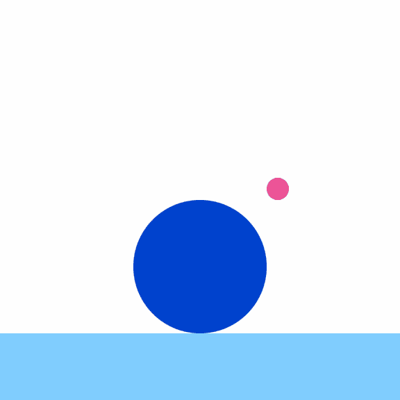

import LottiePlayer from '../../components/LottiePlayer';

<PageDescription>

Most animators are familiar with the
[12 basic principles of animation](https://en.wikipedia.org/wiki/Twelve_basic_principles_of_animation).
Although these principles originally applied to character animation, our unique
interpretation of each one makes it decidedly relevant when applying motion to
graphic forms.

</PageDescription>

## Classic animation principles

### Squash and stretch

Embrace acceleration and reaction but refrain from overt stretchiness and
deformations. Aim for precision and accuracy, not cartoonish playfulness.

<Row className="mock-gallery">
<Column colMd={4} colLg={4}>
<DoDontExample type="do">
<GifPlayer color="dark">

<LottiePlayer src={import(`../../lottie/cp-01-do.json`)} />

</GifPlayer>
</DoDontExample>
</Column>

<Column colMd={4} colLg={4}>
<DoDontExample type="dont">
<GifPlayer color="dark">

<LottiePlayer src={import(`../../lottie/cp-01-dont.json`)} />

</GifPlayer >
</DoDontExample>
</Column>
</Row>

### Anticipation

Use elements under acceleration and deceleration to instigate instant changes
and indicate significance.

<Row className="mock-gallery">
<Column colMd={4} colLg={4}>
<DoDontExample type="do">
<GifPlayer color="dark">

<LottiePlayer src={import(`../../lottie/cp-02-do.json`)} />

</GifPlayer>
</DoDontExample>
</Column>

<Column colMd={4} colLg={4}>
<DoDontExample type="dont">
<GifPlayer color="dark">

<LottiePlayer src={import(`../../lottie/cp-02-dont.json`)} />

</GifPlayer >
</DoDontExample>
</Column>
</Row>

### Staging

Lead the eye. Forego unnecessarily complex or busy compositions and backgrounds
that may detract from meaningful details. Direct attention to what’s most
important by leaning on elements animated in sequence and refraining from
competing actions.

<Row className="mock-gallery">
<Column colMd={4} colLg={4}>
<DoDontExample type="do">
<GifPlayer color="dark">

<LottiePlayer src={import(`../../lottie/cp-03-do.json`)} />

</GifPlayer>
</DoDontExample>
</Column>

<Column colMd={4} colLg={4}>
<DoDontExample type="dont">
<GifPlayer color="dark">

<LottiePlayer src={import(`../../lottie/cp-03-dont.json`)} />

</GifPlayer >
</DoDontExample>
</Column>
</Row>

### Pose to pose

Be efficient; create as few key poses as possible while striving to create
compelling performances.

<Row className="mock-gallery">
<Column colMd={4} colLg={4}>
<DoDontExample type="do">
<GifPlayer color="dark">

<LottiePlayer src={import(`../../lottie/cp-04-do.json`)} />

</GifPlayer>
</DoDontExample>
</Column>

<Column colMd={4} colLg={4}>
<DoDontExample type="dont">
<GifPlayer color="dark">

<LottiePlayer src={import(`../../lottie/cp-04-dont.json`)} />

</GifPlayer >
</DoDontExample>
</Column>
</Row>

### Overlapping action

Secondary elements that inherit the motion of a parent on a slight delay can
create visual interest and emphasis.

<Row className="mock-gallery">
<Column colMd={4} colLg={4}>
<DoDontExample type="do">
<GifPlayer color="dark">

<LottiePlayer src={import(`../../lottie/cp-05-do.json`)} />

</GifPlayer>
</DoDontExample>
</Column>

<Column colMd={4} colLg={4}>
<DoDontExample type="dont">
<GifPlayer color="dark">

<LottiePlayer src={import(`../../lottie/cp-05-dont.json`)} />

</GifPlayer >
</DoDontExample>
</Column>
</Row>

### Slow in and slow out

Objects should behave according to their material and design but will typically
speed up quickly and slow down smoothly. Animation curves that suggest bounce,
stretch or abrupt stops aren’t recommended.

<Row className="mock-gallery">
<Column colMd={4} colLg={4}>
<DoDontExample type="do">
<GifPlayer color="dark">

<LottiePlayer src={import(`../../lottie/cp-06-do.json`)} />

</GifPlayer>
</DoDontExample>
</Column>

<Column colMd={4} colLg={4}>
<DoDontExample type="dont">
<GifPlayer color="dark">

<LottiePlayer src={import(`../../lottie/cp-06-dont.json`)} />

</GifPlayer >
</DoDontExample>
</Column>
</Row>

### Arc

In contrast to this original principle and its advice on creating organic
movements, our projection of purpose and seamless organization can be emphasized
in motion by translating elements on one axis at a time, with a slight overlap
between each one.

<Row className="mock-gallery">
<Column colMd={4} colLg={4}>
<DoDontExample type="do">
<GifPlayer color="dark">

<LottiePlayer src={import(`../../lottie/cp-07-do.json`)} />

</GifPlayer>
</DoDontExample>
</Column>

<Column colMd={4} colLg={4}>
<DoDontExample type="dont">
<GifPlayer color="dark">

<LottiePlayer src={import(`../../lottie/cp-07-dont.json`)} />

</GifPlayer >
</DoDontExample>
</Column>
</Row>

### Secondary action

If necessary, secondary action should be introduced to enhance, or be in
response to, the main action, not distract from it.

<Row className="mock-gallery">
<Column colMd={4} colLg={4}>
<DoDontExample type="do">
<GifPlayer color="dark">

<LottiePlayer src={import(`../../lottie/cp-08-do.json`)} />

</GifPlayer>
</DoDontExample>
</Column>

<Column colMd={4} colLg={4}>
<DoDontExample type="dont">
<GifPlayer color="dark">

<LottiePlayer src={import(`../../lottie/cp-08-dont.json`)} />

</GifPlayer >
</DoDontExample>
</Column>
</Row>

### Timing

Be decisive in getting from point A to point B. Avoid long exponential eases as
elements settle into place.

<Row className="mock-gallery">
<Column colMd={4} colLg={4}>
<DoDontExample type="do">
<GifPlayer color="dark">

<LottiePlayer src={import(`../../lottie/cp-09-do.json`)} />

</GifPlayer>
</DoDontExample>
</Column>

<Column colMd={4} colLg={4}>
<DoDontExample type="dont">
<GifPlayer color="dark">

<LottiePlayer src={import(`../../lottie/cp-09-dont.json`)} />

</GifPlayer >
</DoDontExample>
</Column>
</Row>

### Exaggeration

Exaggeration isn’t employing decoration to create visual interest. Instead,
animate elements in a manner that clearly demonstrates function and purpose.

<Row className="mock-gallery">
<Column colMd={4} colLg={4}>
<DoDontExample type="do">
<GifPlayer color="dark">

<LottiePlayer src={import(`../../lottie/cp-10-do.json`)} />

</GifPlayer>
</DoDontExample>
</Column>

<Column colMd={4} colLg={4}>
<DoDontExample type="dont">
<GifPlayer color="dark">

<LottiePlayer src={import(`../../lottie/cp-10-dont.json`)} />

</GifPlayer >
</DoDontExample>
</Column>
</Row>

### Solid drawing

Be sure to portray an appropriate sense of weight and momentum, especially when
depicting recognizable forms or objects with volume and dimension.

<Row className="mock-gallery">
<Column colMd={4} colLg={4}>
<DoDontExample type="do">
<GifPlayer color="dark">

<LottiePlayer src={import(`../../lottie/cp-11-do.json`)} />

</GifPlayer>
</DoDontExample>
</Column>

<Column colMd={4} colLg={4}>
<DoDontExample type="dont">
<GifPlayer color="dark">

<LottiePlayer src={import(`../../lottie/cp-11-dont.json`)} />

</GifPlayer >
</DoDontExample>
</Column>
</Row>

### Appeal

Look for opportunities to create moments of compelling—yet considered—surprise
and delight when applying motion to designs.

<Row className="mock-gallery">
<Column colMd={4} colLg={4}>
<DoDontExample type="do">
<GifPlayer color="dark">

<LottiePlayer src={import(`../../lottie/cp-12-do.json`)} />

</GifPlayer>
</DoDontExample>
</Column>

<Column colMd={4} colLg={4}>
<DoDontExample type="dont">
<GifPlayer color="dark">

<LottiePlayer src={import(`../../lottie/cp-12-dont.json`)} />

</GifPlayer >
</DoDontExample>
</Column>
</Row>
