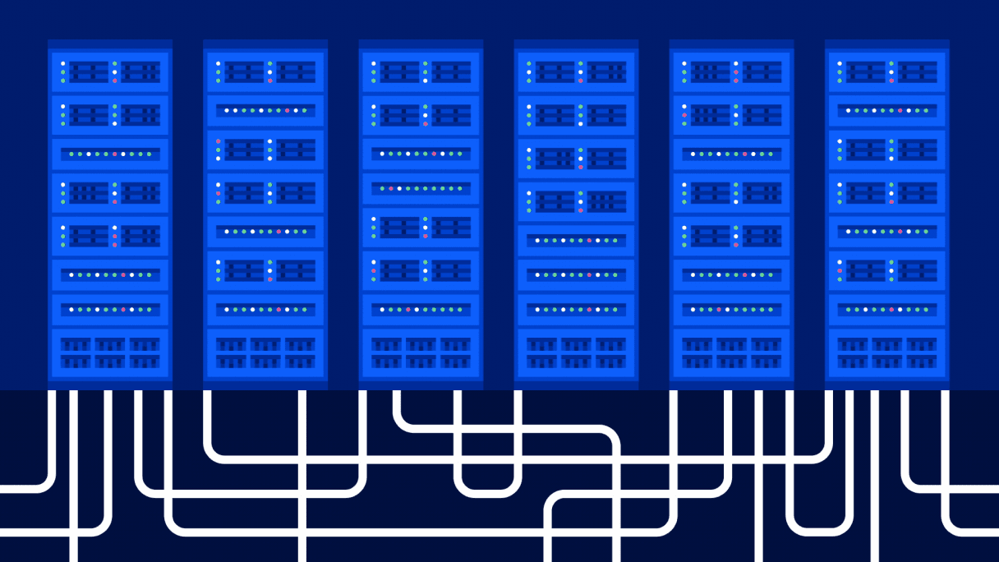
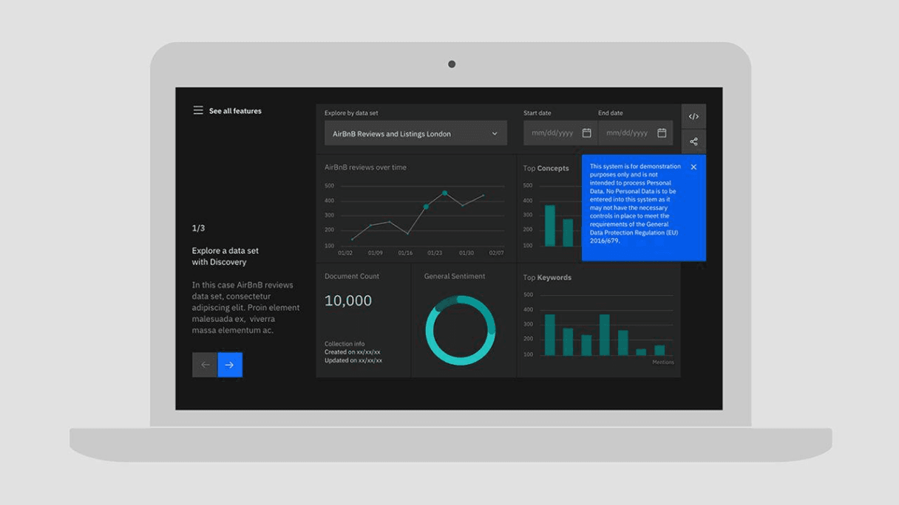

import poster from './images/animation-overview-pe-poster.png';

<PageDescription>

Animation is a powerful communication tool. It can bring our work to life, guide
viewers through complicated problems, tell meaningful stories and help make
progress—from here to there, now to next, start to finish.

</PageDescription>

<AnchorLinks>
  <AnchorLink>Approach</AnchorLink>
  <AnchorLink>Productive and expressive</AnchorLink>
  <AnchorLink>Applications</AnchorLink>
</AnchorLinks>

<Video vimeoId="425895830" />

## Approach

How we communicate through animation is just as important as _what_ we
communicate. Every element we set in motion is an extension of our voice—it must
serve a purpose, embody precision and communicate clearly. No matter the format
or subject matter, these themes are universal when correctly capturing our tone
and approach to motion.

<!-- Container div for margin-top spacing -->

<Row class="narrativeTable">

<Column colLg={4} noGutter>

### Effective

</Column>

<Column colLg={8} noGutter>

Animation at IBM amplifies the meaning inherent in any design. It doesn’t
obscure or distract. Motion is uniquely effective in its capacity to explain
ideas sequentially and rapidly refocus on what’s important. Endeavor to capture
attention through action, demonstrate function and process with compelling
performances, and break down complex ideas into digestible steps that
progressively build toward understanding.

</Column>

</Row>

<Row class="narrativeTable">

<Column colLg={4} noGutter>

### Concise

</Column>

<Column colLg={8} noGutter>

Consider the scope of your story. Define the message and craft your animation to
be straightforward and succinct in how it conveys that message. Respect the
viewer’s time and attention by communicating both promptly and clearly and with
an expertise that answers questions in advance.

</Column>

</Row>

<Row class="narrativeTable">

<Column colLg={4} noGutter>

### Simple

</Column>

<Column colLg={8} noGutter>

Animate only what’s vital. Needless flourishes or overcomplicated actions
without clear reason have no place in our animations. The essential elements
within a design should be animated to move with restraint—enough to effectively
demonstrate function and purpose while avoiding gratuitous decoration and
overexaggeration. Often the simplest solution is the most elegant and correct
one.

</Column>

</Row>

<Row class="narrativeTable">

<Column colLg={4} noGutter>

### Engineered

</Column>

<Column colLg={8} noGutter>

Any animation at IBM begins with a clear goal in mind and, much like our
approach to design itself, should be finely engineered, precise and produced
with confidence. This meticulous attention to detail is vital to establishing a
consistent attitude and tone of motion in everything we create.

</Column>

</Row>

## Productive and expressive

Our approach to animation is guided by two essential types of motion: productive
and expressive. The distinct impression created by each type offers a clear
means of creating contrast, but also a sense of cooperation—man and machine,
organic and engineered.

<Video poster={poster} src="/videos/animation/animation-overview-pe.mp4" />

### Types

Productive and expressive motion each evoke a particular tone that’s
identifiably IBM:

– &nbsp;&nbsp;_Productive_ motion leans toward efficiency and
responsiveness.  – &nbsp;&nbsp;_Expressive_ motion is enthusiastic and
vibrant.

While there are countless ways to interpret and depict either type, they also
serve as the foundation of an animation vocabulary, a shorthand to describe how
an object should move, the feeling it should evoke.

While there’s no specific formula for creating motion, it’s the rationale behind
choosing to apply each type that’s important. Each type on its own is useful,
but they’re greater together.

### Harmony

Our animation is at its best when the conversation between productive and
expressive motion is clearly apparent. Each type has an important role to play
in a piece, and the energy between the two provide a compelling contrast,
bringing a nuanced personality to each element in motion.

Beyond how each individual element is influenced by either type—or the interplay
between them—every piece of animation can similarly benefit by being weighted
toward either productive or expressive motion as a whole.

### Tone

Using either productive or expressive motion alone will inherently create
different impressions. For example, productive elements may appear professional,
confident, smart and efficient, while expressive elements may evoke more
personality and emotion.

Thinking in expressive and productive terms opens a broad range of tone. Our
motion toolbox can evoke everything from cheerful and lighthearted to forthright
and reserved while steering clear of the silly or overly dramatic.

## Applications

Animation can help recognize moments throughout the user interface experience.
For example, you might use productive motion to confirm completion of tasks, or
expressive motion to mark the beginning of a process. Animation can help guide
users through complex experiences, or highlight progress through a process.

### Illustration

<Row>

<Column colMd={6} colLg={8}>

</Column>

</Row>

<Row className="resource-card-group">
<Column colMd={4} colLg={4} noGutterSm>
    <ResourceCard
      subTitle="Line style"
      href="https://www.ibm.com/design/language/illustration/line-style/usage#animation"
      actionIcon="arrowRight"
      >

</ResourceCard>
</Column>
<Column colMd={4} colLg={4} noGutterSm>
    <ResourceCard
      subTitle="Flat style"
      actionIcon="arrowRight"
      href="https://www.ibm.com/design/language/illustration/flat-style/usage#animation"
      >

  </ResourceCard>
</Column>
<Column colMd={4} colLg={4} noGutterSm>
    <ResourceCard
      subTitle="Isometric style"
      actionIcon="arrowRight"
      href="https://www.ibm.com/design/language/illustration/isometric-style/usage#animation"
      >

  </ResourceCard>
</Column>
</Row>

### User interface

Our point of view can be applied to any narrative in every style; from simple to
complex, ambient loop to feature brand film.

<Row className="gallery-row-padding">

<Column colMd={6} colLg={8}>

</Column>

</Row>

<Row className="resource-card-group">
<Column colMd={4} colLg={4} noGutterSm>
  <ResourceCard
    subTitle="Motion in UI"
    href="https://www.carbondesignsystem.com/guidelines/motion/overview"
    >

</ResourceCard>
</Column>
</Row>
