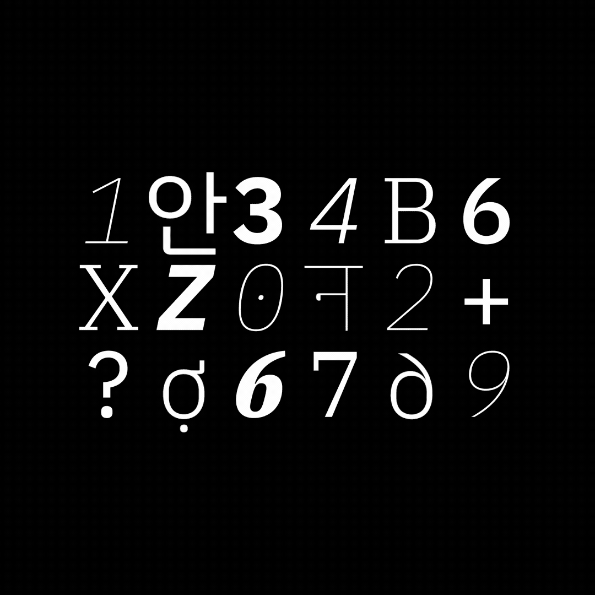
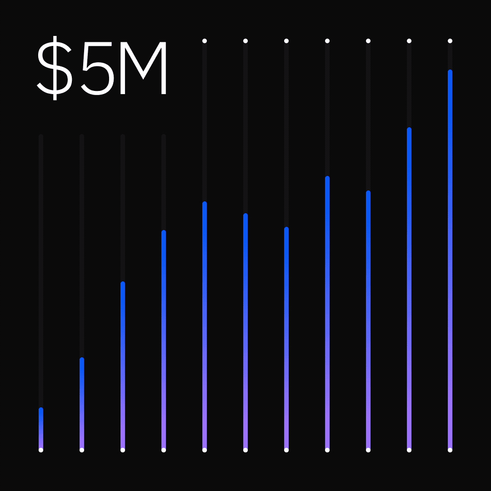
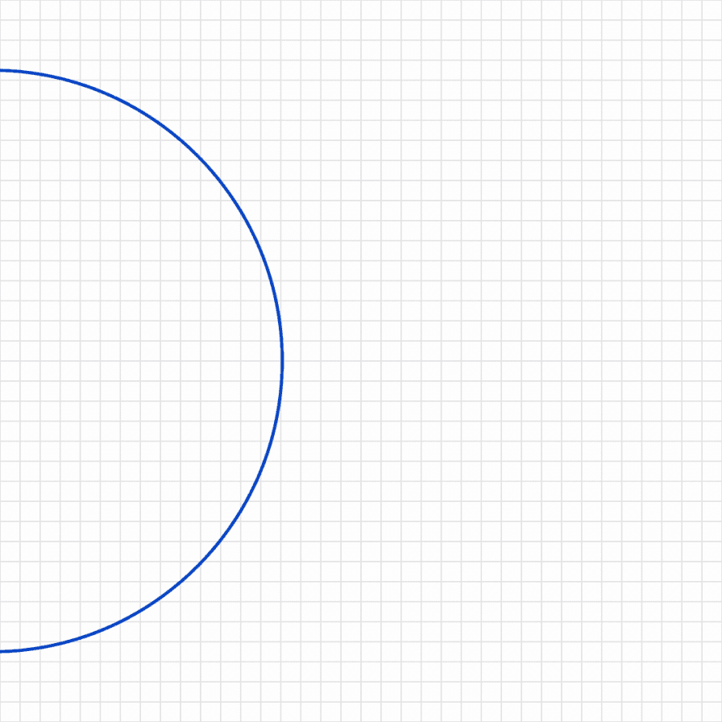
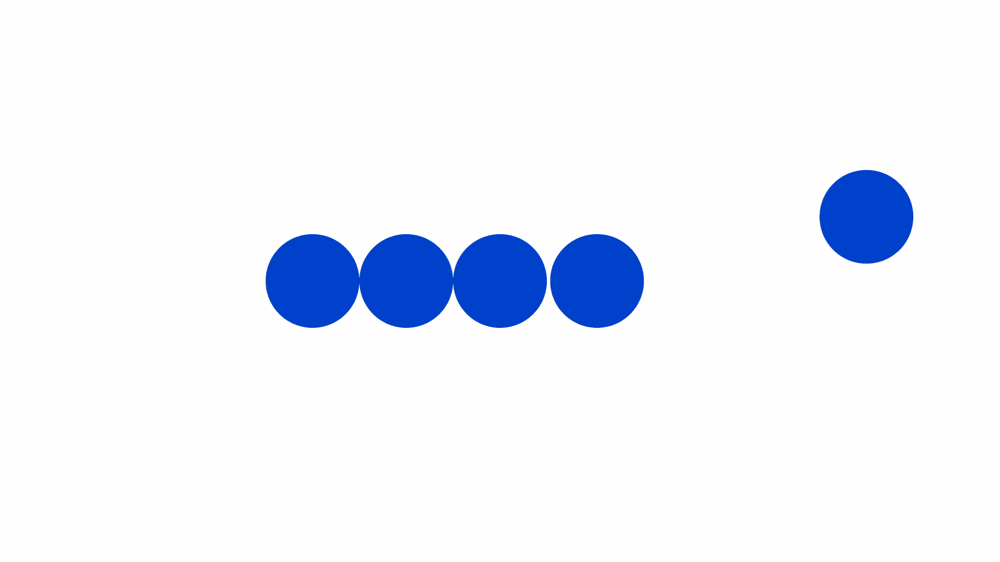
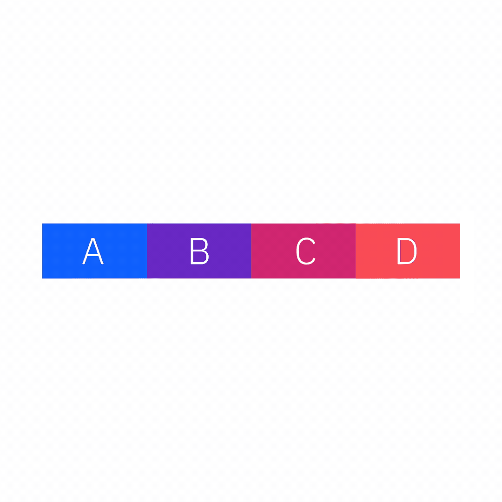
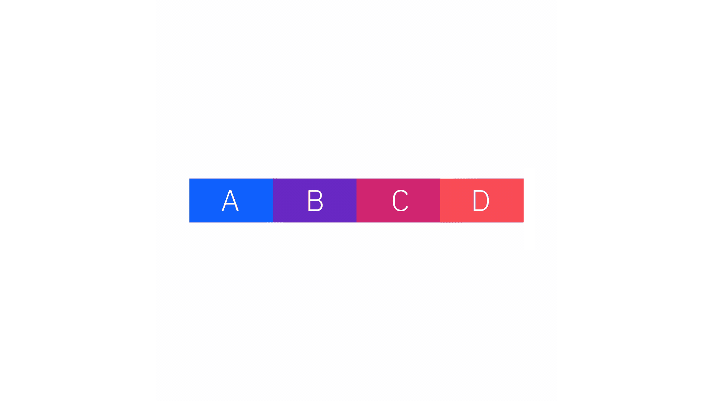
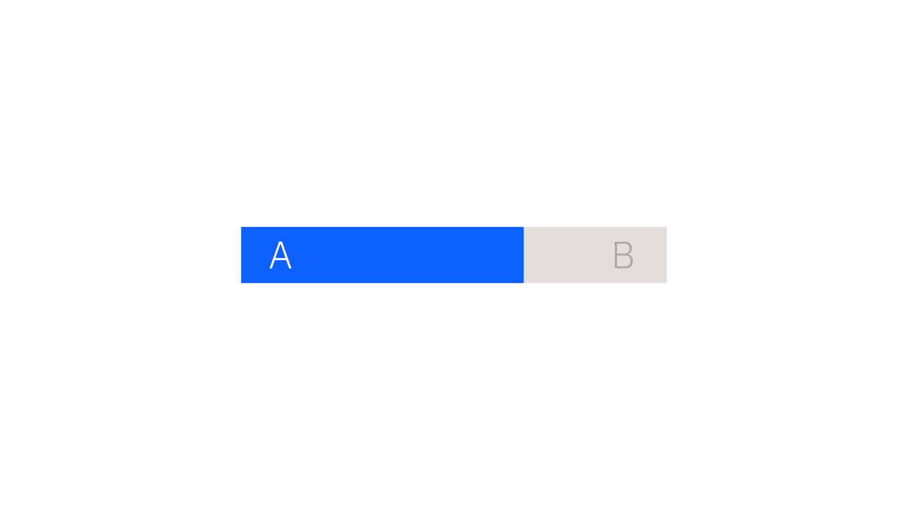

import LottiePlayer from '../../components/LottiePlayer';

<!-- GIFs aren't properly processed with withPrefix, if we import them so weback can keep track of them -->

import animation_tt_ex2 from './videos/animation-tt-ex2.gif';

<PageDescription>

Every animation—from simple linework pictograms through expansive, high-fidelity
3D—requires a different approach and new solutions. However, the following
guidance is universally applicable to every execution.

</PageDescription>

<AnchorLinks>
  <AnchorLink>Examples</AnchorLink>
  <AnchorLink>Attention</AnchorLink>
  <AnchorLink>Visual clarity</AnchorLink>
  <AnchorLink>Personality</AnchorLink>
  <AnchorLink>Physicality</AnchorLink>
  <AnchorLink>Structure</AnchorLink>
</AnchorLinks>

## Examples

<Row className="mock-gallery">

<Column colMd={4} colLg={4}>

<GifPlayer className="video-player">

<Video
  autoPlay
  playsInline
  loop="on"
  muted
  src="/videos/animation/minified/animation-tt-ex1.mp4"
/>

</GifPlayer>

</Column>

<Column colMd={4} colLg={4}>

<GifPlayer>

</GifPlayer>

</Column>

<Column colMd={4} colLg={4}>

<GifPlayer className="video-player">

<Video
  autoPlay
  playsInline
  loop="on"
  muted
  src="/videos/animation/minified/animation-tt-ex3.mp4"
/>

</GifPlayer>

</Column>

</Row>

<GifPlayer className="video-player">

<Video
  autoPlay
  playsInline
  loop="on"
  muted
  src="/videos/animation/animation-tt-ex4.mp4"
/>

</GifPlayer>

<Row className="mock-gallery">

<Column colMd={8} colLg={8}>

<GifPlayer className="video-player">

<Video
  autoPlay
  playsInline
  loop="on"
  muted
  src="/videos/animation/animation-tt-ex5.mp4"
/>

</GifPlayer>

</Column>

<Column colMd={4} colLg={4}>

<GifPlayer className="video-player">

<Video
  autoPlay
  playsInline
  loop="on"
  muted
  src="/videos/animation/animation-tt-ex6.mp4"
/>

</GifPlayer>

</Column>

</Row>

## Attention

Motion is exceptionally useful in capturing attention. How we use motion to
direct that attention is essential in effectively communicating with the viewer.

### Focus

Maintain a focal point of interest and seek out a seamless means of transferring
it from one subject to the next. A viewer’s attention is an investment. With the
brief and dense nature of most animation, be cognizant of how you capture and
shift a viewer's focus to minimize confusion and fatigue.

<Row className="mock-gallery">
<Column colMd={8} colLg={8}>
<GifPlayer>

<LottiePlayer src={import(`../../lottie/animation-tt-focus.json`)} />

</GifPlayer>

<Caption>
  A commanding performance begins this sequence that leads the eye from right to
  left.
</Caption>

</Column>
</Row>

### Camera

Cameras are the mechanism through which we present our view of the world to an
observer and, therefore, must be treated with the utmost care to maintain an
attitude of confidence and positivity.

Efficient, single-axis translations feel deliberate and unobtrusive, while
untethered, dynamic moves impart a sense of chaos and uncertainty. If creating a
dynamically animated camera is absolutely necessary, ensure its movement remains
controlled, clearly focused and positioned to create balanced compositions.

<DoDontRow>
<DoDont caption="Controlled camera movements support action.">
<GifPlayer>

<LottiePlayer src={import(`../../lottie/animation-tt-camera1.json`)} />

</GifPlayer>
</DoDont>

<DoDont type="dont" caption="Avoid uncontrolled action cameras.">
<GifPlayer>

<LottiePlayer src={import(`../../lottie/animation-tt-camera2.json`)} />

</GifPlayer >
</DoDont>
</DoDontRow>

## Visual clarity

Our animations should be simple and straightforward in their effect by not only
respecting the integrity of their original design but also by enhancing and
evolving it.

### Complexity

Every element in a composition has the potential for movement, but every
movement of an element increases the density of information presented to a
viewer. This dynamic intuitively leads us to apply an inverse relationship
between the complexity of a design and the complexity of an animation. In
general, minimally populated compositions lend themselves to more expressive and
expansive animation, while dense and complex designs benefit from smaller, more
textural motion.

<Row className="mock-gallery">
<Column colMd={4} colLg={4}>
<GifPlayer>

<LottiePlayer src={import(`../../lottie/animation-tt-complexity1.json`)} />

</GifPlayer>

<Caption>Detailed visuals call for subtle animations.</Caption>

</Column>
<Column colMd={4} colLg={4}>
<GifPlayer>

<LottiePlayer src={import(`../../lottie/animation-tt-complexity2.json`)} />

</GifPlayer>

<Caption>Simple designs allow for dynamic animation.</Caption>

</Column>
</Row>

### Detail

In animation, the accuracy of a form in any key pose should adhere to the same
rigorous standards used in creating the design. During transitions from one key
to another, strive to maintain clean and precise silhouettes by avoiding odd
shapes, irregular angles, overlaps and intersections, unless explicitly desired
as an effect.

A similar level of attention should be paid to the briefest of moments. For
example, avoid creating irregularities during the overlap of transparent shapes
by animating between swatch colors, not opacity. Maintain crisp graphic lines by
increasing the stroke weight from zero to the thickness, not crossfading.

<DoDontRow>
<DoDont caption="Animated stroke weights maintain clean and crisp lines.">
<GifPlayer color="dark">

<LottiePlayer src={import(`../../lottie/animation-tt-detail-do.json`)} />

</GifPlayer>
</DoDont>

<DoDont type="dont" caption="Avoid distorting shapes and cross-fading opacity.">
<GifPlayer color="dark">

<LottiePlayer src={import(`../../lottie/animation-tt-detail-dont.json`)} />

</GifPlayer >
</DoDont>
</DoDontRow>

## Consistency

Animate with a consistency of motion both systematically and specifically.

Making broad, consistent choices defines a framework for how we present
information and make it understood, especially in more technical scenarios.
Seemingly inconsequential distinctions, like which direction elements move in
and out of frame or how crossfades and type behave, are foundational to creating
a sense of reason and purpose.

In more illustrative scenarios, consistency can help demonstrate the role and
function of abstract elements or define a baseline of behavior against which
abrupt changes and influences become more noticeable. Setting expectations and,
in some cases, subverting them is an excellent way to convey novel cause and
effect, and imbue even simple forms with personality.

<DoDontRow>
<DoDont caption="Reward expectations through consistent choices.">
<GifPlayer color="dark">

<LottiePlayer src={import(`../../lottie/animation-tt-consistency-do.json`)} />

</GifPlayer>
</DoDont>

<DoDont type="dont" caption="Avoid the misinterpretation that can follow capricious movement.">
<GifPlayer color="dark" caption="Avoid the misinterpretation that can follow capricious movement.">

<LottiePlayer src={import(`../../lottie/animation-tt-consistency-dont.json`)} />

</GifPlayer >
</DoDont>
</DoDontRow>

## Personality

Our animations should always seek a balance between natural and engineered in
tone and behavior. Unless essential to the story, nothing should feel coldly
mechanical or overtly organic—it’s both working in cooperation that imparts a
subtle, yet appreciable, personality.

### Precision

Elements move decisively, efficiently and with purpose. Align to the grid. Snap
into place. Use momentum to instigate crisp transitions. While no single detail
will be immediately noticeable, this precision and attention to detail is
palpable and felt when applied holistically.

<DoDontRow>
<DoDont caption="A clear intent and precise movements communicate purpose.">
<GifPlayer color="dark">

<LottiePlayer src={import(`../../lottie/animation-tt-precision-do.json`)} />

</GifPlayer>
</DoDont>

<DoDont type="dont" caption="Avoid superfluous motion.">
<GifPlayer color="dark">

<LottiePlayer src={import(`../../lottie/animation-tt-precision-dont.json`)} />

</GifPlayer >
</DoDont>
</DoDontRow>

### Rhythm

Establishing a sense of rhythm in motion is essential to well-paced and
understandable animations–rarely does everything happen at once. No matter which
tactic you use to choreograph action into sequences, they all contribute to an
ebb and flow of activity that creates a pleasing rhythm and allows the viewer a
mental pause before continuing. Tactics can include translating objects along
already defined paths with slightly offset timings, showing deliberate moments
of cause and effect or allowing elements to move purposefully and then rest.

<Row className="mock-gallery">
<Column colMd={4} colLg={4}>
<GifPlayer className="video-player">

<Video
  autoPlay
  playsInline
  loop="on"
  muted
  src="/videos/animation/animation-tt-rhythm1.mp4"
/>

</GifPlayer>

<Caption>Achieve effective rhythm with staggered hero performances.</Caption>

</Column>
<Column colMd={4} colLg={4}>
<GifPlayer className="video-player">

<Video
  autoPlay
  playsInline
  loop="on"
  muted
  src="/videos/animation/animation-tt-rhythm2.mp4"
/>

</GifPlayer>

<Caption>
  Offsetting similar actions by small increments can be effective.
</Caption>

</Column>
</Row>

### Fluidity

A well-animated object should feel effortless and elegant, with a fluidity to
its motion—not in the path it takes, but the finesse with which it moves. Pay
close attention to how each attribute is animated and the transition between
movements.

In general, refrain from employing stepped, stilted or disorderly motion.
Technically, motion requires animating at or above 24 frames per second (FPS) to
help ensure smooth performances.

<DoDontRow>
<DoDont caption="Aim for smooth and seamless movements.">
<GifPlayer color="dark">

<LottiePlayer src={import(`../../lottie/animation-tt-fluidity-do.json`)} />

</GifPlayer>
</DoDont>

<DoDont type="dont" caption="Don’t use a frame rate lower than 24 frames per second.">
<GifPlayer color="dark">

<LottiePlayer src={import(`../../lottie/animation-tt-fluidity-dont.json`)} />

</GifPlayer >
</DoDont>
</DoDontRow>

## Physicality

When applied selectively, animation that feels physical is an incredibly
effective means of adding interest and personality to your designs, whether
they’re overtly dimensional or recognizable elements, or simple graphic shapes.

### Mass and momentum

Charm and spirit can be produced through collisions, moments of friction and
slides. However, be deliberate and considered when moving elements—avoid
cartoonish overshoots and bounces.

<Row className="mock-gallery">
<Column colMd={8} colLg={8}>
<GifPlayer color="dark">

<LottiePlayer src={import(`../../lottie/animation-tt-momentum.json`)} />

</GifPlayer>
</Column>
</Row>

### Volume

Consider what the element to be animated represents, especially in
higher-fidelity and dimensional executions. Intuitively, viewers expect things
to behave as they do in reality; feathers shouldn’t fall like lead, stone
shouldn’t stretch like rubber. Treating recognizable objects with a sense of
stylized realism can be an effective way to create interest.

<DoDontRow>
<DoDont caption="Use motion that underscores the object in reality.">
<GifPlayer color="dark" className="video-player">

<Video
  autoPlay
  playsInline
  loop="on"
  muted
  src="/videos/animation/animation-tt-volume-do.mp4"
/>

</GifPlayer>

<Caption></Caption>

</DoDont>

<DoDont type="dont" caption="Avoid motion that contradicts the object in reality.">
<GifPlayer color="dark" className="video-player">

<Video
  autoPlay
  playsInline
  loop="on"
  muted
  src="/videos/animation/animation-tt-volume-dont.mp4"
/>

</GifPlayer>
</DoDont>

</DoDontRow>

## Structure

Animated illustrations inevitably fall into one of two categories—sequential or
looped. Although a technical specification, this distinction also helps to
define how a message is structured.

### Sequential

Sequential animations are intended to depict a sequence of events with
deliberate start points and endpoints—an A to B narrative. Whether they then
settle into a loop state or reset to begin again, sequential animations are
typically more anecdotal and linear in their message than loops.

<Row className="mock-gallery">
<Column colMd={4} colLg={8}>

<ArtDirection>

<GifPlayer color="dark" className="video-player">

<Video
  autoPlay
  playsInline
  loop="on"
  muted
  src="/videos/animation/animation-tt-sequential-mobile.mp4"
/>

</GifPlayer>

<GifPlayer color="dark" className="video-player">

<Video
  autoPlay
  playsInline
  loop="on"
  muted
  src="videos/animation/animation-tt-sequential-wide.mp4"
/>

</GifPlayer>

</ArtDirection>

<Caption>Sequential movement leads a viewer along a prescribed path.</Caption>

</Column>
</Row>

### Simple loops

Loops continue in a usually seamless cycle and often only convey a singular idea
or message. The loop may be a series of states aligned to one topic or an
overall ambient effect that draws focus and sets a particular tone.

<Row className="mock-gallery">
<Column colMd={4} colLg={8}>

<ArtDirection>

<GifPlayer color="dark" className="video-player">

<Video
  autoPlay
  playsInline
  loop="on"
  muted
  src="/videos/animation/animation-tt-simple-loop-mobile.mp4"
/>

</GifPlayer>

<GifPlayer color="dark" className="video-player">

<Video
  autoPlay
  playsInline
  loop="on"
  muted
  src="/videos/animation/animation-tt-simple-loop-wide.mp4"
/>

</GifPlayer>

</ArtDirection>

<Caption>Use simple loops to convey individual concepts.</Caption>

</Column>
</Row>

### Nested loops

<DoDontRow>
<DoDont caption="Offset loops to guide attention in sequence from region to region.">
<GifPlayer>

<LottiePlayer src={import(`../../lottie/animation-tt-nested-loop-do.json`)} />

</GifPlayer>
</DoDont>

<DoDont type="dont" caption="Avoid excessive overlaps in action.">
<GifPlayer>

<LottiePlayer src={import(`../../lottie/animation-tt-nested-loop-dont.json`)} />

</GifPlayer >
</DoDont>
</DoDontRow>

## Type

Type is an essential component of our communications. Accordingly, care must be
taken in animation to present type in a manner that's natural and understandable
to our viewers.

### Presentation

Whether revealing a block of type as a whole or animating individual
elements—line by line, word by word, even character by character—our approach to
type should reinforce the natural rhythm of reading, typically by appearing left
to right, top to bottom. And, as with graphic elements, type should only be
animated on one axis at a time, and be left in the frame long enough to be
legible and comprehensible to the viewer.

<DoDontRow>
<DoDont caption="Reveal type with orientation that supports comprehension.">
<GifPlayer color="dark">

<LottiePlayer src={import(`../../lottie/animation-tt-presentation-do.json`)} />

</GifPlayer>
</DoDont>

<DoDont type="dont" caption="Avoid centered paragraphs and revealing type over multiple axes simultaneously.">
<GifPlayer color="dark">

<LottiePlayer
  src={import(`../../lottie/animation-tt-presentation-dont.json`)}
/>

</GifPlayer >
</DoDont>
</DoDontRow>

### Integrity

The IBM Plex® typeface is designed to be a representation of our brand, where
every detail reflects a decision made with purpose. As such, the integrity of
any typographic element must be maintained at all times. Refrain from
stretching, warping, or otherwise distorting any form or detail, regardless
whether it’s a single glyph or an entire paragraph.

<DoDontRow>

<DoDont type="do">
<GifPlayer color="dark">

<LottiePlayer src={import(`../../lottie/animation-tt-integrity-do.json`)} />

</GifPlayer>
</DoDont>

<DoDont type="dont">
<GifPlayer color="dark">

<LottiePlayer src={import(`../../lottie/animation-tt-integrity-dont.json`)} />

</GifPlayer>
</DoDont>

</DoDontRow>
