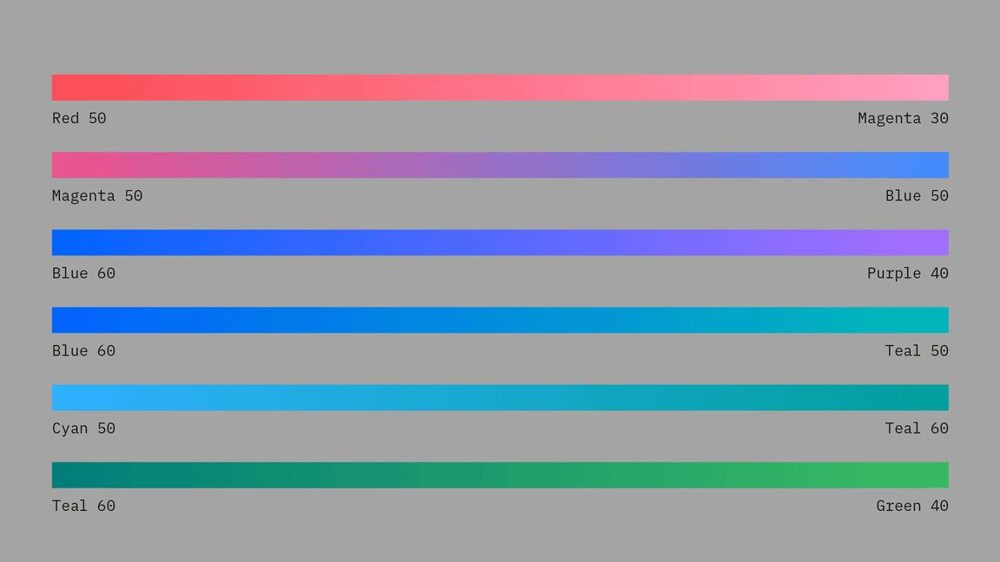
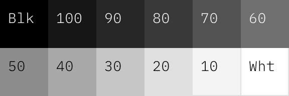
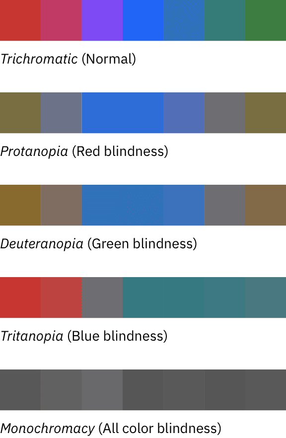
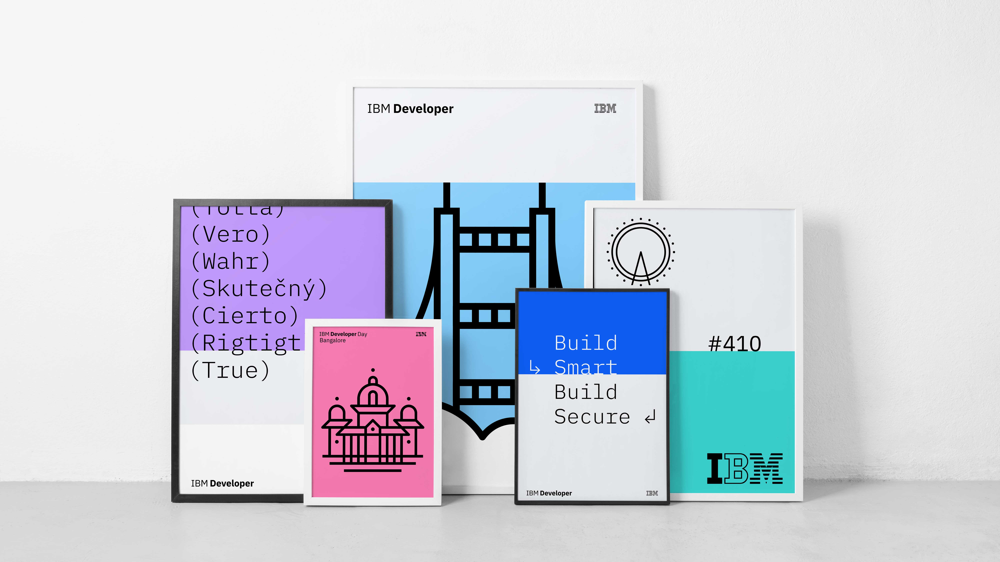
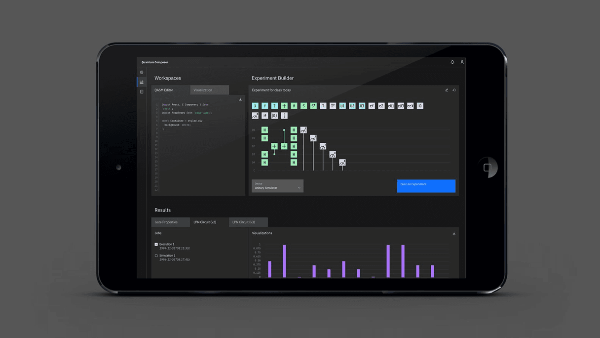
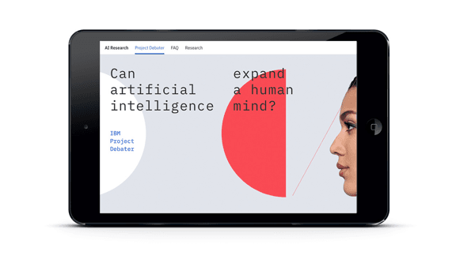

import Carousel from '../components/Carousel';
import SwatchPaletteWidget from '../components/SwatchPaletteWidget';
import ColorGrid from '../components/ColorGrid';
import { noGutterSm } from '../styles/Grid.module.scss';

<PageDescription>

Our color palette expands on our unique aesthetic and represents a contemporary
and ever-changing IBM. Balancing mankind and machine, the colors are harmonious
with nature, yet chosen for their luminous quality in the digital world.

</PageDescription>

<AnchorLinks>
  <AnchorLink>Blue at the core</AnchorLink>
  <AnchorLink>Specifications</AnchorLink>
  <AnchorLink>Color families</AnchorLink>
  <AnchorLink>Gradients</AnchorLink>
  <AnchorLink>Color in UI</AnchorLink>
  <AnchorLink>Accessibility</AnchorLink>
  <AnchorLink>Color in action</AnchorLink>
</AnchorLinks>

## Resources

<Row className="resource-card-group">
<Column colMd={4} colLg={4} noGutterSm>
    <ResourceCard
      subTitle="IBM Design Language library"
      aspectRatio="2:1"
      href="sketch://add-library/cloud/4f1cbe6c-6626-405e-8c46-a9ae41a30cba"
      >

  </ResourceCard>
</Column>
<Column colMd={4} colLg={4} noGutterSm>
    <ResourceCard
      subTitle="IBM color palette (.ase and .clr)"
      aspectRatio="2:1"
      href="https://github.com/carbon-design-system/carbon/raw/main/packages/colors/artifacts/IBM_Colors.zip"
      actionIcon="download"
      >

  </ResourceCard>
</Column>
</Row>

## Blue at the core

A vibrant set of blues is the centerpoint of the color palette. When combined
with the simplicity of black and white, a refreshing and unique look emerges for
IBM.

  <Row className="color-logo-row">
  <Column colMd={4} colLg={6}  className="color-logo">

  </Column>
  <Column colMd={4} colLg={6}  className="color-logo-carousel">

  <Carousel id="c1" count="1 2 3 4 5 6 7 8 9" nav={false} fade={true} autoPlay>

  </Carousel>

  </Column>
  </Row>
  <ColorGrid colorFamily="blue" />
  <ColorGrid colorFamily="gray" />

### The palette

The full palette extends from the blue family to the edges of the blue
spectrum—even the reds contain a hint of blue. The resulting palette is a set of
colors that portrays a singular IBM. Of the world and digital. Useful and
judicious.

  <ColorGrid colorFamily="red" />
  <ColorGrid colorFamily="magenta" />
  <ColorGrid colorFamily="purple" />
  <ColorGrid colorFamily="blue" />
  <ColorGrid colorFamily="cyan" />
  <ColorGrid colorFamily="teal" />
  <ColorGrid colorFamily="green" />

### Grays

Having multiple gray families gives each design the opportunity for nuance and
meaningful moments of color. Each experience should be dominated by the grays
and the core colors of black, white, and the blue family, allowing the other
color families to have vibrancy and provide purpose.

  <ColorGrid colorFamily="coolGray" />
  <ColorGrid colorFamily="gray" />
  <ColorGrid colorFamily="warmGray" />

## Specifications

Each of the 10 color families have been divided into 10 swatches ranging from
light to dark. RGB and HEX values are provided for digital applications along
with Pantone® and CMYK values for print.

<SwatchPaletteWidget
  palettes={[
    ['red', 'magenta', 'purple', 'blue', 'cyan', 'teal', 'green'],
    ['cool gray-bw', 'gray-bw', 'warm gray-bw'],
  ]}
/>

## Color families

The color palette has been organized into four distinct 4-Color families, each
containing the IBM core blue. When creating color groups for your particular
usage and application, you may combine any of the colors within these families.
When fewer colors are required, you may further subdivide any of the 4-Color
families into 1, 2 or 3 Color families. See the possible combinations below.

### 4-Color

### 3-Color

### 2-Color

### 1-Color

### Combinations to avoid

The following color combinations have been eliminated from the Color families
and should be avoided unless required for specific applications, such as Data
Visualization.

<DoDontRow>
<DoDont type="dont" caption="Avoid mixing greens with reds, magentas or purples.">

</DoDont>
<DoDont type="dont" caption="Avoid mixing teals with reds or magentas.">

</DoDont>
</DoDontRow>

## Gradients

Use combinations within any of the acceptable 2-Color families when blending
gradients. Values between 30 and 60 are used to create vibrant gradients that
work well against both dark and light backgrounds. For more contrast or
subtlety, blend between darker or lighter colors. Do not blend between colors
that are more than two steps away from each other.

<GifPlayer color="dark">

 

</GifPlayer>

<DoDontRow>
<DoDont type="dont" caption="Don’t mix colors that are outside of the accepted 2-Color Families.">

</DoDont>
<DoDont type="dont" caption="Avoid blending between colors that are more than 2 steps away, i.e. Blue 60 to Teal 20.">

</DoDont>
</DoDontRow>

<DoDontRow>
<DoDont type="dont" caption="Avoid creating gradients with more than two colors.">

</DoDont>
</DoDontRow>

## Color in UI

Application of the IBM color palette brings an unified and recognizable
consistency to IBM’s vast array of digital products and interfaces. This
consistency is grounded by a set of well-defined rules on how to work with our
component library in the context of dark and light themes.

<GifPlayer color="dark">

</GifPlayer>

### Specifications

The Neutral Gray family is dominant in our UI, making use of subtle shifts in
value to help organize content into distinct zones. The Core Blue family has
been designated as the primary action color across all products and experiences,
ensuring our color aesthetic is a part of every interaction. Additional colors
are used sparingly and purposefully.

<SwatchPaletteWidget palettes={[['blue-bw', 'gray-bw', 'alert']]} />

<Row className="resource-card-group">
<Column colMd={4} colLg={4} noGutterSm>
    <ResourceCard
      subTitle="Color in UI"
      aspectRatio="2:1"
      href="https://www.carbondesignsystem.com/guidelines/color/overview"
      >

  </ResourceCard>
</Column>
</Row>

## Accessibility

Color plays a key role in legibility regardless of the medium and application—think
of motion graphics in videos, social content, data visualization charts, user
interfaces and more. When colors are insufficiently distinct, whether in
brightness or difference in hue, low-vision users might have difficulty discerning
letters and graphical elements. Don’t let poor color choices stand between your 
design’s message and a good user experience.

### Contrast ratios

Contrast is the difference in brightness between any two elements. The [Web 
Content Acessibility Guidelines (WCAG)](https://www.w3.org/TR/WCAG20/) set specific ratios that achieve the
minimum required contrast for legibility. Generally speaking, small text is any
size below 24px and requires a 4.5:1 contrast ratio. Large text is anything above
24px and requires a 3:1 contrast ratio. Graphical elements, such as charts in
data visualization, also require a 3:1 contrast ratio.

The IBM palette is comprised of twelve color grades—Black, White and ten
values for each hue. When determining contrast ratios, it’s useful to assess how
many color grades or “steps” are between the foreground and background
colors. Steps imply the distance between any two colors when arranged
sequentially. For example, a color grade of 60 is five steps away from a color
grade of 10. The following table indicates the minimum number of steps
required to achieve commonly used contrast ratios between any two colors.

<Row>
<Column colLg={8}>
<ArtDirection>

</ArtDirection>
</Column>
</Row>

| Color 1  | Color 2 (4.5:1 contrast)   | Color 2 (3:1 contrast)     |
| -------- | -------------------------- | -------------------------- |
| Black    | 50 through White (6 steps) | 60 through White (5 steps) |
| 100      | 50 through White (5 steps) | 60 through White (4 steps) |
| 90       | 50 through White (4 steps) | 60 through White (3 steps) |
| 80       | 40 through White (4 steps) | 50 through White (3 steps) |
| 70       | 30 through White (4 steps) | 40 through White (3 steps) |
| 60       | 20 through White (4 steps) | 20 through White (4 steps) |
| 50       | 90 through Black (4 steps) | 80 through Black (3 steps) |
| 40       | 80 through Black (4 steps) | 70 through Black (3 steps) |
| 30       | 70 through Black (4 steps) | 70 through Black (4 steps) |
| 20       | 70 through Black (5 steps) | 60 through Black (4 steps) |
| 10       | 60 through Black (5 steps) | 50 through Black (4 steps) |
| White    | 60 through Black (6 steps) | 50 through Black (5 steps) |

### Examples

<DoDontRow>
<DoDont type="do" caption="Purple 90 text is accessible on Purple 50.">

</DoDont>
<DoDont type="do" caption="Teal 20 text is accessible on Teal 80.">

</DoDont>
<DoDont type="do" caption="Black text is accessible on Blue 50 and Teal 40.">

</DoDont>
</DoDontRow>

<DoDontRow>
<DoDont type="dont" caption="Blue 60 text is not accessible on Black.">

</DoDont>
<DoDont type="dont" caption="White text is not accessible on Gray 50.">

</DoDont>
<DoDont type="dont" caption="White text is not accessible on Blue 50 and Teal 40.">

</DoDont>
</DoDontRow>

### Color blindness

Don’t rely on color alone to convey meaning. This rule includes conveying
information, indicating an action, prompting the user for a response or
distinguishing one visual element from another.

Those people affected by protanopia color blindness are less sensitive to red
light, while sufferers of deuteranopia have the same problem with green. For
example, people with protanopia will confuse blue and purple because they
can’t recognize the red element of the color purple. The third type of color
deficiency, tritanopia, is the least common and refers to sufferers who struggle
to distinguish blue or yellow light. This image shows what the rainbow may look
like to individuals with each of these forms of color blindness, compared to
normal vision.

<Row>
<Column colLg={8}>
<ArtDirection>

</ArtDirection>
</Column>
</Row>

<Row className="resource-card-group">
<Column colMd={4} colLg={4} noGutterSm>
    <ResourceCard
      subTitle="Web Content Accessibility Guidelines (WCAG) 2.1"
      aspectRatio="2:1"
      href="https://www.w3.org/TR/WCAG20/"
      >

  </ResourceCard>
</Column>
<Column colMd={4} colLg={4} noGutterSm>
    <ResourceCard
      subTitle="Color contrast checker"
      aspectRatio="2:1"
      href="https://marijohannessen.github.io/color-contrast-checker/"
      >

  </ResourceCard>
</Column>
</Row>

## Color in action

See the IBM Design color palette in action across multiple business units and
applications. Deliberate hits of color are composed with rich neutrals for a
well-balanced and cohesive experience.

<ImageGallery>

<ImageGalleryImage alt="color in action books" title="Color in action books" col={8}>

</ImageGalleryImage>

<ImageGalleryImage alt="color in action mobile" title="Color in action mobile" col={4}>

</ImageGalleryImage>

<ImageGalleryImage alt="color in action exhibit" title="Color in action exhibit" col={4}>

</ImageGalleryImage>

<ImageGalleryImage alt="color in action tablet" title="Color in action tablet" col={8}>

</ImageGalleryImage>

<ImageGalleryImage alt="color in action charts" title="Color in action charts" col={4}>

</ImageGalleryImage>

<ImageGalleryImage alt="color in action landing" title="Color in action landing" col={4}>

</ImageGalleryImage>

<ImageGalleryImage alt="color in action icons" title="Color in action icons" col={4}>

</ImageGalleryImage>

<ImageGalleryImage alt="color in action leadspace" title="Color in action leadspace" col={8}>

</ImageGalleryImage>

<ImageGalleryImage alt="color in action tablet 2" title="Color in action tablet 2" col={4}>

</ImageGalleryImage>

</ImageGallery>

<Row className="resource-card-group">
  <Column colMd={4} colLg={4} noGutterSm>
    <ResourceCard
      subTitle="IDL Gallery"
      aspectRatio="2:1"
      href="/gallery"
      actionIcon="arrowRight"
     >

  </ResourceCard>
  </Column>
</Row>

