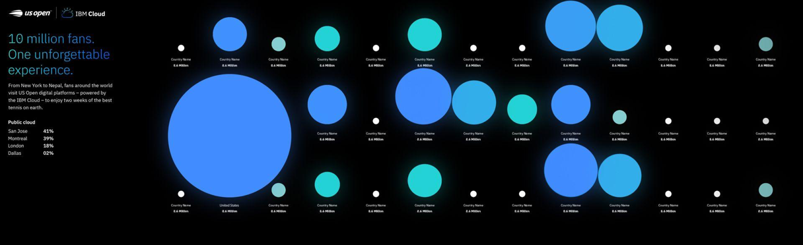
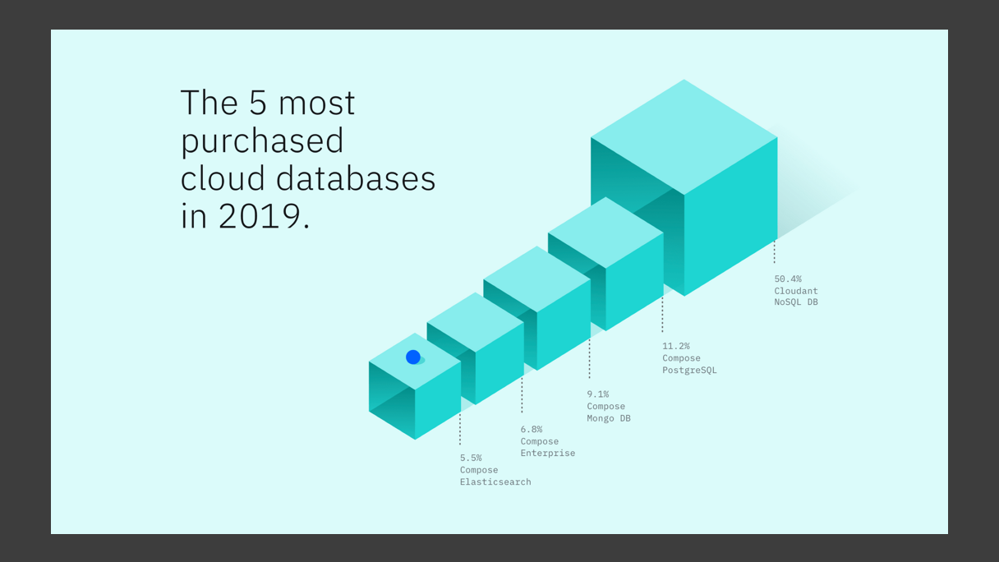
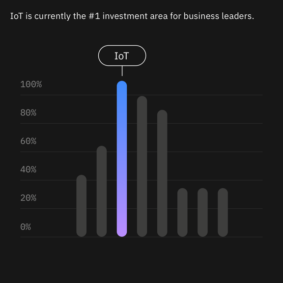

<PageDescription>

Data visualizations can serve a variety of purposes. Depending on the context, they help provide meaning and explain outcomes. While they can serve practical and functional requirements in products and services, they might lend graphical or emotional impact that supports the meaningful data in the stories we communicate.
</PageDescription>

## Data visualization in action

Have a look at how visualizations behave in different IBM contexts and products. Accuracy and visual consistency make them all look part of the same ecosystem.

<Row className="gallery-row-padding">
<Column colMd={2} colLg={4}>

</Column>
<Column colMd={4} colLg={8}>

</Column>

</Row>
<Row className="gallery-row-padding">

<Column colMd={4} colLg={8}>

</Column>
<Column colMd={2} colLg={4}>

</Column>

</Row>

<Row className="gallery-row-padding">
<Column colMd={4} colLg={8} offsetMd={2} offsetLg={4}>

</Column>
</Row>

<Row className="gallery-row-padding">
<Column colMd={2} colLg={4}>

</Column>
<Column colMd={2} colLg={4}>

</Column>
<Column colMd={2} colLg={4}>

</Column>
</Row>

<Row className="gallery-row-padding">

<Column colMd={4} colLg={8}>

</Column>

</Row>
<Row className="gallery-row-padding">
<Column colMd={2} colLg={4}>

</Column>
<Column colMd={2} colLg={4}>

</Column>
<Column colMd={2} colLg={4}>

</Column>
</Row>
