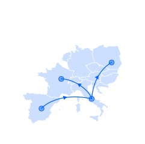

import '../../styles/data-vis.scss';
import OverviewCard from "../../components/OverviewCard";

<PageDescription>

Charts are typically divided into categories based on their goals, aesthetics or visual features. Since charts can be versatile and used in different ways, details and features of these categories are explained and contextualized here. Use these best practices as you create data visualizations.
</PageDescription>

<AnchorLinks>
  <AnchorLink>Comparisons</AnchorLink>
  <AnchorLink>Trends</AnchorLink>
  <AnchorLink>Part to whole</AnchorLink>
  <AnchorLink>Correlations</AnchorLink>
  <AnchorLink>Relationships and connections</AnchorLink>
  <AnchorLink>Maps</AnchorLink>
</AnchorLinks>

## Comparisons

Charts designed for comparison aim to visualize differences between elements. Most of the time comparisons rely on the ability of the human eye to identify longer or bigger shapes with very little or no effort. Side-by-side positioning and alignment of the visual elements make comparisons even easier.

#### Data typologies
Time-based data (for example, units sold per day, worked hours per month) 
Categorized data (for example, revenue by market, sold units by team)

<Row className="overview-card-group">
<Column  colMax={3} colXl={3} colLg={4} colMd={4} colSm={2} noGutterSm >
 <OverviewCard
    title="Bar chart"
    href="https://www.carbondesignsystem.com/data-visualization/basic-charts#bar-chart"
    >

</OverviewCard>
</Column>

<Column  colMax={3} colXl={3} colLg={4} colMd={4} colSm={2} noGutterSm >
 <OverviewCard
    title="Grouped bar"
    href="https://www.carbondesignsystem.com/data-visualization/basic-charts#grouped-bar-chart"
    >

</OverviewCard>
</Column>

<Column  colMax={3} colXl={3} colLg={4} colMd={4} colSm={2} noGutterSm >
 <OverviewCard
    title="Bubble chart"
    href="https://www.carbondesignsystem.com/data-visualization/basic-charts#bubble-chart"
    >

</OverviewCard>
</Column>

<Column  colMax={3} colXl={3} colLg={4} colMd={4} colSm={2} noGutterSm >
 <OverviewCard
    title="Radar chart"
    >

</OverviewCard>
</Column>

<Column  colMax={3} colXl={3} colLg={4} colMd={4} colSm={2} noGutterSm >
 <OverviewCard
    title="Horizontal bar chart"
    href="https://www.carbondesignsystem.com/data-visualization/basic-charts#horizontal-bar"
    >

</OverviewCard>
</Column>
</Row>

## Trends

Trend charts represent data along with the time dimension. Use them mainly to track changes over periods of time of varying duration and scale. They rely on direction to show the evolution of consecutive values and might be influenced by different cultural contexts.

#### Data typologies

Time-based data (for example, revenue by quarter, rainfall per day)

<Row className="overview-card-group">

<Column  colMax={3} colXl={3} colLg={4} colMd={4} colSm={2} noGutterSm >
 <OverviewCard
    title="Line chart"
    href="https://www.carbondesignsystem.com/data-visualization/basic-charts#line-chart"
    >

</OverviewCard>
</Column>

<Column  colMax={3} colXl={3} colLg={4} colMd={4} colSm={2} noGutterSm >
 <OverviewCard
    title="Area chart"
    href="https://www.carbondesignsystem.com/data-visualization/basic-charts#area-chart"
    >

</OverviewCard>
</Column>

<Column  colMax={3} colXl={3} colLg={4} colMd={4} colSm={2} noGutterSm >
 <OverviewCard
    title="Histogram"
    href="https://www.carbondesignsystem.com/data-visualization/basic-charts#bar-chart"
    >

</OverviewCard>
</Column>

<Column  colMax={3} colXl={3} colLg={4} colMd={4} colSm={2} noGutterSm >
 <OverviewCard
    title="Stream chart"
    >

</OverviewCard>
</Column>

</Row>

## Part to whole

The goal of these charts is to show the inner subdivision of a value among different categories or groups. Mostly used to represent percentages, they can also be used for absolute values. Their function does not depend on the graphic shapes used, such as pie, donut, square and so on.

#### Data typologies
Categorized data (for example, subdivision of revenue by product, percentage of users by browser)

<Row className="overview-card-group">

<Column  colMax={3} colXl={3} colLg={4} colMd={4} colSm={2} noGutterSm >
 <OverviewCard
    title="Donut / pie"
    href="https://www.carbondesignsystem.com/data-visualization/basic-charts#polar-charts"
    >

</OverviewCard>
</Column>

<Column  colMax={3} colXl={3} colLg={4} colMd={4} colSm={2} noGutterSm >
 <OverviewCard
    title="Stacked bar"
    href="https://www.carbondesignsystem.com/data-visualization/basic-charts/#stacked-bar"
    >

</OverviewCard>
</Column>

<Column  colMax={3} colXl={3} colLg={4} colMd={4} colSm={2} noGutterSm >
 <OverviewCard
    title="Stacked area"
    href="https://www.carbondesignsystem.com/data-visualization/basic-charts/#stacked-area-chart"
    >

</OverviewCard>
</Column>

<Column  colMax={3} colXl={3} colLg={4} colMd={4} colSm={2} noGutterSm>
 <OverviewCard
    title="Tree map"
    href=""
    >

</OverviewCard>
</Column>

<Column  colMax={3} colXl={3} colLg={4} colMd={4} colSm={2} noGutterSm >
 <OverviewCard
    title="Meter / gauge"
    href="https://www.carbondesignsystem.com/data-visualization/basic-charts/#meter-and-gauge"
    >

</OverviewCard>
</Column>

</Row>

## Correlations

These charts are better suited to highlight the possible correlation between two or more indicators and how they might affect each other. Correlation charts have the final goal of making it easier for the human eye to spot combined behaviors.

#### Data typologies
Multidimensional data (for example, correlation between phone-call duration and customer’s satisfaction)

<Row className="overview-card-group">
<Column  colMax={3} colXl={3} colLg={4} colMd={4} colSm={2} noGutterSm>
 <OverviewCard
    title="Scatter plot"
    href="https://www.carbondesignsystem.com/data-visualization/basic-charts#scatter-plots"
    >

</OverviewCard>
</Column>
<Column  colMax={3} colXl={3} colLg={4} colMd={4} colSm={2} noGutterSm >
 <OverviewCard
    title="Heat map"
    href="https://www.carbondesignsystem.com/data-visualization/advanced-charts#heatmap"
    >

</OverviewCard>
</Column>
<Column  colMax={3} colXl={3} colLg={4} colMd={4} colSm={2} noGutterSm >
 <OverviewCard
    title="Parallel coordinates"
    >

</OverviewCard>
</Column>
</Row>

## Relationships and connections

Charts included in this category represent hierarchies. The intent is to explain the role of an element within an ecosystem or to observe the inner nature of a subject in different phases and states of a process.

#### Data typologies
Categorized data (for example, country of origin of asylum seeker and gender)  
Multidimensional data (for example, number of active users by testing phase)

<Row className="overview-card-group">
<Column  colMax={3} colXl={3} colLg={4} colMd={4} colSm={2} noGutterSm >
 <OverviewCard
    title="Alluvial diagram"
    href="https://www.carbondesignsystem.com/data-visualization/advanced-charts#alluvial-diagram"
    tag="Design only"
    >

</OverviewCard>
</Column>
<Column  colMax={3} colXl={3} colLg={4} colMd={4} colSm={2} noGutterSm >
 <OverviewCard
    title="Tree diagram"
    href="https://www.carbondesignsystem.com/data-visualization/advanced-charts#tree-diagram"
    >

</OverviewCard>
</Column>
</Row>

## Maps

Maps are the easiest and most immediate way to communicate geolocated information. Maps allow the user to recognize areas and places, to understand the geographical context of the topic and to identify patterns, all relying on the position of elements.

#### Data typologies
Geographical data (for example, voters by county, average wage by neighborhood)

<Row className="overview-card-group">
<Column  colMax={3} colXl={3} colLg={4} colMd={4} colSm={2} noGutterSm >
 <OverviewCard
    title="Choropleth map"
    href="https://www.carbondesignsystem.com/data-visualization/advanced-charts#choropleth-map"
    >

</OverviewCard>
</Column>
<Column  colMax={3} colXl={3} colLg={4} colMd={4} colSm={2} noGutterSm >
 <OverviewCard
    title="Proportional symbol"
    href="https://www.carbondesignsystem.com/data-visualization/advanced-charts#proportional-symbol"
    >

</OverviewCard>
</Column>
<Column  colMax={3} colXl={3} colLg={4} colMd={4} colSm={2} noGutterSm >
 <OverviewCard
    title="Connecting lines"
    href="https://www.carbondesignsystem.com/data-visualization/advanced-charts#connecting-lines"
    >

</OverviewCard>
</Column>
</Row>

