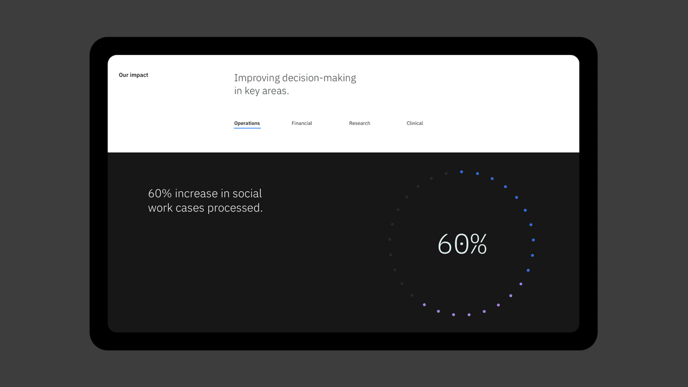

<PageDescription>

Taking our design philosophy from theory to practice, these examples demonstrate the IBM data visualization guidelines applied across product UI and marketing environments of all types.
</PageDescription>

<AnchorLinks>

  <AnchorLink>Product and dashboard applications</AnchorLink>
  <AnchorLink>Marketing applications</AnchorLink>
</AnchorLinks>

## Product and dashboard applications

Complex environments for monitoring and decision-making typically require interfaces that are able to show different perspectives of the same subject. Be consistent and design a set of charts that work together instead of independently.

<ImageGallery className="show">

<ImageGalleryImage  alt="Watson Discovery" title="Watson Discovery" col={8}>

</ImageGalleryImage>
<ImageGalleryImage alt="Security Cloud-1" title="Security Cloud-1" col={4}>

</ImageGalleryImage>
<ImageGalleryImage alt="security cloud-2" title="security cloud-2" col={4}>

</ImageGalleryImage>
<ImageGalleryImage alt="security cloud-3" title="security cloud-3" col={8}>

</ImageGalleryImage>
<ImageGalleryImage alt="Watson Discovery Demo" title="Watson Discovery Demo" col={8}>

</ImageGalleryImage>
</ImageGallery>

## Marketing applications

Data visualization can be declined in contexts, such as marketing presentations and editorial design, where the simplicity of the message is the most important point to convey. Charts can be used as abstract elements to communicate concepts, trends and ideas.

<ImageGallery className="show">

<ImageGalleryImage  alt="watson health matrix" title="watson health matrix" col={4}>

</ImageGalleryImage>
<ImageGalleryImage alt="gallery" title="gallery" col={8}>

</ImageGalleryImage>
<ImageGalleryImage alt="watson insights" title="watson insights" col={4}>

</ImageGalleryImage>
<ImageGalleryImage alt="watson insights" title="watson insights" col={4}>

</ImageGalleryImage>
<ImageGalleryImage alt="whirlpool casestudy" title="whirlpool casestudy" col={4}>

</ImageGalleryImage>
<ImageGalleryImage alt="kubernetes container" title="kubernetes container" col={8}>

</ImageGalleryImage>

<ImageGalleryImage alt="Australia" title="Australia" col={4}>

</ImageGalleryImage>
<ImageGalleryImage alt="Australia" title="Australia" col={4}>

</ImageGalleryImage>
<ImageGalleryImage alt="IoT investment area" title="IoT investment area" col={4}>

</ImageGalleryImage>
<ImageGalleryImage alt="IBM Cloud RedHat" title="IBM Cloud RedHat" col={4}>

</ImageGalleryImage>

<ImageGalleryImage alt="Cloud database" title="Cloud database" col={8}>

</ImageGalleryImage>

</ImageGallery>
