import { PageDescription, AnchorLinks, AnchorLink } from 'gatsby-theme-carbon';

<PageDescription>

The 2x Grid is the geometric foundation of all the visual elements of IBM
Design, from typography to columns, boxes, icons, and illustrations. It
provides structure and guidance to creative decision-making.

</PageDescription>

<AnchorLinks>
  <AnchorLink>Mini unit</AnchorLink>
  <AnchorLink>2x Grid fundamentals</AnchorLink>
  <AnchorLink>Grid behaviors</AnchorLink>
  <AnchorLink>Grid influencers</AnchorLink>
  <AnchorLink>Grid influencers</AnchorLink>
</AnchorLinks>

<Video vimeoId="281513522" />

## Resources

<Row className="resource-card-group">
<Column colMd={4} colLg={4} noGutterSm>
    <ResourceCard
      subTitle="Setup the IBM Design kit"
      aspectRatio="2:1"
      href="https://ibm.com/standards/web/design-kitt"
      >

  </ResourceCard>
</Column>
<Column colMd={4} colLg={4} noGutterSm>
    <ResourceCard
      subTitle="Grid repo"
      aspectRatio="2:1"
      href="https://github.com/carbon-design-system/carbon/tree/master/packages/grid"
      >

  </ResourceCard>
</Column>
</Row>

## Mini unit

The basic unit of 2x Grid geometry is the 8-pixel square Mini Unit. Multiples of mini units compose the dimensions of columns, rows, boxes, and their margins and padding. The mini unit adapts to your content while maintaining a consistent visual rhythm.

At breakpoint boundaries, mini units divide the screen into a fixed master grid, and multiples of mini units map to fluid grid column widths and row heights. Fixed boxes are sized in mini units, as are the fixed dimension of hybrid boxes.

Margin and padding are always applied in fixed mini unit multiples. Boxes are sized by applying a sizing scale based on either fixed mini units or fluid column widths, along with a core set of aspect ratios.

<Video
  src="/videos/Mini-Unit-intro.mp4"
  poster="/images/Mini_Unit_Poster.png"
/>

## 2x Grid Fundamentals

The core concept of the 2x Grid is to divide or multiply by two, forming a visual rhythm. Fluid grids are built by division, whereas fixed grids are built with multiplication. On breakpoint boundaries, the sizes match. Margins and padding are applied consistently in both cases.

<AnchorLinks small>
  <AnchorLink>Columns and rows</AnchorLink>
  <AnchorLink>Margins</AnchorLink>
  <AnchorLink>Padding</AnchorLink>
  <AnchorLink>Gutters</AnchorLink>
  <AnchorLink>Breakpoints</AnchorLink>
</AnchorLinks>

### Columns and rows

Columns and rows create key lines that are essential for visual rhythm, especially for typography. Construct columns by dividing a space into a fluid grid, or by tiling fixed boxes in multiples.

#### Fluid grid

A fluid grid divides space by two. This division is immediately evident in the 2x column structure. Within a breakpoint, column count is constant and unit size scales with screen size. Choose a column count by starting with one, then divide by two as needed:

| Fluid Grid Columns |
| ------------------ |
| 1, 2, 4, 8, 16     |

#### Fixed grid

A fixed grid starts with a fixed unit size from the sizing scale, then tiles and wraps as needed, like text. To employ the 2x concept, multiply box sizes by two and mix them together.

When tiling fixed boxes, the column count is not known in advance, but a grid emerges visually due to the use of a consistent sizing scale. On breakpoint boundaries, fixed sizing scales match column sizes.

#### Hybrid grid

Hybrid grids are also frequent in practice, and hybrid boxes have properties of both.

#### Decision tree

For dense content, use mini units for further alignment and spatial guidance.

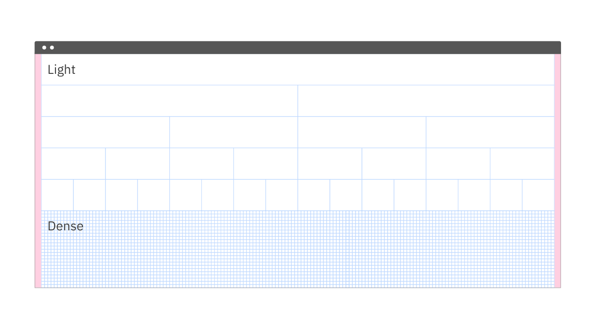

### Margins

The margins at the outer edge of the grid are always a fixed size within a breakpoint, even when columns are fluid. See [Breakpoints](https://www.ibm.com/design/language/elements/2x-grid-ui#breakpoints) for a table of margin sizes.

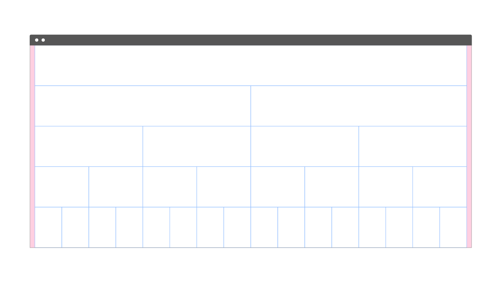

### Padding

Padding is always a fixed multiple of mini units: 16 pixels at all standard breakpoints. Always align type to the edge of box padding. Note, some design tools add padding to text boxes by default; check text box padding and remove it if necessary.

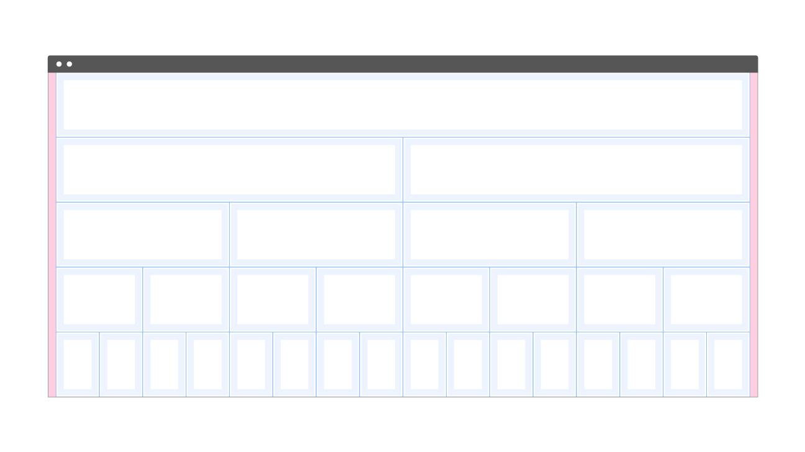

<Row>
<Column colMd={4} colLg={4}>
<DoDontExample type="do" caption="Always place type against the padding.">

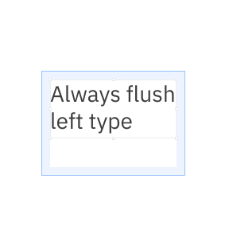

</DoDontExample>
</Column>
<Column colMd={4} colLg={4}>
<DoDontExample type="dont" caption="Never place type on the padding.">

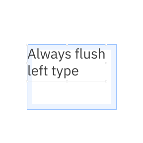

</DoDontExample>
</Column>
</Row>

### Gutters

Grid gutters can be absent as shown above, or present as shown below. Th margin around each grid box matches its padding, for a total gutter of 32 pixels. For closely related content, consider a gutterless grid. Apply gutters when content warrants more separation.

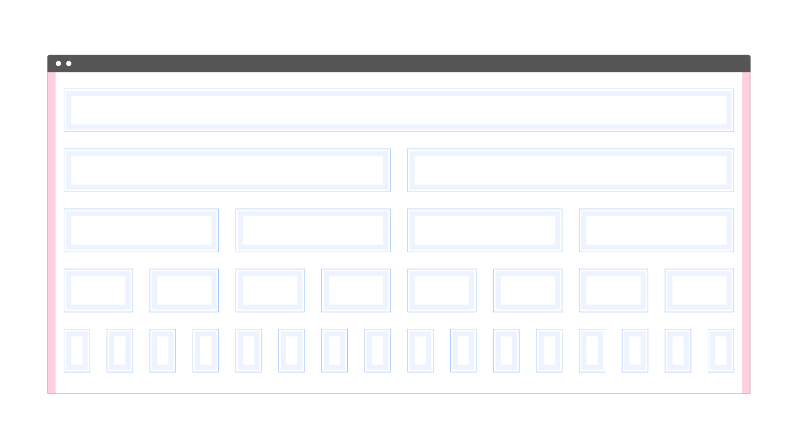

### Breakpoints

Use this set of standard breakpoints to maintain layout integrity across screen sizes. For best results, test designs and code at each of these standard breakpoints.

Create Custom Breakpoints to accommodate special needs, by writing your own media queries and CSS rules. Refer to the grid code package for more information.

| Breakpoints | Value (px/rem) | Columns | Column Width (%) | Column Size (px) | Padding (px) | Margin (px) |
| ----------- | -------------- | ------- | ---------------- | ---------------- | ------------ | ----------- |
| Small       | 320/20         | 4       | 25%              | 80               | 16           | 0           |
| Medium      | 672/42         | 8       | 12.5%            | 80               | 16           | 16          |
| Large       | 1056/66        | 16      | 6.25%            | 64               | 16           | 16          |
| X-Large     | 1312/82        | 16      | 6.25%            | 80               | 16           | 16          |
| Max         | 1584/99        | 16      | 6.25%            | 96               | 16           | 24          |

<Video src="/videos/Breakpoints.mp4" poster="/images/Breakpoints_Poster.png" />

## Grid behaviors

In user interfaces, screen size is dictated by the device and the user’s chosen window size. We may know content in advance or the content may be dynamic. Carefully consider the user’s goal for their screen space, particularly when displaying dynamic content. Choose the layout approach that best meets the user’s expectation in each case.

For example, when the user resizes their browser, is their goal to: **See more things?** Then scale column count by tiling fixed boxes. **See more content within each thing?** Then scale boxes and use fixed column counts.

<AnchorLinks small>
  <AnchorLink>Fluid grid</AnchorLink>
  <AnchorLink>Fixed boxes</AnchorLink>
  <AnchorLink>Hybrid</AnchorLink>
  <AnchorLink>Guide lines</AnchorLink>
</AnchorLinks>

### Fluid grid

Fluid Grids are ideal for editorial content, dashboards, images, video, data visualizations, etc. In each case, scaling the size of things is more useful to the user than scaling the number of visible things. In a fluid grid, we divide available width in half to create columns, repeating as necessary.

At each breakpoint, column count is fixed and column width is a multiple of mini units. Row height is a multiple of column size, following recommended aspect ratios. Margin and padding are fixed multiples of mini units. In between breakpoints, actual column width is a percentage of the grid area, not a mini unit multiple. Content scales fluidly.

<Video src="/videos/Fluid-Grid.mp4" poster="/images/Fluid_Grid_Poster.png" />

### Fixed Boxes

A grid can be formed with Fixed Boxes by tiling cards in an inline block, icons in toolbars, etc. Column count grows with browser width. Tiles wrap to the next line, or are sometimes truncated with an overflow scroll. First choose a base size from the sizing scale, then build up each Box in multiples of the base size, following recommended aspect ratios. A grid emerges when each tile uses a multiple of a consistent base size. Following this method ensures consistency of tile sizes even across products.

<Video src="/videos/Fixed_Boxes.mp4" poster="/images/Fixed_Boxes_Poster.png" />

### Hybrid

Hybrid Boxes have different scaling rules in each dimension, so they do not use aspect ratios. When a user would resize the browser expecting content to scale in one dimension but not the other, use hybrid boxes.

Use the sizing scale to size a fixed dimension. Use column-width multiples to size a grid-fluid dimension. Aspect ratios do not apply.

<Video src="/videos/Hybrid-Grid.mp4" poster="/images/Hybrid_Poster.png" />

Here are some common UI behaviors:

| Examples   | Width | Height |
| ---------- | ----- | ------ |
| Header     | Fluid | Fixed  |
| Toolbar    | Fluid | Fixed  |
| Side Panel | Fixed | Fluid  |
| Menu       | Fixed | Fluid  |
| Content    | Fixed | Fluid  |
| Data Table | Fluid | Fluid  |

### Guide Lines

Regardless how your column structure derived from the 2x Grid, ensure the overall layout has clear priority alignments: vertical and horizontal lines on which multiple objects align helping to create hierarchies. Horizontal and vertical alignment are equally critical. When present, the eye can follow content more easily, increase the perception of visual harmony.

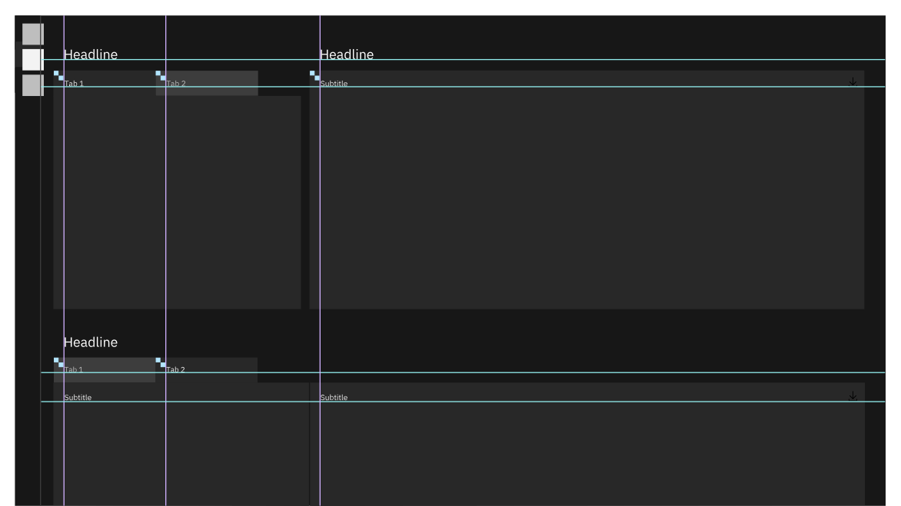

## Grid influencers

Within a design system, layouts often follow a common structure, especially with regard to navigational patterns. This section covers which of these UI patterns you’ll need, where users will expect to see them on a page and how they’ll affect the content that lives within the responsive grid. Hence the name “Grid influencers.”

<AnchorLinks small>
  <AnchorLink>Screen regions</AnchorLink>
  <AnchorLink>Panel behavior</AnchorLink>
</AnchorLinks>

### Scren regions

In a UI layout, users expect to find certain types of content in certain areas. We call these areas Screen Regions. It is especially important for these zones to be consistent across devices, and adapt across breakpoints.

![](images/Desktop_Screen_Regions_01.svg

<Caption>
  1. Header  
  2. Global sidenav  
  3. Local sidenav
</Caption>

![](images/Desktop_Screen_Regions_02.svg

<Caption>
  4. Dropdown Menu  
  5. Content  
  6. Footer
</Caption>

![](images/Desktop_Screen_Regions_03.svg

<Caption>7. Dialog</Caption>

### Panel behavior

All vertical panels expand to fill the full height of the browser window.

#### Flexible panels

The Flexible Panels allow for both collapsed and expanded states. The expanded state of a Flexible Panel is a fixed width that cannot be adjusted by the user. The collapsed Flexible Panel expands when the user hovers over any portion of it. When flexible panels expand, they either condense both the content and the grid or they push content beyond the edge of the browser.

<Video
  src="/videos/Panel_Behavior_Flexible.mp4"
  poster="/images/Flexible_Panels_Poster.png"
/>

#### Fixed panels

Fixed panels maintain a static width, cannot be collapsed and also exist outside of the responsive grid.

<Video
  src="/videos/Panel_Behavior_Fixed.mp4"
  poster="/images/Fixed_Panels_Poster.png"
/>

#### Floating panels

This panel style floats above the primary content area and does not affect the responsive grid. Floating panels conceal any UI elements below them and must be dismissable by the user. Inline menus, dropdowns and tooltips also float.

<Video
  src="/videos/Panel_Behavior_Floating.mp4"
  poster="/images/Floating_Panels_Poster.png"
/>

## Sizing scale

We provide a sizing scale for both fixed and fluid sizes. Use it to size content as well as negative space. Like a type scale, the sizing scale constrains the range of sizes to improve consistency and rhythm, while still allowing a wide range of sizes. To use it, first choose a fixed or fluid base unit, then multiply it in each dimension, applying aspect ratios as needed.

<AnchorLinks small>
  <AnchorLink>Fixed base unit</AnchorLink>
  <AnchorLink>Fluid base unit</AnchorLink>
  <AnchorLink>Scaling multiple</AnchorLink>
  <AnchorLink>Aspect ratio</AnchorLink>
  <AnchorLink>Vertical rhythm</AnchorLink>
  <AnchorLink>Components</AnchorLink>
</AnchorLinks>

### Fixed base unit

Use this fixed sizing scale, comprised of select mini unit multiples, when sizing icons, tiling boxes, and applying vertical margin space.

.

| Sizing Scale (px) | Mini Units |
| ----------------- | ---------- |
| 8                 | 1          |
| 16                | 2          |
| 24                | 3          |
| 32                | 4          |
| 48                | 6          |
| 64                | 8          |
| 80                | 10         |
| 96                | 12         |

### Fluid base unit

For fluid grids, the column width is the base unit. Just as a box can span multiple columns, its height is a multiple of column width. Use cases are leading section in a webpage, divded section for editorial content, modals, etc. Check out the [breakpoints table](https://www.ibm.com/design/language/elements/2x-grid-ui#breakpoints) for pixel sizings.

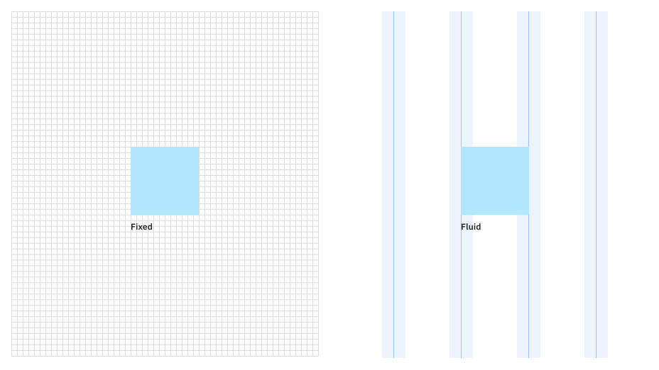

### Scaling multiple

After determining your base size, multiply it as needed for each use. For box sizing, apply an aspect ratio too.

<Video
  src="/videos/Scaling-Multiple.mp4"
  poster="/images/Scaling_Multiple_Poster.png"
/>

### Aspect ratio

When sizing boxes, constrain dimensions to one of the aspect ratios shown below whenever possible. Doing so will heighten the perception of unity between products.

Choose an aspect ratio from the table, then multiply the base unit in each dimension as needed to set width and height, maintaining the ratio in either portrait or landscape.

| Aspect Ratios            |
| ------------------------ |
| 1:1, 2:1, 3:2, 4:3, 16:9 |

For example, to size a fluid box with a 2:1 landscape aspect ratio, you could span 4 columns in width and 2 column-widths of height. To size a fixed box with the same aspect ratio, you could start with an 80 pixel base unit, then multiply it by 4 in width and 2 in height, for a fixed box size of 320 by 160.

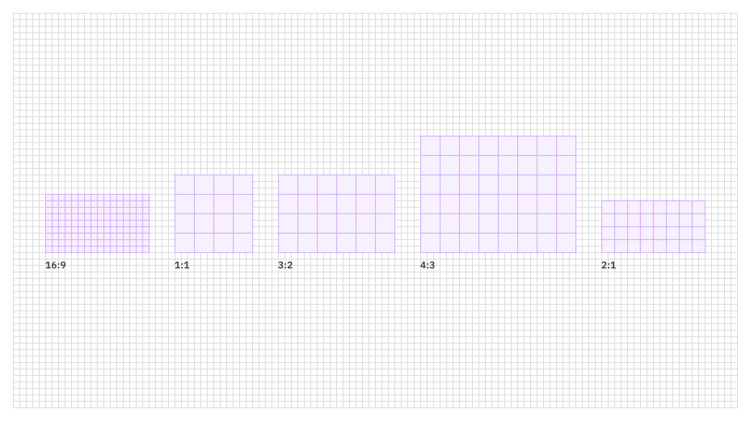

### Vertical rhythm

Use the fixed sizing scale to set vertical spacing between sections, by adding it to the top or bottom margin of a box:

<Video
  src="/videos/Visual-Rhythm.mp4"
  poster="/images/Visual_Rhythm_Poster.png"
/>

<Row>
<Column colMd={4} colLg={4}>
<DoDontExample type="do" caption="Mini unit is the guide when needed. Spacer snaps to the text box and does not necessarily need to snap to the mini unit.">

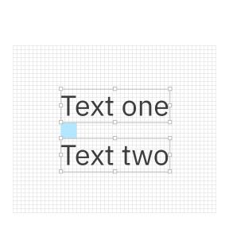

</DoDontExample>
</Column>
<Column colMd={4} colLg={4}>
<DoDontExample type="dont" caption="In Sketch, always use “Auto” in alignment to ensure the text box is fitting with the content. Spacer snaps to the text box.">

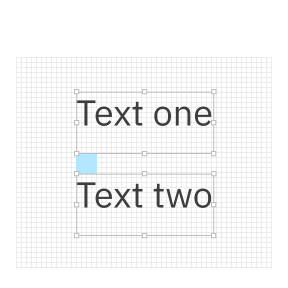

</DoDontExample>
</Column>
</Row>

### Components

Components can be sized like other boxes: either fixed or fluid, and often hybrid, with fixed height and fluid width. When interior space within a component is cramped, use the minor sizing scale:

| Px              |
| --------------- |
| 2, 4, 8, 12, 16 |

When multiple components adhere to the same scale, grid relationships naturally emerge. For example, vertically aligning form fields such as checkboxes and radio buttons produces a grid effect when interior spacing is consistent.

<Video src="/videos/Components.mp4" poster="/images/Components_Poster.png" />
