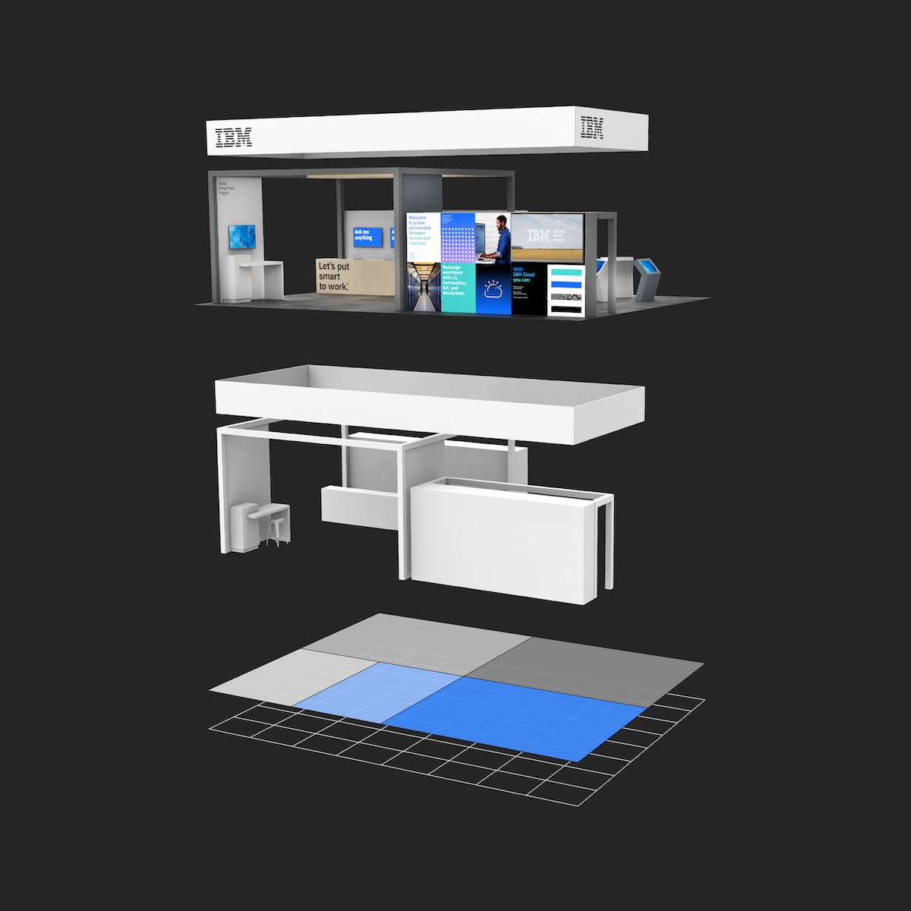

import { PageDescription, AnchorLinks, AnchorLink } from 'gatsby-theme-carbon';

<PageDescription>

The IBM grid is the framework for all the visual elements and typography. It’s
fundamental to everything we design. No matter what device or medium you’re
working with, the grid gives you just enough structure and guidance so you can
focus on your creative idea.

</PageDescription>

<AnchorLinks>
  <AnchorLink>Divisions of two</AnchorLink>
  <AnchorLink>Constructing the 2x grid</AnchorLink>
  <AnchorLink>Base unit</AnchorLink>
  <AnchorLink>Spatial relationships</AnchorLink>
</AnchorLinks>

<Video vimeoId="337387156" />

## Resources

<Row className="resource-card-group">
<Column colMd={4} colLg={4} noGutterSm>
    <ResourceCard
      subTitle="2x Grid in UI"
      aspectRatio="2:1"
      href="/elements/2x-grid-ui"
      actionIcon="arrowRight"
      >

  </ResourceCard>
</Column>
<Column colMd={4} colLg={4} noGutterSm>
    <ResourceCard
      subTitle="2x Grid for events"
      aspectRatio="2:1"
      disabled
      >

  </ResourceCard>
</Column>
</Row>

## Divisions of two

At the core of the 2x Grid concept is the idea of divisions of two. This can be applied to most surfaces, 3-D objects, and architecture as a means to divide space into a helpful grid system. Dividing your space into 2, 4, 8, 16, 32, or 64 columns gives you the basis of the system with the purpose of helping you make decisions and organize your content.

<Video
  poster="/images/divisions-of-two.jpg"
  src="/videos/divisions-of-two.mp4"
/>

<Row>
<Column colMd={4} colLg={8}>

</Column>
<Column colMd={2} colLg={4}>

</Column>
<Column colMd={2} colLg={4}>

</Column>
<Column colMd={2} colLg={4}>

</Column>
<Column colMd={2} colLg={4}>

</Column>
<Column colMd={2} colLg={4}>

</Column>
<Column colMd={4} colLg={8}>

</Column>
<Column colMd={2} colLg={4}>

</Column>
<Column colMd={2} colLg={4}>

</Column>
<Column colMd={2} colLg={4}>

</Column>
</Row>

## Constructing the 2x grid

Each application of the grid can require a different grid structure. When constructing the grid, keep in mind these different types of grids and choose which one best serves your need.

<Row>
<Column colMd={2} colLg={4}>

<Caption>No margin or gutter</Caption>

</Column>
<Column colMd={2} colLg={4}>

<Caption>Margin with no gutter</Caption>

</Column>
<Column colMd={2} colLg={4}>

<Caption>Margin and gutter</Caption>

</Column>
</Row>

### Margins

Add margins to your canvas when you need separation of content from the canvas boundaries. In some cases, margins are specified by the production method.

<Video src="/videos/margins.mp4" poster="/images/margins.jpg" />

<Row>
<Column colMd={4} colLg={6}>

<Caption>2x Grid constructed with margins</Caption>

</Column>
<Column colMd={4} colLg={6}>

<Caption>2x Grid without margins</Caption>

</Column>
</Row>

### Columns and rows

Within the grid, columns and rows are especially important—they give layouts their structure. You can choose between 1, 2, 4, 8, and 16 divisions. Stick to your choice throughout your design to maintain structure.

<Video
  src="/videos/columns-and-rows.mp4"
  poster="/images/columns-and-rows.jpg"
/>

<Caption>Columns only</Caption>

<Row>
<Column colMd={4} colLg={6}>

<Caption>Rows only</Caption>

</Column>
<Column colMd={4} colLg={6}>

<Caption>Columns and rows</Caption>

</Column>
</Row>

<Row>
<Column colMd={4} colLg={4}>
<DoDontExample type="do" caption="Always divide the live area to ensure equal column and row widths.">

</DoDontExample>
</Column>
<Column colMd={4} colLg={4}>
<DoDontExample type="dont" caption="Never divide from the canvas boundary when using a margin.">

</DoDontExample>
</Column>
</Row>

### Gutters

Add gutters to columns and rows when additional space is needed to separate content. When using gutters, always align type to the gutters rather than the canvas divisions. Columns and rows must always remain equal.

<Video src="/videos/gutters.mp4" poster="/images/gutters.jpg" />

<Row>
<Column colMd={4} colLg={6}>

<Caption>With gutters</Caption>

</Column>
<Column colMd={4} colLg={6}>

<Caption>Without gutters</Caption>

</Column>
</Row>

<Row>
<Column colMd={4} colLg={4}>
<DoDontExample type="do" caption="Distribute gutters evenly to achieve equal columns and rows.">

</DoDontExample>
</Column>
<Column colMd={4} colLg={4}>
<DoDontExample type="dont" caption="Don’t add gutter to the canvas divisions without redistributing.">

</DoDontExample>
</Column>
</Row>

## Base unit

If the 2x grid gives your designs structure, base units give them precision. Using a base unit will establish relationships between your grid proportions, typography, dimensions of shapes, and space between elements. You can choose either the mini unit or a baseline unit to build your grid and spatial relationships.

<Video src="/videos/base-unit.mp4" poster="/images/base-unit.jpg" />

### The mini unit

The mini unit can vary in size depending on the media. When choosing an appropriate unit for your application, consider the viewing distance. Each mini unit in the scale below has a type scale pairing and was determined by legibility over distance.

Mini unit sizes based on viewing distance:

| View distance | Mini unit | Media                             | Minimum Type Size (caption) |
| ------------- | --------- | --------------------------------- | --------------------------- |
| 0–0.5m        | 2mm       | Handheld print                    | 6pt                         |
| 0.5–1m        | 4mm       | Print viewed within arm’s reach   | 12pt                        |
| 1–2m          | 8mm       | Posters and small signage         | 24pt                        |
| 2–4m          | 16mm      | Human-scale print                 | 48pt                        |
| 4–8m          | 32mm      | Print viewed from across a room   | 96pt                        |
| 8–16m         | 64mm      | Print viewed from across a street | 192pt                       |

<Row>
<Column colMd={2} colLg={4}>

<Caption>Handheld card—2mm mini unit</Caption>

</Column>
<Column colMd={2} colLg={4}>

<Caption>Standing banner—16mm mini unit</Caption>

</Column>
<Column colMd={2} colLg={4}>

<Caption>Billboard—256mm mini unit</Caption>

</Column>
</Row>

<ArtDirection>

</ArtDirection>

<Caption>
  Grids above viewed at intended distance—all mini units have the same apparent
  size.
</Caption>

#### Mini unit for product and web

The 8px mini unit guides everything in both software product and web environments, from the construction of the grid to all the elements that live within it.

<Row className="resource-card-group">
<Column colMd={4} colLg={4} noGutterSm>
    <ResourceCard
      subTitle="2x Grid in UI: The mini unit"
      aspectRatio="2:1"
      href="/elements/2x-grid-ui#mini-unit"
      actionIcon="arrowRight"
      >

  </ResourceCard>
</Column>
<Column colMd={4} colLg={4} noGutterSm>
    <ResourceCard
      subTitle="IBM digital media templates"
      aspectRatio="2:1"
      disabled
      ></ResourceCard>
</Column>
</Row>

### Baseline unit

For advanced typographic layouts, consider creating a base unit from the leading of your document. You can use the leading size or a fraction of it to determine the baseline unit. Although this method requires finer tuning of margins, gutters, and type specs, it can help establish vertical rhythm and typographic harmony throughout your design.

The baseline unit can be used to construct all of the grid proportions, or you can take a hybrid approach by using the mini unit to create your grid and a baseline grid to guide your content.

<Row>
<Column colMd={4} colLg={6}>

<Caption>Baseline unit grid</Caption>

</Column>
<Column colMd={4} colLg={6}>

<Caption>Hybrid mini unit grid with baseline</Caption>

</Column>
</Row>

<Row className="resource-card-group">
<Column colMd={4} colLg={4} noGutterSm>
    <ResourceCard
      subTitle="IBM type scale"
      aspectRatio="2:1"
      href="/elements/type-specs-ui/#scales"
      actionIcon="arrowRight"
      >

  </ResourceCard>
</Column>
<Column colMd={4} colLg={4} noGutterSm>
    <ResourceCard
      subTitle="Thinking with type: baseline grid"
      aspectRatio="2:1"
      href="http://thinkingwithtype.com/grid/#baseline-grid"
      ></ResourceCard>
</Column>
</Row>
<Row className="resource-card-group">
<Column colMd={4} colLg={4} noGutterSm>
    <ResourceCard
      subTitle="Grid systems in graphic design"
      aspectRatio="2:1"
      href="https://www.amazon.com/Grid-Systems-Graphic-Design-Communication/dp/3721201450"
      ></ResourceCard>
</Column>
</Row>

## Spatial relationships

All spacing between elements can be defined by the base unit. Use the following multiples of your base unit to construct your layout: 1x, 2x, 3x, 4x, 6x, 8x, 10x, 12x. Consistent and replicated use of spacing ensures spatial rhythm between all content.

<ArtDirection>

</ArtDirection>

<Row>
<Column colMd={4} colLg={6}>

<Caption>Standing Banner (mini unit)</Caption>

</Column>
<Column colMd={4} colLg={6}>

<Caption>IBM Letterhead (baseline unit)</Caption>

</Column>
</Row>

### Aspect relationships

Use common aspect ratios, such as 16:9, 4:3, 3:2, 2:1, and 1:1 for images and containers. Always measure the width to the columns; the height is determined by it.

<Video src="/videos/aspect-ratios.mp4" poster="/images/aspect-ratios.jpg" />
