<PageDescription>

IBM’s app icons are visual symbols used to represent products or services.
They allow users to identify apps at a glance while serving as a unique
expression of our brand.

</PageDescription>

<AnchorLinks>
  <AnchorLink>Overview</AnchorLink>
  <AnchorLink>Stroke icons</AnchorLink>
  <AnchorLink>Fill icons</AnchorLink>
  <AnchorLink>IBM Plex icons</AnchorLink>
  <AnchorLink>Hero brands and 3rd parties</AnchorLink>
  <AnchorLink>Usage</AnchorLink>
</AnchorLinks>

## Resources

<Row className="resource-card-group">
<Column colMd={4} colLg={4} noGutterSm>
    <ResourceCard
      subTitle="App icon builder (.ai)"
      aspectRatio="2:1"
      href="/files/App_Icon_Builder.ai"
      actionIcon="download"
      >

  </ResourceCard>
</Column>
<Column colMd={4} colLg={4} noGutterSm>
    <ResourceCard
      subTitle="App icon template (.ai)"
      aspectRatio="2:1"
      href="https://github.ibm.com/carbon/app-icons/tree/master/app-icon-template"
      actionIcon="download"
      >

  </ResourceCard>
</Column>
</Row>

## Overview

App icons visually communicate the core idea of a product or service through either objective or abstract form. Expressive and distinct, each icon serves to identify apps at a glance, while collectively appearing to be part of a whole. All app icons are constructed on the same 32px grid and share many stylistic properties of UI Icons. Several different forms of app icons exist to serve the needs of different products, services, and the contexts in which they appear.

<Row>
<Column colMd={4} colLg={6}>

<Caption>Stroke icons</Caption>

</Column>
<Column colMd={4} colLg={6}>

<Caption>Fill icons</Caption>

</Column>
<Column colMd={4} colLg={6}>

<Caption>IBM Plex icons</Caption>

</Column>
<Column colMd={4} colLg={6}>

<Caption>Hero brands and third party logos</Caption>

</Column>
</Row>

## Stroke icons

Similar the visual expression of Watson, stroke app icons bring in light strokes and color gradients to stand out from product UI icons. Stroke app icons work best in product situations where app icons, UI Icons, and typography appear in the same context.

### Style

Stroke app icons are largely based on the styling of UI Icons, following all of the same production guidelines other than color. When creating stroke app icon, reference the UI icon guidance as a starting point.

<Row>
<Column colMd={4} colLg={4}>

<Caption>UI icon</Caption>

</Column>
<Column colMd={4} colLg={4}>

<Caption>Stroke app icon</Caption>

</Column>
</Row>

<Row>
<Column colMd={4} colLg={4} noGutterSm>
    <ResourceCard
      subTitle="UI icons guidance"
      href="/elements/icons"
      actionIcon="arrowRight"
      >

  </ResourceCard>
</Column>
</Row>

### Elements

All stroke app icons consist of 3 elements: A color gradient, a gradient stroke, and a solid stroke. Each of these elements must appear at least once in the icon, and separate elements do not touch each other.

<Row>
<Column colMd={4} colLg={4}>

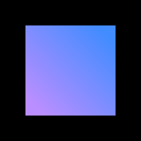

<Caption>Color gradient</Caption>

</Column>
<Column colMd={4} colLg={4}>

<Caption>Gradient stroke</Caption>

</Column>
<Column colMd={4} colLg={4}>

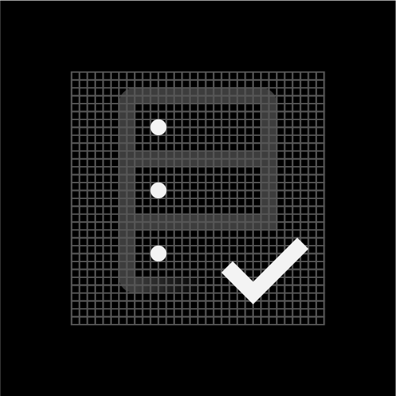

<Caption>Solid stroke</Caption>

</Column>
</Row>
<Row>
<Column colMd={4} colLg={4}>
<DoDontExample type="dont" caption="Gradient strokes and solid strokes do not touch.">

</DoDontExample>
</Column>
<Column colMd={4} colLg={4}>
<DoDontExample type="dont" caption="Stroke app icons must include both solid and gradient strokes.">

</DoDontExample>
</Column>
</Row>

#### Color gradient

The color gradient provides color to the gradient stroke of the icon. This layer remains stationary on the icon grid at 45° and is masked by the gradient stroke for consistent color across each icon.

<Row>
<Column colMd={4} colLg={6}>

<Caption>
  The color gradient layer remains stationary on the icon grid and is masked by
  the gradient stroke.
</Caption>

</Column>
<Column colMd={4} colLg={6}>

<Caption>The color gradient is always at 45°.</Caption>

</Column>
</Row>

You can choose between any of the 4 color gradients below. Note that the colors are adjusted for both light and dark backgrounds to appear best in either context.

<Caption>Color gradients for dark backgrounds</Caption>

<Caption>Color gradients for light backgrounds</Caption>

<Row>
<Column colMd={4} colLg={4}>
<DoDontExample type="dont" caption="Don’t alter the angle or scale of the color gradient.">

</DoDontExample>
</Column>
<Column colMd={4} colLg={4}>
<DoDontExample type="dont" caption="Don’t use unapproved color gradients.">

</DoDontExample>
</Column>
</Row>

#### Gradient stroke

The gradient stroke portion of the icon features an alpha gradient, or a gradient that blends between 100% and 0% opacity. This element serves as a mask for the color gradient.

<Row>
<Column colMd={4} colLg={4}>
<DoDontExample type="dont" caption="The gradient stroke must include an alpha gradient.">

</DoDontExample>
</Column>
<Column colMd={4} colLg={4}>
<DoDontExample type="dont" caption="Don’t make the alpha gradient too harsh.">

</DoDontExample>
</Column>
</Row>

<Row>
<Column colMd={4} colLg={4}>
<DoDontExample type="dont" caption="Don’t use radial gradients.">

</DoDontExample>
</Column>
<Column colMd={4} colLg={4}>
<DoDontExample type="dont" caption="Don’t use gradient horizontally along the stroke to create faded edges.">

</DoDontExample>
</Column>
</Row>

#### Solid stroke

The solid stroke features no gradients of any kind, and it is used as an accent or to emphasize a part of the icon. Be purposeful with which part of the icon is comprised by the solid stroke—do not add emphasis to insignificant parts of the icon.

<Row>
<Column colMd={4} colLg={4}>
<DoDontExample type="dont" caption="Be purposeful with the solid stroke. Don’t add emphasis on insignificant parts of the icon.">

</DoDontExample>
</Column>
<Column colMd={4} colLg={4}>
<DoDontExample type="dont" caption="Don’t use alpha gradient on the solid stroke layer.">

</DoDontExample>
</Column>
</Row>

The color of the solid stroke can be either Gray 10 for dark backgrounds or Blue 90 for light backgrounds. These colors work great for either context and with any approved color gradient.

<Row>
<Column colMd={4} colLg={4}>

<Caption>Gray 10 solid stroke on dark background</Caption>

</Column>
<Column colMd={4} colLg={4}>

<Caption>Blue 90 solid stroke on light background</Caption>

</Column>
</Row>
<Row>
<Column colMd={4} colLg={4}>
<DoDontExample type="dont" caption="Don’t use dark theme colors on light theme and vice versa.">

</DoDontExample>
</Column>
<Column colMd={4} colLg={4}>
<DoDontExample type="dont" caption="Don’t use other solid stroke colors.">

</DoDontExample>
</Column>
</Row>

### Monochromatic icons

In some limited use cases, you may need a single-color app icon. These icons are generally used when the icon needs to appear on a color background or in situations when the icon shouldn’t call attention to itself with color, such as disabled states.

<Row>
<Column colMd={4} colLg={4}>

<Caption>Gray 10 monochromatic icon for background values 60–100</Caption>

</Column>
<Column colMd={4} colLg={4}>

<Caption>Gray 100 monochromatic icon for background values 10–50</Caption>

</Column>
</Row>
<Row>
<Column colMd={4} colLg={4}>
<DoDontExample type="do" caption="Use monochromatic for app icons on color fields.">

</DoDontExample>
</Column>
<Column colMd={4} colLg={4}>
<DoDontExample type="dont" caption="Don’t apply color to an app icon on a color field.">

</DoDontExample>
</Column>
</Row>

## Fill icons

Alternative to stroke app icons, fill app icons communicate the core idea of the app with more simplicity and abstraction. These icons should focus on the bigger concepts of the product or service, such as scale, transaction, integration, etc. Functionally, fill app icons work best in situations where you need to call attention to the app with more visual weight or a larger color field, as opposed to the light, linear form of fill app icons.

### Style

Fill icons are created by combining, intersecting, and subdividing two core shapes: the square and the circle. These shapes can be scaled to fit within the grid to allow for endless possibilities.

<Row>
<Column colMd={4} colLg={6}>

<Caption>Core shape (circle) with subdivisions</Caption>

</Column>
<Column colMd={4} colLg={6}>

<Caption>Core shape (square) with subdivisions</Caption>

</Column>
<Column colMd={4} colLg={6}>

<Caption>Core shape (circle) with subdivisions</Caption>

</Column>
<Column colMd={4} colLg={6}>

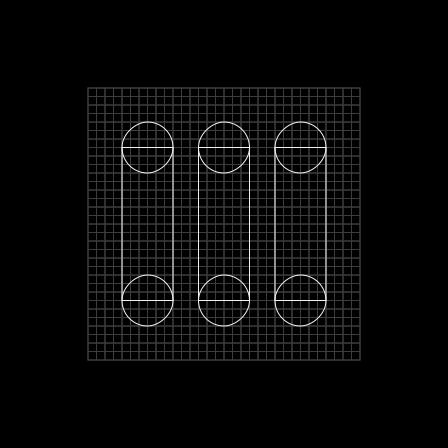

<Caption>Core shape (square) with subdivisions</Caption>

</Column>
</Row>

<Row>
<Column colMd={4} colLg={4}>
<DoDontExample type="dont" caption="Avoid making icons too complex.">

</DoDontExample>
</Column>
<Column colMd={4} colLg={4}>
<DoDontExample type="dont" caption="Avoid making icons too literal.">

</DoDontExample>
</Column>
</Row>
<Row>
<Column colMd={4} colLg={4}>
<DoDontExample type="dont" caption="Don’t use organic shapes. ">

</DoDontExample>
</Column>
</Row>

### Elements

Fill icons consist of up to 3 elements: A primary gradient, a secondary color, and a tertiary gradient. All fill app icons must have at least one primary gradient, and at least one secondary color and/or tertiary gradient. Any element can exist in more than one shape, i.e. two separate shapes with primary gradient.

<Row>
<Column colMd={4} colLg={4}>

<Caption>Primary gradient</Caption>

</Column>
<Column colMd={4} colLg={4}>

<Caption>Secondary color</Caption>

</Column>
<Column colMd={4} colLg={4}>

<Caption>Tertiary gradient</Caption>

</Column>
</Row>
<Row>
<Column colMd={4} colLg={4}>
<DoDontExample type="dont" caption="Fill icons must include at least one shape with primary gradient.">

</DoDontExample>
</Column>
<Column colMd={4} colLg={4}>
<DoDontExample type="dont" caption="Fill icons must include at least one secondary color and/or tertiary gradient.">

</DoDontExample>
</Column>
</Row>

### Primary gradient

The primary gradient is the primary element of the icon consisting of a blend between any acceptable 2-Color Family from the color palette. Due to the larger color fields possible in Fill icons compared to stroke icons, it is possible for a wider range of color gradients to work well on both light and dark backgrounds. Please reference the color guidance when choosing the right color gradient for your app icon.

Use combinations within any of the acceptable 2-color families when blending gradients. Values between 30 and 60 are used to create vibrant gradients that work well against both dark and light backgrounds. For more contrast or subtlety, blend between darker or lighter colors. Do not blend between colors that are more than two steps away from each other.

<Row>
<Column colMd={4} colLg={4}>
<DoDontExample type="dont" caption="Don’t use more than one 2-Color Family for the primary gradient.">

</DoDontExample>
</Column>
<Column colMd={4} colLg={4}>
<DoDontExample type="dont" caption="Don’t use different color values for the primary gradient.">

</DoDontExample>
</Column>
</Row>
<Row>
<Column colMd={4} colLg={4}>
<DoDontExample type="dont" caption="Don’t mix colors that are outside of the accepted 2-Color Families.">

</DoDontExample>
</Column>
<Column colMd={4} colLg={4}>
<DoDontExample type="dont" caption="Don’t blend between colors that are more than two steps away, i.e. Blue 60 to Teal 20.">

</DoDontExample>
</Column>
</Row>
<Row>
<Column colMd={4} colLg={4}>
<DoDontExample type="dont" caption="Don’t create gradients with more than two colors.">

</DoDontExample>
</Column>
<Column colMd={4} colLg={4}>
<DoDontExample type="dont" caption="Don’t use radial gradients.">

</DoDontExample>
</Column>
</Row>

<Row>
<Column colMd={4} colLg={4} noGutterSm>
    <ResourceCard
      subTitle="Color: gradients"
      href="/elements/color/#gradients"
      actionIcon="arrowRight"
      >

  </ResourceCard>
</Column>
</Row>

 
 

#### Secondary color

Secondary color can be used as an accent or to place emphasis on part of the icon. Use either Gray 10 for dark backgrounds or Blue 90 for light backgrounds.

<Row>
<Column colMd={4} colLg={4}>

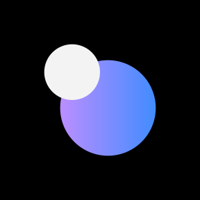

<Caption>Gray 10 secondary color on dark background</Caption>

</Column>
<Column colMd={4} colLg={4}>

<Caption>Blue 90 secondary color on light background</Caption>

</Column>
</Row>
<Row>
<Column colMd={4} colLg={4}>
<DoDontExample type="dont" caption="Don’t use dark theme color on light theme and vice versa.">

</DoDontExample>
</Column>
<Column colMd={4} colLg={4}>
<DoDontExample type="dont" caption="Don’t use other colors for secondary color.">

</DoDontExample>
</Column>
</Row>

#### Tertiary gradient

The tertiary gradient is a very light and subtle supporting element designed to fall somewhat to the background. It consists of an opacity gradient using either Gray 10 for dark backgrounds or Gray 100 for light backgrounds.

<Caption>Tertiary gradient for dark backgrounds</Caption>

<Caption>Tertiary gradient for light backgrounds</Caption>

### Monochromatic icons

In some limited use cases, you may need a single-color app icon. These icons are generally used when the icon needs to appear on a color background or in situations when the icon shouldn’t call attention to itself with color, such as disabled states. Fill icons use opacities of a single color to create gradients.

<Row>
<Column colMd={4} colLg={4}>

<Caption>Gray 10 monochromatic icon for background values 60–100</Caption>

</Column>
<Column colMd={4} colLg={4}>

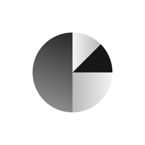

<Caption>Gray 100 monochromatic icon for background values 10–50</Caption>

</Column>
</Row>

Opacity gradients for monochromatic icons:

| Icon color | Primary gradient (opacity) | Secondary color (opacity) | Tertiary gradient (opacity) |
| ---------- | -------------------------- | ------------------------- | --------------------------- |
| Gray 10    | 90%–50%                    | 100%                      | 40%–10%                     |
| Gray 100   | 90%–50%                    | 100%                      | 30%–5%                      |

<Row>
<Column colMd={4} colLg={4}>
<DoDontExample type="do" caption="Use monochromatic for app icons on color fields.">

</DoDontExample>
</Column>
<Column colMd={4} colLg={4}>
<DoDontExample type="dont" caption="Don’t apply color to an app icon on a color field.">

</DoDontExample>
</Column>
</Row>

## IBM Plex icons

IBM Plex can also be sized for use as product or service identifiers. Use the icon grid as a guide to ensure type appears clear and proportional alongside other iconography.

<Row>
<Column colMd={4} colLg={4}>

</Column>
<Column colMd={4} colLg={4}>

</Column>
<Column colMd={4} colLg={4}>

</Column>
</Row>

### Style

For app icons, bold weights of IBM Plex Sans work best. You may choose to use Plex Mono or italics Plex fonts when it makes sense for your product or service.

<Row>
<Column colMd={4} colLg={4}>
<DoDontExample type="do" caption="Use bold weights of IBM Plex and default to Plex Sans.">

</DoDontExample>
</Column>
<Column colMd={4} colLg={4}>
<DoDontExample type="dont" caption="Don’t use lighter weights.">

</DoDontExample>
</Column>
</Row>

<Row>
<Column colMd={4} colLg={4}>
<DoDontExample type="do" caption="You can use Plex mono and italics Plex fonts when it makes sense to do so.">

</DoDontExample>
</Column>
<Column colMd={4} colLg={4}>
<DoDontExample type="dont" caption="Avoid use of Plex Serif.">

</DoDontExample>
</Column>
</Row>

<Row>
<Column colMd={4} colLg={4}>
<DoDontExample type="do" caption="Use solid type.">

</DoDontExample>
</Column>
<Column colMd={4} colLg={4}>
<DoDontExample type="dont" caption="Don’t outline type.">

</DoDontExample>
</Column>
</Row>

### Typesetting

When setting type on the icon grid, use smaller type sizes as character count increases in order to fit the type comfortably. Please do not alter other type specs, such as tracking, kerning or vertical/horizontal scale.

<Row>
<Column colMd={4} colLg={4}>
<DoDontExample type="dont" caption="Don’t use more than 3–4 characters max.">

</DoDontExample>
</Column>
<Column colMd={4} colLg={4}>
<DoDontExample type="dont" caption="Don’t use more than one line of text.">

</DoDontExample>
</Column>
</Row>

<Row>
<Column colMd={4} colLg={4}>
<DoDontExample type="dont" caption="Don’t stretch the type.">

</DoDontExample>
</Column>
<Column colMd={4} colLg={4}>
<DoDontExample type="dont" caption="Don’t alter the tracking.">

</DoDontExample>
</Column>
</Row>

### Alignment

Always keep type center aligned within the icon grid, and adjust for optical alignment when needed. Keep baselines aligned to a grid division and respect icon padding guidelines.

<Row>
<Column colMd={4} colLg={4}>
<DoDontExample type="do" caption="Center typography while aligning the baseline to the icon grid.">

</DoDontExample>
</Column>
<Column colMd={4} colLg={4}>
<DoDontExample type="dont" caption="Don’t place the baseline off-grid.">

</DoDontExample>
</Column>
</Row>

<Row>
<Column colMd={4} colLg={4}>
<DoDontExample type="do" caption="You can adjust horizontal alignment when optical centering is needed.">

</DoDontExample>
</Column>
<Column colMd={4} colLg={4}>
<DoDontExample type="dont" caption="Don’t left, right, top, or bottom align the type.">

</DoDontExample>
</Column>
</Row>

<Row>
<Column colMd={4} colLg={4}>
<DoDontExample type="do" caption="Adhere to icon padding guidance, using the padding occasionally for optical centering.">

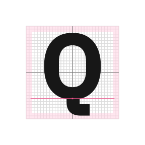

</DoDontExample>
</Column>
<Column colMd={4} colLg={4}>
<DoDontExample type="dont" caption="Don’t unnecessarily place type in the padding.">

</DoDontExample>
</Column>
</Row>

<Row>
<Column colMd={4} colLg={4}>
<DoDontExample type="do" caption="Place type completely within the icon grid">

</DoDontExample>
</Column>
<Column colMd={4} colLg={4}>
<DoDontExample type="dont" caption="Don’t crop.">

</DoDontExample>
</Column>
</Row>

### Color

Color should be used sparingly with Plex. Always choose color within the palette, and consider how type color will appear on color fields.

<Row>
<Column colMd={4} colLg={4}>
<DoDontExample type="do" caption="You can use one color value within the color palette.">

</DoDontExample>
</Column>
<Column colMd={4} colLg={4}>
<DoDontExample type="dont" caption="Don’t use multiple colors.">

</DoDontExample>
</Column>
</Row>

<Row>
<Column colMd={4} colLg={4}>
<DoDontExample type="do" caption="You can use gradients across the entire icon.">

</DoDontExample>
</Column>
<Column colMd={4} colLg={4}>
<DoDontExample type="dont" caption="Don’t place gradients on separate elements of the type.">

</DoDontExample>
</Column>
</Row>

## Hero brands and third party logos

Products and services often need to be represented with logos in environments such as marketplaces, especially when it is delivered by a third party or IBM partner company. Placement within the icon grid can help to ensure logos look great alongside other iconography.

<Row>
<Column colMd={4} colLg={4}>

<Caption>IBM Cloud logo</Caption>

</Column>
<Column colMd={4} colLg={4}>

<Caption>Third party logo</Caption>

</Column>
<Column colMd={4} colLg={4}>

<Caption>Third party logo within container</Caption>

</Column>
</Row>

### Alignment

While most logos don’t align perfectly to the icon grid, it is important to align any icon artwork to the grid as best as possible. Center logos and align edges to grid divisions while respecting icon padding guidelines.

<Row>
<Column colMd={4} colLg={4}>
<DoDontExample type="do" caption="Optically center logos and align to the icon grid as best as possible.">

</DoDontExample>
</Column>
<Column colMd={4} colLg={4}>
<DoDontExample type="dont" caption="Don’t left, right, top or bottom align logos.">

</DoDontExample>
</Column>
</Row>

<Row>
<Column colMd={4} colLg={4}>
<DoDontExample type="do" caption="Adhere to icon padding guidance, using the padding occasionally for optical centering.">

</DoDontExample>
</Column>
<Column colMd={4} colLg={4}>
<DoDontExample type="dont" caption="Don’t unnecessarily place type in the padding.">

</DoDontExample>
</Column>
</Row>

### Keyshapes

When logos have a background container, use [keyshapes](elements/icons/#keyshapes) to guide your design. This makes it easier to create a visually stable foundation and helps to keep visual weight consistent between icons.

<Row>
<Column colMd={4} colLg={4}>

<Caption>Third party logo set in circle keyshape</Caption>

</Column>
<Column colMd={4} colLg={4}>

<Caption>Third party logo set in square keyshape</Caption>

</Column>
</Row>

## Usage

App icons distinguish themselves from UI icons through expressive shape and color, allowing users to quickly identify applications at a glance and pivot to them quickly. They appear in a variety of contexts and environments that should be considered when designing new icons.

### Product and web

Most often, app icons are needed within product and web platforms and marketplaces. In these contexts, app icons should follow the same usage conventions as UI icons for sizing, alignment, and clearance.

<Caption>App icons in product, IBM Security</Caption>

<Caption>Product catalog example</Caption>

 
 

<Row>
<Column colMd={4} colLg={4} noGutterSm>
    <ResourceCard
      subTitle="UI icons: usage"
      href="/elements/icons#usage"
      actionIcon="arrowRight"
      >

  </ResourceCard>
</Column>
</Row>

 
 

#### Type pairing

When pairing with typography, app icons should not appear to be a logo for any product, service, or business unit. Please contact the brand team for logo requests.

<Row>
<Column colMd={4} colLg={4}>
<DoDontExample type="do" caption="You can use app icons with type to identify a product or service in the context of a product or marketplace.">

</DoDontExample>
</Column>
<Column colMd={4} colLg={4}>
<DoDontExample type="dont" caption="Don’t use any icon as a logo or with a brand type lockup for product headers, merchandise or events.">

</DoDontExample>
</Column>
</Row>

### Native OS

For native desktop apps, icons are placed in a square or circle container depending on the requirements of the operating system.

<Video
  src="/videos/Usage_Native_GridAnimation.mp4"
  poster="/images/Usage_Native_PosterImage.svg"
/>

<Row>
<Column colMd={4} colLg={4}>

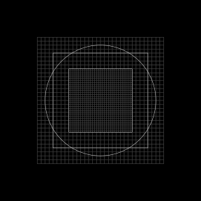

</Column>
<Column colMd={4} colLg={4}>

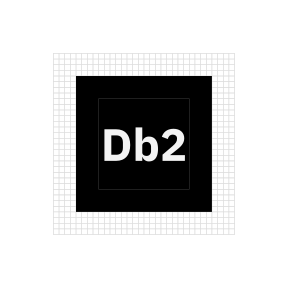

</Column>
<Column colMd={4} colLg={4}>

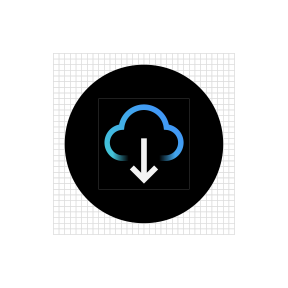

</Column>
</Row>

### Background Color

You can choose a background color or gradient for native app icons. Be sure to follow color guidance of your chosen icon style.

<Row>
<Column colMd={4} colLg={4}>
<DoDontExample type="do" caption="You can use monochromatic app icons with gradients and background colors in the 20–80 value range.">

</DoDontExample>
</Column>
<Column colMd={4} colLg={4}>
<DoDontExample type="dont" caption="Don’t use color app icons with gradients or mid-range color values. ">

</DoDontExample>
</Column>
</Row>

<Row>
<Column colMd={4} colLg={4} noGutterSm>
    <ResourceCard
      subTitle="UI icons: usage"
      href="/elements/icons#usage"
      actionIcon="arrowRight"
      >

  </ResourceCard>
</Column>
</Row>

## Mobile OS

Specific grids have been created for app icons to appear best in both iOS and Android mobile operating systems. For other mobile app icon needs, use the native OS grid.

### iOS

The iOS app icon grid is adjusted for the rounded corners that are masked out of the icon. Refer to the app icon template for placement.

<Row>
<Column colMd={4} colLg={6}>

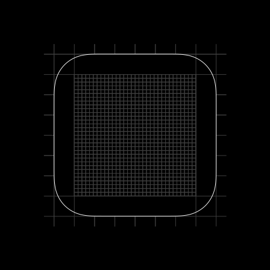

<Caption>iOS app icon grid</Caption>

</Column>
<Column colMd={4} colLg={6}>

<Caption>Example iOS app icon</Caption>

</Column>
</Row>

 
 

<Row className="resource-card-group">
<Column colMd={4} colLg={4} noGutterSm>
    <ResourceCard
      subTitle="Apple Human Interface Guidelines: App Icons"
      aspectRatio="2:1"
      href="https://developer.apple.com/design/human-interface-guidelines/ios/icons-and-images/app-icon/"
      >

  </ResourceCard>
</Column>
<Column colMd={4} colLg={4} noGutterSm>
    <ResourceCard
      subTitle="App icon template (.ai)"
      aspectRatio="2:1"
      href="https://github.ibm.com/carbon/app-icons/tree/master/app-icon-template"
      actionIcon="download"
      >

  </ResourceCard>
</Column>
</Row>

 
 

### Android

Android app icons have user-customizable masks and make use of foreground and background layers to achieve parallax effects. You can separate your icon’s elements into the two layers to make use of this interactive feature.

<Row>
<Column colMd={4} colLg={6}>

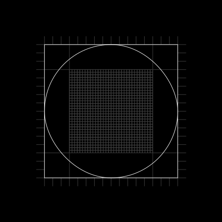

<Caption>Android adaptive app icon grid</Caption>

</Column>
<Column colMd={4} colLg={6}>

<Caption>Example Android adaptive app icon</Caption>

</Column>
</Row>

 
 

<Row className="resource-card-group">
<Column colMd={4} colLg={4} noGutterSm>
    <ResourceCard
      subTitle="Android adaptive icons"
      aspectRatio="2:1"
      href="https://developer.android.com/guide/practices/ui_guidelines/icon_design_adaptive"
      >

  </ResourceCard>
</Column>
<Column colMd={4} colLg={4} noGutterSm>
    <ResourceCard
      subTitle="App icon template (.ai)"
      aspectRatio="2:1"
      href="https://github.ibm.com/carbon/app-icons/tree/master/app-icon-template"
      actionIcon="download"
      >

  </ResourceCard>
</Column>
</Row>
