import ColorBlock from '../../components/ColorBlock';

<PageDescription>

Maintaining consistent and engaging digital interfaces throughout IBM, whether
applications or experiences, demands extended guidance around color usage. The
following concepts are the foundation as we strive to achieve balance and
harmony through our User Interface design.

</PageDescription>

<AnchorLinks>
  <AnchorLink>Get started</AnchorLink>
  <AnchorLink>Introduction</AnchorLink>
  <AnchorLink>Color anatomy</AnchorLink>
  <AnchorLink>Interaction states</AnchorLink>
  <AnchorLink>Implementing color</AnchorLink>
  <AnchorLink>Digital accessibility</AnchorLink>
  <AnchorLink>Accessibility resources</AnchorLink>
</AnchorLinks>

<Video vimeoId="281513790" />

## Get started

<Row className="resource-card-group">
<Column colMd={4} colLg={4} noGutterSm>
    <ResourceCard
      subTitle="Start withy the IBM Design kit"
      aspectRatio="2:1"
      href="https://ibm.com/standards/web/design-kitt"
      >

  </ResourceCard>
</Column>
<Column colMd={4} colLg={4} noGutterSm>
    <ResourceCard
      subTitle="Color Palettes for Adobe™(.ase)"
      aspectRatio="2:1"
      href="/files/IBM-color-palettes.zip"
      actionIcon="download"
      >

  </ResourceCard>
</Column>
</Row>

## Introduction

Application of our color palette brings a unified and recognizable consistency to IBM’s vast array of digital products and interfaces. This consistency is grounded by a set of well-defined rules on how to work with our component library in the context of dark and light themes.

## Color anatomy

The Neutral Gray family is dominant in our UI, making use of subtle shifts in value to help organize content into distinct zones. The core Blue family has been designated as the primary action color across all products and experiences. Additional colors are used sparingly and purposefully.

<Caption>Alerts Colors</Caption>

## Implementing color

Color is implemented through the [Carbon Design System](http://www.carbondesignsystem.com) which uses tokens and themes to manage color. Tokens are role-based, and themes specify the color values that serve those roles in the UI.

| Term    | Definition                                                                                                  |
| ------- | ----------------------------------------------------------------------------------------------------------- |
| _Theme_ | The set of unique values assigned to the tokens of a Carbon interface.                                      |
| _Token_ | The code identifier for a unique role or set of roles. Tokens are universal and never change across themes. |
| _Role_  | The systematic usage(s) of a token. Roles cannot be changed between themes.                                 |
| _Value_ | The actual style (i.e. hex code) assigned to a token.                                                       |

### Tokens

Tokens are a method of abstracting color by role or usage, independent of the actual color values. For example, instead of needing to code all instances of input labels in a UI to be `#565656`, the form component in Carbon specifies the token for these lables, and that token is specified in a separate theme file to `$text-02` be `#565656`. For a different theme, that same `$text-02` token could be mapped to a different hex value, like `#ffffff`. Thus, tokens not only allow for more efficient color updates within a theme, but also enable any UI (or portion of a UI) built with Carbon to easily switch between different themes.
A single token can be associated with multiple roles, but only if the color value is used consistently across those roles. This allows for uniform color application across themes while maintaining full styling flexibility.

With this system, all Carbon users can create their own themes by assigning new values to the established color tokens. IBM products should use the IBM default themes.

### Themes

Themes serve as an organizational framework for color in Carbon, with each theme based on a specific primary background color. Default light themes use White and Gray 10 backgrounds and default dark themes use Gray 100, 90 and 80 backgrounds. Default color tokens are provided for each component based on the primary background color. _Gray 80 coming soon._

<Row class="color-blocks">
<Column colMd={3} colLg={2}>

  

    White
  

<Caption>Light</Caption>

</Column>
<Column colMd={3} colLg={2}>

  

    Gray 10
  

</Column>
<Column colMd={3} colLg={2}>

  

    Gray 100
  

<Caption>Dark</Caption>

</Column>
<Column colMd={3} colLg={2}>

  

    Gray 90
  

</Column>
<Column colMd={3} colLg={2}>

  

    Gray 80
  

</Column>
</Row>

### Global background colors

| Color    | Role                    | Token            | Hex Value |                                            |
| -------- | ----------------------- | ---------------- | --------- | ------------------------------------------ |
| White    | Global Background Light | `$ui-background` | `#ffffff` | <ColorBlock size="xs">#ffffff</ColorBlock> |
| Gray 10  | Global Background Light | `$ui-background` | `#f3f3f3` | <ColorBlock size="xs">#f3f3f3</ColorBlock> |
| Gray 80  | Global Background Dark  | `$ui-background` | `#3d3d3d` | <ColorBlock size="xs">#3d3d3d</ColorBlock> |
| Gray 90  | Global Background Dark  | `$ui-background` | `#282828` | <ColorBlock size="xs">#282828</ColorBlock> |
| Gray 100 | Global Background Dark  | `$ui-background` | `#171717` | <ColorBlock size="xs">#171717</ColorBlock> |

### Light theme

Gray 10 components are generally paired with White backgrounds and White components with Gray 10 backgrounds. Some components, such as buttons and toggles, are common across both backgrounds.

<Row>
<Column colMd={4} colLg={6}>
<DoDontExample type="do" caption="Gray 10 Dropdown on White background.">

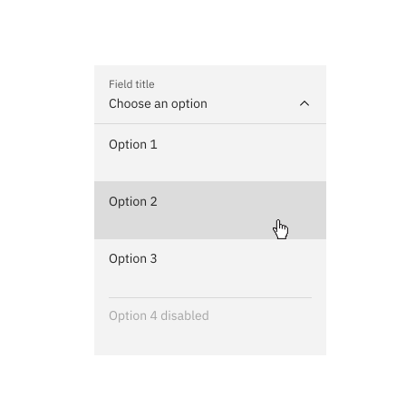

</DoDontExample>
</Column>
<Column colMd={4} colLg={6}>
<DoDontExample type="do" caption="White Dropdown on Gray 10 background.">

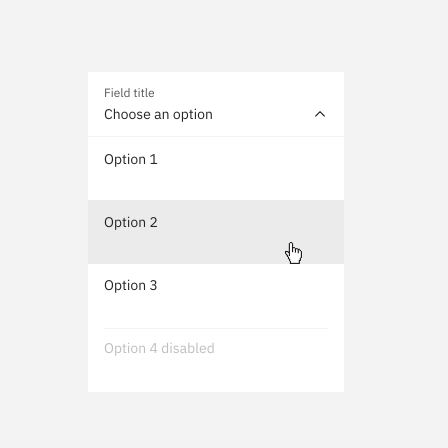

</DoDontExample>
</Column>
<Column colMd={4} colLg={6}>
<DoDontExample type="do" caption="White Overflow Menu on Gray 10 Card.">

</DoDontExample>
</Column>
<Column colMd={4} colLg={6}>
<DoDontExample type="dont" caption="Avoid use of midtones.">

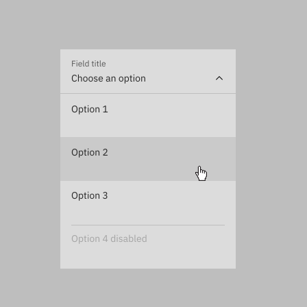

</DoDontExample>
</Column>
</Row>

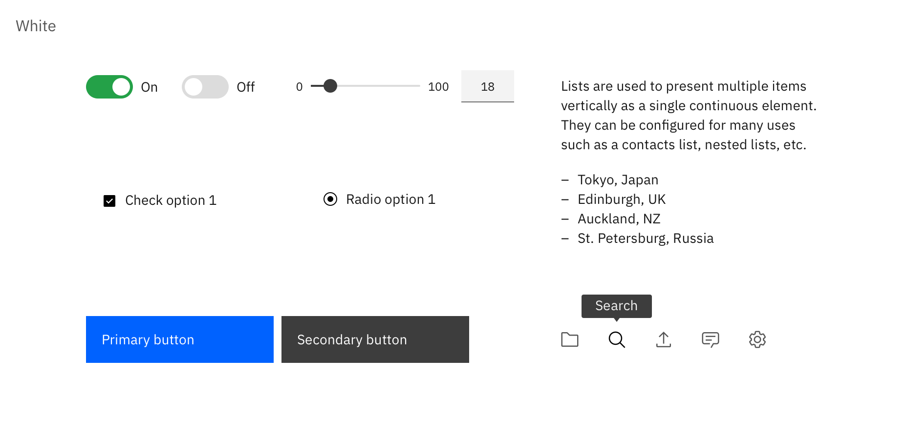

<Caption>
  Components with common colors across both light UI backgrounds
</Caption>

<Row>
<Column colMd={4} colLg={4}>

  

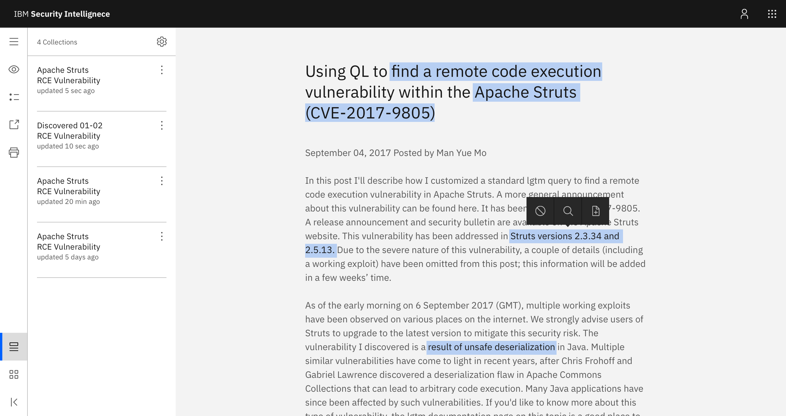

  

<Caption>IBM Evidence Builder Prototype</Caption>

</Column>
<Column colMd={4} colLg={4}>

  

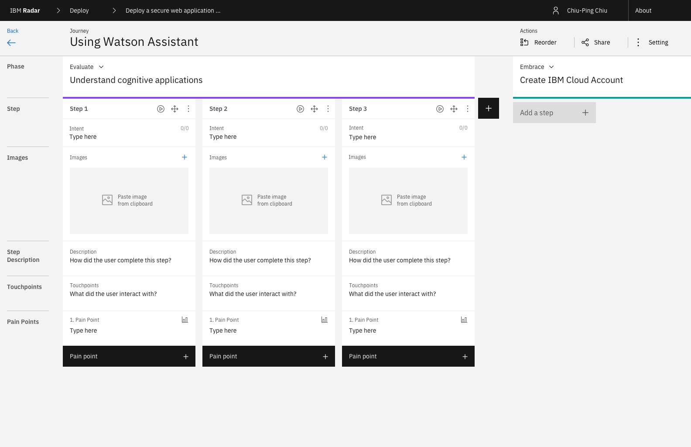

  

<Caption>IBM Radar Prototype</Caption>

</Column>
<Column colMd={4} colLg={4}>

  

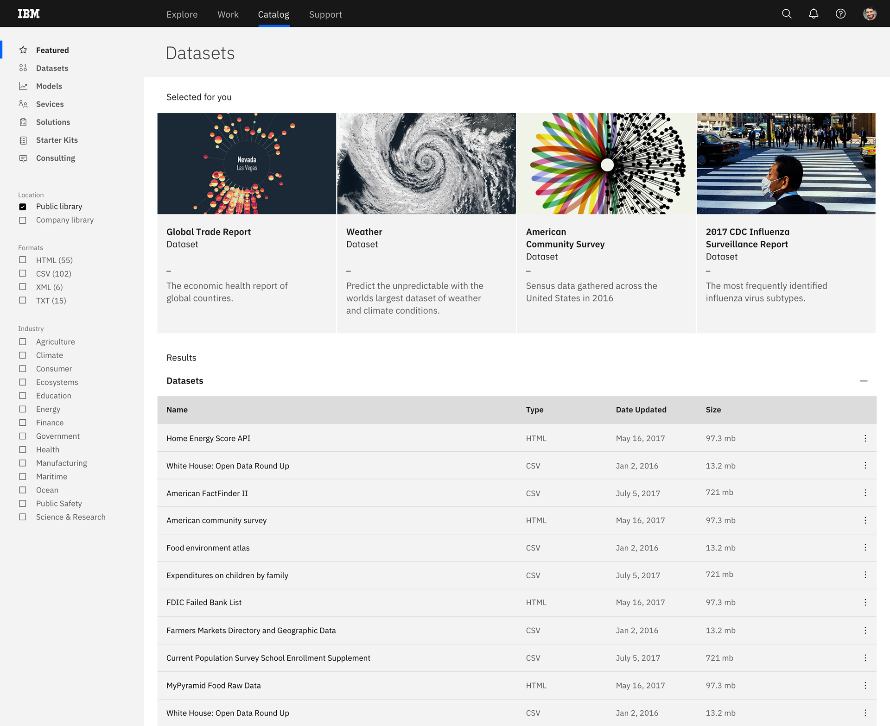

  

<Caption>IBM Cloud Platform Prototype</Caption>

</Column>
</Row>

### Dark theme

Gray 90 components are generally paired with Gray 100 backgrounds and Gray 80 components with Gray 90 backgrounds. Some components, such as buttons and toggles, are common across all three dark UI backgrounds.

<Row>
<Column colMd={4} colLg={6}>
<DoDontExample type="do" caption="Gray 90 Dropdown on Gray 100 background.">

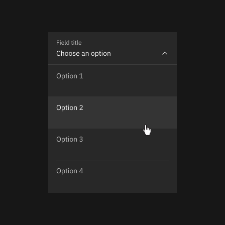

</DoDontExample>
</Column>
<Column colMd={4} colLg={6}>
<DoDontExample type="do" caption="Gray 80 Dropdown on Gray 90 background.">

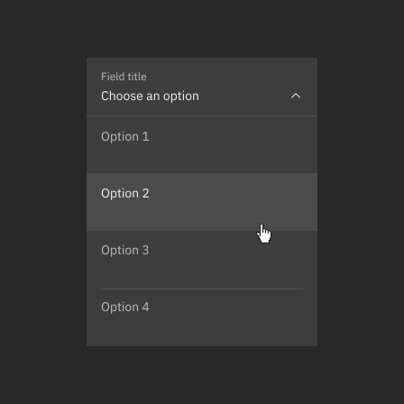

</DoDontExample>
</Column>
<Column colMd={4} colLg={6}>
<DoDontExample type="do" caption="Gray 70 is sometimes used when compound components are being applied such as an overflow menu.">

</DoDontExample>
</Column>
<Column colMd={4} colLg={6}>
<DoDontExample type="dont" caption="Do not apply components that are darker than the background unless using high contrast mode.">

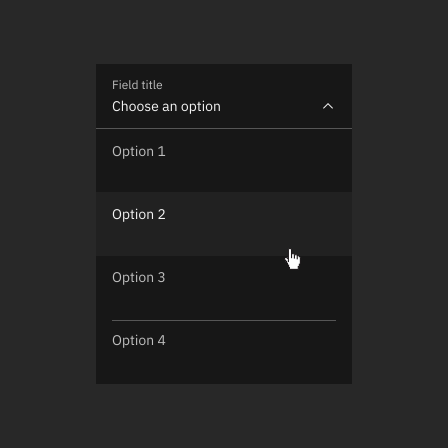

</DoDontExample>
</Column>
</Row>

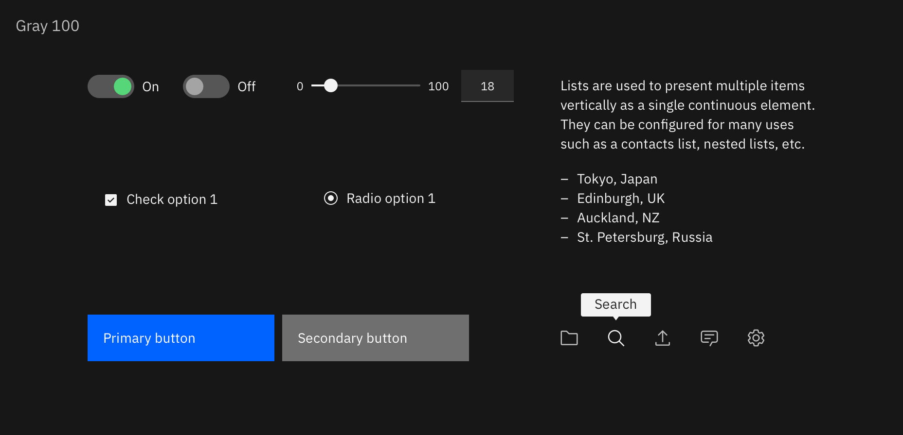

<Caption>Components with common colors across all dark UI backgrounds</Caption>

<Row>
<Column colMd={4} colLg={4}>

  

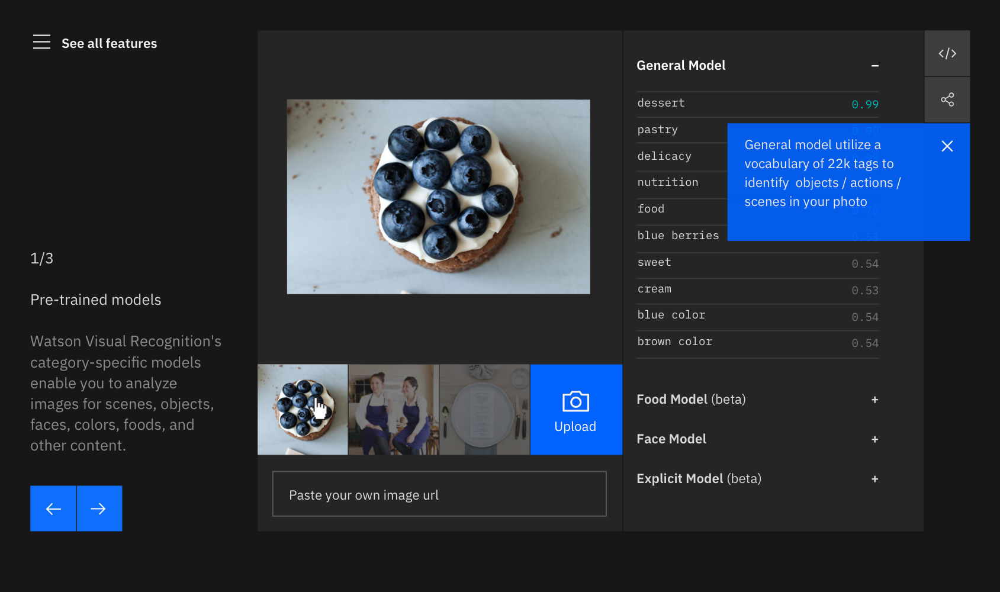

  

<Caption>IBM Watson API Demo</Caption>

</Column>
<Column colMd={4} colLg={4}>

  

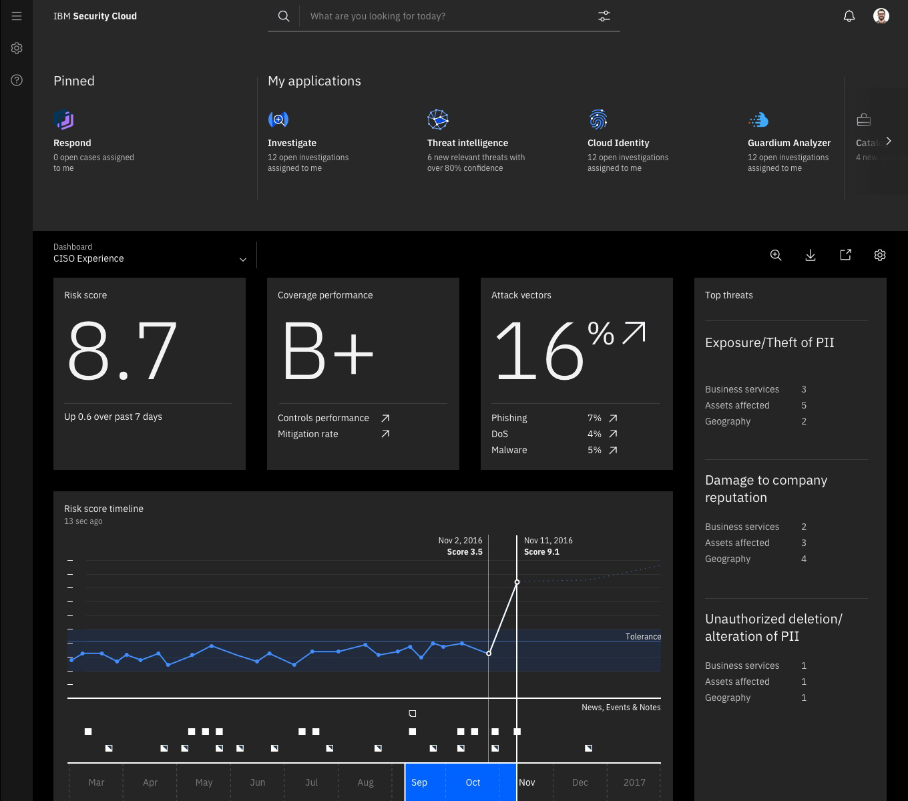

  

<Caption>IBM Security Cloud Prototype</Caption>

</Column>
<Column colMd={4} colLg={4}>

  

  

<Caption>IBM Watson Health Prototype</Caption>

</Column>
</Row>

### High contrast

In some cases, it is helpful to apply light components to dark backgrounds or light components to dark backgrounds. This technique is useful to focus attention or create visual tension when necessary.

<Row>
<Column colMd={4} colLg={6}>

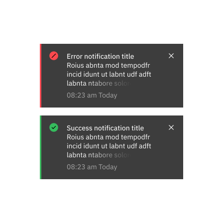

</Column>
<Column colMd={4} colLg={6}>

</Column>
</Row>

## Interaction states

The primary interaction states have been defined for all colors within the palette. For values between Black and 70, interaction gets lighter and for values between 60 and White, interaction gets darker.

#### Hover

A unique set of color tokens are available for hover states. These colors are outside of the core palette and can be considered as half steps in between adjacent colors.

#### Active

The active state is two full steps lighter for values between 100 and 70 and two full steps darker for values between 60 and 10. _Exception: White shares the same active state as Gray 10 and Black shares the same active state as Gray 100. Example: the Gray 10 active state is Gray 30._

#### Selected

The selected state is one full step lighter for values between 100 and 70 and one full step darker for values between 60 and 10. _Exception: White shares the same selected state as Gray 10 and Black shares the same selected state as Gray 100. Example: the Gray 10 selected state is Gray 20._

#### Focus

The focus state usually appears as a Blue 60 border in the light theme and as a White border in the dark theme.

#### Disabled

Disabled components are unavailable for interaction, so they don’t receive hover or focus and are not subject to WC3 contrast compliance standards. In dark themes, disabled values are two full steps lighter than their respective background. In light themes, they are two full steps darker. For example, disabled text on a Gray 100 background is Gray 80. _Exception: the disabled value for both White and Gray 10 backgrounds is Gray 30._

<Row>
<Column>

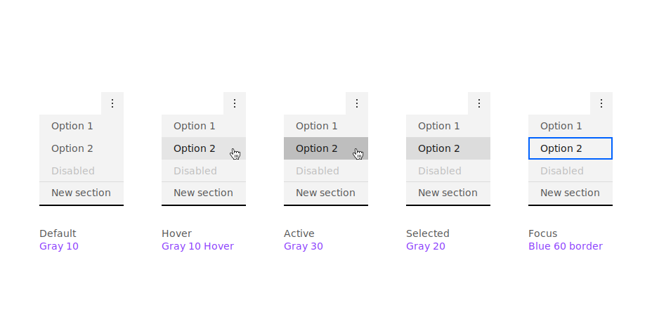

<Caption>Example light theme interaction states</Caption>

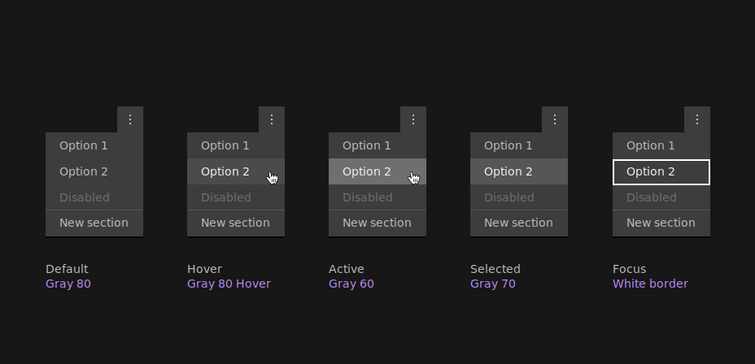

<Caption>Example dark theme interaction states</Caption>

</Column>
</Row>

## Digital accessibility

Using various forms of contrast is the most important consideration when making user-friendly color and interface choices. Awareness of standards and color blindness best practices is the key to accessible color selection.

### WCAG 2.0 Standards

All type color combinations must pass WCAG AA standards of 4.5:1 for normal text and 3:1 for large text. For larger text, if the font weight is light (300) or normal (400) the text should be no smaller than 24px. If the font weight is Semi-Bold (600) then the large text should be no smaller than 19px.

The color families in our palette contain ten values from 10 to 100. White and Black sit outside those values. Black text is WCAG AA accessible on colors ranging from 10 to 50. White text is accessible on colors from 60 to 100.

Beyond black and white, the IBM color palette provides a range of accessible combinations. Subtracting the foreground value from the background value (or vice versa) helps determine whether that color combination meets the WCAG AA contrast ratio success criteria. If the difference between two values is 50 or greater, the colors are accessible. Anything below a difference of 50 may fail accessibility standards.

### Color blindness

The most common form of color blindness is red/green, where sufferers mix up all colors which have red or green as part of the whole color. Our palette and its usage emphasize blues, darks and lights. These concepts ensure a pleasurable and consistent color experience for as many users as possible.

Those affected by Protanopia color blindness are less sensitive to red light, while sufferers of Deuteranopia have the same problem with green. For example, a person with Protanopia will confuse blue and purple because they can’t recognize the red element of the color purple. The third type of color deficiency, Tritanopia, is the least common and refers to sufferers who struggle to distinguish blue or yellow light. The image below shows what the rainbow may look like to individuals with each of these forms of color blindness.

<Row>
<Column colLg={8}>

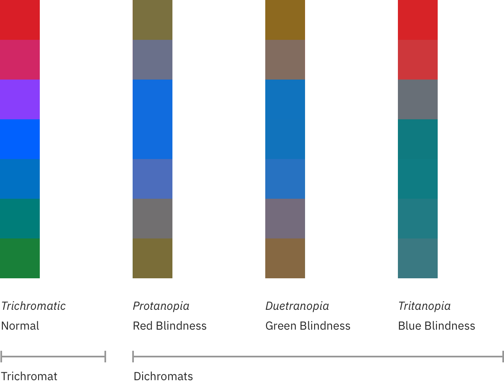

</Column>
</Row>

## Accessibility resources

<Row className="resource-card-group">
  <Column colMd={4} colLg={4} noGutterSm>
    <ResourceCard
      subTitle="Color contrast analyzer"
      aspectRatio="2:1"
      href="https://marijohannessen.github.io/color-contrast-checker/"
      actionIcon="arrowRight"
    />
  </Column>
  <Column colMd={4} colLg={4} noGutterSm>
    <ResourceCard
      subTitle="Accessible color guide"
      aspectRatio="2:1"
      href="https://www.w3.org/TR/UNDERSTANDING-WCAG20/visual-audio-contrast-contrast.html"
      actionIcon="arrowRight"
    />
  </Column>
</Row>

 
 

For a complete look at color-related accessibility topics, visit the [Carbon Design System Accessibility](https://www.carbondesignsystem.com/guidelines/accessibility/overview) section.
