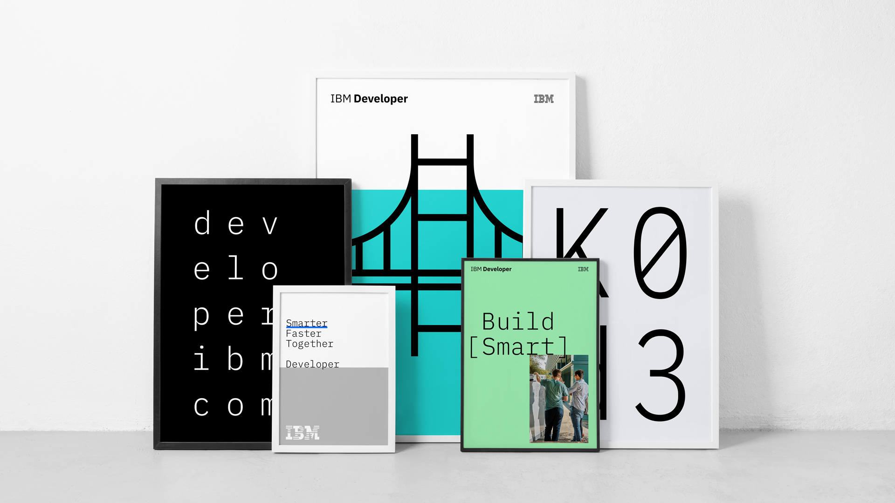
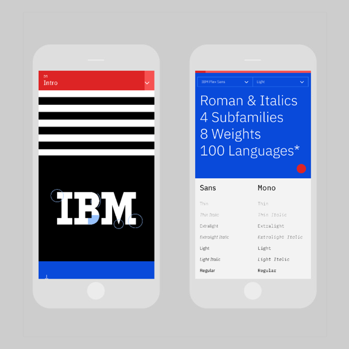
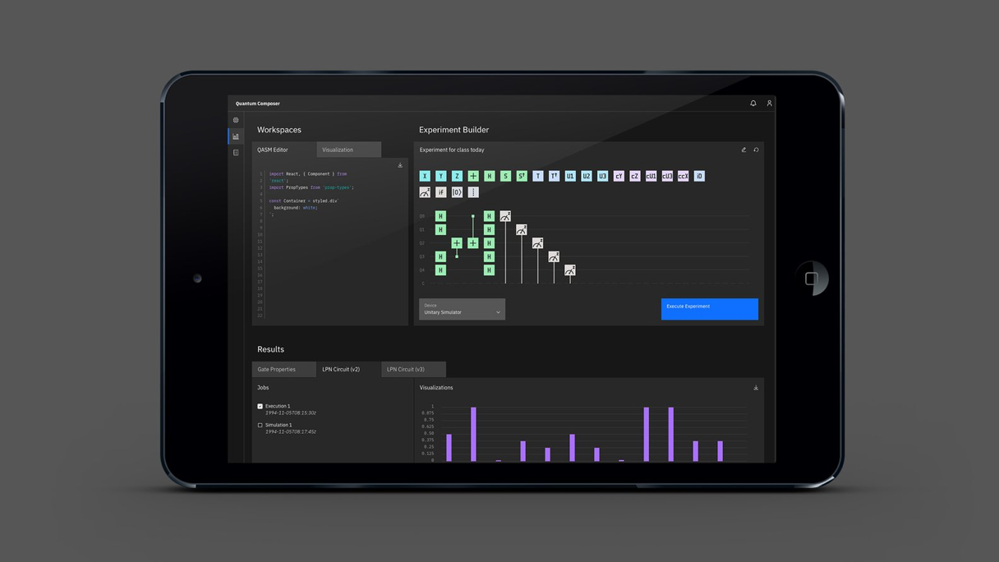
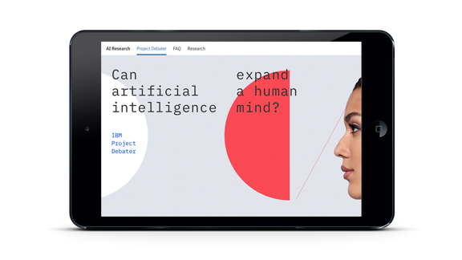

import Carousel from '../../components/Carousel';
import SwatchPaletteWidget from '../../components/SwatchPaletteWidget';
import ColorGrid from '../../components/ColorGrid';

<PageDescription>

Our color palette expands on our unique aesthetic and represents a
contemporary and ever-changing IBM. Balancing mankind and machine, the colors
are harmonious with nature, yet chosen for their luminous quality in the
digital world.

</PageDescription>

<AnchorLinks>
  <AnchorLink>Blue at the core</AnchorLink>
  <AnchorLink>Specifications</AnchorLink>
  <AnchorLink>Color families</AnchorLink>
  <AnchorLink>Gradients</AnchorLink>
  <AnchorLink>Color in UI</AnchorLink>
  <AnchorLink>Color in action</AnchorLink>
</AnchorLinks>

## Resources

<Row className="resource-card-group">
<Column colMd={4} colLg={4} noGutterSm>
    <ResourceCard
      subTitle="Setup the IBM Design kit"
      aspectRatio="2:1"
      href="https://ibm.com/standards/web/design-kitt"
      >

  </ResourceCard>
</Column>
<Column colMd={4} colLg={4} noGutterSm>
    <ResourceCard
      subTitle="Color Palettes for Adobe™(.ase)"
      aspectRatio="2:1"
      href="https://github.com/carbon-design-system/carbon/raw/master/packages/colors/artifacts/IBM_Colors.zip"
      actionIcon="download"
      >

  </ResourceCard>
</Column>
</Row>

## Blue at the core

A vibrant set of blues is the centerpoint of the color palette. When combined with the simplicity of black and white, a refreshing and unique look emerges for IBM.

<Row className="color-logo-row">
<Column colMd={4} colLg={6}  className="color-logo">

</Column>
<Column colMd={4} colLg={6}  className="color-logo-carousel">

<Carousel id="c1" count="1 2 3 4 5 6 7 8 9" nav={false} fade={true} autoPlay>

</Carousel>

</Column>
</Row>

<ColorGrid colorFamily="blue" />
<ColorGrid colorFamily="gray" />

### The palette

The full palette extends from the blue family to the edges of the blue spectrum—even the reds contain a hint of blue. The resulting palette is a set of colors that portrays a singular IBM. Of the world and digital. Useful and judicious.

<ColorGrid colorFamily="red" />
<ColorGrid colorFamily="magenta" />
<ColorGrid colorFamily="purple" />
<ColorGrid colorFamily="blue" />
<ColorGrid colorFamily="cyan" />
<ColorGrid colorFamily="teal" />
<ColorGrid colorFamily="green" />

### Grays

Having multiple gray families gives each design the opportunity for nuance and meaningful moments of color. Each experience should be dominated by the grays and the core colors (black, white, and the blue family), allowing the other color families to have vibrancy and provide purpose.

<ColorGrid colorFamily="coolGray" />
<ColorGrid colorFamily="gray" />
<ColorGrid colorFamily="warmGray" />

## Specifications

Each of the 10 color families have been divided into 10 swatches ranging from light to dark. RGB and HEX values are provided for digital appliations along with Pantone and CMYK values for print.

<SwatchPaletteWidget
  palettes={[
    ['red', 'magenta', 'purple', 'blue', 'cyan', 'teal', 'green'],
    ['cool gray-bw', 'gray-bw', 'warm gray-bw'],
  ]}
/>

## Color families

The color palette has been organized into four distinct 4-Color families, each containing the IBM core blue. When creating color groups for your particular usage and application, you may combine any of the colors within these families. When fewer colors are required, you may further subdivide any of the 4-Color families into 1, 2 or 3 Color families. See the possible combinations below.

### 4-Color

### 3-Color

### 2-Color

### 1-Color

### Combinations to avoid

The following color combinations have been eliminated from the Color families and should be avoided unless required for specific appliations such as Data Visualization.

<Row>
<Column colMd={4} colLg={4}>
<DoDontExample type="dont" caption="Do not mix greens with reds, magentas or purples.">

</DoDontExample>
</Column>
<Column colMd={4} colLg={4}>
<DoDontExample type="dont" caption="Do not mix teals with reds or magentas.">

</DoDontExample>
</Column>
</Row>

## Gradients

Use combinations within any of the acceptable 2-Color families when blending gradients. Values between 30 and 60 are used to create vibrant gradients that work well against both dark and light backgrounds. For more contrast or subtlety, blend between darker or lighter colors. Do not blend between colors that are more than two steps away from each other.

<Row>
<Column colMd={4} colLg={4}>
<DoDontExample type="dont" caption="Do not mix colors that are outside of the accepted 2-Color Families.">

</DoDontExample>
</Column>
<Column colMd={4} colLg={4}>
<DoDontExample type="dont" caption="Do not blend between colors that are more than 2 steps away, i.e. Blue 60 to Teal 20.">

</DoDontExample>
</Column>
</Row>
<Row>
<Column colMd={4} colLg={4}>
<DoDontExample type="dont" caption="Do not create gradients with more than two colors.">

</DoDontExample>
</Column>
</Row>

## Color in UI

Application of the IBM color palette brings an unified and recognizable consistency to IBM’s vast array of digital products and interfaces. This consistency is grounded by a set of well-defined rules on how to work with our component library in the context of dark and light themes.

### Specifications

The Neutral Gray family is dominant in our UI, making use of subtle shifts in value to help organize content into distinct zones. The Core Blue family has been designated as the primary action color across all products and experiences, ensuring our color aesthetic is a part of every interaction. Additional colors are used sparingly and purposefully.

<SwatchPaletteWidget palettes={[['blue-bw', 'gray-bw', 'alert']]} />

<Row className="resource-card-group">
<Column colMd={4} colLg={4} noGutterSm>
    <ResourceCard
      subTitle="Visit Color in UI for more color guidance"
      aspectRatio="2:1"
      href="https://www.carbondesignsystem.com/guidelines/color/overview"
      actionIcon="arrowRight"
     />
</Column>
</Row>

## Color in action

See the IBM Design color palette in action across multiple business units and applications. Deliberate hits of color are composed with rich neutrals for a well-balanced and cohesive experience.

<Row>
<Column colMd={5} colLg={8}>

</Column>
<Column colMd={3} colLg={4}>

</Column>
<Column colMd={3} colLg={4}>

</Column>
<Column colMd={5} colLg={8}>

</Column>
<Column colMd={4} colLg={4}>

</Column>
<Column colMd={4} colLg={4}>

</Column>
<Column colMd={3} colLg={4}>

</Column>
<Column colMd={5} colLg={8}>

</Column>
<Column colMd={4} colLg={4}>

</Column>
</Row>

<Row className="resource-card-group">
  <Column colMd={4} colLg={4} noGutterSm>
    <ResourceCard
      subTitle="View gallery"
      aspectRatio="2:1"
      href="/gallery"
      actionIcon="arrowRight"
    />
  </Column>
</Row>
