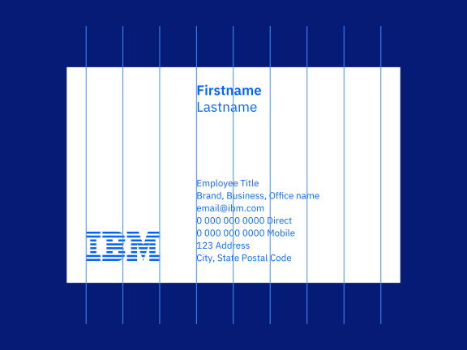

<PageDescription>

Page description

</PageDescription>

<AnchorLinks>
  <AnchorLink>Overview</AnchorLink>
  <AnchorLink>Let logic guide</AnchorLink>
  <AnchorLink>Make and break patterns</AnchorLink>
  <AnchorLink>Guide the eye</AnchorLink>
  <AnchorLink>Let it breathe</AnchorLink>
  <AnchorLink>Asymmetry adds interest</AnchorLink>
</AnchorLinks>

## Overview

In many ways, visual composition is very similar to musical composition. Both rely on principles of harmony, rhythm, and melody (among others) to create a statement. It is thought that both design and music appeal to the same core aspects of our psychology; pattern seekers by nature, we are drawn to patterns and relationships established across time and space. But while patterns are pleasant to us, it’s variation that keeps us interested. 

Is it too repetitive and predictable? Is it too chaotic and lacking in structure? How do the elements relate to each other as well as the surrounding space?

Many relationships have already been made with our foundational elements: Our type scales and spacing scales are engineered for harmonious relationships between sizes. Our typeface shares common features with our iconography. The grid divides space evenly to create relationships between canvas and content. 

Logical, consistent use of these elements will establish repetition and relationships. Expressive use of them—where appropriate—can break expectations and create visual interest. While this delicate balance can be difficult to achieve, there are several tips and tricks that can help guide your decision-making.

## Let logic guide

When arranging elements in a given space, nothing should be arbitrary. All decisions should be made according to a system of logic so that everything is carefully considered. We call this a decision-tree approach, meaning that every design decision is made to be as simple and logical as possible. When additional complexity is needed, you move on to the next, most logical decision.

### Let's use an example

Say we need to make a simple advertisement for IBM Security to be shown on a TV screen in a lobby. We already know the format will be 16:9 RGB, and given the context, we need a short line about the impact of IBM Security. Looking at the IBM Security brand guidelines, we can find some copywriting examples as well as brand assets and color guidance. Now let’s take a look at our content:

After reviewing the guidelines regarding [the 2x Grid](/elements/2x-grid), [type basics](/elements/type-basics), [type specs](/elements/type-specs-ui), and [logos](/elements/logos/8-bar), we can move on to the decision-tree process.

<Row className="example-section">
<Column colMd={4} colLg={6}>

Starting with the foundation, we make the margins for our canvas according to the 2x Grid guidance. We can add columns and rows later if they’re needed.

</Column>
<Column colMd={4} colLg={6}>

</Column>
</Row>

<Row className="example-section">
<Column colMd={4} colLg={6}>

Next, let's add the information needed on the page. Because we read top-left to right in english speaking countries, we will place the main copy top-left. “70B” needs to have additional impact, so we will make that larger. We’ll place the logos on the bottom to create a footer so that they serve as a sign-off for the communication. Note that all typography, including the logotype, correlates to a size on the type scale.

</Column>
<Column colMd={4} colLg={6}>

</Column>
</Row>

<Row className="example-section">
<Column colMd={4} colLg={6}>

In order to activate the available space in a more interesting way, let’s try separating the copy. We’ll need another position on the canvas, so we'll start by dividing by two. This also gives us some more space to increase the “70B” type to a larger value on the type scale for more impact.

</Column>
<Column colMd={4} colLg={6}>

</Column>
</Row>

<Row className="example-section">
<Column colMd={4} colLg={6}>

Now to add the brand expression. We want to highlight (rather than detract from) the content with it, so let’s try placing it “pointing” toward the type. We’ll need yet another position, so we will divide the vertical space by two.

</Column>
<Column colMd={4} colLg={6}>

</Column>
</Row>

<Row className="example-section">
<Column>

</Column>
</Row>

Now we have a very simple, yet elegant solution. While the underlying structure isn’t shown, it is still clearly visible in every decision we’ve made. Each element on the page is placed and sized regarding a logical system, inherently making them relate to each other as well as the surrounding space.

While this example used the grid more than anything else to illustrate the decision tree, the same principle can be applied to other methods such as alignment, sizing, and color.

## Make and break patterns

Breaking expectations in delightful ways is crucial to keeping a viewer engaged. But variation cannot exist without repetition; you must first create patterns in order to break them. 

Anything that is repeated can provide rhythm and unity to the design, whether it is shape, position, size, color, or an idea.

### Structural rhythm

Rhythm is made by what's not on the canvas as much as what is. Consider a measure of music; repetition of notes without structure does not provide good rhythm. Once notes are placed regarding regular time intervals, however, rhythm emerges.

#### 2x Grid

[The 2x Grid](/elements/2x-grid) is the scaffolding on which IBM designers create structural rhythm. It provides structural, proportional, and spatial guidance for design within any media. Skillful use of it will yield harmonious spatial relationships between canvas and content while expressing our distinct point-of-view.

<Row>
<Column colMd={8} colLg={12}>

</Column>
</Row>

<Row>
<Column colMd={4} colLg={8}>

</Column>
<Column colMd={2} colLg={4}>

</Column>
</Row>

#### Sizing scale

In lieu of concrete vertical divisions, such as on a web page, the [sizing scale](https://www.carbondesignsystem.com/guidelines/layout#sizing-scale) is helpful in establishing vertical rhythm. Like a type scale, the sizing scale constrains the range of sizes to improve consistency and rhythm, while still allowing a wide range of sizes.

<Video
  src="/videos/Visual-Rhythm.mp4"
  poster="/images/Visual_Rhythm_Poster.png"
/>

### Editorial rhythm

Editorial rhythm is driven by careful repetition and alternation of larger units of design. This is most often done in multi-page editorial design or scrolling web pages, where the viewer experiences one part of the whole at a time. 

The concept is well-established in music as form. Musical form describes the structure of a piece of music as a combination of units. Letters are given to the first occurrence of each unit, and the same letter is given to repeated units. In the AABA form for example, A units have similar melodic content as repeated A units, while the B unit offers an alternation to the A units to provide interest.

In design, larger visual units are driven by the content. Similar types of content can be given similar structure, such as the the same spatial dimensions, type sizes and hierarchy, and alignments. Consider how units can be repeated, and conversely, how structurally different units can break up the monotony of repeated ones. Repetition of units across multiple designs will drive continuity between them.

#### Pacing

When practicing editorial rhythm, it’s important to think of the rate and rhythm of the amount of visual information that is being communicated. 

Take this paragraph, for example. Some sentences are much longer than others, requiring you to read for longer without a break. Some are quite short. Rhythm is created from variation of information density, making it more engaging and accessible. The same principle applies to design, where it is good practice to create rhythm of content through pacing.

>Pull quotes are a good example of breaking up pace. They allow the reader to pause and reflect while offering a mental break from dense content.

## Guide the eye

#### Hierarchical relationships

## Let it breathe

A classic offense that plagues many designers and non-designers alike is the overabundance of elements in a design. While utilizing all available space may reduce canvas size or scroll distance, it does more harm than good when it comes to a viewer's understanding of information. Overcrowding will render your design impenetrable. 

White space is approachable. It creates visual entry points to a design and allows the viewer to consider one thing at a time. It is an essential tool designers can use to guide the viewer through the design to an intended outcome.

## Asymmetry adds interest

While perfect symmetry can be beautiful and create a sense of stability, it is usually not the best way to create a dynamic composition. Balanced asymmetry is often more successful in creating movement, life, and interest through more creative activation of space. It also requires more careful orchestration of elements to achieve.

<Row>

<Column colMd={6} colLg={8}>

</Column>

<Column colMd={2} colLg={4}>

</Column>
</Row>

One approach to creating a dynamic, asymmetrical composition is to arrange three main elements or groups of elements. Varying the sizes of these groups in order of importance will help guide the viewer through the design. 
