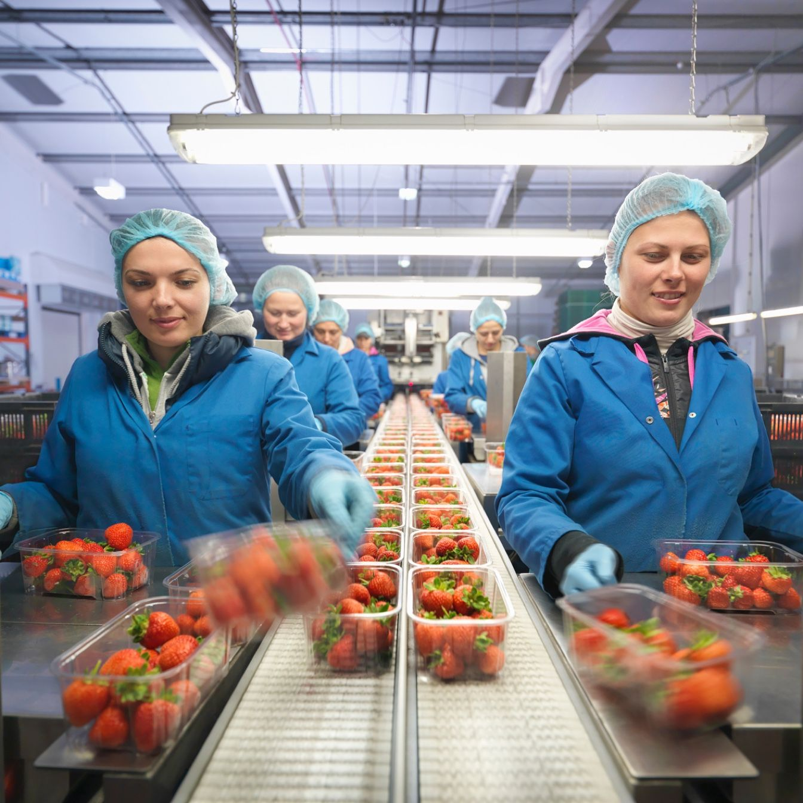
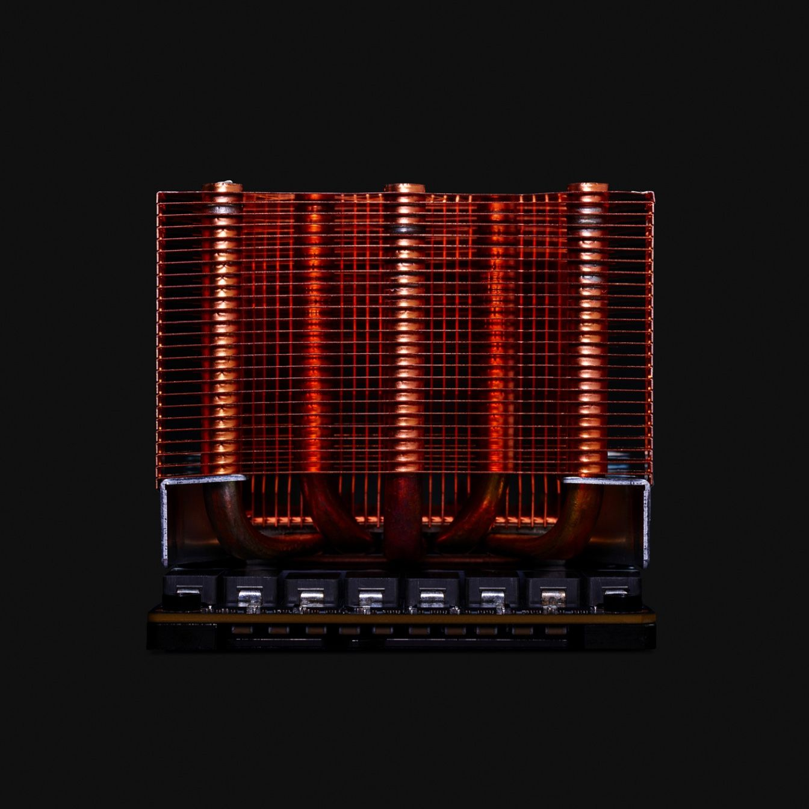
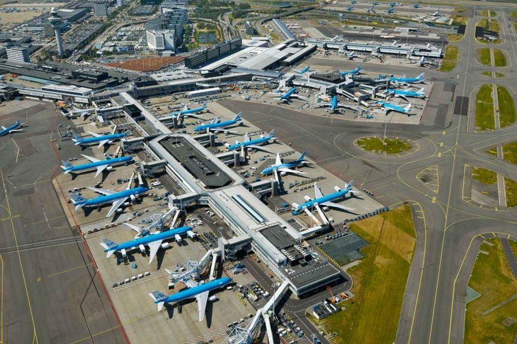

<PageDescription>

When choosing or creating an IBM image, certain criteria should be considered.
The following guidance will help achieve the effect and impression we’re
looking for.

</PageDescription>

## Perspective

As IBMers, we are objective observers of the working world. This translates into the perspectives we commonly use in photography. There are two primary viewpoints, each deliberately designed to present the world “as-is” and at its beautiful best.

### Eye level

We are a forward-facing organization. We treat our clients and ourselves as equals. Imagine IBM or an IBMer is the camera, this is how we view the world around us; authentically, eye-to-eye, fairly, naturally, truthfully. We take a step back, capture context, observe the environment, and present a bigger picture.

<Row>

<Column colMd={4} colLg={6}>

</Column>
<Column colMd={4} colLg={6}>

</Column>

</Row>

## Aerial

Used less often, another angle we take is to offer things from a different perspective. Equally as objective, an aerial view allows us to “elevate” our observations. This communicates a certain “eye” on consequences and impact at scale.

<Row>

<Column colMd={4} colLg={6}>

</Column>
<Column colMd={4} colLg={6}>

</Column>

</Row>

<Row>
<Column colMd={3} colLg={4}>
<DoDontExample type="dont" caption="Avoid forced perspectives that attempt to add interest to uninteresting subjects">

</DoDontExample>
</Column>
<Column colMd={3} colLg={4}>
<DoDontExample type="dont" caption="Avoid perspectives that are neither overhead or at natural eye-level">

</DoDontExample>
</Column>

</Row>
