<PageDescription>

Good typography often goes unnoticed because it just makes sense. Elements of good typography include consistency, hierarchy and alignment. With our new corporate typeface, IBM Plex™, comes an opportunity to recalibrate our typographic mindset with some best practices.

</PageDescription>

<AnchorLinks>
  <AnchorLink>Tracking</AnchorLink>
  <AnchorLink>Flush left</AnchorLink>
  <AnchorLink>Leading</AnchorLink>
  <AnchorLink>Punctuation</AnchorLink>
  <AnchorLink>Belt and suspenders</AnchorLink>
  <AnchorLink>Case</AnchorLink>
  <AnchorLink>Rags, orphans and widows</AnchorLink>
  <AnchorLink>Alignment</AnchorLink>
  <AnchorLink>Comfortable reading</AnchorLink>
  <AnchorLink>Line lengths within containers</AnchorLink>
  <AnchorLink>Stacked headlines</AnchorLink>
  <AnchorLink>Titles and subtitles</AnchorLink>
</AnchorLinks>

## Resources

<Row className="resource-card-group">
<Column colMd={4} colLg={4} noGutterSm>
    <ResourceCard
      subTitle="Get the Latest IBM Plex™ download on GitHub"
      aspectRatio="2:1"
      href="https://github.com/IBM/plex/releases/latest"
      >

  </ResourceCard>
</Column>
<Column colMd={4} colLg={4} noGutterSm>
    <ResourceCard
      subTitle="Visit the IBM Plex™ website to learn more"
      aspectRatio="2:1"
      href="https://www.ibm.com/plex/"
      >

  </ResourceCard>
</Column>
</Row>

## Tracking

Plex has been designed to not be spaced tightly. It requires space to breathe comfortably within text and headlines. It’s lighter in appearance and is more legible when spaced appropriately.

<DoDontExample type="do">

</DoDontExample>
<DoDontExample type="dont">

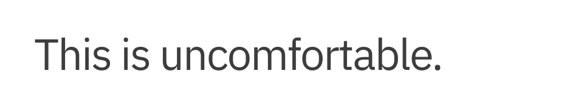

</DoDontExample>
<DoDontExample type="dont">

</DoDontExample>

## Flush left

Flush left creates strong alignments for the eye to follow, aiding readability and organization. It is our standard for all typography across IBM because it is functional, modern, timeless and the most effective in information design and legibility.

<Row>
<Column colMd={4} colLg={4}>
<DoDontExample type="do">

</DoDontExample>
</Column>
<Column colMd={4} colLg={4}>
<DoDontExample type="dont">

</DoDontExample>
</Column>
</Row>
<Row>
<Column colMd={4} colLg={4}>
<DoDontExample type="dont">

</DoDontExample>
</Column>
<Column colMd={4} colLg={4}>
<DoDontExample type="dont">

</DoDontExample>
</Column>
</Row>

## Leading

Choosing the appropriate leading or line spacing is very important to the reading quality and and efficiency of the typography and should never be to open or too tight which makes reading difficult and unpleasant for the reader.

<Row>
<Column colMd={4} colLg={4}>
<DoDontExample type="do">

</DoDontExample>
</Column>
<Column colMd={4} colLg={4}>
<DoDontExample type="dont">

</DoDontExample>
</Column>
</Row>
<Row>
<Column colMd={4} colLg={4}>
<DoDontExample type="do">

</DoDontExample>
</Column>
<Column colMd={4} colLg={4}>
<DoDontExample type="dont">

</DoDontExample>
</Column>
</Row>

## Punctuation

The use of spacing and certain typographical devices are important to the understanding and correct reading. The typographical details of correct punctuation aid in interpretation, division of text into sentences, clauses, and is critical to disambiguate the meaning of sentences.

### Apostrophes and primes

Apostrophes are used to indicate either possession (e.g., Harry’s book ; boys’ coats ) or the omission of letters or numbers. Primes are commonly used for minutes, seconds, feet, inches and degrees and lucky for us IBM Plex includes them as many fonts do not.

<Row>
<Column colMd={4} colLg={4}>
<DoDontExample type="do">

</DoDontExample>
</Column> 
<Column colMd={4} colLg={4}>
<DoDontExample type="dont">

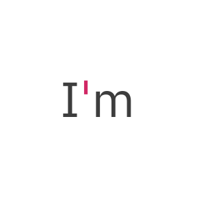

</DoDontExample>
</Column>
</Row>
<Row>
<Column colMd={4} colLg={4}>
<DoDontExample type="do">

</DoDontExample>
</Column>
<Column colMd={4} colLg={4}>
<DoDontExample type="dont">

</DoDontExample>
</Column>
</Row>

### Quotes

Use left and right “curly quotes” when quote marks should be used. They are design-sensitive intended to match, or blend within our typeface IBM Plex. Avoid the “straight” quotes from the typewriter days which is a common error in modern typography.

<Row>
<Column colMd={4} colLg={4}>
<DoDontExample type="do">

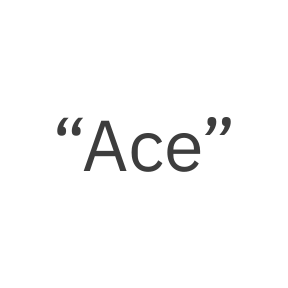

</DoDontExample>
</Column> 
<Column colMd={4} colLg={4}>
<DoDontExample type="dont">

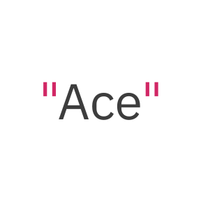

</DoDontExample>
</Column>
</Row>

### Em dash

The em dash is used to create a strong break in the structure of a sentence. Hyphens and en dashes are not appropriate alternatives for em dashes.

<DoDontExample type="do">

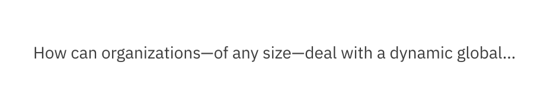

</DoDontExample>
<DoDontExample type="dont">

</DoDontExample>

### Hyphen and en dash (-, –)

Some examples of correct use of hyphens and en dashes are shown below. For reference: an en dash is used to span or ranges of numbers (1945–1975) and the the hyphen is for compound terms (check-in).

<Row>
<Column colMd={4} colLg={6}>
<DoDontExample type="do">

</DoDontExample>
</Column> 
<Column colMd={4} colLg={6}>
<DoDontExample type="dont">

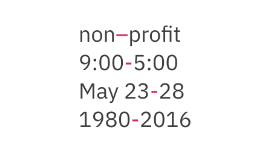

</DoDontExample>
</Column>
</Row>

## Belt and suspenders

The term “belt and suspenders” refers to using multiple styles to do the same thing in typography. IBM should always be essential, so keep styles to a minimum when emphasizing words in messaging.

<Row>
<Column colMd={4} colLg={6}>
<DoDontExample type="do">

</DoDontExample>
</Column> 
<Column colMd={4} colLg={6}>
<DoDontExample type="dont">

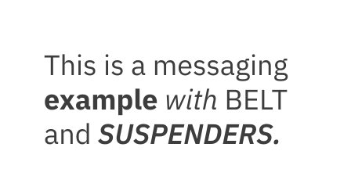

</DoDontExample>
</Column>
</Row>

## Case

Write content in sentence case. Title case can be used in proper titles, product names and service names. Avoid the use of all uppercase or “all caps” in your typography especially for paragraphs or text.

<DoDontExample type="do">

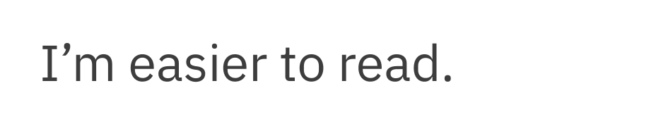

</DoDontExample>
<DoDontExample type="dont">

</DoDontExample>

## Rags, orphans and widows

Always look for opportunities to create improve rags. Watch out for orphans and widows and adjust line lengths with a writer to solve awkward breaks which can effect reading quality.

<Row>
<Column colMd={4} colLg={6}>
<DoDontExample type="do">

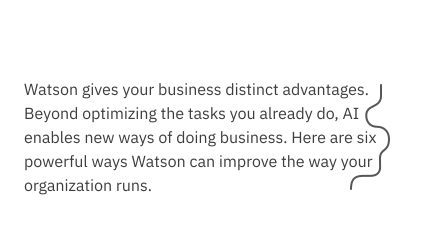

</DoDontExample>
</Column> 
<Column colMd={4} colLg={6}>
<DoDontExample type="dont">

</DoDontExample>
</Column>
</Row>
<Row>
<Column colMd={4} colLg={6}>
<DoDontExample type="do">

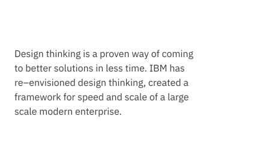

</DoDontExample>
</Column> 
<Column colMd={4} colLg={6}>
<DoDontExample type="dont">

</DoDontExample>
</Column>
</Row>

## Alignment

Whenever possible, left align copy with other copy, even when it’s in a container element. This create a strong vertical alignment with the text adding in legibility, organization and clarity for a user.

<DoDontExample type="do">

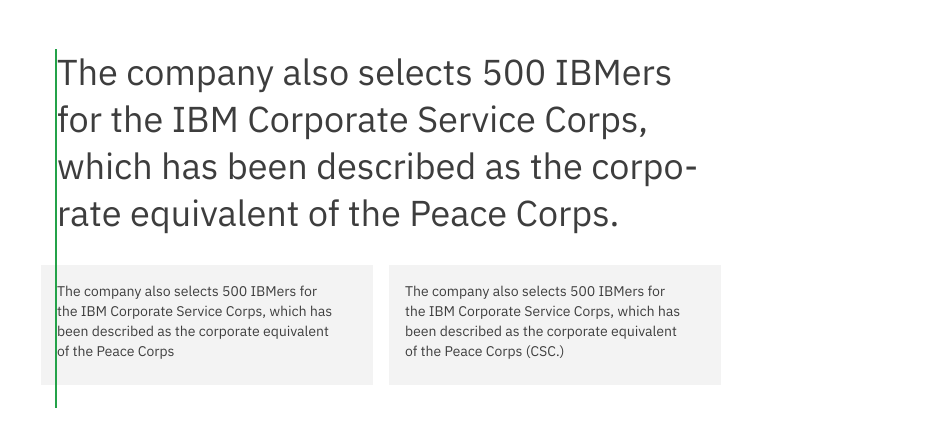

</DoDontExample>
<DoDontExample type="do">

</DoDontExample>

## Comfortable reading

Line length is based on character or word count per line and is determined by the amount of copy being used. It’s important not to create long lines of text for a reader. Short and efficient line lengths are easier to read.

<<<<<<< HEAD
<Video poster="/images/type-basics-comfortable-reading2.gif" src="/videos/type-basics-comfortable-reading.mp4" />
=======
<Video
  src="/videos/type-basics-comfortable-reading.mp4"
  poster="/images/type-basics-comfortable-reading"
/>
>>>>>>> 60da9f5c1c6c0860adebb4d1950cc199d96788f5

## Line lengths within containers

Avoid long line lengths within containers and in general within your typography practice. To help solve text going to the edges consider adding extra padding right in a container to reserve the openness in the typography which helps in reading.

<Row>
<Column colMd={4} colLg={6}>
<DoDontExample type="do">

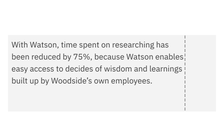

</DoDontExample>
</Column> 
<Column colMd={4} colLg={6}>
<DoDontExample type="dont">

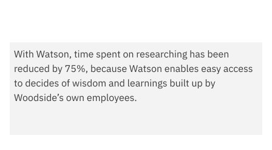

</DoDontExample>
</Column>
</Row>

## Stacked headlines

Headlines are preferred stacked into 2 or even three lines versus keeping them in one long line. This helps create a compact reading unit for the headline and can help control or avoid widows.

<DoDontExample type="do">

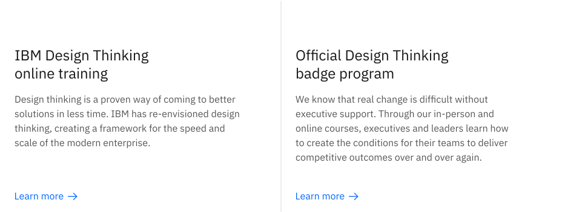

</DoDontExample>
<DoDontExample type="dont">

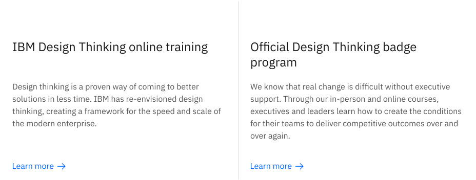

</DoDontExample>

## Titles and subtitles

Examples of how to differentiate titles and subtitles by weight or contrast change are shown here. It’s important to keep it simple and not create titles that are too long.

<Row>
<Column colMd={4} colLg={4}>
<DoDontExample type="do" caption="Bold with regular">

</DoDontExample>
</Column> 
<Column colMd={4} colLg={4}>
<DoDontExample type="do" caption="Semibold with Light">

</DoDontExample>
</Column>
<Column colMd={4} colLg={4}>
<DoDontExample type="do" caption="Contrast with one weight">

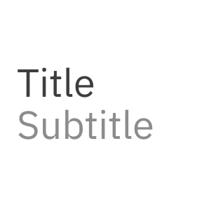

</DoDontExample>
</Column>
<Column colMd={4} colLg={4}>
<DoDontExample type="do" caption="Scale with one weight">

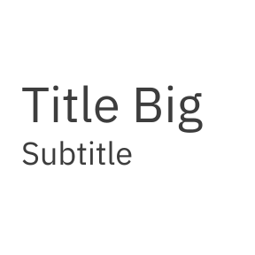

</DoDontExample>
</Column>
<Column colMd={4} colLg={4}>
<DoDontExample type="do" caption="Scale with one weight">

</DoDontExample>
</Column>
</Row>
