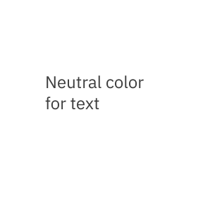
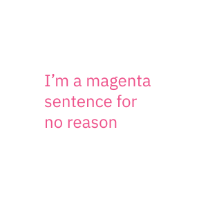
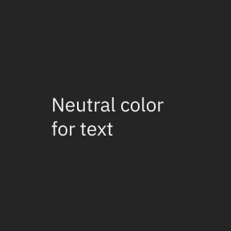
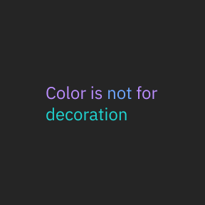

import { AnchorLinks, PageDescription, Video } from 'gatsby-theme-carbon';

<PageDescription>

With our new bespoke corporate typeface, IBM Plex™, comes a new set of guidance and best practices. Type Specs helps to set up a start point to apply typography—type scales, styles and alignment on screens.

</PageDescription>

<AnchorLinks>
  <AnchorLink>Typeface</AnchorLink>
  <AnchorLink>Scales</AnchorLink>
  <AnchorLink>Style</AnchorLink>
  <AnchorLink>Fluid type</AnchorLink>
  <AnchorLink>Type set</AnchorLink>
  <AnchorLink>Type color</AnchorLink>
</AnchorLinks>

## Resources

<Row className="resource-card-group">
<Column colMd={4} colLg={4} noGutterSm>
    <ResourceCard
      subTitle="Get the Latest IBM Plex™ download on GitHub"
      aspectRatio="2:1"
      href="https://github.com/IBM/plex/releases/latest"
      >


  </ResourceCard>
</Column>
<Column colMd={4} colLg={4} noGutterSm>
    <ResourceCard
      subTitle="Setup the IBM Design kit"
      aspectRatio="2:1"
      href="https://ibm.com/standards/web/design-kit"
      >


  </ResourceCard>
</Column>
</Row>

## Typeface

The IBM Plex™ family comes in sans, serif, condensed and monospaced versions to serve a variety of needs across all experiences. It has been specifically designed to work well in digital environments and small or large scales. It comes in extended Latin and non-Latin scripts. See [Typeface](https://www.ibm.com/elements/typeface/) to learn more.

<Row>
<Column colLg={8} noGutterSm>
<div class="typeface">

<span class="bx--type">IBM Plex Sans</span>
<span class="bx--type-serif">IBM Plex Serif</span>
<span class="bx--type-mono">IBM Plex Mono</span>
<span class="bx--type-condensed">IBM Plex Condensed</span>

</div>

```
<span class="bx--type">IBM Plex Sans</span>
<span class="bx--type-serif">IBM Plex Serif</span>
<span class="bx--type-mono">IBM Plex Mono</span>
<span class="bx--type-condensed">IBM Plex Condensed</span>
```

</Column>
</Row>

## Scales

The IBM type scale is built on a single equation. The formula for our scale was created to provide hierarchy for all types of experiences. The formula assumes that y₀=12px:

<Row>
<Column colLg={8} noGutterSm>

<div class="type-scale-table">

| rem   | px      |
| ----- | ------- |
| 0.75  | Plex 12 |
| 0.875 | Plex 14 |
| 1     | Plex 16 |
| 1.125 | Plex 18 |
| 1.25  | Plex 20 |
| 1.5   | Plex 24 |
| 1.75  | Plex 28 |
| 2     | Plex 32 |
| 2.25  | Plex 36 |
| 2.625 | Plex 42 |
| 3     | Plex 48 |
| 3.375 | Plex 54 |
| 3.75  | Plex 60 |
| 4.25  | Plex 68 |
| 4.75  | Plex 76 |
| 5.25  | Plex 84 |
| 5.75  | Plex 92 |

</div>

```
Xn = Xn-1 + {INT[(n-2)/4] + 1} * 2
Xn: step n type size Xn-1: step n-1 type size
```

</Column>
</Row>

## Style

Typography creates purposeful texture. It guides users to read and understand the hierarchy of information. The right typographic treatment and the controlled usage of type styles helps manage the display of content, keeping it useful, simple and effective.

### Weights

We suggest to use IBM Plex Light, Regular, and SemiBold for digital experiences. The semibold weight is ideal for section headers, but should not be used for long text.

<Row>
<Column colLg={8} noGutterSm>

<div class="type-weight">

<span class="bx--type-semibold">Semibold</span>
<span class="bx--type-regular">Regular</span>
<span class="bx--type-light">Light</span>

</div>

```
<span class="bx--type-semibold">Semibold</span>
<span class="bx--type-regular">Regular</span>
<span class="bx--type-light">Light</span>
```

</Column>
</Row>

### Italic

Each weight has an Italic style, which should only be used when you need to emphasize certain words in a sentence (titles of works, technical terms, names of devices, captions).

<Row>
<Column colLg={8} noGutterSm>

<div class="type-weight">

<span class="bx--type-semibold bx--type-italic">Semibold</span>
<span class="bx--type-regular bx--type-italic">Regular</span>
<span class="bx--type-light bx--type-italic">Light</span>

</div>

```
<span class="bx--type-semibold bx--type-italic">Semibold</span>
<span class="bx--type-regular bx--type-italic">Regular</span>
<span class="bx--type-light bx--type-italic">Light</span>
```

</Column>
</Row>

## Fluid type

To create a better experience along with our fluid grid, fluid type is an option for large display type. We set up our fixed type scales for the breakpoints and have them being fluid in between. This helps us to maintain the quality of typography.

<<<<<<< HEAD
<Video poster="/images/type-specs-fluid-type.jpg" src="/videos/type-specs-fluid-type.mp4" />
=======
<Video
  src="/videos/type-specs-fluid-type.mp4"
  poster="/images/type-specs-fluid-type.jpg"
/>
>>>>>>> 60da9f5c1c6c0860adebb4d1950cc199d96788f5

## Type set

Even though IBM Plex contains a wide range of scales, it’s important to use a curated type set. For a clear and focused reading experience, consider content needs and how type works across various screen sizes. The IBM type set includes a Productive set designed primarily for product use and an Expressive set which adds a series scales and fluid behavior.

-- ADD TYPE STICKY BREAKPOINT COMPONENT --

## Type color

Careful consideration of color maintains quality and recognition for users. Legibility and accessibility are two keys. Keep colored type neutral when in paragraphs. Use primary blue for primary actions.

<Row>
<Column colMd={4} colLg={4}>
<DoDontExample type="do">



</DoDontExample>
</Column>
<Column colMd={4} colLg={4}>
<DoDontExample type="dont">



</DoDontExample>
</Column>
</Row>
<Row>
<Column colMd={4} colLg={4}>
<DoDontExample type="do" color="dark">



</DoDontExample>
</Column>
<Column colMd={4} colLg={4}>
<DoDontExample type="dont" color="dark">



</DoDontExample>
</Column>
</Row>
<Row>
<Column colMd={4} colLg={4}>
<DoDontExample type="do" caption="Core blue colors are used for text links and primary actions.">


</DoDontExample>
</Column>
<Column colMd={4} colLg={4}>
<DoDontExample type="do" caption="Secondary actions use gray 100 and icons.">


</DoDontExample>
</Column>
</Row>
<Row>
<Column colMd={4} colLg={4}>
<DoDontExample type="do" caption="Other use cases for colored type are code snippets, warnings, alerts, etc.">


</DoDontExample>
</Column>
<Column colMd={4} colLg={4}>
<DoDontExample type="do">


</DoDontExample>
</Column>
</Row>
