<PageDescription>

The IBM logo is one of our most valuable corporate assets. It’s among the most
recognized corporate identities in the world, uniquely distinguishing us from
our competitors and other companies. It’s the tangible symbol of our brand,
representing everything we are: our expertise, our values, our people, our
offerings.

</PageDescription>

<AnchorLinks>
  <AnchorLink>The 8-bar</AnchorLink>
  <AnchorLink>Legal requirements</AnchorLink>
  <AnchorLink>Color</AnchorLink>
  <AnchorLink>Usage</AnchorLink>
  <AnchorLink>Lineage</AnchorLink>
  <AnchorLink>Co-branding</AnchorLink>
  <AnchorLink>Third-party logo usage</AnchorLink>
</AnchorLinks>

## Resources

<Row className="resource-card-group">
<Column colMd={4} colLg={4} noGutterSm>
    <ResourceCard
                  subTitle={<>Third-party IBM logo request (IBM ID required)</>}
      href="https://prdpcrhibmbl01.w3-969.ibm.com/marketing/logotool/logotool.nsf/BrandingLogoHome?Openform"
      >

  </ResourceCard>
</Column>
<Column colMd={4} colLg={4} noGutterSm>
    <ResourceCard
      subTitle={<>Internal IBM logo request (IBM ID required)</>}
      href="https://www.ibm.com/brand/ibm-logos/logo-requests"
      >

  </ResourceCard>
</Column>
</Row>

## The 8-bar

Created by legendary designer Paul Rand, the basic design of the IBM logo has
remained unchanged since 1972. Its consistent, visible use reinforces the IBM
brand, makes it more memorable and authenticates the things to which it’s
applied. It’s an essential component of the IBM look—used to lend authority and
engender trust wherever it appears. It’s our responsibility to protect it.

_Note: The black stripes have been drawn thicker than the white stripes. The
black and white should appear to be similar optically._

### Reversed 8-bar

The logotype has been adjusted to work well reversed on dark backgrounds. In
this case, the white stripes are thinner than the black stripes to adjust for
optical differences, but, like the positive version, the stripes should appear
similar in weight.

### Positive and reversed

In addition to the differences in bar thickness between the positive and
reversed versions, there have been adjustments to the points in the counter
shape. The positive being a sharp and the reversed more blunt. This subtle
difference between the two ensures optical integrity on light or dark
backgrounds.

<Row className="mock-gallery">
<Column colMd={4} colLg={4}>

</Column>
<Column colMd={4} colLg={4}>

</Column>
</Row>

## Legal requirements

The IBM logo should appear on every piece of official IBM communication. On
printed literature, it generally appears on the front cover, back cover or both.
In videos, it generally appears at the end as a final sign off. In the United
States, one appearance of the IBM logo, generally the sign off, must be
accompanied by the registered trademark. In other countries, local legal counsel
should be consulted for trademark guidance. There’s also a copyright statement
that should appear in the legal attribution area, which reads: © International
Business Machines [insert current year].

<Row>
<Column colLg={8}>
<ArtDirection>

</ArtDirection>
</Column>
</Row>

## Color

The IBM core colors, consisting of the blue and gray families, are used when
applying color specifically to the 8-bar logo. Please refer to the
[color specifications](/color#specifications) for precise values. Here are a few
examples of possible color combinations using core colors and positive and
negative IBM 8-bar logos.

<ArtDirection>

</ArtDirection>

<Title>Positive logo</Title>

<Row className="mock-gallery">
<Column colMd={4} colLg={4}>

<Caption>Black / Gray 30</Caption>

</Column>
<Column colMd={4} colLg={4}>

<Caption>Blue 70 / Blue 20</Caption>

</Column>
<Column colMd={4} colLg={4}>

<Caption>Gray 60 / White</Caption>

</Column>
</Row>

<Title>Reversed logo</Title>

<Row className="mock-gallery">
<Column colMd={4} colLg={4}>

<Caption>Blue 50 / Black</Caption>

</Column>
<Column colMd={4} colLg={4}>

<Caption>Blue 40 / Blue 90</Caption>

</Column>
<Column colMd={4} colLg={4}>

<Caption>Gray 10 / Blue 60</Caption>

</Column>
</Row>

### Background colors

Dark or light background colors work well with core color IBM 8-bar logos.
Always use a minimum of five “steps” away between the foreground and background
color to insure appropriate contrast and legibility. Any background color from
the [IDL color palette](/color#the-palette) with sufficient contrast may be used
with a core color 8-bar logo. Here are a few examples of possible color
combinations.

<Title>Positive logo</Title>

<Row className="mock-gallery">
<Column colMd={4} colLg={4}>

<Caption>Gray 100 / Blue 20</Caption>

</Column>
<Column colMd={4} colLg={4}>

<Caption>Blue 70 / Green 10</Caption>

</Column>
<Column colMd={4} colLg={4}>

<Caption>Blue 80 / Purple 30</Caption>

</Column>
</Row>

<Title>Reversed logo</Title>

<Row className="mock-gallery">
<Column colMd={4} colLg={4}>

<Caption>Blue 40 / Purple 90</Caption>

</Column>
<Column colMd={4} colLg={4}>

<Caption>Gray 10 / Teal 90</Caption>

</Column>
<Column colMd={4} colLg={4}>

<Caption>White / Magenta 60</Caption>

</Column>
</Row>

### Colors to avoid

Never apply colors to the 8-bar logo that are outside of the blue and gray
families and make sure to adhere to the five “steps” away rule for contrast
between the foreground and background. Don’t use unapproved color combinations
that have been noted in the [IBM color palette guidance](/color#color-families).

<DoDontRow>
<DoDont type="dont" caption="Don’t use colors that aren’t the core colors for the IBM logo." >

</DoDont>
<DoDont type="dont" caption="Don’t break the five “steps” away rule.">

</DoDont>
<DoDont type="dont" caption="Don’t use unapproved color combinations.">

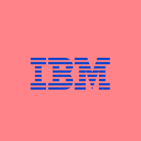

</DoDont>
</DoDontRow>

<DoDontRow>
<DoDont type="dont" caption="Don’t create stripes using different colors.">

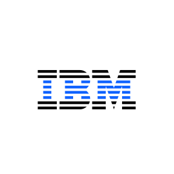

</DoDont>
<DoDont type="dont" caption="Don’t make each letter a different color.">

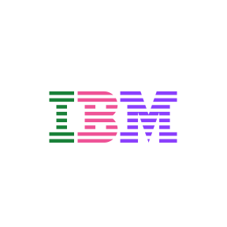

</DoDont>
<DoDont type="dont" caption="Don’t use a gradient to color the logo.">

</DoDont>
</DoDontRow>

## Usage

Consider these important points when using the logo across a wide range of
applications. Careful use and consideration are a requirement to maintain the
integrity of the logo in any type of environment or experience. The logo
shouldn’t be altered in any way and should always adhere to this usage guidance.

### Clear space

The IBM 8-bar logo should always be clearly visible. Keep the logo separated
from other visual elements by a distance equal to its height. This distance is
considered the minimum uninterrupted space surrounding the logo. We call it the
area of isolation, or clear space, and it should be adhered to in most
situations.

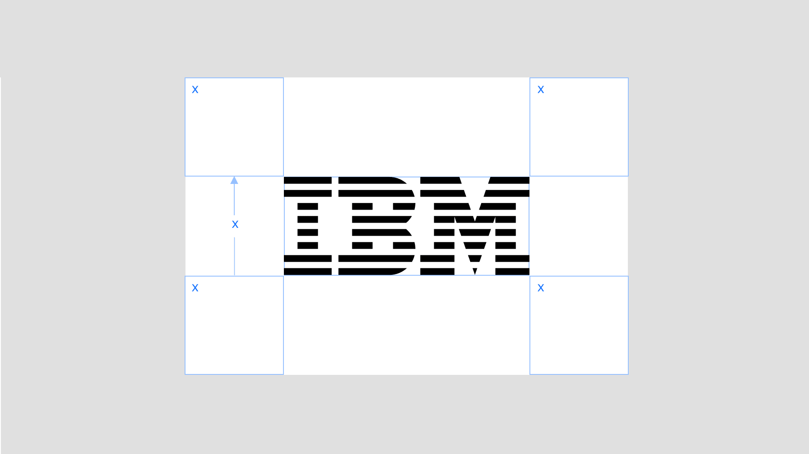

### Alignment

The IBM 8-bar logo has both horizontal and vertical relationships with the
business units and hero brand logotypes. In either axis, the IBM logo is based
on the cap height of the logotype or can scale larger by the ratio outlined in
the next section that follows. Please make sure to use the appropriate positive
or reversed version of the logo.

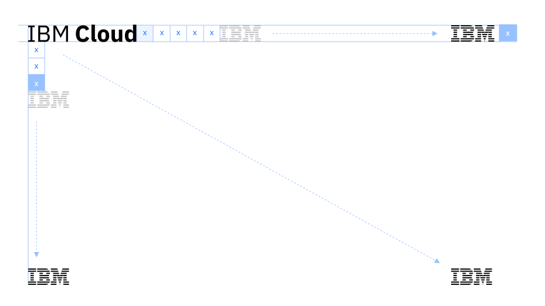

### Scale relationships

The IBM logo has several size relationships with logotypes. These relationships
are driven by the cap height of the logotypes and ensure a nice balance with the
IBM logo. The logo can “hang” from the cap height or align to the baseline when
the logos are placed near the bottom edge of a layout or footer.

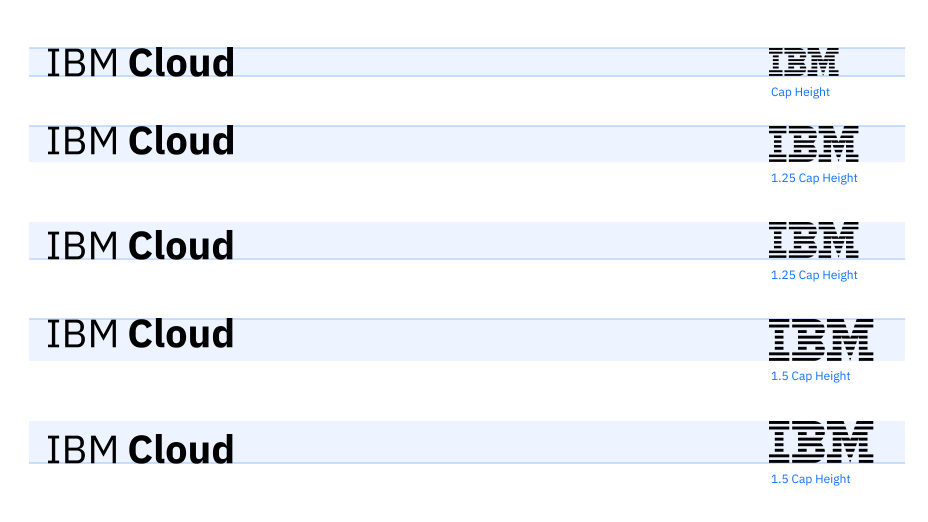

### Usage on photography

The logo should be carefully placed on photography. Always place the logo on
clear and simple backgrounds with plenty of contrast for legibility. Avoid
placing the logo on busy or complex backgrounds or images to keep it as legible
as possible.

<DoDontRow>
<DoDont type="do" colLg={6} caption="Always place the logo on clear and simple backgrounds.">

</DoDont>
<DoDont type="do" colLg={6} caption="Always place the logo on backgrounds with plenty of contrast for legibility.">

</DoDont>
</DoDontRow>

<DoDontRow>
<DoDont type="dont" colLg={6} caption="Never place the logo on images that don’t provide enough contrast.">

</DoDont>
<DoDont type="dont" colLg={6} caption="Never place the logo on busy or complex backgrounds.">

</DoDont>
</DoDontRow>

<!-- Add this bit back in when small scale logo will be available to download.
### Digital usage for small scales
For small scale use, we have altered the 8-bar logo to take advantage of pixels. This alteration renders a crisper appearance for the 8-bars. Without the adjustments, anti-aliasing causes visual banding that creates a fuzzy effect on our logo. To avoid poor rendering, please choose this small-scale version in digital work where the logo is used below 32px.
<Row className="mock-gallery">
<Column colMd={4} colLg={4}>

<Caption>Original logo</Caption>
</Column>
<Column colMd={4} colLg={4}>

<Caption>Optimized logo</Caption>
</Column>
</Row>
<Row className="mock-gallery">
<Column colMd={4} colLg={4}>

<Caption>Original logo detail, zoomed in</Caption>
</Column>
<Column colMd={4} colLg={4}>

<Caption>Optimized logo detail, zoomed in</Caption>
</Column>
</Row>  -->

### Things to avoid

The 8-bar logo shouldn’t be placed into container shapes, altered or embellished
in any way. It should only be used in the appropriate colors from the IBM color
palette. The following examples reflect only a handful of samples of what not to
do.

<DoDontRow>
<DoDont type="dont" caption="Don’t change the direction or weight of the bars.">

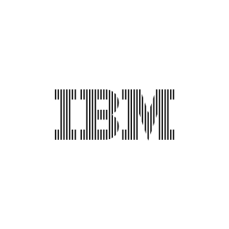

</DoDont>
<DoDont type="dont" caption="Don’t make a dot matrix.">

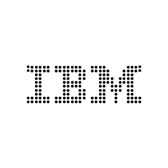

</DoDont>
<DoDont type="dont" caption="Don’t extend the serifs to touch each other.">

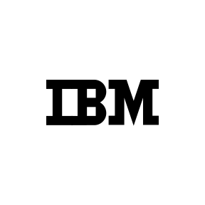

</DoDont>
</DoDontRow>
<DoDontRow>
<DoDont type="dont" caption="Don’t outline the bars.">

</DoDont>
<DoDont type="dont" caption="Don’t stretch or compress the logo.">

</DoDont>
<DoDont type="dont" caption="Don’t alter the spacing between the letters.">

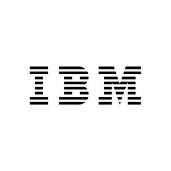

</DoDont>
</DoDontRow>
<DoDontRow>
<DoDont type="dont" caption="Don’t outline or overlap the letters.">

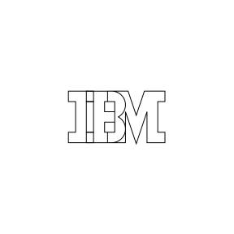

</DoDont>
<DoDont type="dont" caption="Don’t contain the logo in a shape.">

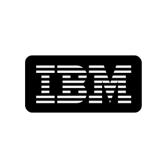

</DoDont>
<DoDont type="dont" caption="Don’t add the smart rays.">

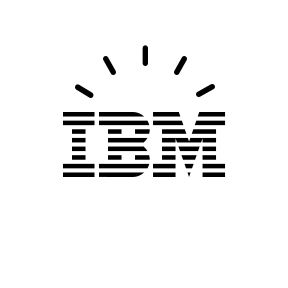

</DoDont>
</DoDontRow>
<DoDontRow>
<DoDont type="dont" caption="Don’t add characters in the 8-bar design.">

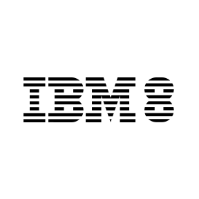

</DoDont>
<DoDont type="dont" caption="Don’t add your own taglines or mottos.">

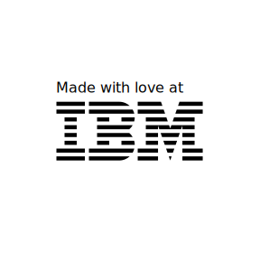

</DoDont>
<DoDont type="dont" caption="Don’t use drop shadows.">

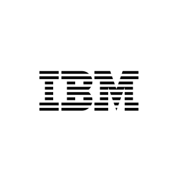

</DoDont>
</DoDontRow>

## Lineage

The IBM logo transformed through the years as the business it represents grew.
When the company took the name International Business Machines in 1924, the
brand evolution of IBM began. The following timeline illustrates its journey.

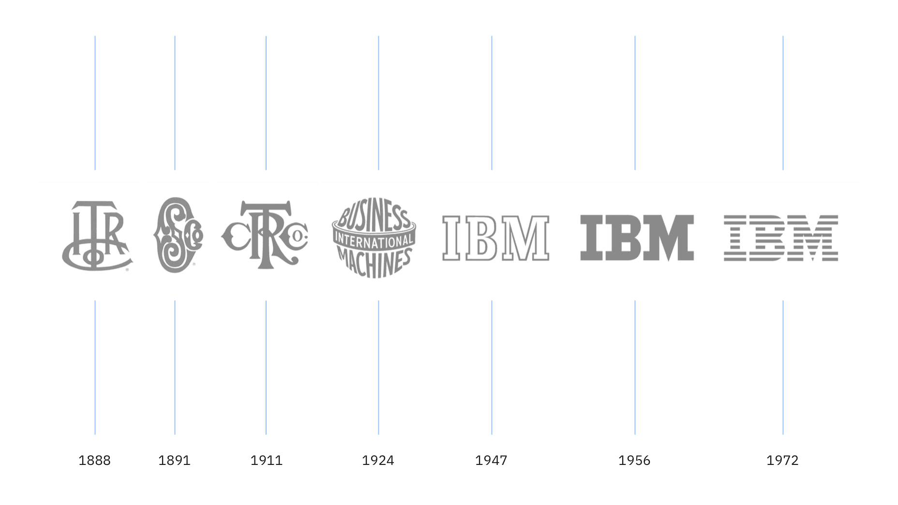

## Co-branding

Co-branding, also called “joint branding,” is when two companies form an
alliance to work together to market a related set of products or services that
neither company could develop or promote as effectively alone. IBM rarely
co-brands and the approval process is rigorous. For more information about the
co-branding process, please visit IBM Brand Center.

<Row className="resource-card-group">
<Column colMd={4} colLg={4} noGutterSm>
    <ResourceCard
      subTitle={<>IBM co-branding (IBM ID required)</>}
      href="https://www.ibm.com/brand/ibm-logos/co-branding"
      >

  </ResourceCard>
</Column>
</Row>

## Third-party logo usage

There are multiple categories of IBM logo use requests we consider to be third
party. These requests may come from vendors or organizations that want to market
their solutions as enabled by IBM, associations and events IBM has sponsored
around the world, or co-marketing requests. Each request is evaluated
individually, with the key criteria being appropriateness, clarity of
relationship, clarity of ownership of communications or offering, general
liability and so on. IBM requires all divisions to comply with these guidelines
to ensure a consistent IBM brand identity across all messaging.

<Row className="resource-card-group">
<Column colMd={4} colLg={4} noGutterSm>
    <ResourceCard
      subTitle={<>Third-party IBM logo request (IBM ID required)</>}
      href="https://prdpcrhibmbl01.w3-969.ibm.com/marketing/logotool/logotool.nsf/BrandingLogoHome?Openform"
      >

  </ResourceCard>
</Column>
</Row>
