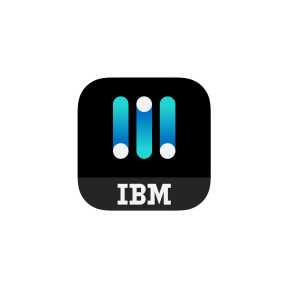
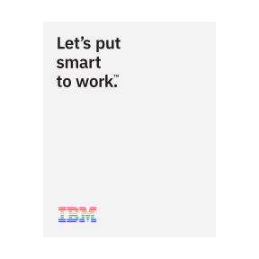

<PageDescription>

The IBM logo is one of our most valuable corporate assets and is among the
most recognized corporate identities in the world, uniquely distinguishing us
from our competitors and other companies. It’s the tangible symbol of our
brand, representing everything we are: our expertise, our values, our people,
our offerings.

</PageDescription>

<AnchorLinks>
  <AnchorLink>The 8-Bar</AnchorLink>
  <AnchorLink>Negative 8-Bar</AnchorLink>
  <AnchorLink>Positive and negative</AnchorLink>
  <AnchorLink>Legal requirements</AnchorLink>
  <AnchorLink>Color</AnchorLink>
  <AnchorLink>Usage</AnchorLink>
  <AnchorLink>Lineage</AnchorLink>
  <AnchorLink>Specific use logos</AnchorLink>
  <AnchorLink>Third-party logo usage</AnchorLink>
  <AnchorLink>Get in touch</AnchorLink>
</AnchorLinks>

## Resources

<Row className="resource-card-group">
<Column colMd={4} colLg={4} noGutterSm>
    <ResourceCard
      subTitle="IBM Logo Request Tool"
      href="https://prdpcrhibmbl01.w3-969.ibm.com/marketing/logotool/logotool.nsf/BrandingLogoHome?Openform"
      >

  </ResourceCard>
</Column>
<Column colMd={4} colLg={4} noGutterSm>
    <ResourceCard
      subTitle="IBM Business Partner marks"
      href="https://www.ibm.com/partnerworld/program/benefits/business-partner-marks"
      >

  </ResourceCard>
</Column>
</Row>

## The 8-Bar

Created by legendary designer Paul Rand, the basic design of the IBM logo has remained unchanged since 1972. Its consistent, visible use reinforces the IBM brand, makes it more memorable and authenticates the things to which it's applied. It is an essential component of the IBM Look—used to lend authority and engender trust wherever it appears. It’s our responsibility to protect it.

_Note: The black stripes have been drawn thicker than the white stripes. The black and white should appear optically similar._

## Negative 8-Bar

The logotype has been adjusted to work well reversed on dark backgrounds. In this case, the white stripes are thinner than the black stripes to adjust for optical differences but like the positive version, the stripes should appear similar in weight.

## Positive and negative

In addition to the differences in bar thickness between the positive and negative versions, there has been adjustments to the points in the counter shape. The positive being a sharp and the negative more blunt. This subtle difference between the two helps ensure optical integrity on light or dark backgrounds.

<Row className="mock-gallery">
<Column colMd={4} colLg={4}>

</Column>
<Column colMd={4} colLg={4}>

</Column>
</Row>

## Legal requirements

The IBM logo should appear on every piece of official IBM communication. On printed literature, it generally appears on the front or back cover, or sometimes on both. In video, it generally appears at the end as a final sign off. In the United States, one appearance of the IBM logo, generally the signoff, must be accompanied by the registered trademark ® symbol. In other countries, local legal counsel should be consulted for trademark guidance. There is also a copyright statement that should appear in the legal attribution area, which reads: © International Business Machines [insert current year].

<Row>
<Column colLg={8}>
<ArtDirection>

</ArtDirection>
</Column>
</Row>

## Color

The IBM core colors consisting of the blue and gray families are used when applying color to the 8-Bar. Always use a minimum of five “steps” away between the foreground and background color to insure appropriate contrast and legibilty.

Dark or light background colors work well with the core color IBM logo. Always use a minimum of five “steps” away between the foreground and background color to insure appropriate contrast and legibilty as in the samples shown here.

<Row className="mock-gallery">
<Column colMd={4} colLg={4}>

<Caption>Black</Caption>

</Column>
<Column colMd={4} colLg={4}>

<Caption>Blue 100</Caption>

</Column>
<Column colMd={4} colLg={4}>

<Caption>Blue 80</Caption>

</Column>
</Row>

<Row className="mock-gallery">
<Column colMd={4} colLg={4}>

<Caption>Blue 70</Caption>

</Column>
<Column colMd={4} colLg={4}>

<Caption>Gray 70</Caption>

</Column>
<Column colMd={4} colLg={4}>

<Caption>Gray 60</Caption>

</Column>
</Row>

<Row className="mock-gallery">
<Column colMd={4} colLg={4}>

<Caption>Blue 50 / Black</Caption>

</Column>
<Column colMd={4} colLg={4}>

<Caption>Blue 40 / Blue 90</Caption>

</Column>
<Column colMd={4} colLg={4}>

<Caption>Blue 50 / Blue 100</Caption>

</Column>
</Row>

<Row className="mock-gallery">
<Column colMd={4} colLg={4}>

<Caption>Gray 40 / Gray 100</Caption>

</Column>
<Column colMd={4} colLg={4}>

<Caption>Gray 30 / Blue 80</Caption>

</Column>
<Column colMd={4} colLg={4}>

<Caption>Black / Cool Gray 30</Caption>

</Column>
</Row>

### Backgrounds for core logos

Dark or light background colors work well with the core color IBM logo. Always use a minimum of five “steps” away between the foreground and background color to insure appropriate contrast and legibilty as in the samples shown here.

<Row className="mock-gallery">
<Column colMd={4} colLg={4}>

<Caption>Gray 40 / Purple 90</Caption>

</Column>
<Column colMd={4} colLg={4}>

<Caption>Gray 40 / Teal 90</Caption>

</Column>
<Column colMd={4} colLg={4}>

<Caption>Gray 30 / Cyan 80</Caption>

</Column>
</Row>

<Row className="mock-gallery">
<Column colMd={4} colLg={4}>

<Caption>Blue 40 / Purple 90</Caption>

</Column>
<Column colMd={4} colLg={4}>

<Caption>Blue 40 / Teal 90</Caption>

</Column>
<Column colMd={4} colLg={4}>

<Caption>Blue 40 / Cyan 80</Caption>

</Column>
</Row>

<Row className="mock-gallery">
<Column colMd={4} colLg={4}>

<Caption>Blue 40 / Blue 100</Caption>

</Column>
<Column colMd={4} colLg={4}>

<Caption>Gray 30 / Purple 80</Caption>

</Column>
<Column colMd={4} colLg={4}>

<Caption>Gray 30 / Red 90</Caption>

</Column>
</Row>

<Row className="mock-gallery">
<Column colMd={4} colLg={4}>

<Caption>Gray 100 / blue 20</Caption>

</Column>
<Column colMd={4} colLg={4}>

<Caption>Blue 90 / Purple 20</Caption>

</Column>
<Column colMd={4} colLg={4}>

<Caption>Black / Purple 20</Caption>

</Column>
</Row>

<Row className="mock-gallery">
<Column colMd={4} colLg={4}>

<Caption>Gray 100 / Blue 10</Caption>

</Column>
<Column colMd={4} colLg={4}>

<Caption>Blue 90 / Magenta 10</Caption>

</Column>
<Column colMd={4} colLg={4}>

<Caption>Blue 80 / Purple 10</Caption>

</Column>
</Row>

### Backgrounds for white logo

There are many color backgrounds available to choose from when using the white logo. In order to achieve clear legibilty, choose from the Black–60 range from the [IBM color palette](/color).

### Colors to avoid

Don't use colors for our logo that are the IBM core colors, and also please don't use unapproved color combos. See the IBM color palette guidance for more notes on unapproved color combos that have been noted in the [IBM color palette guidance](https://www.ibm.com/color).

<DoDontRow>
<DoDont type="dont">

</DoDont>
<DoDont type="dont">

</DoDont>
</DoDontRow>

<DoDontRow>
<DoDont type="dont">

</DoDont>
<DoDont type="dont">

</DoDont>
</DoDontRow>

## Usage

The following examples demonstrate important points to consider when using the logo across a wide range of applications. The logo should not be altered in any way and should always adhere to following guidance.

### Clear space

The IBM logo should always be clearly visible. We keep the logo separated from other visual elements by a distance equal to its height. This distance is considered the minimum uninterrupted space surrounding the logo. We call it the area of isolation clear space and it should be adhered to in most situations.

### Alignments

The IBM logo has both horizontal and vertical relationships with the business units and hero brand logotypes. In either axis, the IBM logo is based on the cap height of the logotype, or can scale larger by the ration oulined in the next section. Please make sure to use the appropriate positve or negative version of the logo.

### Scale relationships

The IBM logo has several size relationships with logotypes. These relationships are driven by the cap-height of the logotypes and insure a nice balance with the IBM logo. The logo can “hang” from the cap-height or align to the “baseline” when the logos are placed near the bottom edge of a layout or footer.

### Usage on photography

The Logotype should be carefully placed on photography. Always place on clear and simple backgrounds with plenty of contrast for legibilty. Avoid placing on busy or complex backgrounds or images to keep the 8-Bar as legible as possible.

<DoDontRow>
<DoDont colLg={6}>

</DoDont>
<DoDont colLg={6}>

</DoDont>
</DoDontRow>

<DoDontRow>
<DoDont type="dont" colLg={6}>

</DoDont>
<DoDont type="dont" colLg={6}>

</DoDont>
</DoDontRow>

### Things to avoid

The logotype should not be placed into container shapes, altered or added to in any way. It should only be used in the appropriate colors from the IBM color palette. Below reflects only a handful of samples of what not to do.

<DoDontRow>
<DoDont type="dont" caption="Don't change stripes direction/weight">

</DoDont>
<DoDont type="dont" caption="Don't make a dot matrix">

</DoDont>
</DoDontRow>

<DoDontRow>
<DoDont type="dont" caption="Don't extend serifs to touch">

</DoDont>
<DoDont type="dont" caption="Don't outline">

</DoDont>
</DoDontRow>

<DoDontRow>
<DoDont type="dont" caption="Don't stretch or compress">

</DoDont>
<DoDont type="dont" caption="Don't alter spacing">

</DoDont>
</DoDontRow>

<DoDontRow>
<DoDont type="dont" caption="Don't outline and overlap">

</DoDont>
<DoDont type="dont" caption="Don't place in container shape">

</DoDont>
</DoDontRow>

<DoDontRow>
<DoDont type="dont" caption="Don't add the “thought rays”">

</DoDont>
<DoDont type="dont" caption="Don't add characters in same style">

</DoDont>
</DoDontRow>

## Lineage

The IBM logo, along with the business it signified, transformed through its initial decades. In 1924 the name changed to International Business Machines and thus began the evolution of IBM’s brand identity. The gallery below illustrates its journey.

## Specific use logos

There are two additional logo styles that can be used in special applications such as merchandise, badges and events. These logos should not be used in place of the 8-Bar as an official brand communications sign-off.

### Solid logo

The solid logo is the predecessor to the 8-Bar and is optimized for usage at smaller scales based on its simplified character. Works well in digital and print applications where the 8-Bar doesn’t render well at small sizes. The negative version is lighter in weight to compensate for optical differences.

<DoDontRow>
<DoDont caption="The solid logo works well in headers and footers when space is minimal.">

</DoDont>
<DoDont type="dont" caption="Don't use the solid logo for medium to large scale applications.">

</DoDont>
</DoDontRow>

<DoDontRow>
<DoDont caption="The solid logo should be used when including ‘IBM’ in app icons.">

</DoDont>
<DoDont type="dont" caption="Don't use the solid logo in place of the 8-Bar for partnerships.">

</DoDont>
</DoDontRow>

## Diversity 8-Bar

At IBM, we have for over 100 years celebrated diversity and championed equal rights for every individual. For the gay rights movement 50 year anniversary, we payed tribute to Baker’s original vision, adapting our corporate logo to demonstrate our solidarity, support and continued commitment to the rights of the LGBT community.

<DoDontRow>
<DoDont caption="Use the Diversity logo as an identifier on physical badges and social avatars.">

</DoDont>
<DoDont type="dont" caption="Don't use in place of the 8-Bar as a marketing sign off.">

</DoDont>
</DoDontRow>

<DoDontRow>
<DoDont caption="The Diversity logo can be applied to merchandise.">

</DoDont>
<DoDont type="dont" caption="Don't apply to background colors other than White or Gray 10.">

</DoDont>
</DoDontRow>

## Third-party logo usage

There are multiple categories of IBM logo use requests we consider to be third party. These may come from partners that want to market their solutions as enabled by IBM, or associations and events IBM has sponsored around the world, or co-marketing requests. Each is evaluated individually, with the key criteria being appropriateness, clarity of relationship, clarity of ownership of communications or offering, and general liability and so on. IBM requires all divisions to comply with these guidelines to ensure a consistent IBM brand identity across all messaging.

<Row className="resource-card-group">
<Column colMd={4} colLg={4} noGutterSm>
    <ResourceCard
      subTitle="IBM Logo Request Tool"
      href="https://prdpcrhibmbl01.w3-969.ibm.com/marketing/logotool/logotool.nsf/BrandingLogoHome?Openform"
      >

  </ResourceCard>
</Column>
<Column colMd={4} colLg={4} noGutterSm>
    <ResourceCard
      subTitle="IBM Business Partner marks"
      href="https://www.ibm.com/partnerworld/program/benefits/business-partner-marks"
      >

  </ResourceCard>
</Column>
</Row>
