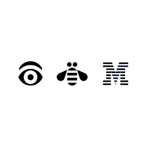
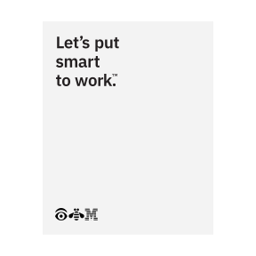
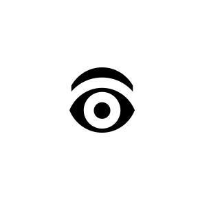
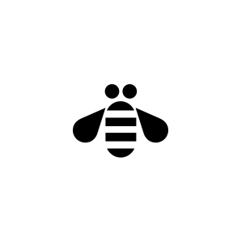

<PageDescription>

The IBM logo is one of our most valuable corporate assets and is among the
most recognized corporate identities in the world, uniquely distinguishing us
from our competitors and other companies. It’s the tangible symbol of our
brand, representing everything we are: our expertise, our values, our people,
our offerings.

</PageDescription>

<AnchorLinks>
  <AnchorLink>IBM Rebus</AnchorLink>
  <AnchorLink>Color</AnchorLink>
  <AnchorLink>IBM Totem Rebus</AnchorLink>
  <AnchorLink>Usage</AnchorLink>
  <AnchorLink>Get in touch</AnchorLink>
</AnchorLinks>

## Resources

<Row className="resource-card-group">
<Column colMd={4} colLg={4} noGutterSm>
    <ResourceCard
      subTitle="Download the Rebus"
      disabled
      >

  </ResourceCard>
</Column>
<Column colMd={4} colLg={4} noGutterSm>
    <ResourceCard
      subTitle="Color palette for Adobe™ (.ase)"
      href="https://github.com/carbon-design-system/carbon/raw/master/packages/colors/artifacts/IBM_Colors.zip"
      actionIcon="download"
      >

  </ResourceCard>
</Column>
</Row>

## IBM Rebus

Designed by Paul Rand for his Eye-Bee-M poster (1981) in support of IBM’s motto, THINK. The Rebus used pictures to represent letters which are an iconic part of IBM’s visual history. Today we still use the Rebus which has since been adjusted to meet the requirements of different mediums, scales and production environments. Like the 8-bar, the Rebus comes in both positive and negative versions. The Rebus can be used in special applications such as merchandise, badges and events but should not be used in place of the 8-Bar as an official brand communications sign off.

## Color

The IBM core colors consisting of the blue and gray families are used when applying color to the Rebus. Always use a minimum of five “steps” away between the foreground and background color to insure appropriate contrast and legibilty.

<Row className="mock-gallery">
<Column colMd={4} colLg={4}>

<Caption>Black</Caption>

</Column>
<Column colMd={4} colLg={4}>

<Caption>Blue 90</Caption>

</Column>
<Column colMd={4} colLg={4}>

<Caption>Blue 80</Caption>

</Column>
</Row>

<Row className="mock-gallery">
<Column colMd={4} colLg={4}>

<Caption>Blue 70</Caption>

</Column>
<Column colMd={4} colLg={4}>

<Caption>Gray 70</Caption>

</Column>
<Column colMd={4} colLg={4}>

<Caption>Gray 60</Caption>

</Column>
</Row>

<Row className="mock-gallery">
<Column colMd={4} colLg={4}>

<Caption>Blue 50 / Black</Caption>

</Column>
<Column colMd={4} colLg={4}>

<Caption>Blue 40 / Blue 90</Caption>

</Column>
<Column colMd={4} colLg={4}>

<Caption>Blue 50 / Blue 100</Caption>

</Column>
</Row>

<Row className="mock-gallery">
<Column colMd={4} colLg={4}>

<Caption>Gray 40 / Gray 100</Caption>

</Column>
<Column colMd={4} colLg={4}>

<Caption>Gray 30 / Blue 80</Caption>

</Column>
<Column colMd={4} colLg={4}>

<Caption>Black / Cool Gray 30</Caption>

</Column>
</Row>

### Backgrounds for core color Rebus

Dark or light background colors work well with the core color IBM logo. Always use a minimum of five “steps” away between the foreground and background color to insure appropriate contrast and legibilty as in the samples below.

<Row className="mock-gallery">
<Column colMd={4} colLg={4}>

<Caption>Gray 40 / Purple 90</Caption>

</Column>
<Column colMd={4} colLg={4}>

<Caption>Gray 40 / Teal 90</Caption>

</Column>
<Column colMd={4} colLg={4}>

<Caption>Gray 30 / Cyan 80</Caption>

</Column>
</Row>

<Row className="mock-gallery">
<Column colMd={4} colLg={4}>

<Caption>Blue 40 / Purple 90</Caption>

</Column>
<Column colMd={4} colLg={4}>

<Caption>Blue 40 / Teal 90</Caption>

</Column>
<Column colMd={4} colLg={4}>

<Caption>Blue 40 / Cyan 90</Caption>

</Column>
</Row>

<Row className="mock-gallery">
<Column colMd={4} colLg={4}>

<Caption>Blue 40 / Blue 100</Caption>

</Column>
<Column colMd={4} colLg={4}>

<Caption>Gray 30 / Purple 80</Caption>

</Column>
<Column colMd={4} colLg={4}>

<Caption>Gray 30 / Red 90</Caption>

</Column>
</Row>

<Row className="mock-gallery">
<Column colMd={4} colLg={4}>

<Caption>Gray 100 / Blue 20</Caption>

</Column>
<Column colMd={4} colLg={4}>

<Caption>Blue 90 / Purple 20</Caption>

</Column>
<Column colMd={4} colLg={4}>

<Caption>Black / Purple 20</Caption>

</Column>
</Row>

<Row className="mock-gallery">
<Column colMd={4} colLg={4}>

<Caption>Gray 100 / Blue 10</Caption>

</Column>
<Column colMd={4} colLg={4}>

<Caption>Blue 90 / Magenta 10</Caption>

</Column>
<Column colMd={4} colLg={4}>

<Caption>Blue 80 / Purple 10</Caption>

</Column>
</Row>

### Backgrounds for white Rebus

There are many colors backgrounds available to choose from when using the white IBM Rebus. To achieve the best results for legibilty choose from the 60–100 ranges from the IBM color palette. Rememeber to use the negative verion of the Rebus in this case.

### IBM Totem Rebus

The totem rebus adds more meaning to the already lovable original. The totem connects with us because it speaks to the human factor, the user, and the ever evolving relationship of mankind and the machines. It reminds that good design should primarily serve people and move us toward progress.

<Row className="mock-gallery">
<Column colMd={4} colLg={6}>

<Caption>Same scale in vertical relationship</Caption>

</Column>
<Column colMd={4} colLg={6}>

<Caption>Totem rebus positive</Caption>

</Column>
</Row>

<Row className="mock-gallery">
<Column colMd={4} colLg={6}>

<Caption>Totem rebus negative</Caption>

</Column>
<Column colMd={4} colLg={6}>

<Caption>Rebus and spacing are on a grid</Caption>

</Column>
</Row>

## Usage

The IBM rebus is a special piece of design and also part of the permanent collection of the Museum of Modern Art. The form should not be be altered, adjusted, colored in inapproriate ways. Below are a few samples of things to avoid and a few that are permissable. If these basics are adhered to it should protect the integrity of Paul Rands great design work.

<DoDontRow>
<DoDont type="dont" caption="Do not alter spacing">

</DoDont>
<DoDont type="dont" caption="Do not scale and recompose">

</DoDont>
</DoDontRow>

<DoDontRow>
<DoDont type="dont" caption="Do not use drop shadows">

</DoDont>
<DoDont type="dont" caption="Do not stretch or compress">

</DoDont>
</DoDontRow>

<DoDontRow>
<DoDont type="dont" caption="Do not replace 8-Bar for sign offs">

</DoDont>
<DoDont type="dont" caption="Do not use unnacceptable combos">

</DoDont>
</DoDontRow>

<DoDontRow>
<DoDont caption="Do use the eye alone">

</DoDont>
<DoDont caption="Do use the bee alone">

</DoDont>
</DoDontRow>

<Row className="resource-card-group">
<Column colMd={4} colLg={4} noGutterSm>
    <ResourceCard
      subTitle="IBM Business Partner marks"
      href="https://prdpcrhibmbl01.w3-969.ibm.com/marketing/logotool/logotool.nsf/BrandingLogoHome?Openform"
      >

  </ResourceCard>
</Column>
<Column colMd={4} colLg={4} noGutterSm>
    <ResourceCard
      subTitle="IBM Business Partner marks"
      href="https://www.ibm.com/innovate/brand/ibm-logo/"
      >

  </ResourceCard>
</Column>
</Row>

## Get in touch

<Row>
<Column colMd={4} colLg={4}>

##### Huda Mohamed

Brand Strategist,
Brand Experience & Design
[mohamed@ca.ibm.com](mailto:mohamed@ca.ibm.com)

</Column>
<Column colMd={4} colLg={4}>

##### Lisa Lind

Executive Producer,
Brand Experience & Design
[llind@us.ibm.com](mailto:llind@us.ibm.com)

</Column>
</Row>
