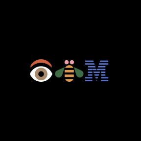
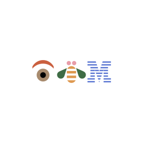

<PageDescription>

Designed in 1981 by Paul Rand for his Eye-Bee-M poster in support of the IBM
THINK motto, the rebus used pictures to represent letters. This rebus is now an
iconic part of our visual history and in the permanent collection at the Museum
of Modern Art in New York.

</PageDescription>

<AnchorLinks>
  <AnchorLink>IBM rebus</AnchorLink>
  <AnchorLink>IBM totem rebus</AnchorLink>
  <AnchorLink>IBM classic rebus</AnchorLink>
  <AnchorLink>Color</AnchorLink>
  <AnchorLink>Usage</AnchorLink>
</AnchorLinks>

## Resources

<Row className="resource-card-group">
<Column colMd={4} colLg={4} noGutterSm>
    <ResourceCard
      subTitle={<>Internal IBM logo request (IBM ID required)</>}
      href="https://www.ibm.com/brand/ibm-logos/logo-requests"
      >

  </ResourceCard>
</Column>
</Row>

## IBM rebus

Today we still use the rebus, which has since been adjusted to meet the
requirements of different mediums, scales and production environments. Like the
8-bar logo, the rebus comes in positive and reversed versions. The rebus can be
used in special applications, such as merchandise, badges and events, but
shouldn’t be used in place of the 8-bar logo as an official brand communications
sign off.

## IBM totem rebus

The totem rebus adds more meaning to the already lovable original. The totem
connects with us because it speaks to the human factor, the user, and the
ever-evolving relationship between mankind and machines. It reminds us that good
design should primarily serve people and move us toward progress.

<Row className="mock-gallery">
<Column colMd={4} colLg={6}>

<Caption>Same scale in vertical relationship</Caption>

</Column>
<Column colMd={4} colLg={6}>

<Caption>Totem rebus positive</Caption>

</Column>
</Row>

<Row className="mock-gallery">
<Column colMd={4} colLg={6}>

<Caption>Totem rebus reversed</Caption>

</Column>
<Column colMd={4} colLg={6}>

<Caption>Rebus and spacing are on a grid</Caption>

</Column>
</Row>

## IBM classic rebus

The classic rebus, using the original color scheme, is still used for our
heritage merchandise and can also be used for special occasions with permission
from the brand team. This special art may only be used on a black background.
This color scheme is not meant for standard usage and doesn’t reflect the
current IBM brand color palette. So, while the classic rebus is available for
restricted use on merchandise or for special events, prior approval is required.

<DoDontRow>
<DoDont type="do" caption="Always use the classic rebus on a black background." >

</DoDont>
<DoDont type="dont" caption="Never use the classic rebus on light backgrounds.">

</DoDont>
</DoDontRow>

## Color

The IBM core colors, consisting of the blue and gray families, are used when
applying color specifically to the rebus. Please refer to the
[color specifications](/color#specifications) for precise values. Here are a few
examples of possible color combinations using core colors and positive and
negative IBM rebuses.

<ArtDirection>

</ArtDirection>

<Title>Positive rebus</Title>

<Row className="mock-gallery">
<Column colMd={4} colLg={4}>

<Caption>Black / Gray 30</Caption>

</Column>
<Column colMd={4} colLg={4}>

<Caption>Blue 70 / Blue 20</Caption>

</Column>
<Column colMd={4} colLg={4}>

<Caption>Gray 60 / White</Caption>

</Column>
</Row>

<Title>Reversed rebus</Title>

<Row className="mock-gallery">
<Column colMd={4} colLg={4}>

<Caption>Blue 50 / Black</Caption>

</Column>
<Column colMd={4} colLg={4}>

<Caption>Blue 40 / Blue 90 </Caption>

</Column>
<Column colMd={4} colLg={4}>

<Caption>Gray 10 / Blue 60 </Caption>

</Column>
</Row>

### Background colors

Dark or light background colors work well with the core colors of the IBM rebus.
Always use a minimum of five “steps” away between the foreground and background
color to insure appropriate contrast and legibility. Any background color from
the [IDL color palette](/color#the-palette) with sufficient contrast may be used
with a core color rebus. Here are a few examples of possible color combinations.

<Title>Positive rebus</Title>

<Row className="mock-gallery">
<Column colMd={4} colLg={4}>

<Caption>Gray 100 / Blue 20</Caption>

</Column>
<Column colMd={4} colLg={4}>

<Caption>Blue 70 / Green 10</Caption>

</Column>
<Column colMd={4} colLg={4}>

<Caption>Blue 80 / Purple 30</Caption>

</Column>
</Row>

<Title>Reversed rebus</Title>

<Row className="mock-gallery">
<Column colMd={4} colLg={4}>

<Caption>Blue 40 / Purple 90</Caption>

</Column>
<Column colMd={4} colLg={4}>

<Caption>Gray 10 / Teal 90</Caption>

</Column>
<Column colMd={4} colLg={4}>

<Caption>White / Magenta 60</Caption>

</Column>
</Row>

## Usage

The IBM rebus is a special piece of design. The form shouldn’t be altered,
adjusted or colored in inappropriate ways. Here are a few samples of what to
avoid and what’s permissible. If these basics are adhered to, it will protect
the integrity of Paul Rand’s great design work.

### Clear space

Keep the rebus and totem rebus separated from other visual elements by a
distance equal to the M height. This distance is considered the minimum
uninterrupted space surrounding the rebus. We call it the area of isolation, or
clear space, and it should be adhered to in most situations.

### Misuse

Shown here are a few examples of improper use of the rebus and totem rebus.

<DoDontRow>
<DoDont type="dont" caption="Don’t alter the spacing of elements.">

</DoDont>
<DoDont type="dont" caption="Don’t scale or recompose rebus elements.">

</DoDont>
<DoDont type="dont" caption="Don’t stretch or compress rebus elements.">

</DoDont>
</DoDontRow>

<DoDontRow>
<DoDont type="dont" caption="Don’t create compositions from the rebus and the 8-bar logo.">

</DoDont>
<DoDont type="dont" caption="Don’t add drop shadows to the rebus.">

</DoDont>
<DoDont type="dont" caption="Don’t use unacceptable color combinations.">

</DoDont>
</DoDontRow>

<DoDontRow>
<DoDont type="dont" caption="Don’t replace the 8-bar logo with the rebus for sign offs, not even in marketing applications.">

</DoDont>
<DoDont type="dont" caption="Don’t combine the rebus with specific business units.">

</DoDont>
</DoDontRow>

### Patterns

Patterns can be useful tools in a variety of graphic applications. In the
workplace for example, distraction patterns on glass walls and doors can prevent
injury. Event structure facades might use graphic wallcovering. They can also be
used effectively on merchandise. There are a few approved patterns based on the
rebus, with positive and reversed options.

<Row className="mock-gallery">
<Column colMd={4} colLg={4}>

</Column>
<Column colMd={4} colLg={4}>

</Column>
<Column colMd={4} colLg={4}>

</Column>
</Row>

<Row className="resource-card-group">
<Column colMd={4} colLg={4} noGutterSm>
    <ResourceCard
      subTitle="Eye-Bee-M patterns"
      href="https://ibm.box.com/s/uf5udm0eo4ifhoj4yco7tkh1c9s37mub"
      >

  </ResourceCard>
</Column>
</Row>

### The rebus in action

<Row className="mock-gallery">
<Column colMd={8} colLg={8}>

</Column>
<Column colMd={4} colLg={4}>

</Column>
</Row>
<Row className="mock-gallery">
<Column colMd={4} colLg={4}>

</Column>
<Column colMd={8} colLg={8}>

</Column>
</Row>
<Row className="mock-gallery">
<Column colMd={8} colLg={8}>

</Column>
<Column colMd={4} colLg={4}>

</Column>
</Row>
<Row className="mock-gallery">
<Column colMd={4} colLg={4}>

</Column>
<Column colMd={8} colLg={8}>

</Column>
</Row>
