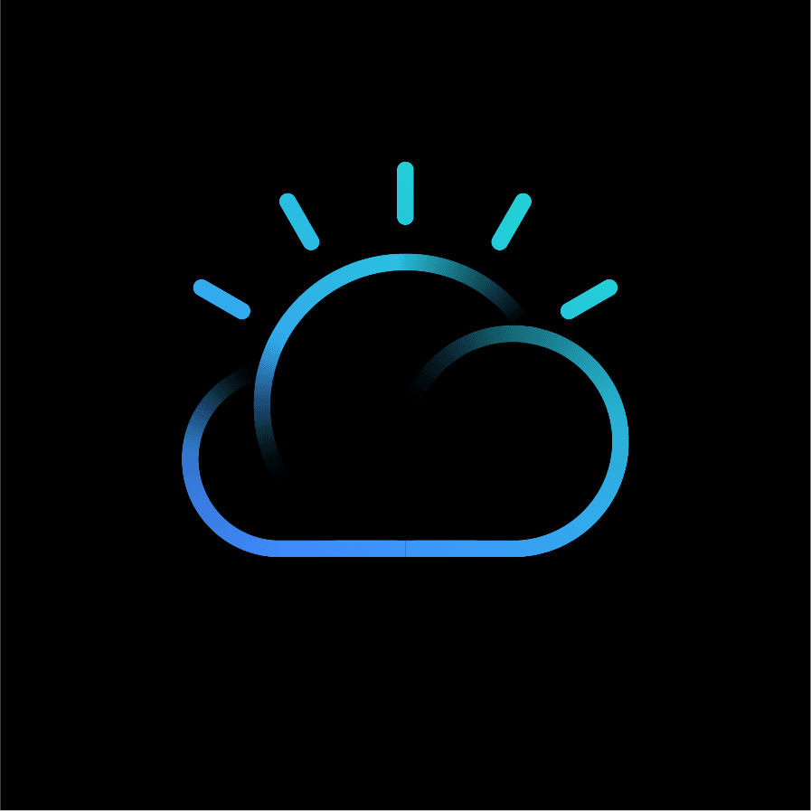
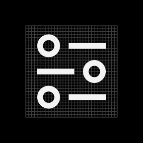
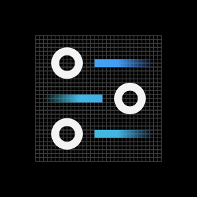
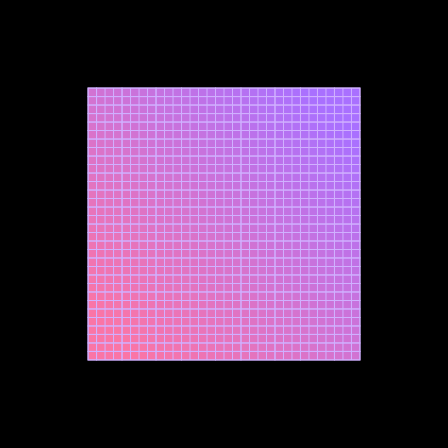
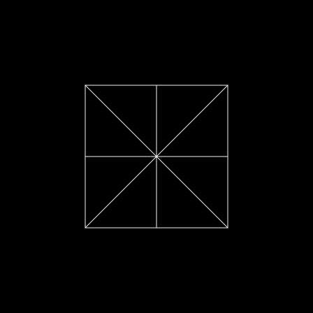
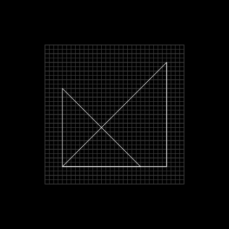
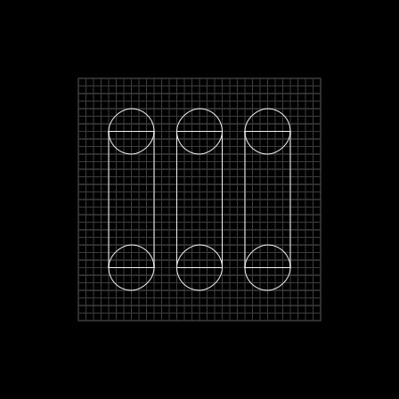
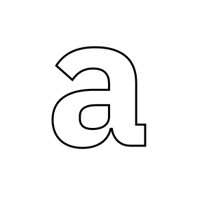
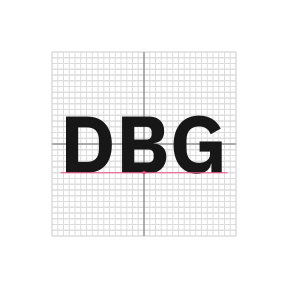

import { Zip32 } from '@carbon/icons-react';

<PageDescription>

IBM app icons are visual symbols used to represent products or services. They
identify apps at a glance for users while serving as a unique expression of our
brand.

</PageDescription>

<AnchorLinks>
  <AnchorLink>Overview</AnchorLink>
  <AnchorLink>Stroke app icons</AnchorLink>
  <AnchorLink>Fill app icons</AnchorLink>
  <AnchorLink>IBM Plex® app icons</AnchorLink>
  <AnchorLink>Hero brands and third parties</AnchorLink>
</AnchorLinks>

## Resources

<Row className="resource-card-group">
<Column colMd={4} colLg={4} noGutterSm>
    <ResourceCard
      subTitle="IBM app icons master"
      actionIcon="download"
      href="https://github.ibm.com/carbon/app-icons/raw/master/App_Icon_Master.ai"
      >

</ResourceCard>
</Column>
<Column colMd={4} colLg={4} noGutterSm>
  <ResourceCard
    subTitle="App icon builder"
    aspectRatio="2:1"
    href="https://github.ibm.com/carbon/app-icons/raw/master/App_Icon_Builder.ai"
    actionIcon="download"
    >

  </ResourceCard>
</Column>
</Row>

## Overview

App icons visually communicate the core idea of a product or service through
either objective or abstract form. Expressive and distinct, each icon serves to
identify apps at a glance, while collectively appearing to be part of a whole.
All app icons are constructed on the same 32px grid and share many stylistic
properties of UI Icons. Several different forms of app icons exist to serve the
needs of different products, services, and the contexts in which they appear.

<Row className="mock-gallery">
<Column colMd={4} colLg={6}>

<Caption>Stroke app icons</Caption>

</Column>
<Column colMd={4} colLg={6}>

<Caption>Fill app icons</Caption>

</Column>
</Row>

<Row className="mock-gallery">
<Column colMd={4} colLg={6}>

<Caption>IBM Plex app icons</Caption>

</Column>
<Column colMd={4} colLg={6}>

<Caption>Hero brands and third-party logos</Caption>

</Column>
</Row>

## Stroke app icons

Drawing from the visual expression of Watson, stroke app icons bring in light
strokes and color gradients to stand out from product UI icons. Stroke app icons
work best in product situations where app icons, UI Icons, and typography appear
in the same context.

<ArtDirection>

</ArtDirection>

### Style

Stroke app icons are largely based on the styling of UI Icons, following all of
the same production guidelines other than color. When creating a stroke app
icon, reference the [UI icon guidance](/iconography/ui-icons/design) as a
starting point.

<Row className="mock-gallery">
<Column colMd={4} colLg={4}>

<Caption>UI icon</Caption>

</Column>
<Column colMd={4} colLg={4}>

<Caption>Stroke app icon</Caption>

</Column>
</Row>

### Elements

All stroke app icons consist of three elements: A color gradient, a gradient
stroke, and a solid stroke. Each of these elements must appear at least once in
the icon, and separate elements do not touch each other.

<Row className="mock-gallery">
<Column colMd={4} colLg={4}>

<Caption>Color gradient</Caption>

</Column>
<Column colMd={4} colLg={4}>

<Caption>Gradient stroke</Caption>

</Column>
<Column colMd={4} colLg={4}>

<Caption>Solid stroke</Caption>

</Column>
</Row>

<DoDontRow>
<DoDont type="dont" caption="Gradient strokes and solid strokes do not touch.">

</DoDont>
<DoDont type="dont" caption="Stroke app icons must include both solid and gradient strokes.">

</DoDont>
</DoDontRow>

#### Color gradient

The color gradient provides color to the gradient stroke of the icon. This layer
remains stationary on the icon grid at 45° and is masked by the gradient stroke
for consistent color across each icon.

<Row className="mock-gallery">
<Column colMd={4} colLg={6}>

<Caption>
  The color gradient layer remains stationary on the icon grid and is masked by
  the gradient stroke.
</Caption>

</Column>
<Column colMd={4} colLg={6}>

<Caption>The color gradient is always at 45°.</Caption>

</Column>
</Row>

Here are the 4 standard icon colors. Note that the colors are adjusted for both
light and dark backgrounds to appear best in either context. Additional color
gradients can be created from any acceptable 2-color family. Refer to the table
below when creating new color gradients.

<Row>
<Column colMd={4} colLg={6}>

</Column>
<Column colMd={4} colLg={6}>

</Column>
</Row>

| Icon theme | Color value 1 | Color value 2 |
| ---------- | ------------- | ------------- |
| Dark       | 50            | 40, 30        |
| Light      | 60            | 50, 40        |

<DoDontRow>
<DoDont type="dont" caption="Don’t alter the angle or scale of the color gradient.">

</DoDont>
<DoDont type="dont" caption="Don’t use unapproved color gradients.">

</DoDont>
</DoDontRow>

#### Gradient stroke

The gradient stroke portion of the icon features an alpha gradient (a gradient
that blends between 100% and 0% opacity). This element serves as a mask for the
color gradient.

<ArtDirection>

</ArtDirection>

<DoDontRow>
<DoDont type="dont" caption="The gradient stroke must include an alpha gradient.">

</DoDont>
<DoDont type="dont" caption="Don’t make the alpha gradient too harsh.">

</DoDont>
</DoDontRow>

<DoDontRow>
<DoDont type="dont" caption="Don’t use radial gradients.">

</DoDont>
<DoDont type="dont" caption="Don’t use gradient horizontally along the stroke to create faded edges.">

</DoDont>
</DoDontRow>

#### Solid stroke

The solid stroke features no gradients of any kind, and it is used as an accent
or to emphasize a part of the icon. Be purposeful with which part of the icon is
comprised of the solid stroke; don’t add emphasis to insignificant parts of the
icon.

<ArtDirection>

</ArtDirection>

<DoDontRow>
<DoDont type="dont" caption="Don’t add emphasis on insignificant parts of the icon.">

</DoDont>
<DoDont type="dont" caption="Don’t use alpha gradient on the solid stroke layer.">

</DoDont>
</DoDontRow>

The color of the solid stroke can be either Gray 10 for dark backgrounds or Blue
90 for light backgrounds. These colors work great for either context and with
any approved color gradient.

<Row className="mock-gallery">
<Column colMd={4} colLg={4}>

<Caption>Gray 10 solid stroke on dark background</Caption>

</Column>
<Column colMd={4} colLg={4}>

<Caption>Blue 90 solid stroke on light background</Caption>

</Column>
</Row>

<DoDontRow>
<DoDont type="dont" caption="Don’t use dark theme colors on light theme and vice versa.">

</DoDont>
<DoDont type="dont" caption="Don’t use other solid stroke colors.">

</DoDont>
</DoDontRow>

## Fill app icons

As an alternative to stroke app icons, fill app icons communicate the core idea
of the app with more simplicity and abstraction. These icons should focus on the
bigger concepts of the product or service, such as scale, transaction,
integration and so on.  Functionally, fill app icons work best in situations
where you need to call attention to the app with more visual weight or a larger
color field, as opposed to the light, linear form of fill app icons.

<ArtDirection>

</ArtDirection>

### Style

Fill icons are created by combining, intersecting, and subdividing two core
shapes: the square and the circle. These shapes can be scaled to fit within the
grid to allow for endless possibilities.

<Row className="mock-gallery">
<Column colMd={4} colLg={6}>

<Caption>Core shape (circle) with subdivisions</Caption>

</Column>
<Column colMd={4} colLg={6}>

<Caption>Core shape (square) with subdivisions</Caption>

</Column>
</Row>

<Row className="mock-gallery">
<Column colMd={4} colLg={6}>

</Column>
<Column colMd={4} colLg={6}>

</Column>
</Row>

<DoDontRow>
<DoDont type="dont" caption="Avoid making icons too complex.">

</DoDont>
<DoDont type="dont" caption="Avoid making icons too literal.">

</DoDont>
<DoDont type="dont" caption="Don’t use organic shapes. ">

</DoDont>
</DoDontRow>

### Elements

Fill icons consist of up to three elements: A primary gradient, a secondary
color, and a tertiary gradient. All fill app icons must have at least one
primary gradient, and at least one secondary color and/or tertiary gradient. Any
element can exist in more than one shape, that is, two separate shapes with
primary gradient.

<Row className="mock-gallery">
<Column colMd={4} colLg={4}>

<Caption>Primary gradient</Caption>

</Column>
<Column colMd={4} colLg={4}>

<Caption>Secondary color</Caption>

</Column>
<Column colMd={4} colLg={4}>

<Caption>Tertiary gradient</Caption>

</Column>
</Row>

<DoDontRow>
<DoDont type="dont" caption="Fill icons must include at least one shape with primary gradient.">

</DoDont>
<DoDont type="dont" caption="Fill icons must include at least one secondary color and/or tertiary gradient.">

</DoDont>
</DoDontRow>

### Primary gradient

The primary gradient is the primary element of the icon consisting of a blend
between any acceptable 2-Color Family from the color palette. Due to the larger
color fields possible in fill icons compared to stroke icons, it is possible for
a wider range of color gradients to work well on both light and dark
backgrounds. Please reference the [color guidelines](/color/#gradients) when
choosing the right color gradient for your app icon.

<ArtDirection>

</ArtDirection>

<DoDontRow>
<DoDont type="dont" caption="Don’t use more than one 2-Color Family for the primary gradient.">

</DoDont>
<DoDont type="dont" caption="Don’t use different color values for the primary gradient.">

</DoDont>
</DoDontRow>

<DoDontRow>
<DoDont type="dont" caption="Don’t create gradients with more than two colors.">

</DoDont>
<DoDont type="dont" caption="Don’t use radial gradients.">

</DoDont>
</DoDontRow>

#### Secondary color

Secondary color can be used as an accent or to place emphasis on part of the
icon. Use either Gray 10 for dark backgrounds or Blue 90 for light backgrounds.

<ArtDirection>

</ArtDirection>

<Row className="mock-gallery">
<Column colMd={4} colLg={4}>

<Caption>Gray 10 secondary color on dark background</Caption>

</Column>
<Column colMd={4} colLg={4}>

<Caption>Blue 90 secondary color on light background</Caption>

</Column>
</Row>

<DoDontRow>
<DoDont type="dont" caption="Don’t use dark theme color on light theme and vice versa.">

</DoDont>
<DoDont type="dont" caption="Don’t use other colors for secondary color.">

</DoDont>
</DoDontRow>

#### Tertiary gradient

The tertiary gradient is a very light and subtle supporting element designed to
fall somewhat to the background. It consists of an opacity gradient using either
Gray 10 for dark backgrounds or Gray 100 for light backgrounds.

<ArtDirection>

</ArtDirection>

<Caption>Tertiary gradient for dark backgrounds</Caption>

<Caption>Tertiary gradient for light backgrounds</Caption>

## IBM Plex® app icons

IBM Plex can also be sized for use as product or service identifiers. Use the
icon grid as a guide to ensure type appears clear and proportional alongside
other iconography.

<Row className="mock-gallery">
<Column colMd={4} colLg={4}>

</Column>
<Column colMd={4} colLg={4}>

</Column>
<Column colMd={4} colLg={4}>

</Column>
</Row>

### Style

For app icons, bold weights of IBM Plex Sans work best. You may choose to use
Plex Mono or italics Plex fonts when it makes sense for your product or service.

<DoDontRow>
<DoDont caption="Use bold weights of IBM Plex and default to Plex Sans.">

</DoDont>
<DoDont type="dont" caption="Don’t use lighter weights.">

</DoDont>
</DoDontRow>

<DoDontRow>
<DoDont caption="You can use Plex mono and italics Plex fonts when it makes sense to do so.">

</DoDont>
<DoDont type="dont" caption="Avoid use of Plex Serif.">

</DoDont>
</DoDontRow>

<DoDontRow>
<DoDont caption="Use solid type.">

</DoDont>
<DoDont type="dont" caption="Don’t outline type.">

</DoDont>
</DoDontRow>

### Typesetting

When setting type on the icon grid, use smaller type sizes as character count
increases in order to fit the type comfortably. Please do not alter other type
specs, such as tracking, kerning and vertical or horizontal scale.

<DoDontRow>
<DoDont type="dont" caption="Don’t use more than 3–4 characters max.">

</DoDont>
<DoDont type="dont" caption="Don’t use more than one line of text.">

</DoDont>
</DoDontRow>

<DoDontRow>
<DoDont type="dont" caption="Don’t stretch the type.">

</DoDont>
<DoDont type="dont" caption="Don’t alter the tracking.">

</DoDont>
</DoDontRow>

### Alignment

Always keep type center aligned within the icon grid, and adjust for optical
alignment when needed. Keep baselines aligned to a grid division and respect
icon padding guidelines.

<DoDontRow>
<DoDont caption="Center typography while aligning the baseline to the icon grid.">

</DoDont>
<DoDont type="dont" caption="Don’t place the baseline off-grid.">

</DoDont>
</DoDontRow>

<DoDontRow>
<DoDont caption="You can adjust horizontal alignment when optical centering is needed.">

</DoDont>
<DoDont type="dont" caption="Don’t left, right, top, or bottom align the type.">

</DoDont>
</DoDontRow>

<DoDontRow>
<DoDont caption="Place type completely within the icon grid.">

</DoDont>
<DoDont type="dont" caption="Don’t crop.">

</DoDont>
</DoDontRow>

### Color

You can use color and gradients with typography. Always choose a color within
the palette and follow the [color guidelines](/color/#gradients) for gradients.

<DoDontRow>
<DoDont caption="You can use one color value within the color palette.">

</DoDont>
<DoDont type="dont" caption="Don’t use multiple colors.">

</DoDont>
</DoDontRow>

<DoDontRow>
<DoDont caption="You can use gradients across the entire icon.">

</DoDont>
<DoDont type="dont" caption="Don’t place gradients on separate elements of the type.">

</DoDont>
</DoDontRow>

## Hero brands and third parties

Products and services often need to be represented with logos in environments
such as marketplaces, especially when it is delivered by a third party or IBM
partner company. Placement within the icon grid can help to ensure logos look
great alongside other iconography.

<Row className="mock-gallery">
<Column colMd={4} colLg={4}>

<Caption>IBM Cloud logo</Caption>

</Column>
<Column colMd={4} colLg={4}>

<Caption>Third party logo</Caption>

</Column>
<Column colMd={4} colLg={4}>

<Caption>Third party logo within container</Caption>

</Column>
</Row>

### Alignment

While most logos don’t align perfectly to the icon grid, it is important to
align any icon artwork to the grid as best as possible. Center logos and align
edges to grid divisions while respecting icon padding guidelines.

<DoDontRow>
<DoDont caption="Optically center logos and align to the icon grid as best as possible.">

</DoDont>
<DoDont type="dont" caption="Don’t left, right, top or bottom align logos.">

</DoDont>
</DoDontRow>

<DoDontRow>
<DoDont caption="Use the padding occasionally for optical centering.">

</DoDont>
<DoDont type="dont" caption="Don’t place logos in the padding unless absolutely necessary.">

</DoDont>
</DoDontRow>

### Keyshapes

When logos have a background container, use
[keyshapes](/iconography/ui-icons/design/#keyshapes) to guide your design. This
makes it easier to create a visually stable foundation and helps to keep visual
weight consistent between icons.

<ArtDirection>

</ArtDirection>

<Row className="mock-gallery">
<Column colMd={4} colLg={4}>

<Caption>Third-party logo set in circle keyshape</Caption>

</Column>
<Column colMd={4} colLg={4}>

<Caption>Third-party logo set in square keyshape</Caption>

</Column>
</Row>
