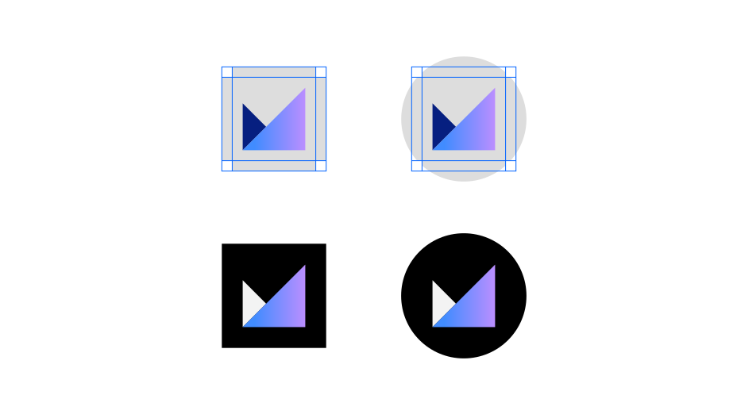

<PageDescription>

While app icons follow the same usage conventions as IBM UI icons when used in product and web platforms, there are differences when they are used in native OS applications and app store environments. Check the gallery of existing app icons when designing a new one to avoid confusion from similarities with those icons already in use.

</PageDescription>

<AnchorLinks>
  <AnchorLink>Product and web</AnchorLink>
  <AnchorLink>Native OS</AnchorLink>
  <AnchorLink>Gallery</AnchorLink>
</AnchorLinks>

## Product and web

Most often, app icons are needed within product and web platforms and marketplaces. In these contexts, app icons should follow the same usage conventions as [UI icons](/iconography/ui-icons/usage) for sizing, alignment, and clearance.

<Caption>App icons in-product, IBM Security</Caption>

<Caption>Product catalog example</Caption>

### Type pairing

When pairing with typography, app icons should not appear to be a logo for any product, service, or business unit. Please contact the brand team for logo requests.

<Row>
<Column colMd={4} colLg={4}>
<DoDontExample type="do" caption="You may use app icons with type to identify a product or service in the context of a product or marketplace.">

</DoDontExample>
</Column>
<Column colMd={4} colLg={4}>
<DoDontExample type="dont" caption="Don’t use any icon as a logo or with a brand type lockup for product headers, merchandise or events.">

</DoDontExample>
</Column>
</Row>

## Native OS

Icons for native applications appear within a variety of contexts, such as task bars, user-customized wallpapers, notifications, system preferences, and more. In most systems, a background container shape is needed to provide proper contrast against the large variety of backgrounds. Check the requirements of the operating system on which your product will be published to determine whether your icon needs a container shape.

<ArtDirection>

</ArtDirection>

<ArtDirection>

</ArtDirection>

<Row>
<Column colMd={4} colLg={6}>
<DoDontExample type="do" caption="In most cases, container shapes are needed for icons that appear within native operating systems.">

</DoDontExample>
</Column>
<Column colMd={4} colLg={6}>
<DoDontExample type="dont" caption="Don’t use container shapes within the product itself. The icon will be too small.">

</DoDontExample>
</Column>
</Row>

#### Android adaptive icons

Android app icons have user-customizable masks as container shapes and make use of foreground and background layers to achieve parallax effects. You can separate your icon's elements into the two layers to make use of this interactive feature.

<Video
  poster="/images/2_2-5_NativeOS_Adapticon_PosterImage.png"
  src="/videos/2_2-5_NativeOS_Adapticon.mp4"
/>

### Background color

You can choose a background color or gradient for native app icon container shapes. Most icons are placed on a black or white background, but you may choose alternative background colors within the color guidance of your app icon style.

Color app icons may be placed on background color values 10–20 and 90–100. Use monochromatic app icons for color values 20–80, and make sure the icon complies with [IBM’s accessibility standards](https://www.carbondesignsystem.com/guidelines/accessibility/overview).

| Background color values | Color icon theme | Monochromatic icon color |
| ----------------------- | ---------------- | ------------------------ |
| White, 10, 20           | Light theme      | Gray 100                 |
| 30–50                   | –                | Gray 100                 |
| 50–80                   | –                | Gray 10                  |
| 90, 100, black          | Dark theme       | Gray 10                  |

<Row>
<Column colMd={4} colLg={4}>

</Column>
<Column colMd={4} colLg={4}>

</Column>
</Row>

<Row>
<Column colMd={4} colLg={4}>

</Column>
<Column colMd={4} colLg={4}>

</Column>
</Row>

<Row>
<Column colMd={4} colLg={4}>
<DoDontExample type="dont" caption="Don’t use monochromatic icons on backgrounds with inaccessible contrast.">

</DoDontExample>
</Column>
<Column colMd={4} colLg={4}>
<DoDontExample type="dont" caption="Don’t use color app icons with mid-range color values. ">

</DoDontExample>
</Column>
</Row>

## Gallery

When designing a new icon, it’s important to see how it compares to the ecosystem of IBM app icons. All app icons should be unique to ensure that no two apps will get confused with one another.

<Row className="resource-card-group">
<Column colMd={4} colLg={4} noGutterSm>
    <ResourceCard
      subTitle="App Icon Master (.ai)"
      aspectRatio="2:1"
      href="https://github.ibm.com/carbon/app-icons/raw/master/App_Icon_Master.ai"
      actionIcon="download"
      >

  </ResourceCard>
</Column>
</Row>
