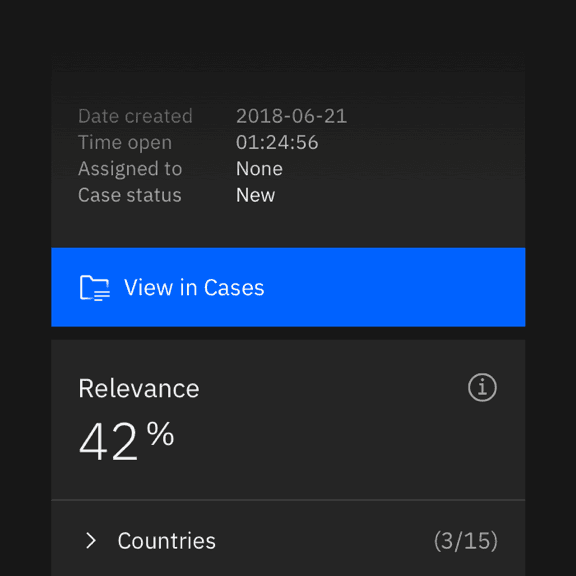

<PageDescription>

While app icons follow the same usage conventions as IBM UI icons when used in
product and web platforms, there are differences when they are used in native OS
applications and app store environments. Check the gallery of existing app icons
when designing a new one to avoid confusion from similarities with those icons
already in use.

</PageDescription>

<AnchorLinks>
  <AnchorLink>Product and web</AnchorLink>
  <AnchorLink>Native OS</AnchorLink>
  <AnchorLink>Gallery</AnchorLink>
</AnchorLinks>

## Product and web

Most often, app icons are needed within product and web platforms and
marketplaces. In these contexts, app icons should follow the same usage
conventions as [UI icons](/iconography/ui-icons/usage) for sizing, alignment,
and clearance.

<Caption>App icons in-product, IBM Security</Caption>

<Caption>Product catalog example</Caption>

### Type pairing

When pairing with typography, app icons should not appear to be a logo for any
product, service, or business unit. Please contact the brand team for logo
requests.

<DoDontRow>
<DoDont caption="You may use app icons with type to identify a product or service in the context of a product or marketplace.">

</DoDont>
<DoDont type="dont" caption="Don’t use any icon as a logo or with a brand type lockup for product headers, merchandise or events.">

</DoDont>
</DoDontRow>

### Monochromatic icons

In some limited use cases, you may need a single-color app icon. These icons are
generally used when the icon needs to appear on a color background or in
situations when the icon shouldn’t call attention to itself with color, such as
disabled states.

<Row className="mock-gallery">
<Column colMd={4} colLg={4}>

<Caption>Gray 10 monochromatic icon for background values 60–100</Caption>

</Column>
<Column colMd={4} colLg={4}>

<Caption>Gray 100 monochromatic icon for background values 10–50</Caption>

</Column>
</Row>

<DoDontRow>
<DoDont caption="Use monochromatic for app icons on color fields.">

</DoDont>
<DoDont type="dont" caption="Don’t apply color to an app icon on a color field.">

</DoDont>
</DoDontRow>

## Native OS

Icons for native applications appear within a variety of contexts, such as task
bars, user-customized wallpapers, notifications, system preferences, and more.
In most systems, a background container shape is needed to provide proper
contrast against the large variety of backgrounds. Check the requirements of the
operating system on which your product will be published to determine whether
your icon needs a container shape.

<ArtDirection>

</ArtDirection>

<ArtDirection>

</ArtDirection>

<DoDontRow>
<DoDont caption="In most cases, container shapes are needed for icons that appear within native operating systems." colLg={6}>

</DoDont>
<DoDont type="dont" caption="Don’t use container shapes within the product itself. The icon will be too small." colLg={6}>

</DoDont>
</DoDontRow>

### Android adaptive icons

Android app icons have user-customizable masks as container shapes and make use
of foreground and background layers to achieve parallax effects. You can
separate your icon's elements into the two layers to make use of this
interactive feature.

<GifPlayer color='dark'>

</GifPlayer>

## Gallery

When designing a new icon, it’s important to see how it compares to the
ecosystem of IBM app icons. All app icons should be unique to ensure that no two
apps will be get confused with one another.

<Row className="resource-card-group">
<Column colMd={4} colLg={4} noGutterSm>
    <ResourceCard
      subTitle="App Icon Master (.ai)"
      aspectRatio="2:1"
      href="https://github.ibm.com/carbon/app-icons/raw/master/App_Icon_Master.ai"
      actionIcon="download"
      >

  </ResourceCard>
</Column>
</Row>
