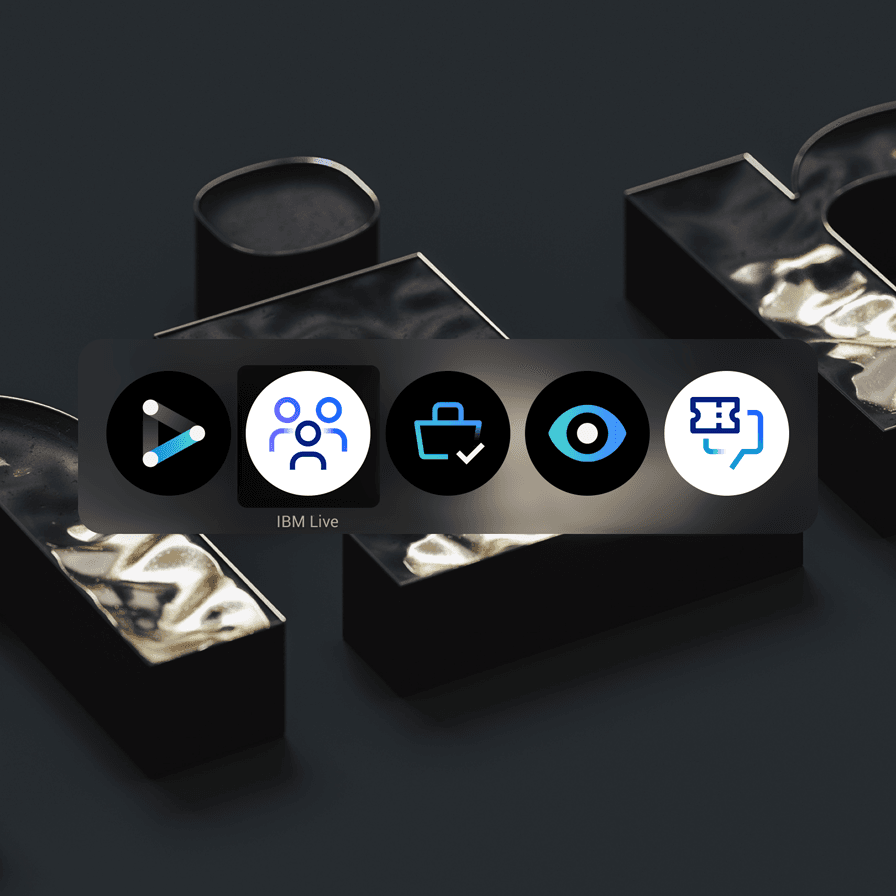
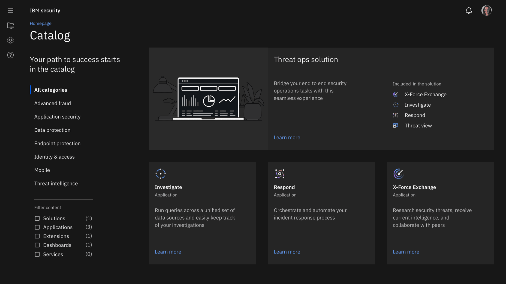
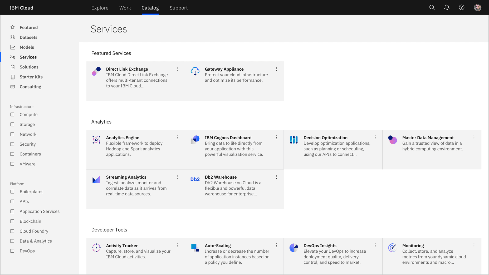
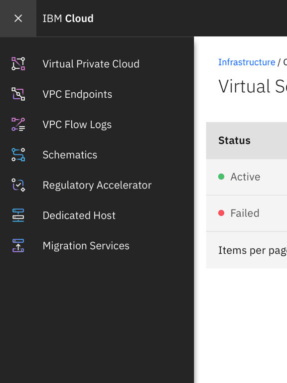
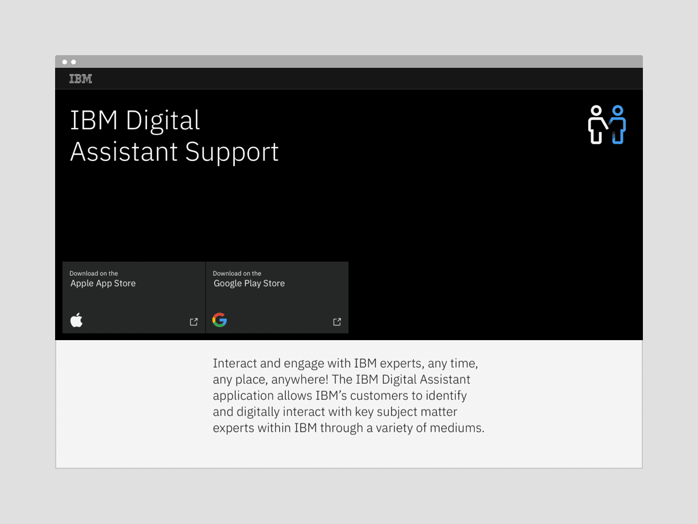

<PageDescription>

While app icons follow the same usage conventions as IBM UI icons when used in
product and web platforms, there are differences when they are used in native OS
applications and app store environments. Check the gallery of existing app icons
when designing a new one to avoid confusion from similarities with those icons
already in use.

</PageDescription>

<AnchorLinks>
  <AnchorLink>Sizing</AnchorLink>
  <AnchorLink>Alignment</AnchorLink>
  <AnchorLink>Containers</AnchorLink>
  <AnchorLink>Clearance</AnchorLink>
  <AnchorLink>Color</AnchorLink>
  <AnchorLink>Icon versus logo usage</AnchorLink>
  <AnchorLink>App icons in action</AnchorLink>
</AnchorLinks>

## Sizing

For productive use in product, app icons work best in four sizes: 16px, 20px, 24px, and 32px. For expressive use, 48px and above may be used. Use icons at their original sizes or scale at accepted increments.

<ArtDirection>

</ArtDirection>

| Icon size | Stroke width | Padding | Live area | Corner radius |
| --------- | ------------ | ------- | --------- | ------------- |
| 16px      | 1px          | 1px     | 14px      | 1px           |
| 20px      | 1.25px       | 1.25px  | 17.5px    | 1.25px        |
| 24px      | 1.5px        | 1.5px   | 21px      | 1.5px         |
| 32px      | 2px          | 2px     | 28px      | 2px           |
| 48px      | 3px          | 3px     | 42px      | 3px           |
| 64px      | 4px          | 4px     | 56px      | 4px           |
| 80px      | 5px          | 5px     | 70px      | 5px           |
| 96px      | 6px          | 6px     | 84px      | 6px           |

## Alignment

App icons are optically aligned to the center of the icon grid within the boundary box. Centering ensures all icons will be aligned correctly when exported and used side by side.

<ArtDirection>

</ArtDirection>

## Containers

App icons can be represented in a circular or rectangular container calculated based on the padding size.

<ArtDirection>

</ArtDirection>
<ArtDirection>

</ArtDirection>

<DoDontRow>
<DoDont caption="Keep icons at scale and center within the container.">

</DoDont>
<DoDont type="dont" caption="Don’t resize icons outside of accepted proportions.">

</DoDont>
</DoDontRow>
<DoDontRow>
<DoDont caption="Use accepted shapes: circle or square for containers.">

</DoDont>
<DoDont type="dont" caption="Don’t create new shapes for containers.">

</DoDont>
</DoDontRow>
<DoDontRow>
<DoDont caption="Always center align icons in their containers.">

</DoDont>
<DoDont type="dont" caption="Don’t crop icons with containers.">

</DoDont>
</DoDontRow>

### Containers for Native OS

Icons for native applications appear within a variety of contexts, such as task bars, user-customized wallpapers, notifications, system preferences, and more. In most systems, a background container shape is needed to provide proper contrast against the large variety of backgrounds. Check the requirements of the operating system on which your product will be published to determine whether your icon needs a container shape.

<DoDontRow>
<DoDont caption="In most cases, containers are needed for icons that appear within native operating systems." colLg="6">

</DoDont>
<DoDont type="dont" caption="Don’t use containers within the product itself. The icon will be too small." colLg="6">

</DoDont>
</DoDontRow>

#### Android adaptive icons

Android app icons have user-customizable masks as container shapes and make use of foreground and background layers to achieve parallax effects. You can separate your icon’s elements into the two layers to make use of this feature.

<GifPlayer color='dark'>

</GifPlayer>

## Clearance

When designing with app icons, all artwork should include minimum padding based on 1/4 of the scaled icon grid size. The padding can be increased by increments of 1/4 grid units.

<ArtDirection>

</ArtDirection>
<ArtDirection>

</ArtDirection>
<ArtDirection>

</ArtDirection>

<DoDontRow>
<DoDont caption="Follow the clearance rule to allow for legibility and an optimal touch experience.">

</DoDont>
<DoDont type="dont" caption="Don’t collapse the icon clearance area.">

</DoDont>
</DoDontRow>

## Color

App icons are created in four themes: dark theme, light theme, monochromatic dark theme, and monochromatic light theme. To ensure accessibility, use the color theme that corresponds with the icon’s background color. 

<ArtDirection>

</ArtDirection>

| Background color value | Icon theme                        |
| ---------------------- | --------------------------------- |
| White, 10–20           | Light theme                       |
| 30–50                  | Monochromatic light theme (black) |
| 50–80                  | Monochromatic dark theme (white)  |
| 90–100, black          | Dark theme                        |

<DoDontRow>
<DoDont caption="Use the correct icon theme for the background color.">

</DoDont>
<DoDont type="dont" caption="Don’t use the incorrect icon theme.">

</DoDont>
</DoDontRow>

### Monochromatic icons

In some limited use cases, you may need a single-color app icon. These icons are generally used when the icon needs to appear on a color background or in situations when the icon shouldn’t call attention to itself with color, such as disabled states.

<DoDontRow>
<DoDont caption="Use monochromatic theme icons on color fields.">

</DoDont>
<DoDont type="dont" caption="Don’t use dark or light theme icons on color fields.">

</DoDont>
</DoDontRow>

## Icon versus logo usage

App icons are not logos. It should be clear that any communication featuring an app icon is coming from one of our hero brands or the master IBM brand, never the product itself. Avoid using app icons in ways that convey the product as a brand.

<DoDontRow>
<DoDont caption="Separate the icon and product name so that they do not appear as a single asset." colLg="6">

</DoDont>
<DoDont type="dont" caption="Don’t create lockups with the icon and product name." colLg="6">

</DoDont>
</DoDontRow>
<DoDontRow>
<DoDont caption="App icons and logos may be used in the same composition with clear separation and hierarchy." colLg="6">

</DoDont>
<DoDont type="dont" caption="Don’t pair app icons with logos." colLg="6">

</DoDont>
</DoDontRow>
<DoDontRow>
<DoDont caption="App icons may be used with type to identify a product or service in the context of a product or marketplace." colLg="6">

</DoDont>
<DoDont type="dont" caption="Don’t use app icons in product headers." colLg="6">

</DoDont>
</DoDontRow>
<DoDontRow>
<DoDont caption="App icons may be used as hero graphics in marketing communications." colLg="6">

</DoDont>
<DoDont type="dont" caption="Don’t use app icons as a replacement for logos or as a sign-off for communications." colLg="6">

</DoDont>
</DoDontRow>
<DoDontRow>
<DoDont caption="App icons may be used as hero graphics in videos or presentation slides." colLg="6">

</DoDont>
<DoDont type="dont" caption="Don’t use app icons as intros or outros in videos or presentation slides." colLg="6">

</DoDont>
</DoDontRow>
<DoDontRow>
<DoDont caption="App icons may be used as hero graphics for merchandise." colLg="6">

</DoDont>
<DoDont type="dont" caption="Don’t use app icons as a replacement for logos or as a sign-off for merchandise." colLg="6">

</DoDont>
</DoDontRow>

## App icons in Action

<ImageGallery>
<ImageGalleryImage alt="App icons in-product, IBM Security" title="App icons in-product, IBM Security" col={12}>

</ImageGalleryImage>
<ImageGalleryImage alt="Product catalog example" title="Product catalog example" col={12}>

</ImageGalleryImage>
<ImageGalleryImage alt="App icons on iOS" title="App icons on iOS" col={8}>

</ImageGalleryImage>
<ImageGalleryImage alt="IBM Cloud product icons" title="IBM Cloud product icons" col={4}>

</ImageGalleryImage>
<ImageGalleryImage alt="App icon in iOS container" title="App icon in iOS container" col={4}>

</ImageGalleryImage>
<ImageGalleryImage alt="Mobile app support page" title="Mobile app support page" col={8}>

</ImageGalleryImage>
</ImageGallery>
