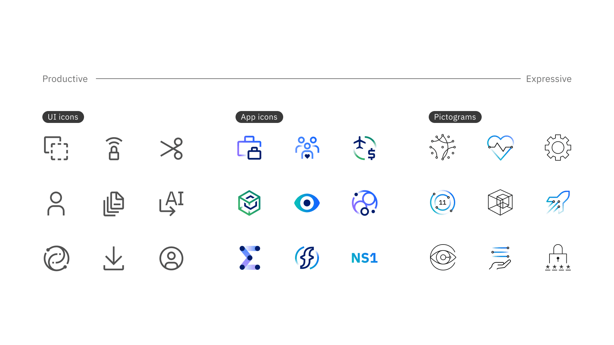
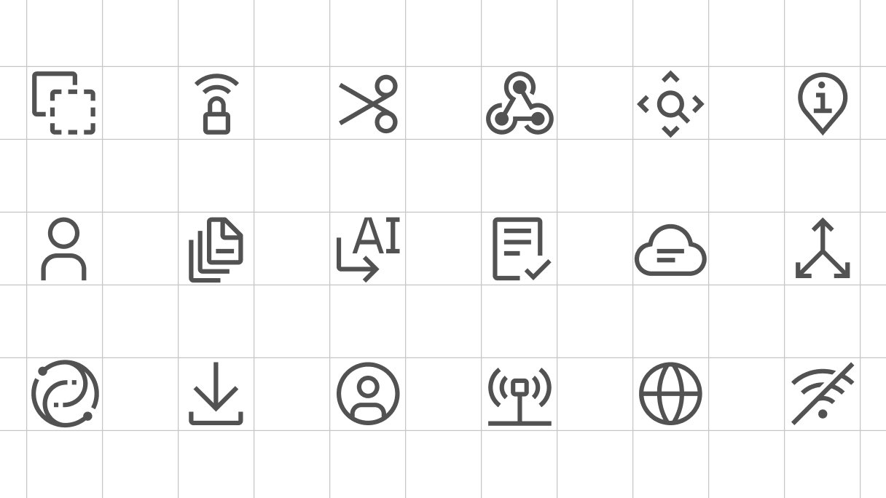
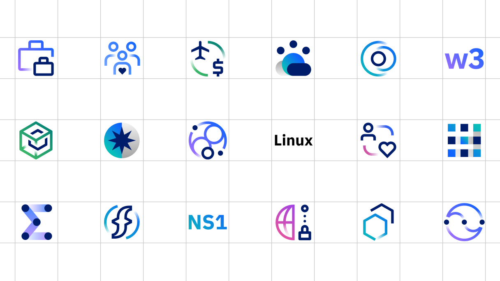
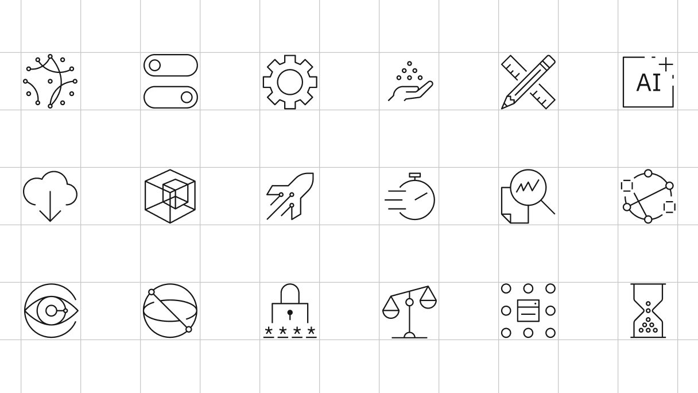

import { exampleSection } from '../../styles/Grid.module.scss';

import v281513611 from '../../videos/vimeo/281513611.mp4';
import p281513611 from '../../videos/vimeo/281513611.jpg';

<PageDescription>

Iconography consists of visual symbols that represent ideas, objects or narratives. Icons can convey messages at a glance, enable interactivity and simplify complex concepts. IBM has three iconography types for various use cases: UI icons, app icons and pictograms.

</PageDescription>

<AnchorLinks>
    <AnchorLink>The icon system</AnchorLink>
    <AnchorLink>Principles</AnchorLink>
    <AnchorLink>Icon types</AnchorLink>
</AnchorLinks>

<video src={v281513611} controls preload="metadata" style={{width: "100%"}} poster={p281513611} />

## The icon system

We use a versatile icon system that meets a broad range of needs, from functional UI elements to expressive visuals for editorial use. Each icon is crafted for visual consistency across digital and print, balancing clarity with character. This flexibility ensures the system supports both interface usability and storytelling, adapting in tone and detail to suit the medium.

## Principles

IBM has a distinct perspective on iconography, supported by a carefully crafted set of principles and best practices. Our icons are designed to be precise, clear, adaptable, inclusive and visually engaging, contributing to the best possible user experience. These principles reflect the core ideas that define the IBM approach to icon design and ensure effectiveness across sizes, contexts and platforms.

<Row className={exampleSection}>
<Column colMd={3} colLg={3}>

### Engineered

</Column>
<Column colMd={8} colLg={8}>

IBM icons should feel precise and balanced. Careful use of the grid, along with consistent shapes, angles and corner radius, creates a distinct aesthetic that reflects our thoughtful, systematic design approach.

</Column>
</Row>
<Row className={exampleSection}>
<Column colMd={3} colLg={3}>

### Clear

</Column>
<Column colMd={8} colLg={8}>

IBM icons should never feel overworked or overloaded with ideas. Only essential, purposeful elements should be used to clearly communicate the core concept. Keeping icons simple and focused enhances clarity and ensures they effectively guide users through complex actions or information.

</Column>
</Row>
<Row className={exampleSection}>
<Column colMd={3} colLg={3}>

### Nimble

</Column>
<Column colMd={8} colLg={8}>

IBM icons should convey a sense of ease, lightness and nimbleness. This approach to composition, spacing, weight and balance helps users quickly grasp complex information, making the icons more engaging and dynamic.

</Column>
</Row>
 

## Icon types

Given our scale and scope, no single icon style can capture the full range of concepts and functions that we need to represent. Specific use cases and contexts can require different styles of icons. Use pictograms to represent broad concepts or categories, UI icons for functional actions within interfaces, and app icons for product or tool identification; each serves a distinct purpose to ensure clarity and consistency across experiences. We’ve developed a clear perspective on the iconographic approaches that best reflect IBM’s identity, both in style and substance.

### UI icons

[IBM user interface (UI) icons](./ui-icons/design) represent ideas, objects or actions and appear throughout digital interfaces to guide users, enhance usability and save space. They’re commonly used in navigation menus, action buttons, forms, toolbars and media controls, helping users identify actions quickly. There may be instances when these small bold elements are useful in other materials to represent a product.

<Column colMd={8} colLg={8} noGutterSm>

</Column>

### App icons

[IBM app icons](./app-icons/design) are primarily used to identify a product in catalogs and within desktop or mobile environments. They follow the same usage conventions as IBM UI icons when used across product and web platforms, ensuring visual consistency. However, differences arise when they’re used in native OS applications and app store environments. They may be used for large-scale, expressive moments—such as when highlighting a specific product at an event or during a keynote presentation.

<Column colMd={8} colLg={8} noGutterSm>

</Column>

### Pictograms

[IBM pictograms](./pictograms/design) represent simplified, symbolic images used by IBM employees in most use cases, from presentations and marketing materials when speaking about a feature or function of a specific product, to web pages, merchandise, posters and signage. They also work well as large elements in graphic moments or subtle backgrounds.

Pictograms are offered in two types: productive and expressive. The standard productive pictograms feature simple linework and are the go-to pictogram type for most contexts, while the more dynamic expressive pictograms work best for select use cases where more visual impact is needed.

<Column colMd={8} colLg={8}>
<Tabs>
<Tab label='Productive'>

</Tab>
<Tab label='Expressive'>

</Tab>
</Tabs>
</Column>