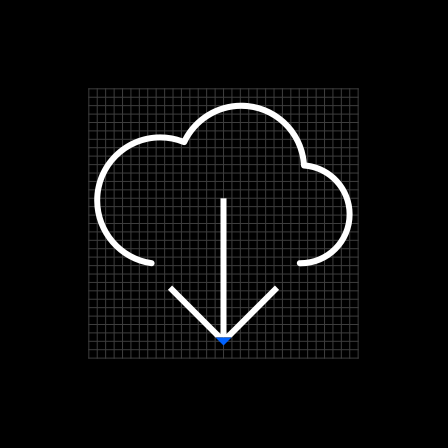
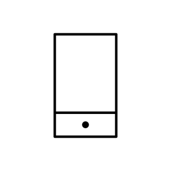
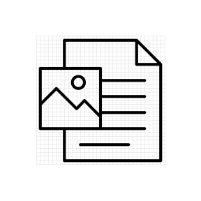
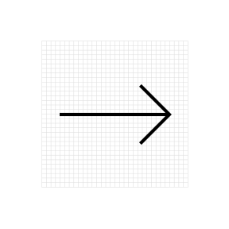
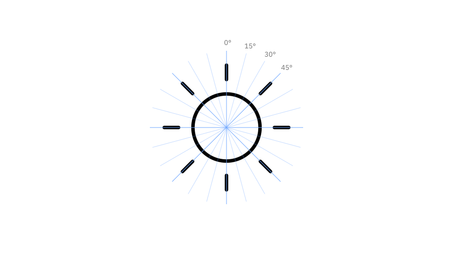
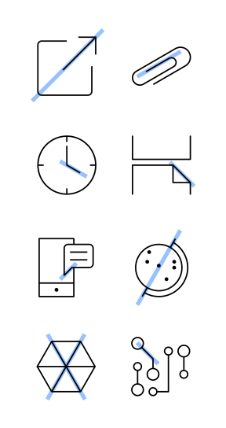
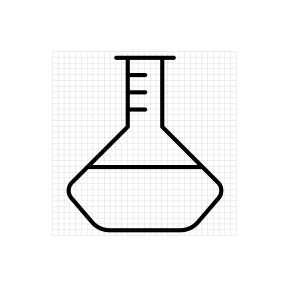
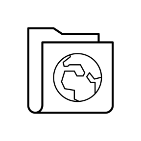
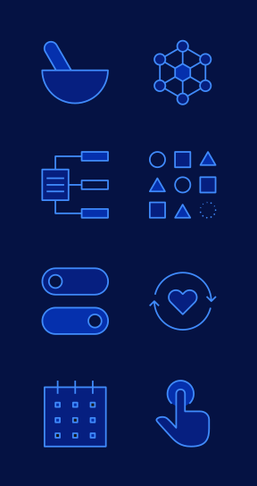
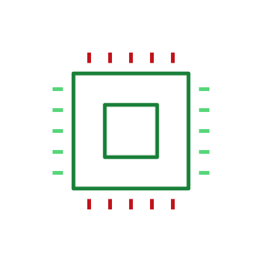

import { Bee32 } from '@carbon/icons-react';

<PageDescription>

IBM’s pictograms are visual symbols used to represent ideas, objects or
narratives. They can communicate messages at a glance, afford interactivity and
simplify complex ideas. Pictograms draw from details found in the IBM Plex®
typeface and work well in presentations and marketing communications.

</PageDescription>

<AnchorLinks>
  <AnchorLink>The foundation</AnchorLink>
  <AnchorLink>Style</AnchorLink>
  <AnchorLink>Color</AnchorLink>
</AnchorLinks>

## Resources

<Row className="resource-card-group">
<Column colMd={4} colLg={4} noGutterSm>
    <ResourceCard
      subTitle="IBM Design Language library"
      aspectRatio="2:1"
      href="sketch://add-library/cloud/nwqmk"
      >

  </ResourceCard>
</Column>
<Column colMd={4} colLg={4} noGutterSm>
    <ResourceCard
      subTitle="IBM pictogram master"
      aspectRatio="2:1"
      href="https://github.com/carbon-design-system/carbon/raw/master/packages/pictograms/master/pictogram-master.ai"
      actionIcon="download"
      >

  </ResourceCard>
</Column>
</Row>

## The foundation

Draw pictograms on the 32 x 32 master grid to maintain consistent positioning
and proportions across the IBM icon set. The Pictogram library is available in
the
[Design Kit](https://www.carbondesignsystem.com/getting-started/designers#get-the-kit)
and please see the [contribute page](/iconography/ui-icons/contribute/) to
contribute your pictogram to the IBM library and/or to receive design feedback.

<Video
  poster="/images/00_Foundation_1.svg"
  src="/videos/Pictograms_video_v2.mp4"
/>

### Base grid

IBM pictograms are drawn on a 32px x 32px base grid. Use the the grid lines as
your basic guideline to snap the stroked line-work of your design elements. We
recommend making adjustments along the way to make sure to have the right amount
of details that work at every size.

<ArtDirection>

</ArtDirection>

<DoDontRow>
<DoDont caption="Do align center point of stroke to fall on the line of the grid.">

</DoDont>
<DoDont type="dont" caption="Don’t place strokes and points in space between grid lines unless necessary.">

</DoDont>
</DoDontRow>

### Padding

The grid contains 1px padding. This ensures pictograms will retain their desired
appearance when exported. Only extend artwork into the padding for additional
visual weight when necessary.

<Row>
<Column colLg={12}>
<ArtDirection>

</ArtDirection>
</Column>
</Row>

<DoDontRow>
<DoDont caption="Do treat padding as a safe zone for overflowing strokes.">

</DoDont>
<DoDont type="dont" caption="Don’t place design elements on the outer edges of the safe zone.">

</DoDont>
</DoDontRow>

## Style

The stylistic conventions of IBM’s pictograms deliver meaningful metaphor
through simple line art. Each symbol is intentionally designed to harmoniously
pair with [IBM Plex™](https://www.ibm.com/plex/). The juxtaposition of smooth
curves and sharp angles is central to IBM Design.

<Row className="mock-gallery">
<Column colMd={6} colLg={6}>
<ArtDirection>

</ArtDirection>
<Caption>Rounded exteriors with 90&deg; interiors</Caption>

</Column>
<Column colMd={6} colLg={6}>
<ArtDirection>

</ArtDirection>
</Column>
</Row>
<Row className="mock-gallery">
<Column colMd={6} colLg={6}>
<ArtDirection>

</ArtDirection>
<Caption>Slab characteristics and square terminals</Caption>

</Column>
<Column colMd={6} colLg={6}>
<ArtDirection>

</ArtDirection>
</Column>
</Row>
<Row className="mock-gallery">
<Column colMd={6} colLg={6}>
<ArtDirection>

</ArtDirection>

<Caption>Distinctive points on tips</Caption>

</Column>
<Column colMd={6} colLg={6}>
<ArtDirection>

</ArtDirection>
</Column>
</Row>
<Row className="mock-gallery">
<Column colMd={6} colLg={6}>
<ArtDirection>

</ArtDirection>
<Caption>Rounded caps for obvious metaphors and objects</Caption>

</Column>
<Column colMd={6} colLg={6}>
<ArtDirection>

</ArtDirection>
</Column>
</Row>

### Strokes

One pictogram should not look heavier or lighter than other pictograms of the
same size. Maintain the same visual weight by using a 0.72px stroke when
designing all pictograms.

<Row>
<Column colLg={12}>
<ArtDirection>

</ArtDirection>
</Column>
</Row>

<DoDontRow>
<DoDont caption="Do use 0.72px for all stroke weights.">

</DoDont>
<DoDont type="dont" caption="Don’t use inconsistent stroke weights">

</DoDont>
</DoDontRow>

### Perspective

IBM Design pictograms are designed and ready to use. Never distort pictograms
and be sure to avoid dimensional representations. Use more objective vantage
points that are straight-on or profile views.

<DoDontRow>
<DoDont caption="Do depict objects straight on.">

</DoDont>
<DoDont type="dont" caption="Don’t create pictograms with perspective.">

</DoDont>
</DoDontRow>

### Corners

Use the default rounded corner setting for all shapes and a consistent corner
radius of 2px for round shapes. The 2px radius can be increased by a multiple of
two when necessary to make the pictogram’s metaphor clear. Use an additional
radius to make the metaphor reflect the real form of the object.

<Row>
<Column colLg={12}>
<ArtDirection>

</ArtDirection>
</Column>
</Row>

<DoDontRow>
<DoDont caption="Do always use rounded corners as a default stroke style.">

</DoDont>
<DoDont type="dont" caption="Don’t use sharp exterior corners unless a metaphor depends on it.">

</DoDont>
</DoDontRow>

<DoDontRow>
<DoDont caption="Do square the tips of arrows.">

</DoDont>
<DoDont type="dont" caption="Don’t use rounded arrow tips.">

</DoDont>
</DoDontRow>

### Angles

Use 45° angles for even anti-aliasing whenever that angle is logical or use
increments of 15° for all other angles. You can create harmony across the
pictogram set by making angles sit on the same increments.

<Row>
<Column colLg={12}>
<ArtDirection>

</ArtDirection>
</Column>
</Row>

<Row>
<Column colLg={12}>
<ArtDirection>

</ArtDirection>
</Column>
</Row>

<DoDontRow>
<DoDont caption="Do use multiple of 15° or an angle that best represents the metaphor when necessary.">

</DoDont>
<DoDont type="dont" caption="Don’t use 45° angles exclusively for all icons. It won't work.">

</DoDont>
</DoDontRow>

### Details

Pictograms are more illustrative than UI icons but should not be overly
detailed. Communicate your ideas with only the most essential elements. Avoid
using perspective and unnecessary visual metaphors.

<DoDontRow>
<DoDont caption="Do use thoughtful metaphors. Create depth through flat layers and essential details.">

</DoDont>
</DoDontRow>

<DoDontRow>
<DoDont type="dont" caption="Don’t use cliches or perspective views. Small details will not scale down well.">

</DoDont>
<DoDont type="dont" caption="Don’t combine pictograms or elements unless contributing a new pictogram">

</DoDont>
</DoDontRow>

<DoDontRow>
<DoDont type="dont" caption="Don’t duplicate or manipulate artwork to create effects.">

</DoDont>
<DoDont type="dont" caption="Don’t scale other pictograms to combine or use different stroke weights">

</DoDont>
</DoDontRow>

## Color

Pictograms are illustrative and can be used at larger scales, therefore a wider
variety of visual styles are acceptable. They are by default a solid,
monochromatic color but may be treated in four distinct styles: black or white,
monochromatic color, tinted or shaded color, and gradient. Regardless of style,
pictograms need to pass the same color contrast ratio as typography (4.5:1). For
more information on color, see [IBM Design Color Usage](/color/).

<Row>
<Column colLg={12}>
<ArtDirection>

</ArtDirection>
<Caption>The grid system and guidance allows for diverse solutions.</Caption>

</Column>
</Row>

<Row>
<Column colLg={12}>
<ArtDirection>

</ArtDirection>
<Caption>Pictograms can be treated in four distinct styles.</Caption>

</Column>
</Row>
<Row>

<Column colLg={12}>
<ArtDirection>

</ArtDirection>

<Caption>Use background color values of 70–100 to achieve luminosity.</Caption>

</Column>
</Row>

<Row>
  <Column colMd={4} colLg={4} noGutterSm>
    <ResourceCard subTitle="Color" aspectRatio="2:1" href="/color/" actionIcon="arrowRight">
      <Bee32 />
    </ResourceCard>
  </Column>
</Row>

### Backgrounds

Pictograms on backgrounds must always pass color contrast requirements. When
pairing pictograms with backgrounds, follow color family rules to ensure that
the pictogram does not clash with or blend into the background. Dark background
colors should range between values 70–100 while light backgrounds should not
exceed values 10–20.

<Row>
<Column colLg={12}>
<ArtDirection>

</ArtDirection>
</Column>
</Row>

<DoDontRow>
<DoDont caption="Do follow the 5-step color rule and only match tones from the same color family or use grayscale backgrounds.">

</DoDont>
<DoDont caption="Do follow gradient rules when placing them on backgrounds.">

</DoDont>
</DoDontRow>

<DoDontRow>
<DoDont type="dont" caption="Don’t place dark tones on dark backgrounds.">

</DoDont>
<DoDont type="dont" caption="Don’t place light tones on light backgrounds.">

</DoDont>
</DoDontRow>

<DoDontRow>
<DoDont type="dont" caption="Don’t use gradient picto’s on backgrounds that are not 70 and above or 20 and below.">

</DoDont>
<DoDont type="dont" caption="Don’t place gradient picto’s on gradient backgrounds.">

</DoDont>
</DoDontRow>

### Gradients

Use combinations within any of the acceptable 2-Color families when blending
gradients. Values between 30 and 60 are used to create vibrant gradients that
work well against both dark and light backgrounds. For more contrast or
subtlety, blend between darker or lighter colors. Do not blend between colors
that are more than two steps away from each other. For more information on
color, see the gradient sections on IBM Design Color Usage.

<Row>
<Column colLg={12}>

</Column>
</Row>
<Row>
<Column colLg={12}>
<ArtDirection>

</ArtDirection>
</Column>
</Row>
<Row>
<Column colLg={12}>
<ArtDirection>

</ArtDirection>
</Column>
</Row>

<DoDontRow>
<DoDont caption="Do follow color gradient usage and only use accepted gradient color families.">

</DoDont>
<DoDont caption="Do use 45 degree angle when applying gradients.">

</DoDont>
</DoDontRow>

<DoDontRow>
<DoDont type="dont" caption="Don’t mix colors that are outside of the accepted 2-Color Families.">

</DoDont>
<DoDont type="dont" caption="Don’t blend between colors that are more than 2 steps away, i.e. Blue 60 to Teal 20.">

</DoDont>
<DoDont type="dont" caption="Don’t create gradients with more than two colors.">

</DoDont>
</DoDontRow>

<DoDontRow>
<DoDont type="dont" caption="Don’t use radial gradients.">

</DoDont>
<DoDont type="dont" caption="Don’t add glow effects to pictograms">

</DoDont>
</DoDontRow>

<Row>
  <Column colMd={4} colLg={4} noGutterSm>
    <ResourceCard
      subTitle="Color: Gradients"
      aspectRatio="2:1"
      href="/color#gradients"
      actionIcon="arrowRight">
      <Bee32 />
    </ResourceCard>
  </Column>
</Row>

### Tints and Shades

Adding color by tinting or shading your pictograms can give a deeper feeling of
expression and tonality. One to three-color families can be used when coloring
pictograms, though single-color families are recommended. On light backgrounds
(white or value 10) use tints 1 to 2 steps up from the background color to fill
in pictograms. On dark backgrounds (black or value 100) use shades 1 to 2 steps
down from the background color. Be sure to follow color contrast rules for
pictogram strokes so the original metaphor can communicate properly.

<Row>
<Column colLg={12}>
<ArtDirection>

</ArtDirection>
</Column>
</Row>
<Row>
<Column colLg={12}>
<ArtDirection>

</ArtDirection>
</Column>
</Row>

<DoDontRow>
<DoDont caption="Do follow the 5 step rule when using 1, 2, or 3-color families to color and shade pictograms.">

</DoDont>
</DoDontRow>

<DoDontRow>
<DoDont type="dont" caption="Don’t use tones that are not accessibleor alert colors.">

</DoDont>
<DoDont type="dont" caption="Don’t use colors outside approved color families or tones outside the 5 step rule.">

</DoDont>
<DoDont type="dont" caption="Don’t use more than 3-color families when shading pictograms.">

</DoDont>
</DoDontRow>

<DoDontRow>
<DoDont type="dont" caption="Don’t shade or mix colors outside the accepted color families.">

</DoDont>
<DoDont type="dont" caption="Don’t resort to realism when coloring and shading pictograms.">

</DoDont>
</DoDontRow>

<Row>
  <Column colMd={4} colLg={4} noGutterSm>
    <ResourceCard
      subTitle="Color: Families"
      aspectRatio="2:1"
      href="/color/#color-families">
      <Bee32 />
    </ResourceCard>
  </Column>
</Row>
