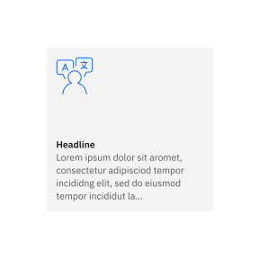
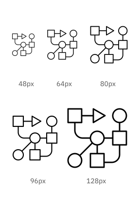
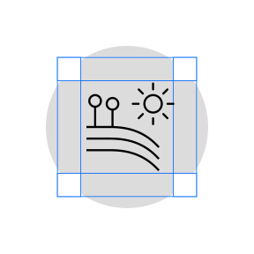

import { Bee } from '@carbon/icons-react';
import * as styles from './custom-table.module.scss'

<PageDescription>

Use pictograms to communicate at a glance, offer interactivity or simplify complex ideas. This page shows examples for many use cases, such as websites, product UIs, signage, events and merchandise. When used appropriately, they become an elegant addition to the IBM experience.

</PageDescription>

<AnchorLinks>
  <AnchorLink>Productive versus expressive</AnchorLink>
  <AnchorLink>Sizing</AnchorLink>
  <AnchorLink>Alignment</AnchorLink>
  <AnchorLink>Containers</AnchorLink>
  <AnchorLink>Clearance</AnchorLink>
  <AnchorLink>Color</AnchorLink>
  <AnchorLink>Pictograms as illustrations</AnchorLink>
  <AnchorLink>Pictograms in action</AnchorLink>
</AnchorLinks>

## Productive versus expressive

Productive and expressive pictograms are two distinct types of artwork that work best in different contexts. Productive pictograms are the go-to pictogram type for most contexts; they work across a variety of scales and environments, whether physical or digital. They’re illustrative and simple, enabling one or many to be used to convey complex ideas.

Expressive pictograms represent a more dynamic option to the standard pictogram, using gradients, layering and transparency to build a sense of depth and movement in the artwork. Due to their visual complexity, expressive pictograms should be used selectively and only in scenarios that call for a graphic with a strong presence.

<Tabs>
<Tab label="Productive">

<ArtDirection>

</ArtDirection>

<Row>
<Column colMd={8} colLg={12} noGutterSm>
  

    <table className="page-table">
      <thead>
        <tr>
          <th className={styles.tableHeader}>Productive pictograms in context</th>
          <th className={styles.tableHeader}></th>
        </tr>
      </thead>
      <tbody>
        <tr>
          <td>Use productive pictograms to deliver clear, consistent visual messaging across interfaces and environments. Their simplicity and adaptability make them ideal for most applications.</td>
          <td/>
        </tr>
      </tbody>
    </table>

</Column>
</Row>

</Tab>
<Tab label="Expressive">

<ArtDirection>

</ArtDirection>

</Tab>
</Tabs>

<DoDontRow>
<DoDont caption="Treat pictograms as illustations with sufficient sizing.">

</DoDont>
<DoDont type="dont" caption="Don’t use pictograms as a replacement for UI icons. It’s not their purpose.">

</DoDont>
</DoDontRow>

<DoDontRow>
<DoDont caption="Use expressive pictograms as large, bold graphics.">

</DoDont>
<DoDont type="dont" caption="Don’t overuse expressive pictograms. They should be used sparingly.">

</DoDont>
</DoDontRow>

<DoDontRow>
<DoDont type="dont" caption="Don’t use productive pictograms as logos or in a lockup for product headers, merchandise or events.">

</DoDont>
<DoDont type="dont" caption="Don’t use expressive pictograms as logos or in a lockup for product headers, merchandise or events.">

</DoDont>
</DoDontRow>

## Sizing

Pictograms are used in a range of sizes, the minimum being 48px. The maximum size may vary based on the application. Use pictograms at their original sizes or scale at accepted increments.

<Tabs>
<Tab label="Productive">

<ArtDirection>

</ArtDirection>

</Tab>
<Tab label="Expressive">

<ArtDirection>

</ArtDirection>

</Tab>
</Tabs>

## Alignment

Pictograms are optically aligned to the center of the icon grid within the boundary box. 
Centering ensures that all pictograms will be aligned correctly when exported and used side by side.

<ArtDirection>

</ArtDirection>

## Containers

Pictograms can be represented in a circular or rectangular container calculated based on the padding size.

<ArtDirection>

</ArtDirection>

<DoDontRow>
<DoDont caption="Keep pictograms at scale and optically centered in the container whenever possible.">

</DoDont>
<DoDont type="dont" caption="Don’t resize pictograms outside of accepted proportions.">

</DoDont>
</DoDontRow>

<DoDontRow>
<DoDont caption="Do use accepted shapes—circle or square—for containers.">

</DoDont>
<DoDont type="dont" caption="Don’t create new shapes for containers.">

</DoDont>
</DoDontRow>

<DoDontRow>
<DoDont caption="Always optically center align pictograms in their containers.">

</DoDont>
<DoDont type="dont" caption="Don’t crop pictograms in the container.">

</DoDont>
</DoDontRow>

## Clearance

When designing with pictograms, all artwork should include minimum padding based on 1/4 of the scaled grid size. 
The padding can be increased by increments of 1/4 grid units.

<ArtDirection>

</ArtDirection>

<DoDontRow>
<DoDont caption="Follow the clearance rule to allow for legibility and touch.">

</DoDont>
<DoDont type="dont" caption="Don’t collapse the pictogram clearance area.">

</DoDont>
</DoDontRow>

## Color

Pictograms on backgrounds must always pass color contrast requirements. When pairing pictograms with backgrounds, follow color-family rules to ensure that the pictogram doesn’t clash with or blend into the background. Dark background colors should range between values 70–100 while light backgrounds should not exceed values 10–20.

<ArtDirection>

</ArtDirection>

<DoDontRow>
<DoDont caption="Follow the 5-step color rule and only match tones from the same color family or use grayscale backgrounds.">

</DoDont>
<DoDont caption="Follow gradient rules when placing them on backgrounds.">

</DoDont>
</DoDontRow>

<DoDontRow>
<DoDont type="dont" caption="Don’t place dark tones on dark backgrounds.">

</DoDont>
<DoDont type="dont" caption="Don’t place light tones on light backgrounds.">

</DoDont>
</DoDontRow>

<DoDontRow>
<DoDont type="dont" caption="Don’t place gradient pictograms on backgrounds that are not 80 and above or 20 and below.">

</DoDont>
<DoDont type="dont" caption="Don’t place gradient pictograms on gradient backgrounds.">

</DoDont>
</DoDontRow>

### Expressive pictogram color

Expressive pictograms have four color themes: dark, light, monochromatic dark  and monochromatic light. To ensure accessibility, use the color theme that corresponds with the pictogram’s background color.

<ArtDirection>

</ArtDirection>

| Background color value | Pictogram theme             |
| ---------------------- | --------------------------- |
| White, 10–20           | Light                       |
| 30–50                  | Monochromatic light (Black) |
| 50–70                  | Monochromatic dark (White)  |
| 80–100, Black          | Dark                        |

<DoDontRow>
<DoDont caption="Use dark-theme pictograms on dark backgrounds and light-theme pictograms on light backgrounds.">

</DoDont>
<DoDont type="dont" caption="Don’t use light-theme pictograms on dark backgrounds or dark-theme pictograms on light backgrounds.">

</DoDont>
</DoDontRow>
<DoDontRow>
<DoDont type="dont" caption="Don’t place expressive pictograms on backgrounds between 30 and 70. Use the monochromatic version for this case.">

</DoDont>
<DoDont type="dont" caption="Don’t place expressive pictograms on gradient backgrounds.">

</DoDont>
</DoDontRow>

## Pictograms as illustrations

Pictograms can serve as a base for more complex illustrations, helping speed up design and ensure consistency. They can also be scaled for workspace environments, such as wall art, bringing the brand into the environment in a bold, cohesive way.

<ImageGallery>

<ImageGalleryImage alt="pictogram on sign" title="Pictogram on sign" col={8}>

</ImageGalleryImage>

<ImageGalleryImage alt="pictogram on sign" title="Pictogram on sign" col={4}>

</ImageGalleryImage>

</ImageGallery>

## Pictograms in action

<ImageGallery>

<ImageGalleryImage alt="" title="Pictogram on sign" col={12}>

</ImageGalleryImage>

<ImageGalleryImage alt="" title="Expressive pictogram on web" col={4}>

</ImageGalleryImage>

<ImageGalleryImage alt="" title="Pictogram on hat" col={8}>

</ImageGalleryImage>

<ImageGalleryImage alt="" title="Expressive pictogram on poster" col={8}>

</ImageGalleryImage>

<ImageGalleryImage alt="" title="Pictogram on card" col={4}>

</ImageGalleryImage>

<ImageGalleryImage alt="" title="Pictogram on wallpaper" col={12}>

</ImageGalleryImage>

<ImageGalleryImage alt="" title="Pictogram on wallpaper" col={4}>

</ImageGalleryImage>

<ImageGalleryImage alt="" title="Pictogram on wallpaper" col={8}>

</ImageGalleryImage>

</ImageGallery>
