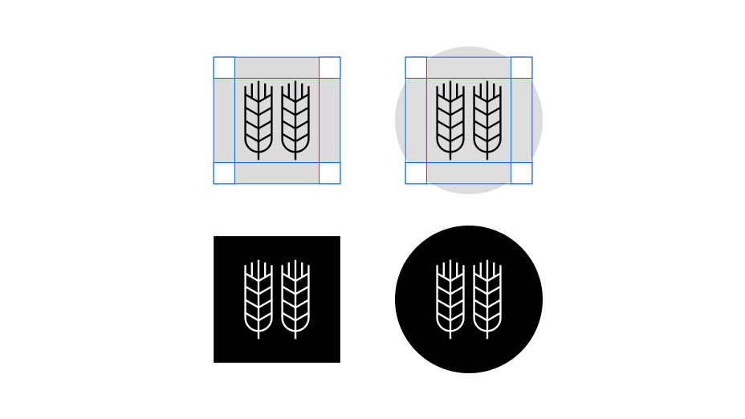
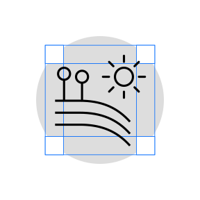
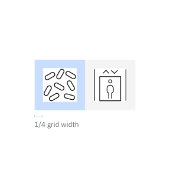
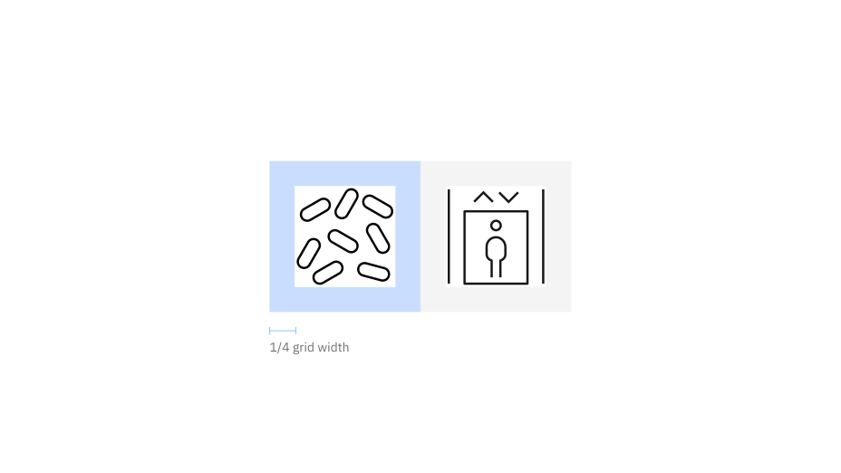
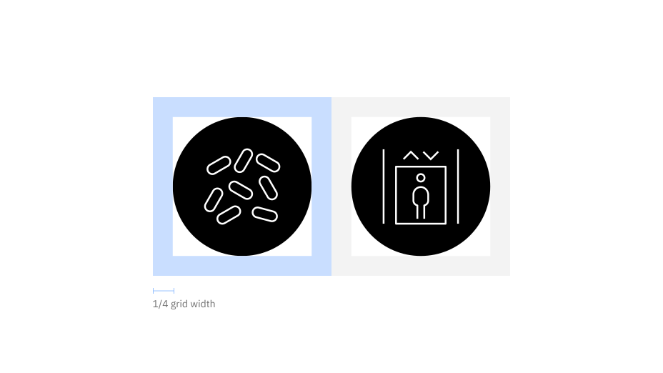
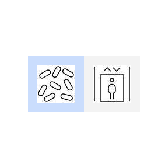
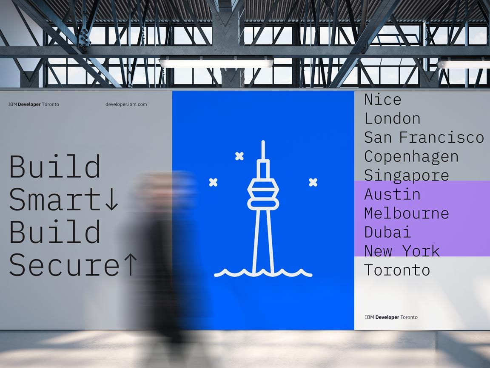
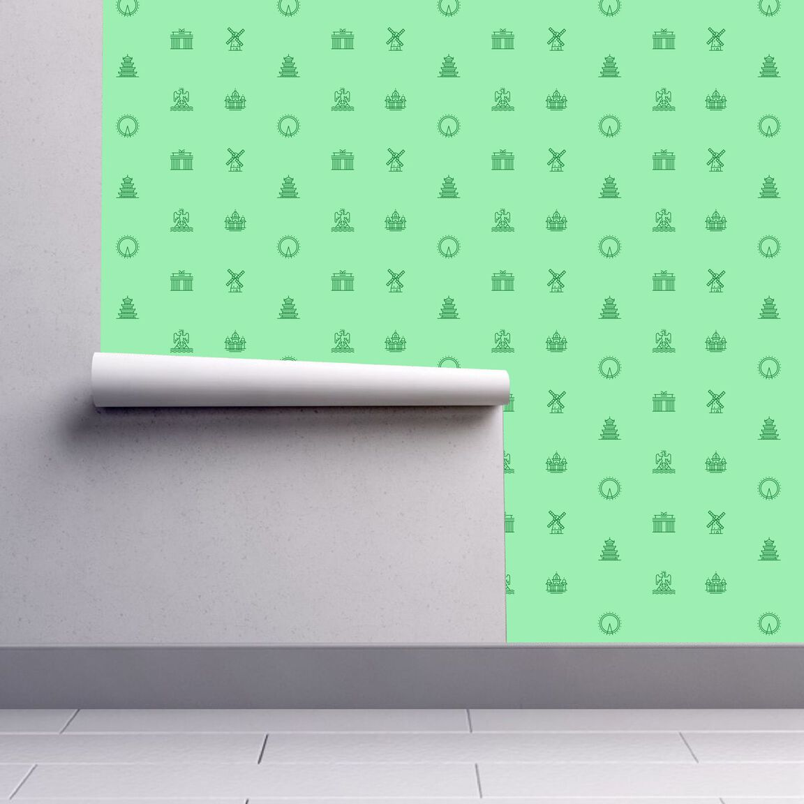

import { Bee32 } from '@carbon/icons-react';
import { noGutterSm } from '../../../styles/Grid.module.scss';

<PageDescription>

Use pictograms to communicate in a glance, offer interactivity or simplify
complex ideas. Shown here are examples for many use cases such as websites,
product UI’s, signage, events and merchandise. When used appropriately, they
become an elegant addition to the IBM experience.

</PageDescription>

<AnchorLinks>
  <AnchorLink>Sizing</AnchorLink>
  <AnchorLink>Alignment</AnchorLink>
  <AnchorLink>Containers</AnchorLink>
  <AnchorLink>Clearance</AnchorLink>
  <AnchorLink>Color</AnchorLink>
  <AnchorLink>Expressive pictograms</AnchorLink>
  <AnchorLink>Pictograms in Action</AnchorLink>
</AnchorLinks>

## Sizing

Pictograms are used in a range of sizes, the minimum being 48px while the
maximum size may vary based on application. Use pictograms at their original
sizes or scale at accepted increments. You may need to adjust the stroke weight
accordingly to accommodate larger scales. For more information on scaling and
accessibility, see the section on mini units on the 2X Grid page.

<ArtDirection>

</ArtDirection>

| Icon size | Stroke width | Padding | Live area | Corner Radius |
| --------- | ------------ | ------- | --------- | ------------- |
| 48px      | 1.08px       | 1.5px   | 48px      | 3px           |
| 64px      | 1.44px       | 2px     | 64px      | 4px           |
| 80px      | 1.80px       | 2.5px   | 80px      | 5px           |
| 96px      | 2.16px       | 3px     | 96px      | 6px           |
| 112px     | 2.52px       | 3.5px   | 112px     | 7px           |

<Caption>
  There is no set maximum to pictogram sizes. As you scale pictograms to larger
  sizes you may want to alter stroke weight to accommodate accessibility or
  environmental factors.
</Caption>

<DoDontRow>
<DoDont caption="Do treat pictograms as illustations with proper sizing.">

</DoDont>
<DoDont type="dont" caption="Don’t use pictograms as a replacement for UI icons, that is not their purpose.">

</DoDont>
</DoDontRow>

## Alignment

Pictograms are optically aligned to the center of the icon grid within the
boundary box. Centering ensures all pictograms will be aligned correctly when
exported and used side by side.

<ArtDirection>

</ArtDirection>

## Containers

Pictograms can be represented in a circular or rectangular container calculated
based on the padding size.

<ArtDirection>

</ArtDirection>

<ArtDirection>

</ArtDirection>

<DoDontRow>
<DoDont caption="Do keep pictograms at scale and optically center in container when necessary.">

</DoDont>
<DoDont type="dont" caption="Don’t resize pictograms outside of accepted proportions.">

</DoDont>
</DoDontRow>

<DoDontRow>
<DoDont caption="Do use accepted shapes: circle or square for containers.">

</DoDont>
<DoDont type="dont" caption="Don’t create new shapes for containers.">

</DoDont>
</DoDontRow>

<DoDontRow>
<DoDont caption="Do always optically center align pictograms in their containers.">

</DoDont>
<DoDont type="dont" caption="Don’t crop pictograms in container.">

</DoDont>
</DoDontRow>

## Clearance

When designing with pictograms, all artwork should include minimum padding based
on 1/4 of the scaled grid size. The padding can be increased by increments of
1/4 grid units.

<ArtDirection>

</ArtDirection>

<Caption>
  Padding and spacing rules apply whether using pictograms with or without containers.
</Caption>

<ArtDirection>

</ArtDirection>

<Caption>Padding starts at the edge of the container shape.</Caption>

<ArtDirection>

</ArtDirection>

<Caption>Padding is the same for both circle and square containers.</Caption>

<DoDontRow>
<DoDont caption="Do follow the clearance rule to allow for legibility and touch.">

</DoDont>
<DoDont type="dont" caption="Don’t collapse the pictogram clearance area.">

</DoDont>
</DoDontRow>

## Color

Pictograms on backgrounds must always pass color contrast requirements. When
pairing pictograms with backgrounds, follow color family rules to ensure that
the pictogram does not clash with or blend into the background. Dark background
colors should range between values 70–100 while light backgrounds should not
exceed values 10–20.

<ArtDirection>

</ArtDirection>

<DoDontRow>
<DoDont caption="Do follow the 5-step color rule and only match tones from the same color family or use grayscale backgrounds.">

</DoDont>
<DoDont caption="Do follow gradient rules when placing them on backgrounds.">

</DoDont>
</DoDontRow>

<DoDontRow>
<DoDont type="dont" caption="Don’t place dark tones on dark backgrounds.">

</DoDont>
<DoDont type="dont" caption="Don’t place light tones on light backgrounds.">

</DoDont>
</DoDontRow>

<DoDontRow>
<DoDont type="dont" caption="Don’t use gradient picto’s on backgrounds that are not 70 and above or 20 and below.">

</DoDont>
<DoDont type="dont" caption="Don’t place gradient picto’s on gradient backgrounds.">

</DoDont>
</DoDontRow>

## Expressive pictograms

Pictograms on backgrounds must always pass color contrast requirements. When pairing pictograms with backgrounds, follow color family rules to ensure that the pictogram does not clash with or blend into the background. Dark background colors should range between values 70–100 while light backgrounds should not exceed values 10–20.

<ArtDirection>

</ArtDirection>

<Row>
<Column colMd={4} colLg={4}>

</Column>
<Column colMd={4} colLg={8}>

</Column>
</Row>

<DoDontRow>
<DoDont type="dont" caption="Don’t overuse expressive pictograms. They should be used sparingly as hero graphics.">

</DoDont>
<DoDont type="dont" caption="Don’t use any pictogram as a logo or in a lockup for product headers, merchandise or events.">

</DoDont>
</DoDontRow>

### Color

App icons are created in four themes: dark theme, light theme, monochromatic dark theme, and monochromatic light theme. To ensure accessibility, use the color theme that corresponds with the icon’s background color.

<ArtDirection>

</ArtDirection>

| Background color value | Icon theme                        |
| ---------------------- | --------------------------------- |
| White, 10–20           | Light theme                       |
| 30–50                  | Monochromatic light theme (black) |
| 50–80                  | Monochromatic dark theme (white)  |
| 90–100, black          | Dark theme                        |

<DoDontRow>
<DoDont caption="Use the correct icon theme for the background color.">

</DoDont>
<DoDont type="dont" caption="Don’t use the incorrect icon theme.">

</DoDont>
</DoDontRow>

## Pictograms in Action

<ImageGallery>

<ImageGalleryImage alt="pictogram on sign" title="Pictogram on sign" col={8}>

</ImageGalleryImage>

<ImageGalleryImage alt="pictogram as logo" title="Pictogram as logo" col={4}>

</ImageGalleryImage>

<ImageGalleryImage alt="pictogram on hat" title="Pictogram on hat" col={4}>

</ImageGalleryImage>

<ImageGalleryImage alt="pictogram on poster" title="Pictogram on poster" col={8}>

</ImageGalleryImage>

<ImageGalleryImage alt="pictogram on card" title="Pictogram on card" col={8}>

</ImageGalleryImage>

<ImageGalleryImage alt="pictogram on wallpaper" title="Pictogram on wallpaper" col={4}>

</ImageGalleryImage>

</ImageGallery>
