<PageDescription>

As visual symbols, IBM user interface (UI) icons represent ideas, objects or actions. They can communicate messages at a glance, afford interactivity and draw attention to important information. Based on details from the IBM Plex® typeface, they work well at small sizes.

</PageDescription>

<AnchorLinks>
  <AnchorLink>Foundation</AnchorLink>
  <AnchorLink>Style</AnchorLink>
  <AnchorLink>Strokes</AnchorLink>
  <AnchorLink>Perspective</AnchorLink>
  <AnchorLink>Corners</AnchorLink>
  <AnchorLink>Angles</AnchorLink>
</AnchorLinks>

## Resources

<Row className="resource-card-group">
<Column colMd={4} colLg={4} noGutterSm>
<ResourceCard
  subTitle="UI icon: Starter file"
  actionIcon="download"
  href="https://github.ibm.com/brand/ui-icons/raw/master/ui-icon-starter-file.ai"
>

</ResourceCard>
</Column>
<Column colMd={4} colLg={4} noGutterSm>
<ResourceCard
  subTitle="UI icon: Figma library"
  href="https://www.figma.com/file/J5c0d85dSJn9JnBhSYYLmD/Icons---IBM-Design-Language?type=design&node-id=129%3A2&mode=design&t=IgykKAObMrV05Sic-1"
  actionIcon="launch"
>

</ResourceCard>
</Column>
<Column colMd={4} colLg={4} noGutterSm>
<ResourceCard
  subTitle="UI icon: Carbon library"
  href="https://github.com/carbon-design-system/carbon/tree/master/packages/icons/src/svg"
>

</ResourceCard>
</Column>
</Row>

## Foundation

The square grid is the underlying fabric of all IBM icons and used as the foundation to determine line thickness, proportion, shape and positioning across the entire set of icons. To ensure a unified approach, the grid helps guide design decisions and allows flexibility in creating the appropriate shape needed to communicate the right idea.

<Video src="./assets/design/01-idl-iconography-ui-icons-design.mp4" />

### Base grid

IBM icons are drawn on a pixel-based grid of 32px x 32px and scaled down linearly to different sizes. Use the grid as your basic guideline to snap the artwork in place. We recommend fine-tuning adjustments for the shape you’re trying to achieve during creation.

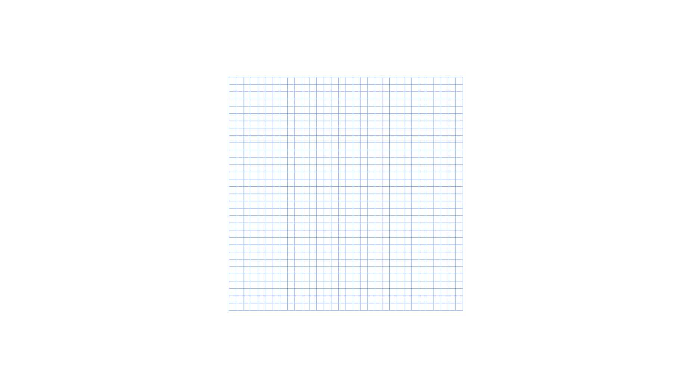

<DoDontRow>
<DoDont colMd={6} colLg={6} caption="Align design elements to the pixel grid.">

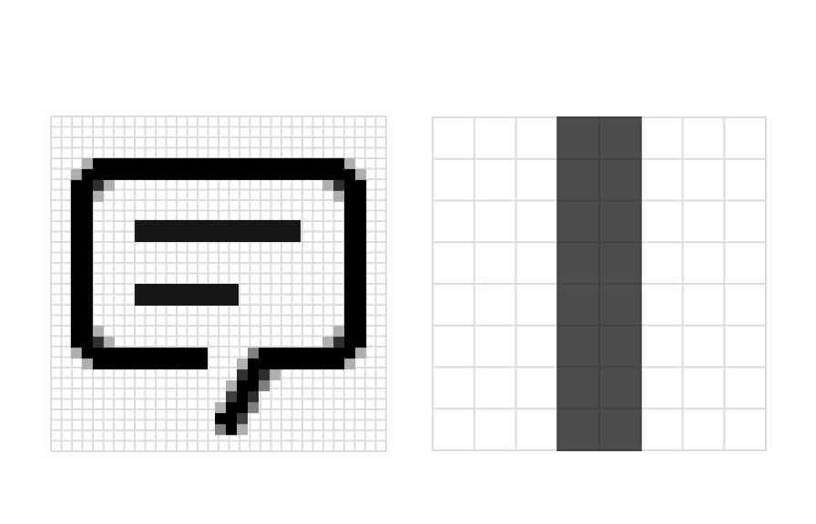

</DoDont>
<Column colMd={6} colLg={6}>
<DoDont type="dont" colMd={12} colLg={12} noGutterSm>

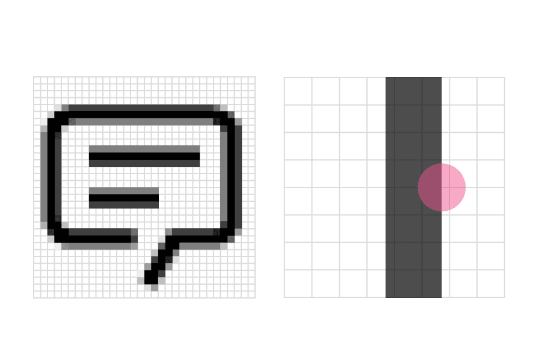

</DoDont>
<Caption>Avoid random decimal points in the <em>x</em> and <em>y</em> coordinates.</Caption>
</Column>
</DoDontRow>
<DoDontRow>
<DoDont colMd={6} colLg={6} caption="Place arrow points on the grid.">

</DoDont>
<DoDont colMd={6} colLg={6} type="dont" caption="Avoid placing arrow points off the grid.">

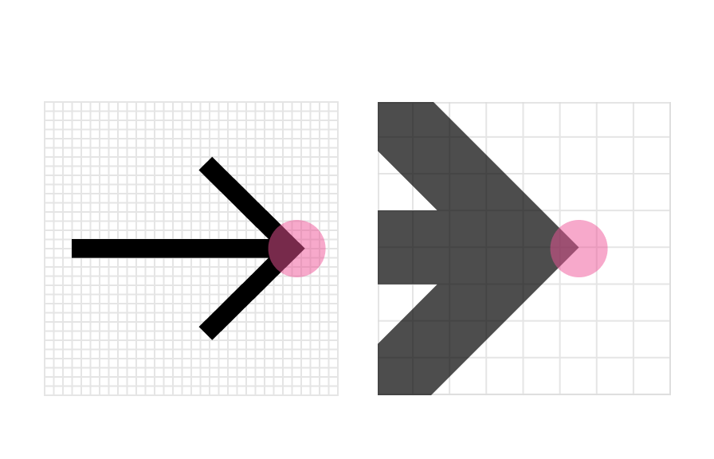

</DoDont>
</DoDontRow>
<DoDontRow>
<DoDont colMd={6} colLg={6} caption="Place at least one point of the angled stroke caps on the grid, if possible.">

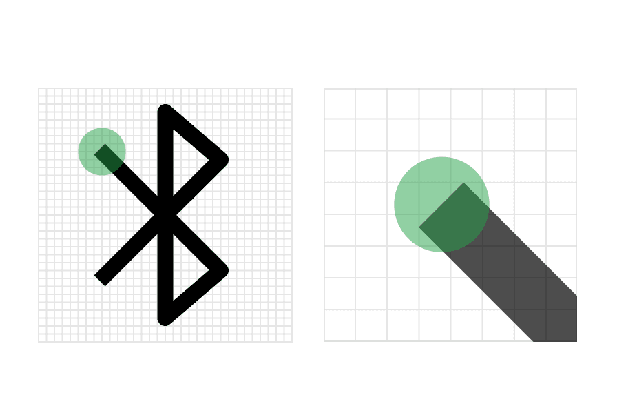

</DoDont>
<DoDont colMd={6} colLg={6} type="dont" caption="Avoid placing all angled stroke caps off the grid.">

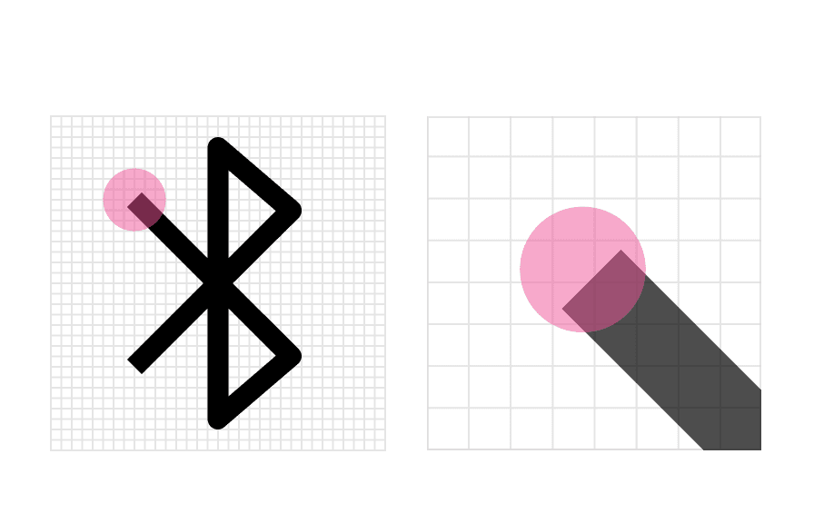

</DoDont>
</DoDontRow>

### Padding

The grid contains 2px padding. This ensures icons will retain their desired scale and surrounding white space when exported. Only extend artwork into the padding for additional visual weight or for specific details required to define the shape’s content, meaning or character.

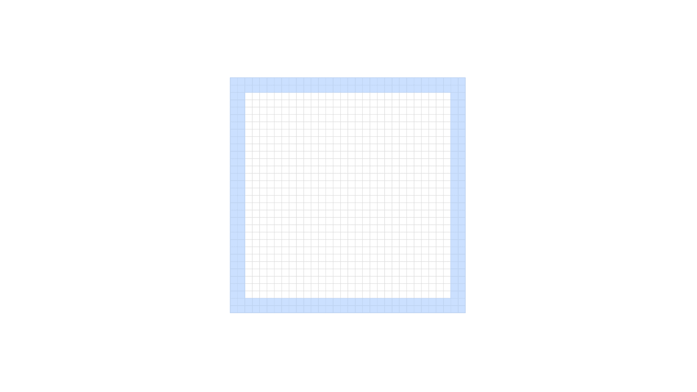

<DoDontRow>
<DoDont caption="The icon should remain inside the padding.">

</DoDont>
<DoDont type="dont" caption="Avoid placing part of the icon in the padding area.">

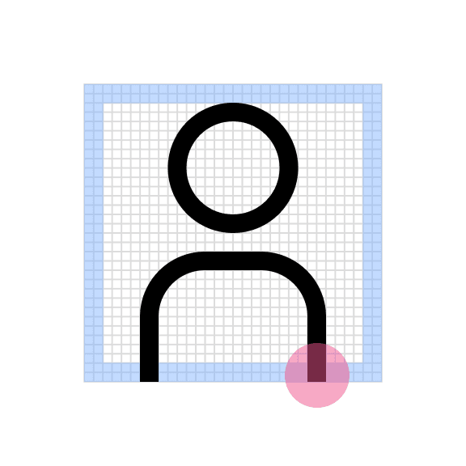

</DoDont>
</DoDontRow>
<DoDontRow>
<DoDont caption="Place the icon against the padding if additional space is needed.">

</DoDont>
<DoDont type="dont" caption="Don’t crowd the design elements—make sure there’s enough space between them.">

</DoDont>
</DoDontRow>

### Key shapes

Key shapes give you consistent sizes for basic shapes or proportions across the icon set. These key lines makes it easier to create a visually stable foundation and helps to establish relationships between the similarly proportioned icons and the objects or ideas they represent.

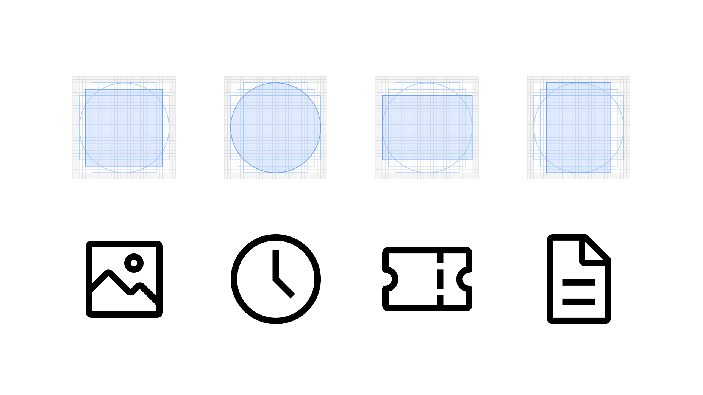

<DoDontRow>
<DoDont caption="Use the key shapes that best demonstrate the proportion of the metaphor.">

</DoDont>
<DoDont type="dont" caption="Don’t use key shapes that don’t reflect the real form of the metaphor.">

</DoDont>
</DoDontRow>
<DoDontRow>
<DoDont caption="Extend content beyond the key shapes for proper form if needed.">

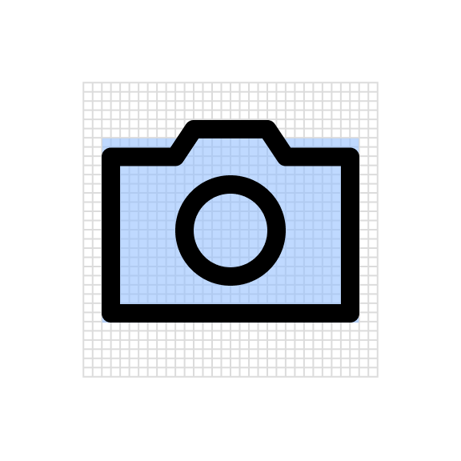

</DoDont>
<DoDont type="dont" caption="Don’t force the content to fit inside the key shapes.">

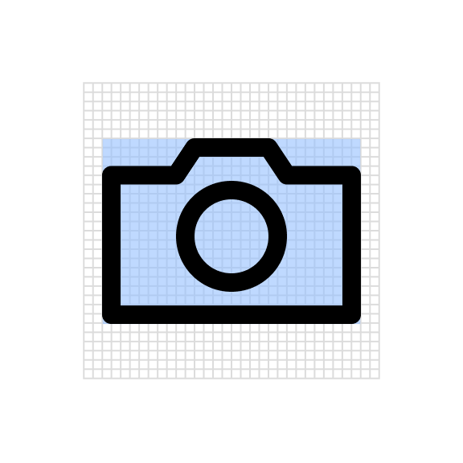

</DoDont>
</DoDontRow>

## Style

The stylistic conventions of IBM icons create a meaningful bond with our typeface, [IBM Plex®](../../typography/typeface). Each icon shares distinct details and characteristics with the letterforms. The following video demonstrates some of these relationships.

<Video src="./assets/design/19-idl-iconography-ui-icons-design.mp4" />

<Row className="mock-gallery">
<Column colMd={6} colLg={6}>

<Caption>Rounded exteriors with 90° interiors</Caption>

</Column>
<Column colMd={6} colLg={6}>

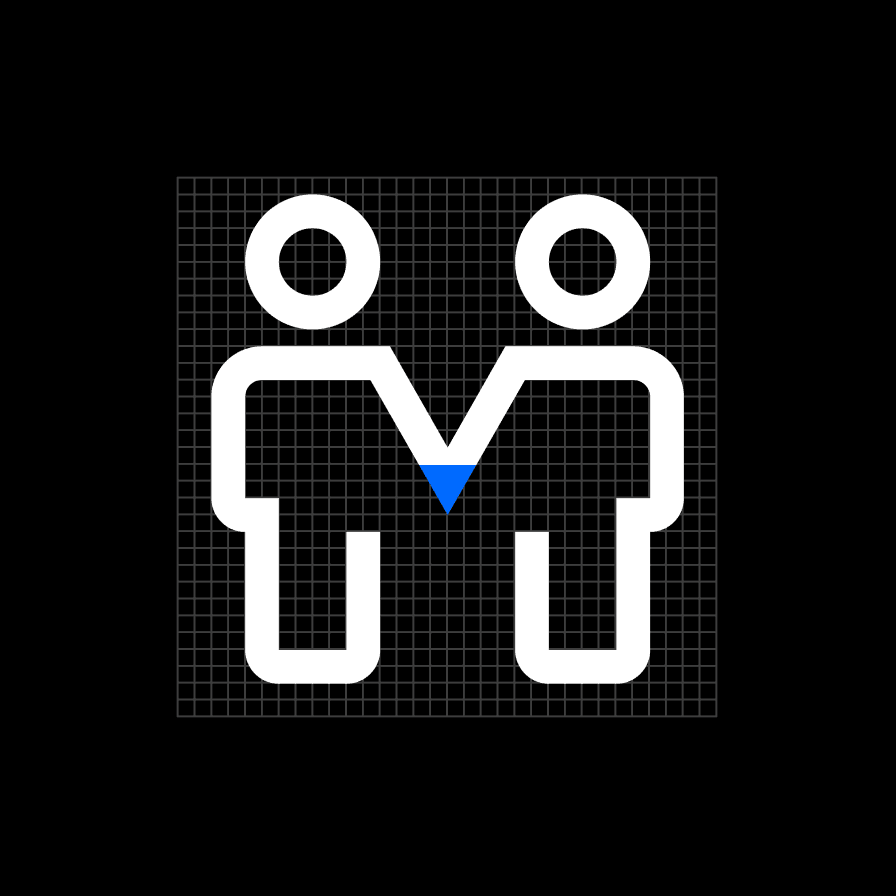

<Caption>Distinctive point on tips</Caption>

</Column>
</Row>
<Row className="mock-gallery">
<Column colMd={6} colLg={6}>

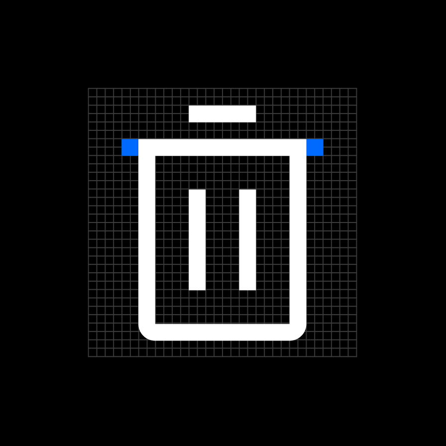

<Caption>Slab characteristics</Caption>

</Column>
<Column colMd={6} colLg={6}>

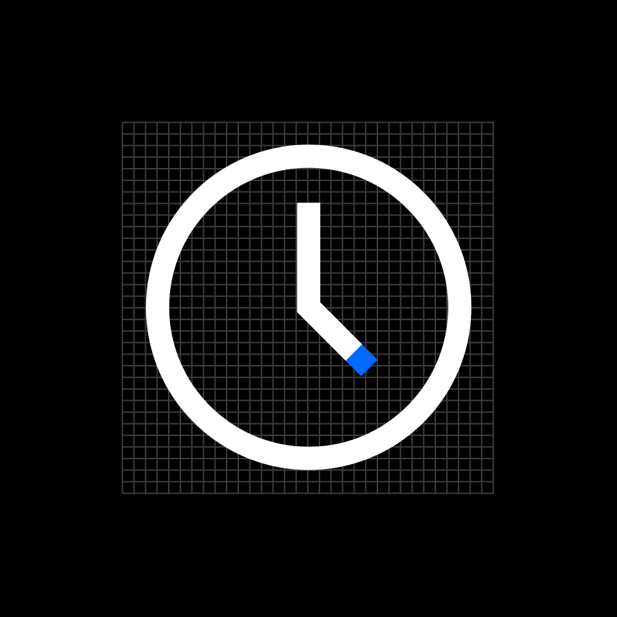

<Caption>Square caps</Caption>

</Column>
</Row>

## Strokes

All icons of the same size should have a consistent visual weight; no icon should appear heavier or lighter than another. A single icon shouldn't contain a mix of different stroke weights. Use a 2px stroke for all icons to maintain uniformity. Exceptions may be made only for more complex icons or those with unusually dense line work.

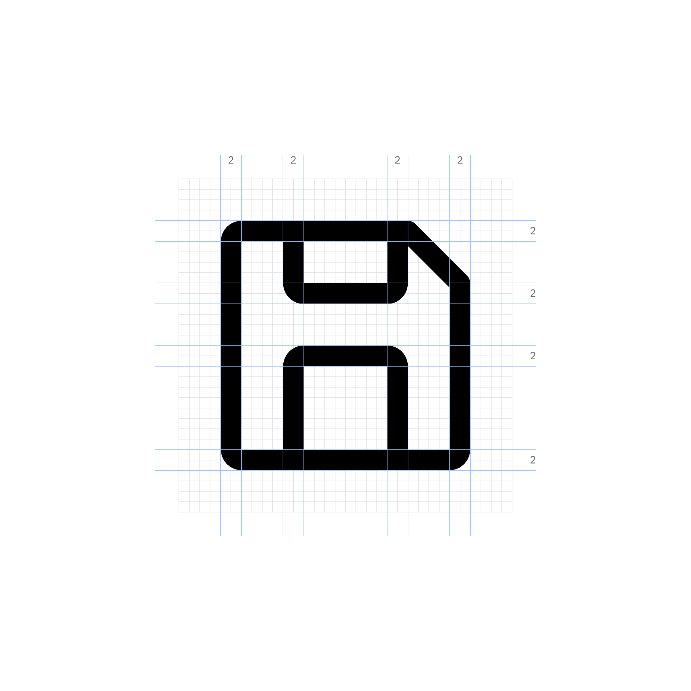

<DoDontRow>
<DoDont caption="Be consistent and use 2px stoke weights.">

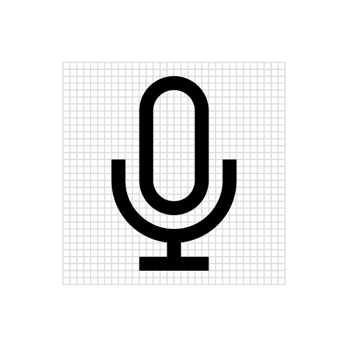

</DoDont>
<DoDont type="dont" caption="Don’t use inconsistent stroke weights. They’ll feel unbalanced and look like a mistake.">

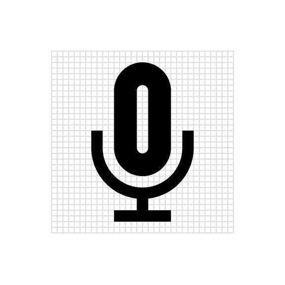

</DoDont>
</DoDontRow>

## Perspective

When creating a new icon for the library, avoid dimensional or perspective-based representations. Use objective angles, such as straight-on or profile views to ensure consistency.

<DoDontRow>
<DoDont caption="Use a straight-on angle for the icon.">

</DoDont>
<DoDont type="dont" caption="Don’t create a dimensional icon.">

</DoDont>
</DoDontRow>

## Corners

Use a consistent corner radius of 2px for rounded shapes. The 2px radius can be increased by a multiple of two when necessary to make the icon’s metaphor understandable or object shape clearly defined. Use an additional radius to make the metaphor reflect the real form of the object.

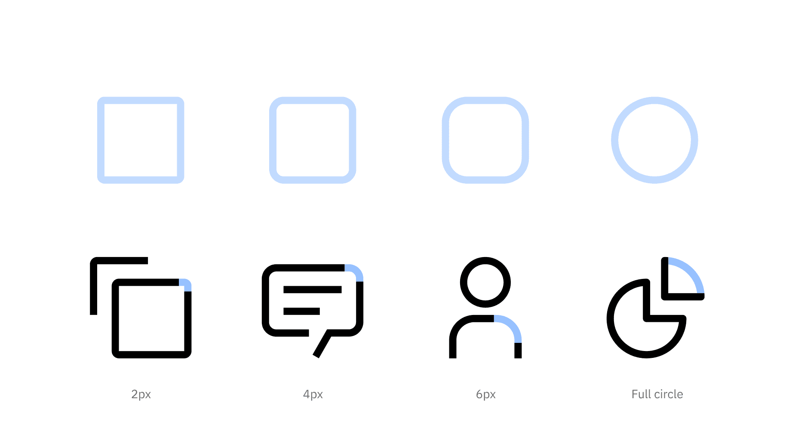

<DoDontRow>
<DoDont caption="Use squared corners when needed to reflect the real form of the metaphor.">

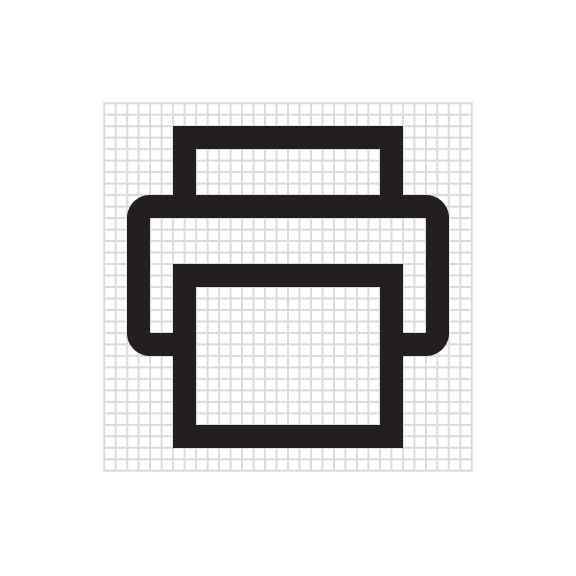

</DoDont>
<DoDont type="dont" caption="Don’t force rounded corners if they don’t work for your metaphor.">

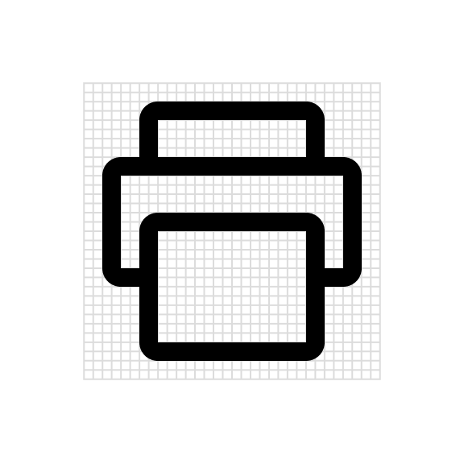

</DoDont>
</DoDontRow>
<DoDontRow>
<DoDont caption="Use square arrow tips.">

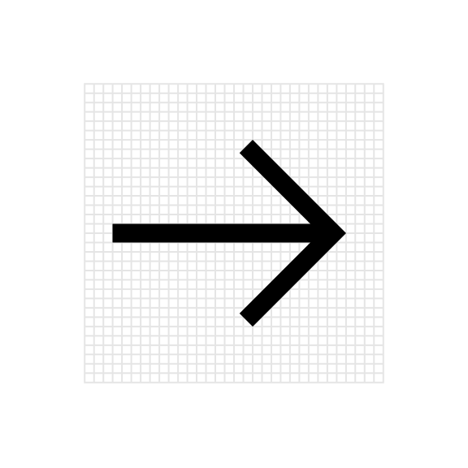

</DoDont>
<DoDont type="dont" caption="Don’t use rounded arrow tips.">

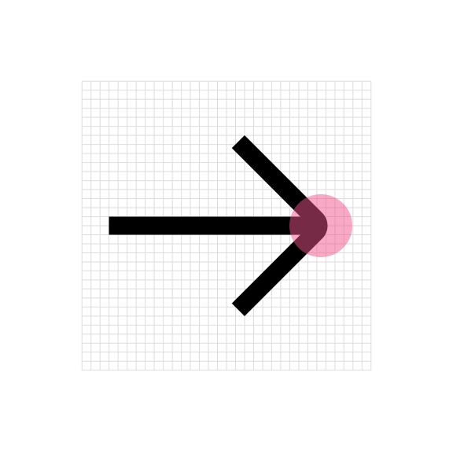

</DoDont>
</DoDontRow>

## Angles

Use 45° angles for even anti-aliasing. Use increments of 15° whenever possible for other needed angles to best depict the shape you’re creating for your metaphor. You can create harmony across the icon set by consistently making angles sit on the same increments.

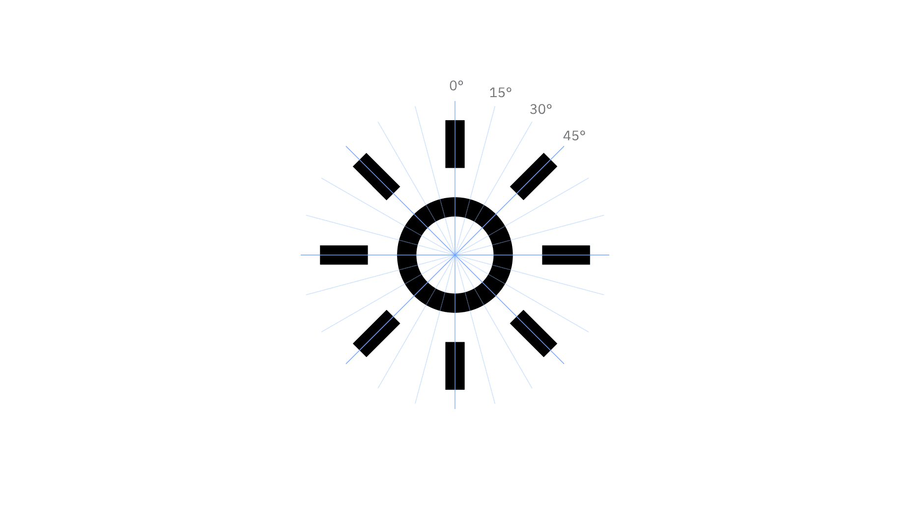

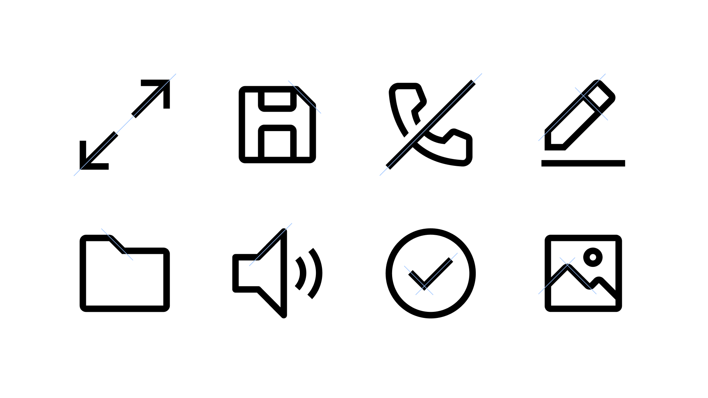

<DoDontRow>
<DoDont caption="Use multiples of 15° or an angle that best represents the metaphor when necessary.">

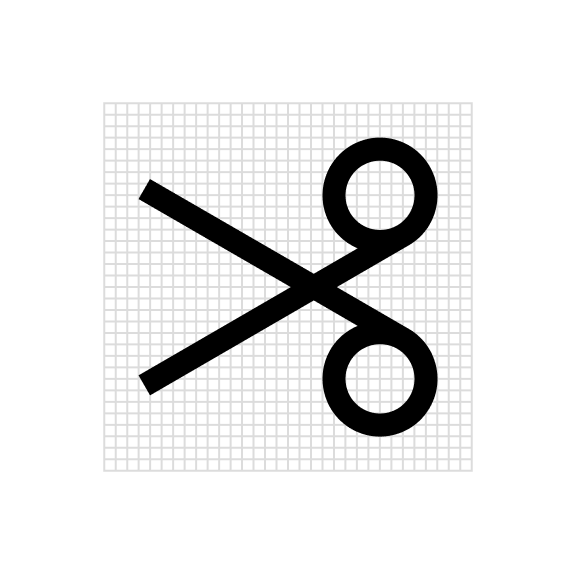

</DoDont>
<DoDont type="dont" caption="Don’t use 45° angles exclusively for all icons. It won’t work.">

</DoDont>
</DoDontRow>
