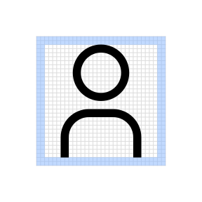
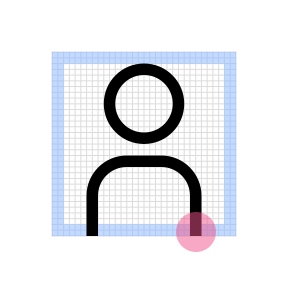
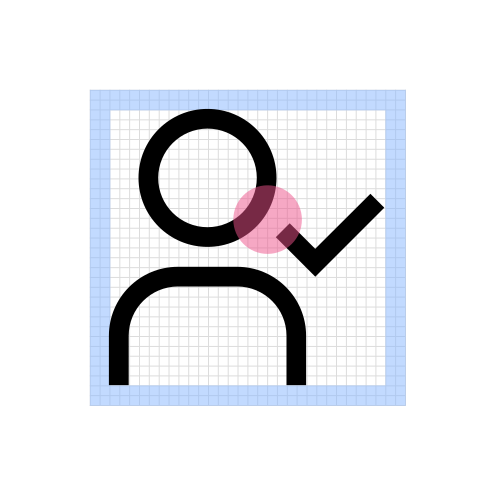
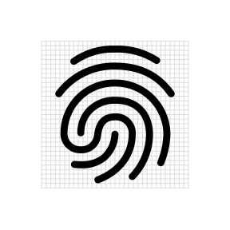
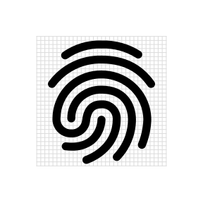
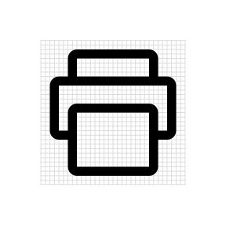
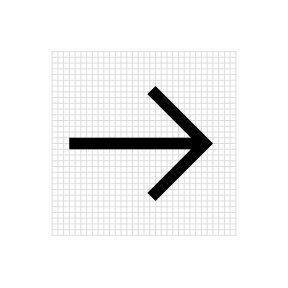
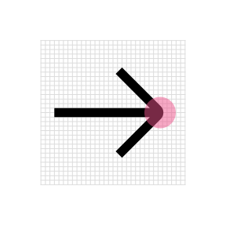
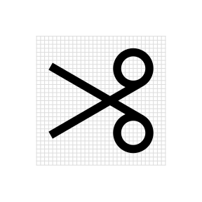
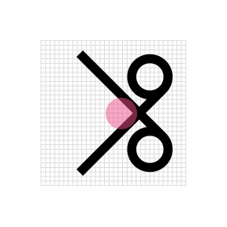

<PageDescription>

As visual symbols, IBM user interface icons represent ideas, objects or actions. They can communicate messages at a glance, afford interactivity, and draw attention to important information. Based on details from the IBM Plex® typeface, they work well at small sizes.

</PageDescription>

<AnchorLinks>
  <AnchorLink>The foundation</AnchorLink>
  <AnchorLink>Style</AnchorLink>
  <AnchorLink>Strokes</AnchorLink>
  <AnchorLink>Perspective</AnchorLink>
  <AnchorLink>Corners</AnchorLink>
  <AnchorLink>Angles</AnchorLink>
</AnchorLinks>

<Video vimeoId="281513611" />

## Resources

<Row className="resource-card-group">
<Column colMd={4} colLg={4} noGutterSm>
    <ResourceCard
      subTitle="IBM Design Language Sketch kit"
      aspectRatio="2:1"
      href="sketch://add-library/cloud/nwqmk"
      >

  </ResourceCard>
</Column>
<Column colMd={4} colLg={4} noGutterSm>
    <ResourceCard
      subTitle="IBM Icons GitHub repo"
      aspectRatio="2:1"
      href="https://github.com/carbon-design-system/carbon/tree/master/packages/icons"
      >

  </ResourceCard>
</Column>
</Row>

## The foundation

The square grid is the underlying fabric of all IBM icons and is used as the foundation to determine line thickness, proportion, shape and positioning across the entire set of icons. The grid helps guide design decisions, which will ensure a unified approach but more importantly allows flexibility in creating the appropriate shape needed to communicate the right idea.

<Video src="/videos/icon-grid.mp4" poster="/images/icon-grid-poster.svg" />

### Base grid

IBM icons are drawn on a pixel based grid of 32px x 32px and scaled down linearly to different sizes. Use the the grid as your basic guideline to snap the artwork in place. We recommend making fine tuned adjustments during your process to support the best shape and details for the shape you’re trying to achieve.
three icons explaining clearance

<ArtDirection>

</ArtDirection>
<Row>
<Column colMd={4} colLg={4}>
<DoDontExample type="do">

</DoDontExample>
</Column>
<Column colMd={4} colLg={4}>
<DoDontExample type="dont">

</DoDontExample>
</Column>
</Row>

<Row>
<Column colMd={4} colLg={4}>
<DoDontExample type="do" caption="Align design elements to the pixel grid.">

</DoDontExample>
</Column>
<Column colMd={4} colLg={4}>
<DoDontExample type="dont" caption="Avoid random decimal points in the x- and y- coordinates.">

</DoDontExample>
</Column>
</Row>

### Padding

The grid contains 2px padding. This ensures icons will retain their desired scale and white space surrounding them when exported. Only extend artwork into the padding for additional visual weight or for specific details required to define the shapes content, meaning or character.
three icons explaining clearance

<ArtDirection>

</ArtDirection>

<Row>
<Column colMd={4} colLg={4}>
<DoDontExample type="do" caption="Icon should remain inside the padding.">
<ArtDirection>

</ArtDirection>
</DoDontExample>
</Column>
<Column colMd={4} colLg={4}>
<DoDontExample type="dont" caption="Don’t place any part of the icon in the padding area.">
<ArtDirection>

</ArtDirection>
</DoDontExample>
</Column>
</Row>

<Row>
<Column colMd={4} colLg={4}>
<DoDontExample type="do" caption="Do extend icons into padding if additional space is needed.">
<ArtDirection>

</ArtDirection>
</DoDontExample>
</Column>
<Column colMd={4} colLg={4}>
<DoDontExample type="dont" caption="Don’t crowd the design elements—make sure there is enough space between them.">
<ArtDirection>

</ArtDirection>
</DoDontExample>
</Column>
</Row>

### Keyshapes

Key lines give you consistent sizes for basic shapes or proportions across the icon set. This makes it easier to create a visually stable foundation and helps to establish relationships between the similarly proportioned icons and the objects or ideas they represent.

<ArtDirection>

</ArtDirection>

<ArtDirection>

</ArtDirection>

<Row>
<Column colMd={4} colLg={4}>
<DoDontExample type="do" caption="Do use the keyshape that best demonstrates the proportion of the metaphor.">
<ArtDirection>

</ArtDirection>
</DoDontExample>
</Column>
<Column colMd={4} colLg={4}>
<DoDontExample type="dont" caption="Don’t use keyshapes that don’t reflect the real form of the metaphor.">
<ArtDirection>

</ArtDirection>
</DoDontExample>
</Column>
</Row>

<Row>
<Column colMd={4} colLg={4}>
<DoDontExample type="do" caption="Do extend content beyond the keyshapes for proper form if needed.">
<ArtDirection>

</ArtDirection>
</DoDontExample>
</Column>
<Column colMd={4} colLg={4}>
<DoDontExample type="dont" caption="Don’t force the content to fit inside the keyshape.">
<ArtDirection>

</ArtDirection>
</DoDontExample>
</Column>
</Row>

## Style

The stylistic conventions of IBM icons deliver a meaningful bond with our typeface IBM Plex™. Each icon is intentionally designed to harmoniously pair by sharing distinct details and characteristics found in the letterforms. The video below demonstrates some of these relationships between icons and letter which allows them to family well together visually.

<Video src="/videos/icon-style.mp4" poster="/images/icon-style-poster.jpg" />

<Row>
<Column colMd={4} colLg={6}>
<ArtDirection>

</ArtDirection>
<Caption>Rounded exteriors with 90° interiors</Caption>

</Column>
<Column colMd={4} colLg={6}>
<ArtDirection>

</ArtDirection>
<Caption>Square terminals</Caption>

</Column>
</Row>

<Row>
<Column colMd={4} colLg={6}>

<Caption>Slab characteristics</Caption>

</Column>
<Column colMd={4} colLg={6}>

<Caption>Distinctive point on tips</Caption>

</Column>
</Row>

## Strokes

One icon should not look heavier or lighter than other icons of the same size. Nor should there be different weights within one icon. Maintain the same visual weight by using a 2px stroke for all icons. There are a few exceptions to this rule and occur when the icons is complex or has a certain density of line (see below).

<ArtDirection>

</ArtDirection>
<Row>
<Column colMd={4} colLg={4}>
<DoDontExample type="do" caption="Do be consistent with 2px stroke weights.">

</DoDontExample>
</Column>
<Column colMd={4} colLg={4}>
<DoDontExample type="dont" caption="Don’t use inconsistent stroke weights. They’ll feel unbalanced and look like a mistake.">

<ArtDirection>

</ArtDirection>

</DoDontExample>
</Column>
</Row>

<Row>
<Column colMd={4} colLg={4}>
<DoDontExample type="do" caption="Do use a 1.5px stroke in instances where complex details are unavoidable.">
<ArtDirection>

</ArtDirection>
</DoDontExample>
</Column>
<Column colMd={4} colLg={4}>
<DoDontExample type="dont" caption="Don’t make icons feel visually heavier than the rest of the set.">
<ArtDirection>

</ArtDirection>
</DoDontExample>
</Column>
</Row>

## Perspective

The IBM Icons are designed and ready to use but if creating a icon to contribute back into the library please be sure to avoid dimensional representations and use more objective vantage points that are straight-on or profile views.

<Row>
<Column colMd={4} colLg={4}>
<DoDontExample type="do" caption="Use icon as it is.">

</DoDontExample>
</Column>
<Column colMd={4} colLg={4}>
<DoDontExample type="dont" caption="Don’t create icon in dimensional.">

</DoDontExample>
</Column>
</Row>

## Corners

Use a consistent corner radius of 2px for round shapes. The 2px radius can be increased by a multiple of two when necessary to make the icon’s metaphor understandable or object shape clearly defined.

Use an additional radius to make the metaphor reflect the real form of the object.

<!-- TODO: join mobiles images and add ArtDirection -->

<ArtDirection>

</ArtDirection>
<Row>
<Column colMd={4} colLg={4}>
<DoDontExample type="do" caption="Do use squared corners when needed to reflect the real form of the metaphor.">

<ArtDirection>

</ArtDirection>
</DoDontExample>
</Column>
<Column colMd={4} colLg={4}>
<DoDontExample type="dont" caption="Don’t force rounded corners if they don’t work for your metaphor.">
<ArtDirection>

</ArtDirection>
</DoDontExample>
</Column>
</Row>

<Row>
<Column colMd={4} colLg={4}>
<DoDontExample type="do" caption="Do square the tips of arrows.">
<ArtDirection>

</ArtDirection>
</DoDontExample>
</Column>
<Column colMd={4} colLg={4}>
<DoDontExample type="dont" caption="Don’t use rounded arrow tips.">
<ArtDirection>

</ArtDirection>
</DoDontExample>
</Column>
</Row>

## Angles

Use 45° angles for even anti-aliasing or increments of 15° whenever possible for other angles needed to best depict the shape you’re creating for your metaphor. You can create harmony across the icon set by consistently making angle sit on the same increments.

<ArtDirection>

</ArtDirection>
<ArtDirection>

</ArtDirection>
<Row>
<Column colMd={4} colLg={4}>
<DoDontExample type="do" caption="Do use multiples of 15° or an angle that best represents the metaphor when necessary.">
<ArtDirection>

</ArtDirection>
</DoDontExample>
</Column>
<Column colMd={4} colLg={4}>
<DoDontExample type="dont" caption="Don’t use 45° angles exclusively for all icons. It won’t work.">
<ArtDirection>

</ArtDirection>
</DoDontExample>
</Column>
</Row>
