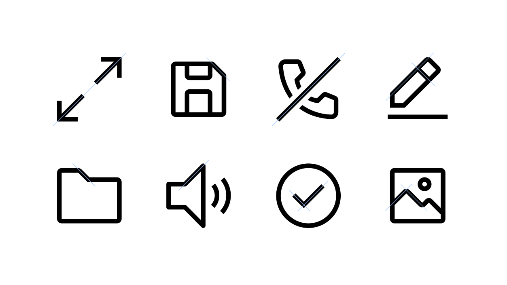

<PageDescription>

As visual symbols, IBM user interface icons represent ideas, objects or actions.
They can communicate messages at a glance, afford interactivity, and draw
attention to important information. Based on details from the IBM Plex®
typeface, they work well at small sizes.

</PageDescription>

<AnchorLinks>
  <AnchorLink>Foundation</AnchorLink>
  <AnchorLink>Style</AnchorLink>
  <AnchorLink>Strokes</AnchorLink>
  <AnchorLink>Perspective</AnchorLink>
  <AnchorLink>Corners</AnchorLink>
  <AnchorLink>Angles</AnchorLink>
</AnchorLinks>

<Video vimeoId="281513611" />

## Resources

<Row className="resource-card-group">
<Column colMd={4} colLg={4} noGutterSm>
    <ResourceCard
      subTitle="IBM icons (16px, 20px) library"
      aspectRatio="2:1"
      href="sketch://add-library/cloud/028e0598-591e-428c-a490-f6ec64b15ea7"
      >

  </ResourceCard>
</Column>
<Column colMd={4} colLg={4} noGutterSm>
    <ResourceCard
      subTitle="IBM icons (24px, 32px) library"
      aspectRatio="2:1"
      href="sketch://add-library/cloud/d530998a-c94c-4f1c-bc0e-c05417e067e3"
      >

  </ResourceCard>
</Column>
<Column colMd={4} colLg={4} noGutterSm>
    <ResourceCard
      subTitle="IBM UI icons master"
      actionIcon="download"
      href="https://github.com/carbon-design-system/carbon/raw/main/packages/icons/master/ui-icon-master.ai"
      >

</ResourceCard>
</Column>
<Column colMd={4} colLg={4} noGutterSm>
    <ResourceCard
      subTitle="IBM UI icons (.svg)"
      href="https://github.com/carbon-design-system/carbon/tree/master/packages/icons/src/svg"
      >

</ResourceCard>
</Column>
</Row>

## Foundation

The square grid is the underlying fabric of all IBM icons and is used as the
foundation to determine line thickness, proportion, shape and positioning across
the entire set of icons. The grid helps guide design decisions, which helps
ensure a unified approach. More importantly, it allows flexibility in creating
the appropriate shape needed to communicate the right idea.

<Video src="/videos/icon-grid.mp4" poster="/images/icon-grid-poster.svg" />

### Base grid

IBM icons are drawn on a pixel-based grid of 32px x 32px and scaled down
linearly to different sizes. Use the grid as your basic guideline to snap the
artwork in place. We recommend fine-tuning adjustments for the shape you are
trying to achieve during creation.

<ArtDirection>

</ArtDirection>

<DoDontRow>
<DoDont>

</DoDont>
<DoDont type="dont">

</DoDont>
</DoDontRow>

<DoDontRow>
<DoDont caption="Align design elements to the pixel grid.">

</DoDont>
<DoDont type="dont" caption="Avoid random decimal points in the x- and y- coordinates.">

</DoDont>
</DoDontRow>

### Padding

The grid contains 2px padding. This ensures icons will retain their desired
scale and surrounding white space when exported. Only extend artwork into
the padding for additional visual weight or for specific details required to
define the shape's content, meaning or character.

<ArtDirection>

</ArtDirection>

<DoDontRow>
<DoDont caption="Icon should remain inside the padding.">

</DoDont>
<DoDont type="dont" caption="Avoid placing part of the icon in the padding area.">

</DoDont>
</DoDontRow>

<DoDontRow>
<DoDont caption="Do extend icons into padding if additional space is needed.">

</DoDont>
<DoDont type="dont" caption="Don’t crowd the design elements—make sure there is enough space between them.">

</DoDont>
</DoDontRow>

### Keyshapes

Key lines give you consistent sizes for basic shapes or proportions across the
icon set. This makes it easier to create a visually stable foundation and helps
to establish relationships between the similarly proportioned icons and the
objects or ideas they represent.

<ArtDirection>

</ArtDirection>

<ArtDirection>

</ArtDirection>

<DoDontRow>
<DoDont caption="Do use the keyshape that best demonstrates the proportion of the metaphor.">

</DoDont>
<DoDont type="dont" caption="Don’t use keyshapes that don’t reflect the real form of the metaphor.">

</DoDont>
</DoDontRow>

<DoDontRow>
<DoDont caption="Do extend content beyond the keyshapes for proper form if needed.">

</DoDont>
<DoDont type="dont" caption="Don’t force the content to fit inside the keyshape.">

</DoDont>
</DoDontRow>

## Style

The stylistic conventions of IBM icons deliver a meaningful bond with our
typeface IBM Plex®. Each icon is intentionally designed to harmoniously pair by
sharing distinct details and characteristics found in the letterforms. The video
below demonstrates some of these relationships between icons and letters which
allows them to family well together visually.

<Video src="/videos/icon-style.mp4" poster="/images/icon-style-poster.jpg" />

<Row className="mock-gallery">
<Column colMd={4} colLg={6}>
<ArtDirection>

</ArtDirection>
<Caption>Rounded exteriors with 90° interiors</Caption>

</Column>
<Column colMd={4} colLg={6}>
<ArtDirection>

</ArtDirection>
<Caption>Square terminals</Caption>

</Column>
</Row>

<Row className="mock-gallery">
<Column colMd={4} colLg={6}>

<Caption>Slab characteristics</Caption>

</Column>
<Column colMd={4} colLg={6}>

<Caption>Distinctive point on tips</Caption>

</Column>
</Row>

## Strokes

One icon should not look heavier or lighter than other icons of the same size.
Nor should there be different weights within one icon. Maintain the same visual
weight by using a 2px stroke for all icons. There are a few exceptions to this
rule which occurs when the icon is complex or has a certain density of line. See
examples shown here.

<ArtDirection>

</ArtDirection>

<DoDontRow>
<DoDont caption="Do be consistent with 2px stroke weights.">

</DoDont>
<DoDont type="dont" caption="Don’t use inconsistent stroke weights. They’ll feel unbalanced and look like a mistake.">

</DoDont>
</DoDontRow>

<DoDontRow>
<DoDont caption="Do use a 1.5px stroke in instances where complex details are unavoidable.">

</DoDont>
<DoDont type="dont" caption="Don’t make icons feel visually heavier than the rest of the set.">

</DoDont>
</DoDontRow>

## Perspective

The IBM icons are designed and ready to use. However, if creating a new icon to
contribute to the library, please be sure to avoid dimensional representations.
Use more objective vantage points that are straight-on, or profile views.

<DoDontRow>
<DoDont caption="Use icon as it is.">

</DoDont>
<DoDont type="dont" caption="Don’t create icon dimensional.">

</DoDont>
</DoDontRow>

## Corners

Use a consistent corner radius of 2px for rounded shapes. The 2px radius can be
increased by a multiple of two when necessary to make the icon’s metaphor
understandable or object shape clearly defined. Use an additional radius to make the metaphor reflect the real form of the
object.

<!-- TODO: join mobiles images and add ArtDirection -->

<ArtDirection>

</ArtDirection>

<DoDontRow>
<DoDont caption="Do use squared corners when needed to reflect the real form of the metaphor.">

</DoDont>
<DoDont type="dont" caption="Don’t force rounded corners if they don’t work for your metaphor.">

</DoDont>
</DoDontRow>

<DoDontRow>
<DoDont caption="Do square the tips of arrows.">

</DoDont>
<DoDont type="dont" caption="Don’t use rounded arrow tips.">

</DoDont>
</DoDontRow>

## Angles

Use 45° angles for even anti-aliasing. Use increments of 15° whenever possible
for other angles needed to best depict the shape you’re creating for your
metaphor. You can create harmony across the icon set by consistently making
angles sit on the same increments.

<ArtDirection>

</ArtDirection>
<ArtDirection>

</ArtDirection>

<DoDontRow>
<DoDont caption="Do use multiples of 15° or an angle that best represents the metaphor when necessary.">

</DoDont>
<DoDont type="dont" caption="Don’t use 45° angles exclusively for all icons. It won’t work.">

</DoDont>
</DoDontRow>
