import Carousel from "../../../components/Carousel"

<PageDescription>

Iconography is highly functional in a user interface. When used wisely, icons become an elegant yet efficient way to communicate with and help guide a user through an experience. To maintain this functionality, it’s important to reduce cognitive load on users by employing icons sparingly and strategically throughout your designs.

</PageDescription>

<AnchorLinks>
  <AnchorLink>Sizing</AnchorLink>
  <AnchorLink>Alignment</AnchorLink>
  <AnchorLink>Clearance</AnchorLink>
  <AnchorLink>Color</AnchorLink>
  <AnchorLink>Third party UI icons</AnchorLink>
  <AnchorLink>UI icons in action</AnchorLink>
</AnchorLinks>

## Sizing

Icons have been designed to work best in four sizes: 16px, 20px, 24px, and 32px. Be sure to use icons at their originally produced size. These are provided in SVG format or they can be used directly from the Figma, Carbon and IBM Design Language libraries.

| Icon size                                     | Stroke width | Padding | Live area | Corner radius | Type sizes |
| --------------------------------------------- | ------------ | ------- | --------- | ------------- | ---------- |
| 32px                                          | 2px          | 2px     | 28px      | 2px           | —          |
| 24px                                          | 1.5px        | 1.5px   | 21px      | 1.5px         | —          |
| 20px | 1.25px       | 1.25px  | 17.5px    | 1.25px        | 16pt       |
| 16px | 1px          | 1px     | 14px      | 1px           | 14pt       |

<Caption>
  
  
    16px and 20px icons are optimized to feel balanced when paired with 14pt and
    16pt IBM Plex. Use 24px and 32px when larger icons are needed.
  
</Caption>

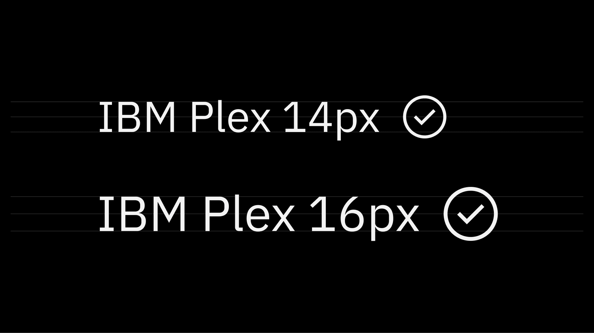

<DoDontRow>
<DoDont caption="Do use the correct icon size with IBM Plex.">

</DoDont>
<DoDont type="dont" caption="Don’t alter icon sizes.">

</DoDont>
</DoDontRow>
<DoDontRow>
<DoDont caption="Do center-align icons when they’re next to text.">

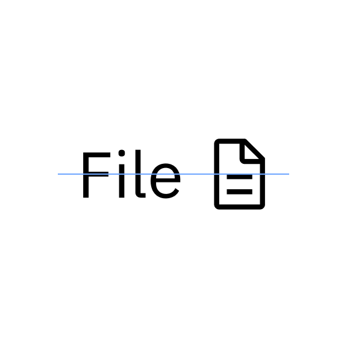

</DoDont>
<DoDont type="dont" caption="Don’t baseline-align icons to the text.">

</DoDont>
</DoDontRow>

## Alignment

Icons are optically aligned to the center of the icon grid within the boundary
box. Centering ensures all icons will be aligned correctly when exported and
used side-by-side in a line or a row. Visually center an icon where the visual
weight is heaviest. In some situations, mechanically centering doesn’t work.

<Carousel carouselLabel="Alignment" style={{marginTop: "2rem"}}>

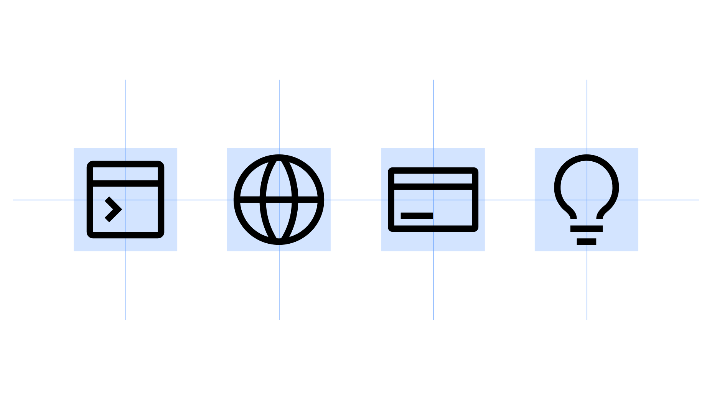

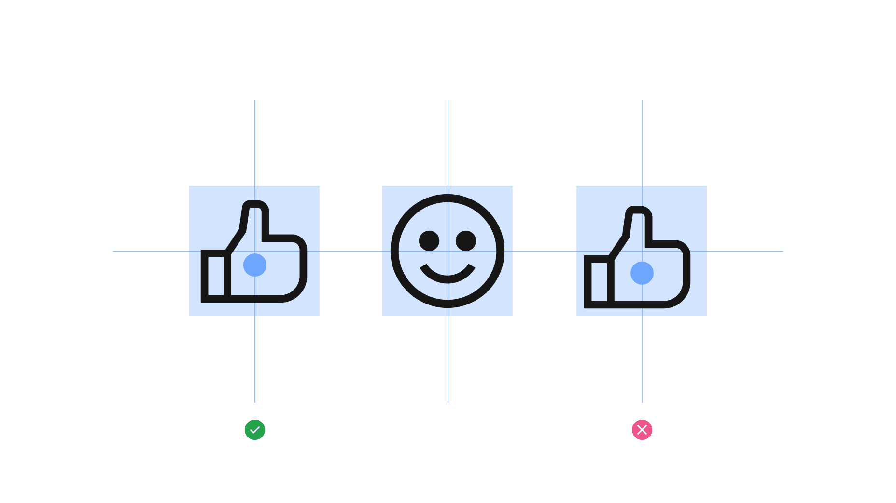

</Carousel>

## Clearance

When designing icons for touch surfaces, all targets should be 44px or greater. The icon can be smaller than 44px if padding is added to the touch target with CSS to meet the 44px minimum.

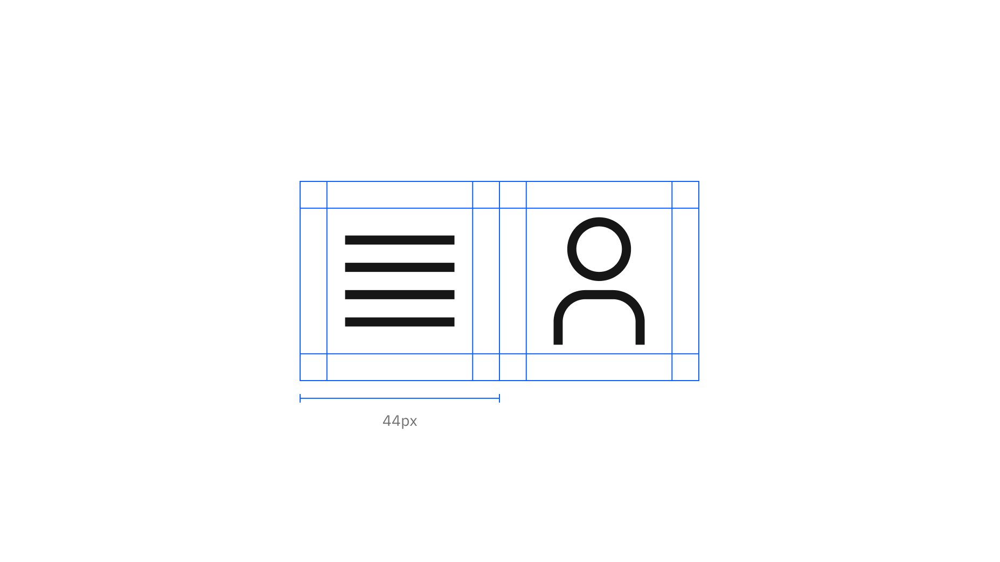

<DoDontRow>
<DoDont caption="Do follow the clearance rule to allow for legibility and an optimal touch experience.">

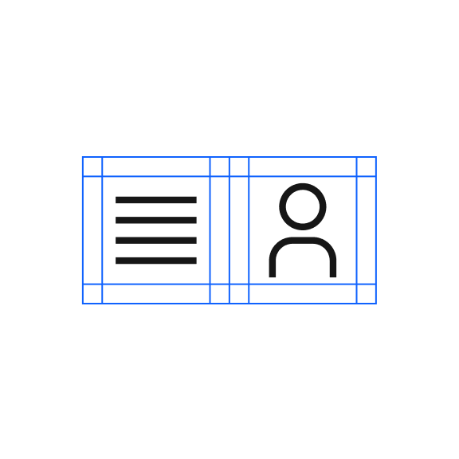

</DoDont>
<DoDont type="dont" caption="Don’t collapse the icon clearance area.">

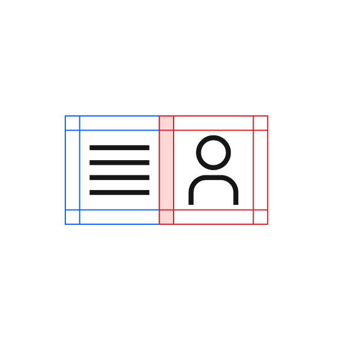

</DoDont>
</DoDontRow>

## Color

Icons are always a solid, monochromatic color and must pass the same color contrast ratio as typography (4.5:1). The color of the icon should reflect the importance of the icon’s action, which should always be to help guide a user. For more information about color, see [Color in UI](https://carbondesignsystem.com/elements/icons/usage/#color).

<DoDontRow>
<DoDont caption="Do match your icon color with your text color when pairing them.">

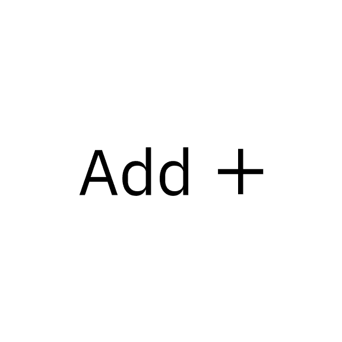

</DoDont>
<DoDont type="dont" caption="Don’t use different colors for text and icons.">

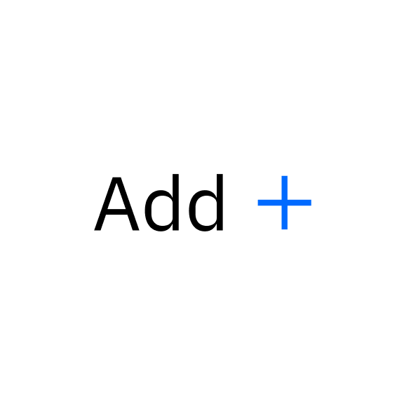

</DoDont>
</DoDontRow>
<DoDontRow>
<DoDont caption="Do make icons monotone.">

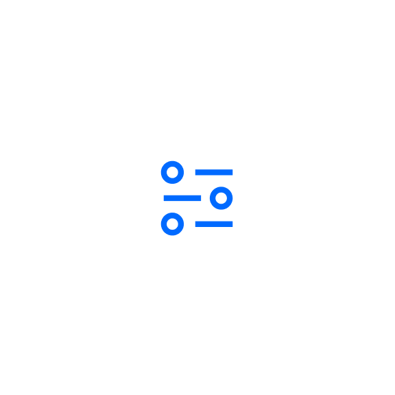

</DoDont>
<DoDont type="dont" caption="Don’t use more than one color within an icon.">

</DoDont>
</DoDontRow>

## Third party UI icons

Third-party UI icons require permission from that third party before the icon can be used and added to our libraries. Requestors are responsible for securing permission. These icons may come in various styles and formats and must not be visually altered. However, they should be visually balanced with existing IBM UI icons to ensure consistency within interfaces.

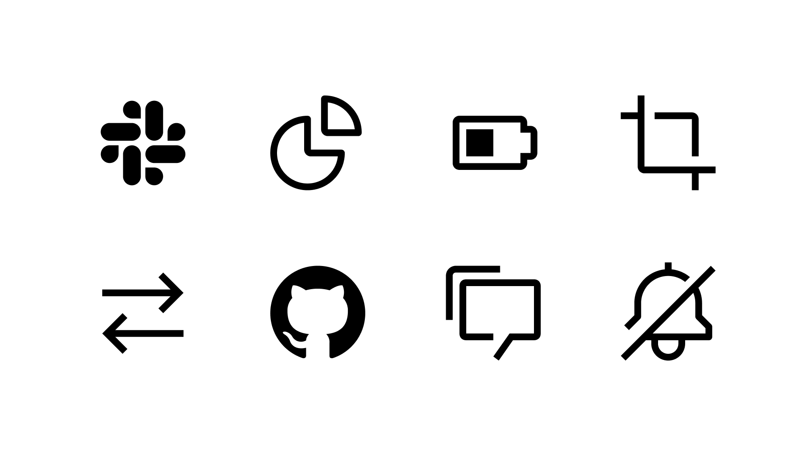

### Alignment

While most third-party icons don’t align perfectly to the icon grid, it is important to align any icon artwork to the grid as best as possible. Center and align edges to grid divisions while respecting icon padding guidelines.

<DoDontRow>
<DoDont caption="Optically center icons and align to the icon grid as best as possible.">

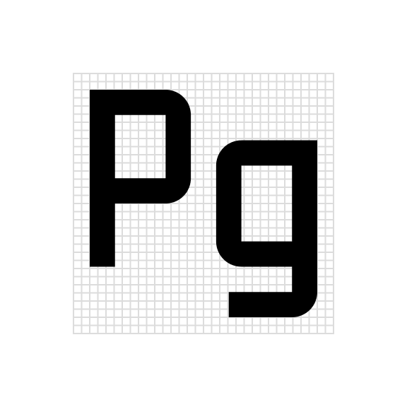

</DoDont>
<DoDont type="dont" caption="Don’t left-, right-, top-, or bottom-align logos.">

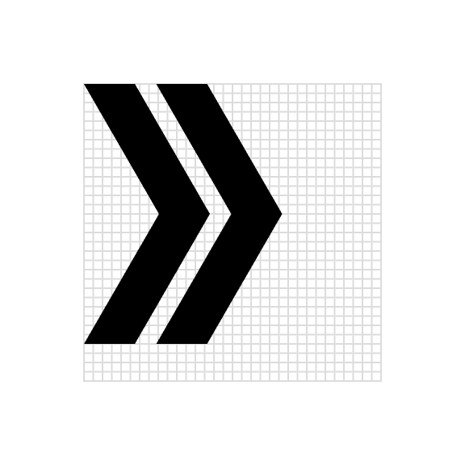

</DoDont>
</DoDontRow>
<DoDontRow>
<DoDont caption="Use the padding sparingly for optical centering.">

</DoDont>
<DoDont type="dont" caption="Don’t place logos in the padding unless absolutely necessary.">

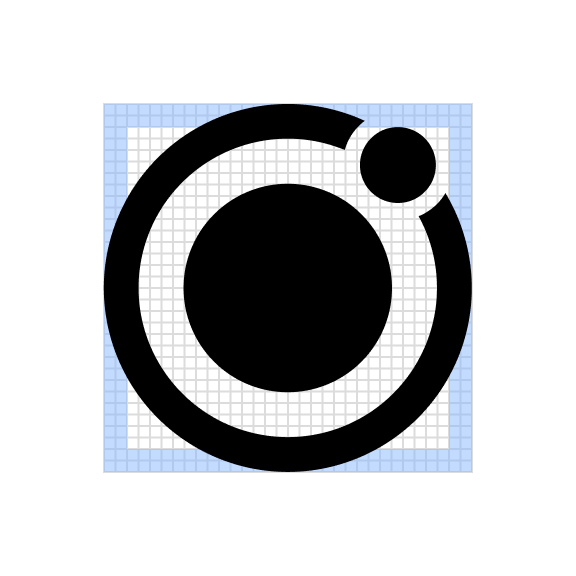

</DoDont>
</DoDontRow>

## UI icons in action

<Video src="./assets/usage/20-idl-iconography-ui-icons-usage.mp4" />

<ImageGallery>
<ImageGalleryImage col={4}>

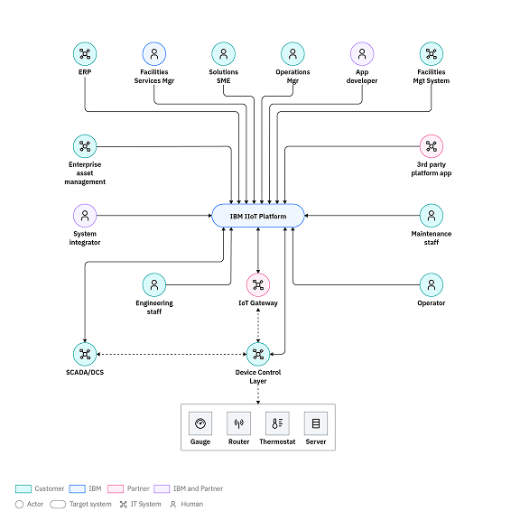

</ImageGalleryImage>
<ImageGalleryImage col={8}>

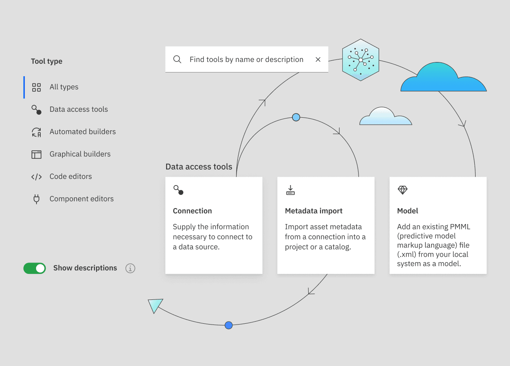

</ImageGalleryImage>
<ImageGalleryImage col={12}>

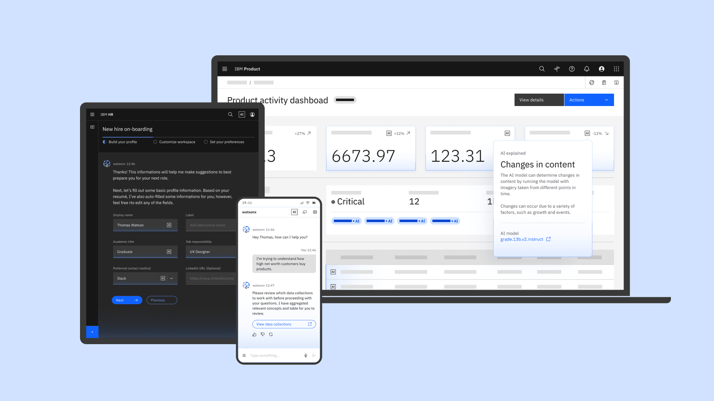

</ImageGalleryImage>
<ImageGalleryImage col={8}>

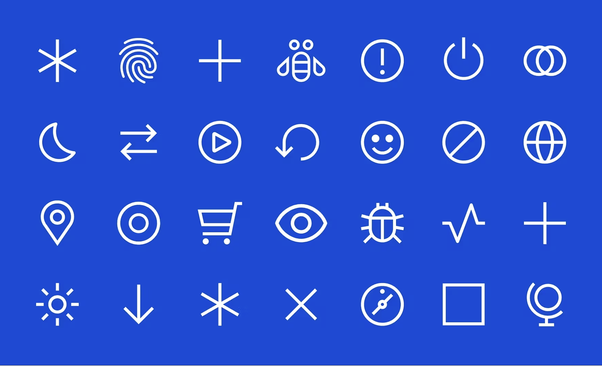

</ImageGalleryImage>
<ImageGalleryImage col={4}>

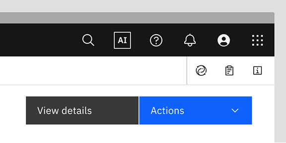

</ImageGalleryImage>
<ImageGalleryImage col={4}>

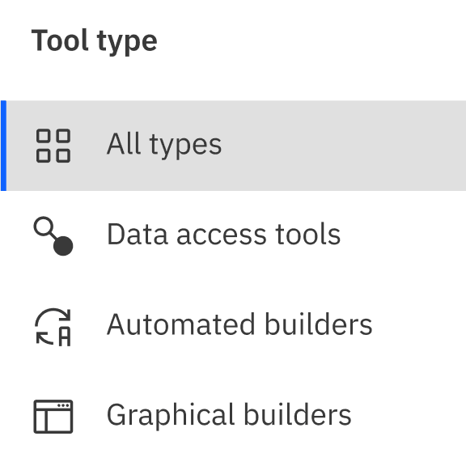

</ImageGalleryImage>
<ImageGalleryImage col={8}>

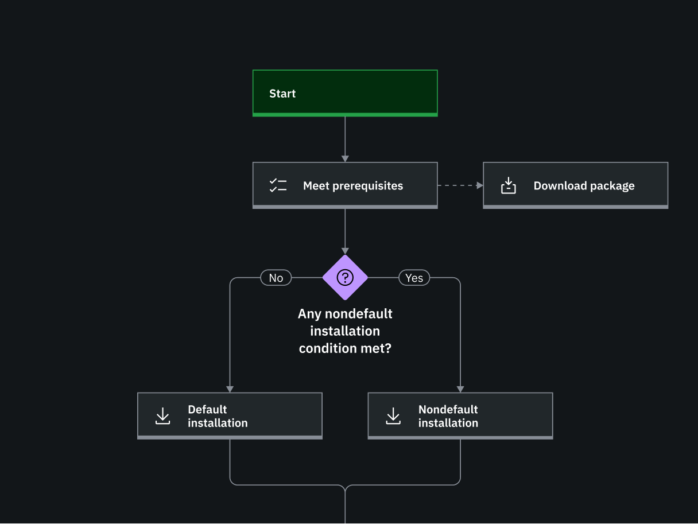

</ImageGalleryImage>
</ImageGallery>
