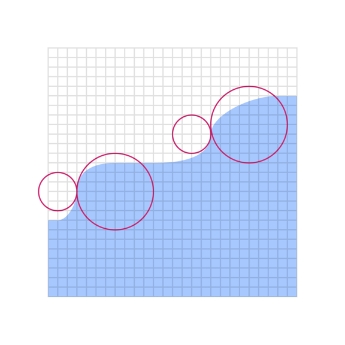
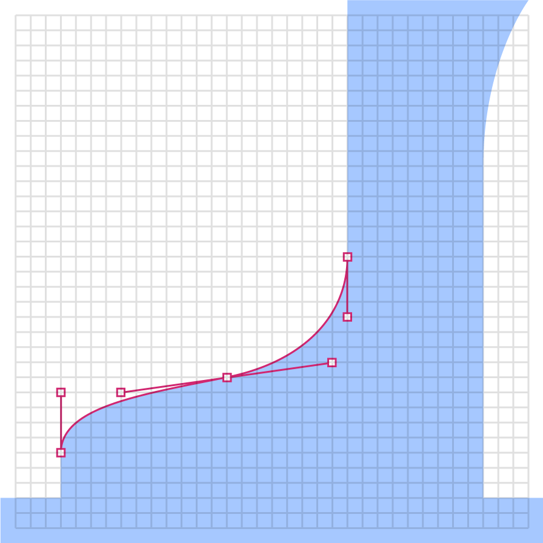

<PageDescription>

Flat style is the boldest and most graphic illustration style used at IBM. As the name suggests, Flat style uses basic geometric shapes to create people, objects, places and even ideas. It also requires thoughtful application of color and tone to delineate shapes in delightful and interesting ways. Please consider the following guidelines when crafting Flat style illustrations.

</PageDescription>

<AnchorLinks>
  <AnchorLink>Shapess</AnchorLink>
  <AnchorLink>Grid</AnchorLink>
  <AnchorLink>Drawing</AnchorLink>
  <AnchorLink>Color</AnchorLink>
</AnchorLinks>

## Resources

<Row className="resource-card-group">
<Column colMd={4} colLg={4} noGutterSm>
    <ResourceCard
      subTitle="Flat style starter kit"
      aspectRatio="2:1"
      href="https://github.com/carbon-design-system/carbon/raw/master/packages/pictograms/master/pictogram-master.ai"
      actionIcon="download"
      >

  </ResourceCard>
</Column>
</Row>

<Row className="mock-gallery">

<Column colMd={4} colLg={4}>

</Column>

<Column colMd={4} colLg={4}>

</Column>

<Column colMd={4} colLg={4}>

</Column>

</Row>

<Row className="mock-gallery">

<Column colMd={4} colLg={4}>

</Column>

<Column colMd={4} colLg={4}>

</Column>

<Column colMd={4} colLg={4}>

</Column>

</Row>

## Shapes

Objects in flat style illustration should use basic geometric shapes as the foundation. An illustrator can effectively draw most any object or scene by artfully combining squares, circles, rectangles and triangles.

<Row className="mock-gallery">

<Column colMd={4} colLg={4}>

<Caption>Two squares and two circles to make an eye.</Caption>
</Column>

<Column colMd={4} colLg={4}>

<Caption>Two squares and one circle to make a heart.</Caption>
</Column>

</Row>

### Size and spacing

All objects within a flat style illustration should be at least 8px wide or tall. This measurement is very important as using a shape any thinner or shorter will be seen as a line and will change the character of your illustration. Similarly, any negative space or spacing between shapes should also be a minimum of 8px.

<Row className="mock-gallery">

<Column colMd={4} colLg={4}>

</Column>

<Column colMd={4} colLg={4}>

</Column>

</Row>

## Grid

Building off of the [2x Grid](https://www.ibm.com/design/language/2x-grid), the underlying grid for Flat style has been set at 8px, as opposed to 4px for the Line style grid. This will ensure that your minimum shape size and spacing is at least 8px and will also help make sure that your illustrations don’t become overly crowded and busy.

### Snapping to grid

Flat style illustrations should be constructed using the “snap to grid” feature in Adobe Illustrator. This setting ensures that the points along your drawing can snap to the grid lines underneath your line work. The grid positioning of the line gives the precise and engineered aesthetic which is vital to any IBM illustration.

<DoDontRow>
<DoDont caption="The anchor point lands on the intersection of the vertical and horizontal grid lines.">

</DoDont>
<DoDont type="dont" caption="Anchor point not landing on the intersection point of the grid.">

</DoDont>
</DoDontRow>

## Drawing

Objects in flat style illustration should be built using basic geometric shapes. An illustrator can effectively draw most any object or scene by artfully combining squares, circles, rectangles and triangles. This example shows the underlying geometry of the drawing.

### Angles

Please use standard angles—degrees of 15, 30, 45, 60, 75 and 90 are preferred. Using these standard angles will help illustration feel and look consistent. Although you can use any angle or diagonal line we recommend sticking with the standards angles suggested here.

### Circular curves

Create curves using the grid as your guide and use quarter, semi and full circles whenever possible to achieve pure and simple curved shapes. Following this guidance will help ensure the desired engineered aesthetic.

<Row className="mock-gallery">

<Column colMd={4} colLg={6}>

</Column>

<Column colMd={4} colLg={6}>

</Column>

</Row>

<DoDontRow>
<DoDont caption="Clear and regular curves should be used when possible.">

</DoDont>
<DoDont type="dont" caption="Avoid the use of irregular cruves when they are not required.">

</DoDont>
</DoDontRow>

### Organic curves

Organic bezier curves may be used to add more realism and character to your illustration but should be used intentionally and with precision. Basic shapes should always lay the foundation and be used to ground the more irregular curves.

<Row className="mock-gallery">

<Column colMd={4} colLg={6}>

</Column>

<Column colMd={4} colLg={6}>

</Column>

</Row>

### Rounded corners and nesting

You can round the corners of angles in Adobe Illustrator for a fluid and controlled look. Here are some specifications for adding radiuses to shape corners.

<DoDontRow>
<DoDont caption="Nested lines that curve should remain equally spaced with increasing radius.">

</DoDont>
<DoDont type="dont" caption="Avoid the use of different corner radiuses in a nested design.">

</DoDont>
</DoDontRow>

## Color

Each illustration style has a slightly different expression of color based on the characteristics of the elements being used. When layering shapes in Flat style illustration for examples, it is necessary to distinguish shapes which often relies on the use of various shading techniques. For general approaches to color, please visit the [Tips and techniques](https://www.ibm.com/design/language/illustration/tips-and-techniques) page.

### Gradients and shading

Gradients can be an effective way of adding more fidelity to your illustration by implying depth, dimension and movement. It can also be an effective and necessary means of creating definition between neighboring shapes.

<Row className="mock-gallery">
<Column colMd={4} colLg={4}>

</Column>
<Column colMd={4} colLg={4}>

</Column>
</Row>

### Transparency

In most cases, it is recommended to use opaque shapes and avoid the use of lighting effects such as trasnparency and multiply. This helps ensure consistent colors across all of our illustrations. Transparency effects can still be implied by carefully use of swatches from the palette or by the use of gradients where one of the swatches blends into the background.

<Row className="mock-gallery">
<Column colMd={4} colLg={4}>

</Column>
<Column colMd={4} colLg={4}>

</Column>
</Row>