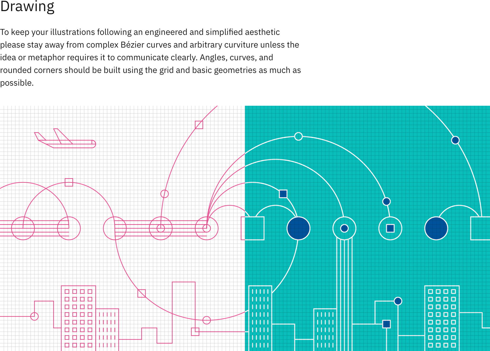
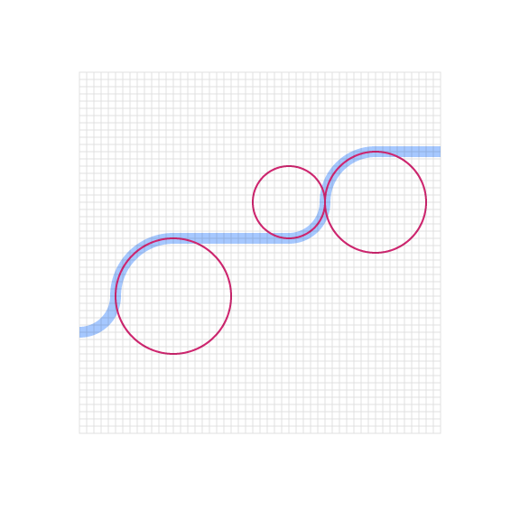
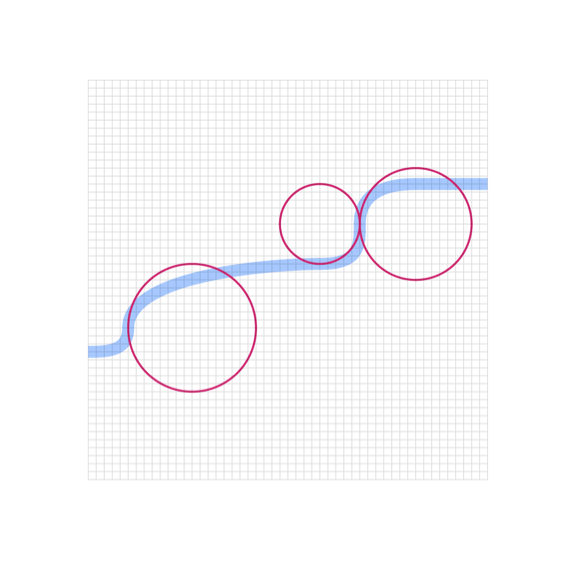
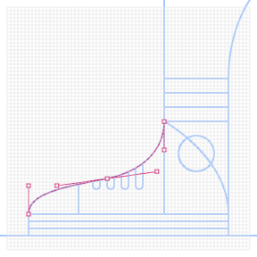

<PageDescription>

Line style is the most basic and immediate type of illustration at IBM. Line style illustrations use a very limited set of line weights, a 4px grid, and simple color rules. Please consider the following guidelines when crafting Line style illustrations.

</PageDescription>

<AnchorLinks>
  <AnchorLink>Lines</AnchorLink>
  <AnchorLink>Grid</AnchorLink>
  <AnchorLink>Drawing</AnchorLink>
  <AnchorLink>Color</AnchorLink>
</AnchorLinks>

## Resources

<Row className="resource-card-group">
<Column colMd={4} colLg={4} noGutterSm>
    <ResourceCard
      subTitle="Line style starter kit"
      aspectRatio="2:1"
      href="https://github.com/carbon-design-system/carbon/raw/master/packages/pictograms/master/pictogram-master.ai"
      actionIcon="download"
      >

  </ResourceCard>
</Column>
</Row>

<Row className="mock-gallery">

<Column colMd={4} colLg={4}>

</Column>

<Column colMd={4} colLg={4}>

</Column>

<Column colMd={4} colLg={4}>

</Column>

</Row>

<Row className="mock-gallery">

<Column colMd={4} colLg={4}>

</Column>

<Column colMd={4} colLg={4}>

</Column>

<Column colMd={4} colLg={4}>

</Column>

</Row>

## Lines

As the name suggests line style uses lines to draw everything. It’s all about the precise nature of the line and the their overall lightness. Using the prescribed set of lines help maintain consistency but also the particular aesthetic of the Line style. The lines suggested in the system use a simple logic that work well with the grid and the Please use these weights.

### Mixing line weights

Mixing line wieghts in an illustration is acceptable as long as you don’t use weights that are too similar. It is also recommended not to use more than four weights within a single illustration.

<DoDontRow>
<DoDont caption="Line weights that are clearly different work very well together. This successful example combines four weights, 1px, 2px, 4px and 6px.">

</DoDont>
<DoDont type="dont" caption="Line weights that are too similar create an unnecessary tension. This example combines three weights, 0.72px, 1px, and 1.5px.">

</DoDont>
</DoDontRow>

### Spacing

It’s very important to have the appropriate space between different line weights. Here is a guide to follow.

<DoDontRow>
<DoDont caption="The space between lines shoule be equal to or greater than the line weights used.">

</DoDont>
<DoDont type="dont" caption="The space between two of the lines is less than the weight of the line weight being used.">

</DoDont>
</DoDontRow>

## Grid

Building off of the [2x Grid](https://www.ibm.com/design/language/2x-grid), the Line style grid has been optimized to help craft engineered executions of line work. Since line style illustrations may require very fine detail, a 4px grid system was chosen as the base unit. The 4px grid should be used for all canvas sizes. This will ensure that your illustrations don’t become overly crowded or busy.

### Snapping to grid

Line style illustrations should be constructed using the “snap to grid” feature in Adobe Illustrator. This setting ensures that the points along your drawing can snap to the grid lines underneath your line work. The grid positioning of the line gives the precise and engineered aesthetic which is vital to any IBM illustration.

<DoDontRow>
<DoDont caption="The anchor point lands on the intersection of the vertical and horizontal grid lines.">

</DoDont>
<DoDont type="dont" caption="Anchor point not landing on the intersection point of the grid.">

</DoDont>
</DoDontRow>

## Drawing

To keep your illustrations following an engineered and simplified aesthetic please stay away from complex Bézier curves and arbitrary curviture unless the idea or metaphor requires it to communicate clearly. Angles, curves, and rounded corners should be built using the grid and basic geometries as much as possible.

### Angles

Please use standard angles—degrees of 15, 30, 45, 60, 75 and 90 are preferred. Using these standard angles will help illustration feel and look consistent. Although you can use any angle or diagonal line we recommend sticking with the standards angles suggested here.

### Circular curves

Create curves using the grid as your guide and use quarter, semi and full circles whenever possible to achieve pure and simple curved shapes. Following this guidance will help ensure the engineered aesthetic.

<Row className="mock-gallery">

<Column colMd={4} colLg={6}>

</Column>

<Column colMd={4} colLg={6}>

</Column>

</Row>

<DoDontRow>
<DoDont caption="Clear and regular curves should be used when possible.">

</DoDont>
<DoDont type="dont" caption="Avoid the use of irregular cruves when they are not required.">

</DoDont>
</DoDontRow>

### Organic curves

Organic bezier curves may be used to add more realism and character to your illustration but should be used intentionally and with precision. Basic shapes should always lay the foundation and be used to ground the more irregular curves.

<Row className="mock-gallery">

<Column colMd={4} colLg={6}>

</Column>

<Column colMd={4} colLg={6}>

</Column>

</Row>

### Rounded corners and nesting

You can round the corners of angles in Adobe Illustrator for a fluid and controlled look. Here are some specifications for adding radiuses to the approved line weights.

<DoDontRow>
<DoDont caption="Nested lines that curve should remain equally spaced with increasing radius.">

</DoDont>
<DoDont type="dont" caption="Avoid the use of different corner radiuses in a nested design.">

</DoDont>
</DoDontRow>

## Color

Each illustration style has a slightly different expression of color based on the characteristics of the elements being used. Stroked lines, for example, have the unique quaility of allowing gradients and transparencies to follow the path of the stroke. For general approaches to color, please visit the [Tips and techniques](https://www.ibm.com/design/language/illustration/tips-and-techniques) page.

### Gradients

Gradients can be an effective way of adding more fidelity to your linework by implying depth, dimension and movement. For best results, apply the gradient so that it follows the path of the stroke.

<Row className="mock-gallery">
<Column colMd={4} colLg={4}>

</Column>
<Column colMd={4} colLg={4}>

</Column>
</Row>

### Transparency

In most cases, it is recommended to use opaque lines and avoid the use of lighting effects such as trasnparency and multiply. This helps ensure consistent colors across all of our illustrations. Transparency effects can still be implied by carefully selecting sequential swatches from the palette or by the use of gradients where one of the swatches blends into the background.

<Row className="mock-gallery">
<Column colMd={4} colLg={4}>

</Column>
<Column colMd={4} colLg={4}>

</Column>
</Row>