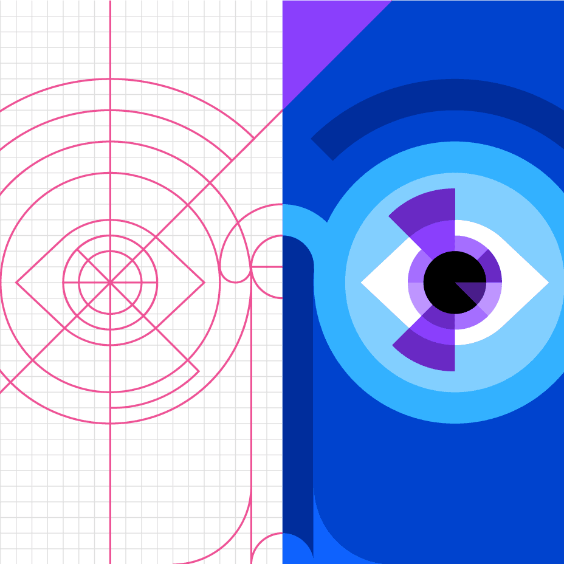
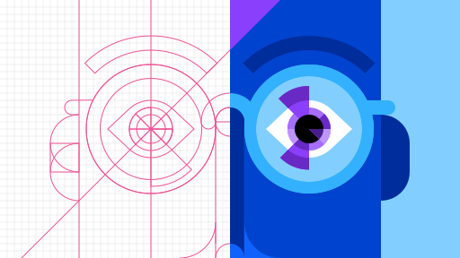
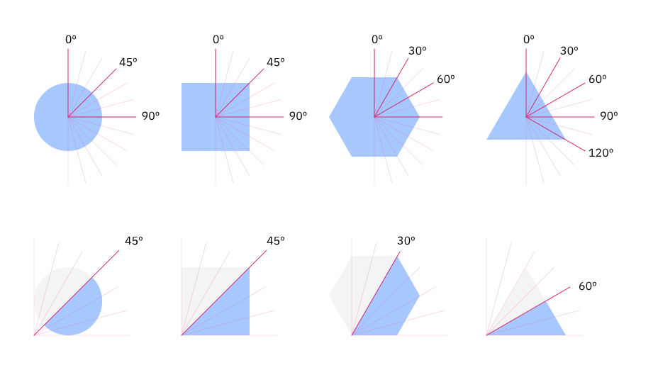
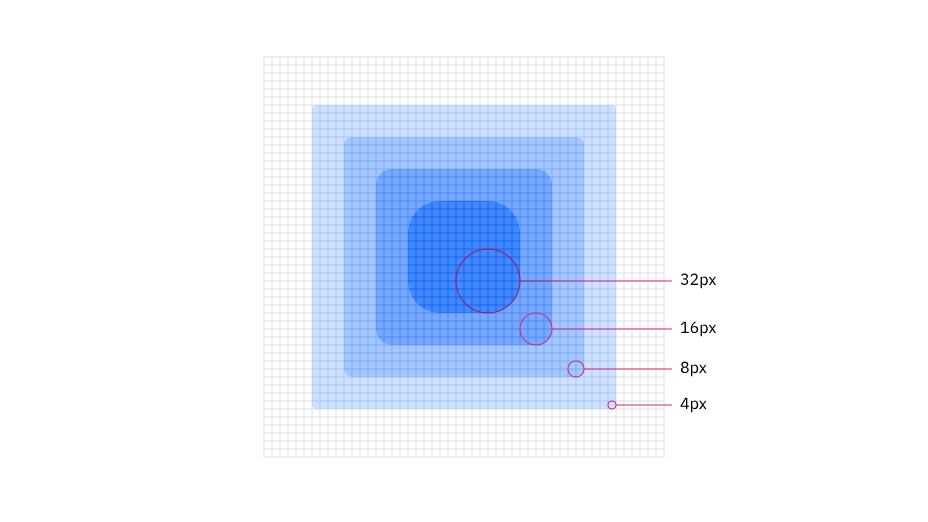

<PageDescription>

Flat style is the boldest and most graphic illustration style used at IBM. As
the name suggests, flat style uses basic geometric shapes to create people,
objects, places and even ideas. It also requires thoughtful application of color
and tone to delineate shapes in delightful and interesting ways. Please consider
the following guidelines when crafting flat style illustrations.

</PageDescription>

<AnchorLinks>
  <AnchorLink>Examples</AnchorLink>
  <AnchorLink>Shapes</AnchorLink>
  <AnchorLink>Grid</AnchorLink>
  <AnchorLink>Drawing</AnchorLink>
  <AnchorLink>Color</AnchorLink>
</AnchorLinks>

## Examples

<Row className="mock-gallery">

<Column colMd={4} colLg={4}>

</Column>

<Column colMd={4} colLg={4}>

</Column>

<Column colMd={4} colLg={4}>

</Column>

</Row>

<Row className="mock-gallery">

<Column colMd={4} colLg={4}>

</Column>

<Column colMd={4} colLg={4}>

</Column>

<Column colMd={4} colLg={4}>

</Column>

</Row>

## Shapes

Objects in flat style illustrations should use basic geometric shapes as the
foundation. An illustrator can effectively draw most any object or scene by
artfully combining squares, circles, rectangles and triangles.

<ArtDirection>

</ArtDirection>

<Row className="mock-gallery">

<Column colMd={4} colLg={4}>

<Caption>Two squares and two circles to make an eye.</Caption>

</Column>

<Column colMd={4} colLg={4}>

<Caption>Two circles and one square to make a heart.</Caption>

</Column>

</Row>

### Size and spacing

All objects within a flat style illustration should be at least 8px wide or
tall. This measurement is very important as using a shape any thinner or shorter
will be seen as a line and will change the character of your illustration.
Similarly, any negative space or spacing between shapes should also be a minimum
of 8px.

<Row className="mock-gallery">

<Column colMd={4} colLg={4}>

</Column>

<Column colMd={4} colLg={4}>

</Column>

</Row>

## Grid

Building off of the [2x Grid](https://www.ibm.com/design/language/2x-grid), the
underlying grid for flat style has been set at 8px, as opposed to 4px for the
line style grid. This method will ensure that your minimum shape size and
spacing is at least 8px and will also help make sure that your illustrations
don’t become overly crowded and busy.

<ArtDirection>

</ArtDirection>

### Snapping to grid

Flat style illustrations should be constructed using the “snap to grid” feature
in Adobe Illustrator. This setting ensures that the points along your drawing
can snap to the grid lines underneath your linework. The grid positioning of the
line gives the precise and engineered aesthetic, which is vital to any IBM
illustration.

<DoDontRow>
<DoDont caption="Do make sure the anchor point lands clearly on intersecting grid lines.">

</DoDont>

<DoDont type="dont" caption="Don’t forget to use “snap to grid,” or it may result in misaligned anchor points.">

</DoDont>
</DoDontRow>

### Layering

When shapes are layered there should be at least an 8px safe area so that the
objects clearly intersect each other.

<DoDontRow>
<DoDont caption="Do use clearly arranged shapes with at least 8px of separation.">

</DoDont>

<DoDont type="dont" caption="Don’t use haphazardly placed shapes with less than 8px of separation.">

</DoDont>
</DoDontRow>

## Drawing

Objects in flat style illustration should be built using basic geometric shapes.
An illustrator can effectively draw most any object or scene by artfully
combining squares, circles, rectangles and triangles. This example shows the
underlying geometry of the drawing.

<ArtDirection>

</ArtDirection>

### Angles

Please use standard angles—15°, 30°, 45°, 60°, 75° and 90° are preferred. Using
these standard angles will help your illustrations appear consistent. Although
you can use any angle, we recommend sticking with the standard angles suggested
here.

<ArtDirection>

</ArtDirection>

### Circular curves

Create curves using the grid as your guide and use quarter circles, semicircles
and full circles whenever possible to achieve pure and simple curved shapes.
Following this guidance will help ensure the engineered aesthetic.

<Row className="mock-gallery">

<Column colMd={4} colLg={6}>

</Column>

<Column colMd={4} colLg={6}>

</Column>

</Row>

<DoDontRow>
<DoDont caption="Do use clear and regular curves when possible.">

</DoDont>

<DoDont type="dont" caption="Don’t use irregular curves if they can be avoided.">

</DoDont>
</DoDontRow>

### Organic curves

Organic Bézier curves may be used to add more realism and character to your
illustration, but should be used intentionally and with precision. Basic shapes
should always lay the foundation and be used to ground the more irregular
curves.

<Row className="mock-gallery">

<Column colMd={4} colLg={6}>

</Column>

<Column colMd={4} colLg={6}>

</Column>

</Row>

### Rounded corners and nesting

You can round the corners of angles in Adobe Illustrator for a fluid and
controlled look. Here are some specifications to use when applying a radius to
your object.

<ArtDirection>

</ArtDirection>

<DoDontRow>
<DoDont caption="Nested lines that curve should remain equally spaced with increasing radius.">

</DoDont>

<DoDont type="dont" caption="Avoid the use of different corner radiuses in a nested design.">

</DoDont>
</DoDontRow>

## Color

Each illustration style has a slightly different expression of color based on
the characteristics of the elements being used. When layering shapes in flat
style illustrations, it’s necessary to distinguish shapes, which often relies on
the use of various shading techniques. For general approaches to color, please
visit the illustration
[tips and techniques](https://www.ibm.com/design/language/illustration/tips-and-techniques)
page.

### Gradients and shading

Gradients can be an effective way of adding more fidelity to your illustration
by implying depth, dimension and movement. They can also be an effective and
necessary means of creating definition between neighboring shapes.

<Row className="mock-gallery">

<Column colMd={4} colLg={4}>

</Column>

<Column colMd={4} colLg={4}>

</Column>

</Row>

### Transparency

In most cases, it’s recommended to use opaque shapes and avoid the use of
lighting effects, such as transparency and multiply. This technique helps ensure
consistent colors across all our illustrations. Transparency effects can still
be implied by carefully use of swatches from the palette or by using gradients
where one of the swatches blends into the background.

<Row className="mock-gallery">

<Column colMd={4} colLg={4}>

</Column>

<Column colMd={4} colLg={4}>

</Column>

</Row>
