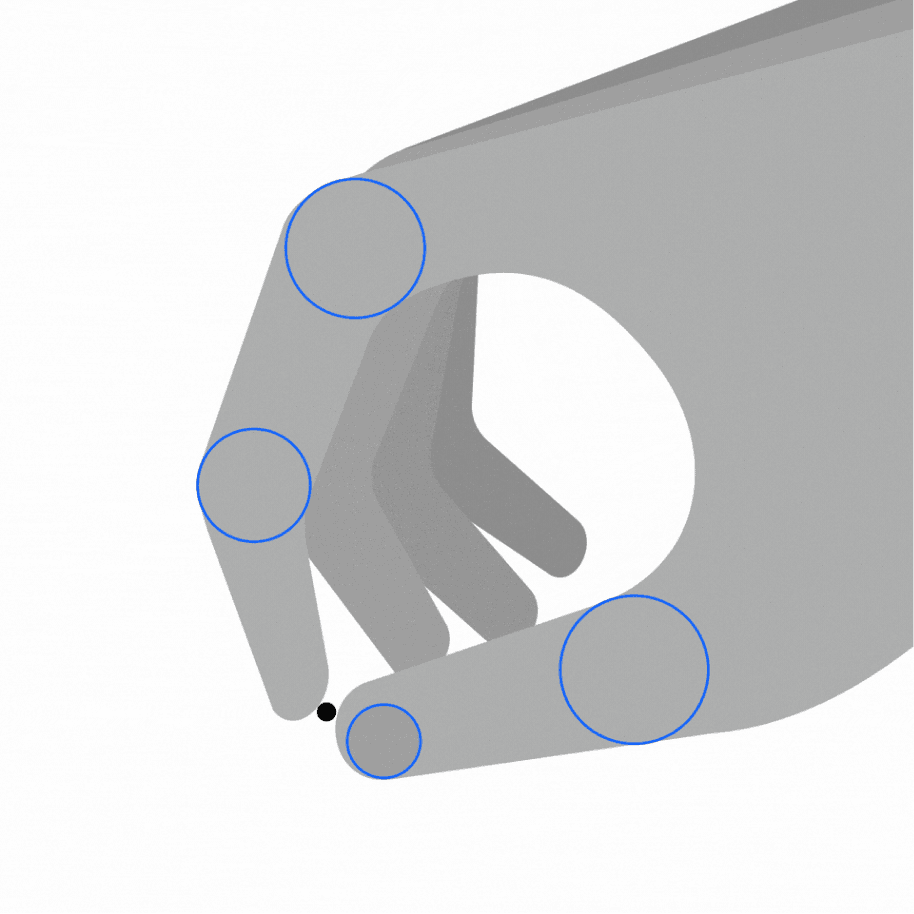

<PageDescription>

We use flat style when bold color and graphic quality best express dynamic
content. Dial up the overlapping fills of color unique to this bold and graphic
style for more vibrancy or tone them down for more subtle applications. Whether
abstract or literal, still or in motion, flat style illustrations bring more
personality to the canvas.

</PageDescription>

<AnchorLinks>
  <AnchorLink>Examples in use</AnchorLink>
  <AnchorLink>Animation</AnchorLink>
</AnchorLinks>

## Examples in use

<Row className="mock-gallery">

<Column colMd={4} colLg={8}>

</Column>

<Column colMd={4} colLg={4}>

</Column>

</Row>

<Row className="mock-gallery">

<Column colMd={4} colLg={4}>

</Column>

<Column colMd={4} colLg={8}>

</Column>

</Row>

<Row className="mock-gallery">

<Column colMd={4} colLg={8}>

</Column>

<Column colMd={4} colLg={4}>

</Column>

</Row>

## Animation

The flat style’s reliance on simple, bold silhouettes allows for more expressive
performances and evocative motion.

<GifPlayer className="video-player">

<Video
  autoPlay
  playsInline
  loop="on"
  muted
  src="/videos/illustration/fs-usage-hero.mp4"
/>

</GifPlayer>

#### Tips

- Shapes should stay true to the original design. Be careful of custom path
  animation and rely on position, rotation and scale.
- Although more involved performances are encouraged, avoid exaggeration,
  bounces and smears.
- Consider working at higher—though proportional—resolutions to ensure crisp,
  clean shapes and extra precision when aligning elements.

### Performance

In contrast to the particular limitations of line style, flat illustration is
well-suited to more nuanced and organic character performances. However, this
style still requires fine attention to geometry and detail to ensure the
integrity of graphic forms.

<Row className="mock-gallery">

<Column colMd={4} colLg={4}>

<GifPlayer className="video-player">

<Video
  autoPlay
  playsInline
  loop="on"
  muted
  src="/videos/illustration/performance-1.mp4"
/>

</GifPlayer>

</Column>

<Column colMd={4} colLg={4}>

<GifPlayer color="dark" className="video-player">

<Video
  autoPlay
  playsInline
  loop="on"
  muted
  src="/videos/illustration/performance-2.mp4"
/>

</GifPlayer>

</Column>

</Row>

### Transparency

Unless intentionally designed for this effect, long, ponderous fades will create
unwanted intersections and confusing overlaps that run contrary to the bold,
clean vernacular of flat style. Lean toward confident, productive fades that
minimize the appearance of unintended shapes.

<DoDontRow>

<DoDont type="do" caption="Use solid color to maintain clean graphic shapes.">
<GifPlayer className="video-player">

<Video
  autoPlay
  playsInline
  loop="on"
  muted
  src="/videos/illustration/transparency-do.mp4"
/>

</GifPlayer>
</DoDont>

<DoDont type="dont" caption="Avoid transparency, overlapping shapes and intersections.">
<GifPlayer className="video-player">

<Video
  autoPlay
  playsInline
  loop="on"
  muted
  src="/videos/illustration/transparency-dont.mp4"
/>

</GifPlayer>
</DoDont>
  
</DoDontRow>

### Translation

Flat style lends itself to richer, more elaborate designs and performances.
Typically, this style requires action to be more focused and specific to a
limited scope of elements, while broader motions that affect the entire
canvas—camera moves—will quickly become distracting and disorienting. Any camera
movement should be simple, decisive and applied with discretion.

<DoDontRow>

<DoDont type="do" caption="Stick to simple, decisive camera movements.">
<GifPlayer className="video-player">

<Video
  autoPlay
  playsInline
  loop="on"
  muted
  src="/videos/illustration/fs-translation-do.mp4"
/>

</GifPlayer>
</DoDont>

<DoDont type="dont" caption="Avoid complex, distracting camera movements.">
<GifPlayer className="video-player">

<Video
  autoPlay
  playsInline
  loop="on"
  muted
  src="/videos/illustration/fs-translation-dont.mp4"
/>

</GifPlayer>
</DoDont>
  
</DoDontRow>

### Adaptation

Illustrations may need to be modified to become technically feasible animations.
For example, some complex gradients may be prohibitively difficult to animate
cleanly and may need to be subtly simplified. Where possible, both illustrator
and animator should collaborate on modifying a design without diluting the
intention or fidelity of the original illustration.

<Row className="mock-gallery">

<Column colMd={4} colLg={4}>

<Caption>Complex gradient shading</Caption>

</Column>

<Column colMd={4} colLg={4}>

<Caption>Adapted shading for animation</Caption>

</Column>

</Row>
