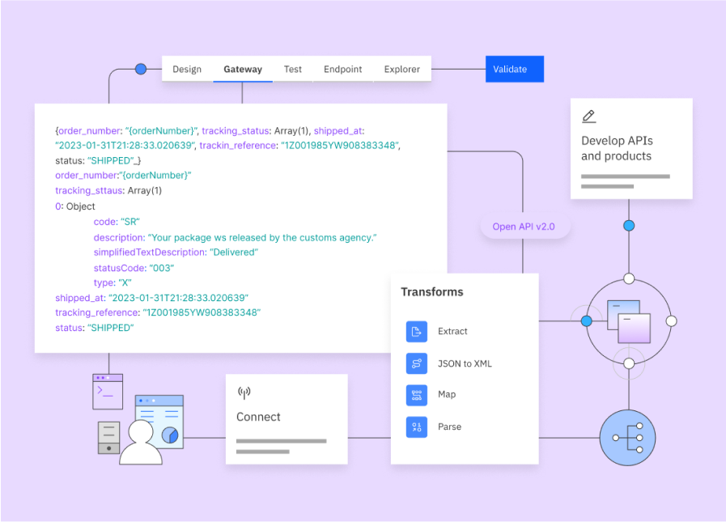
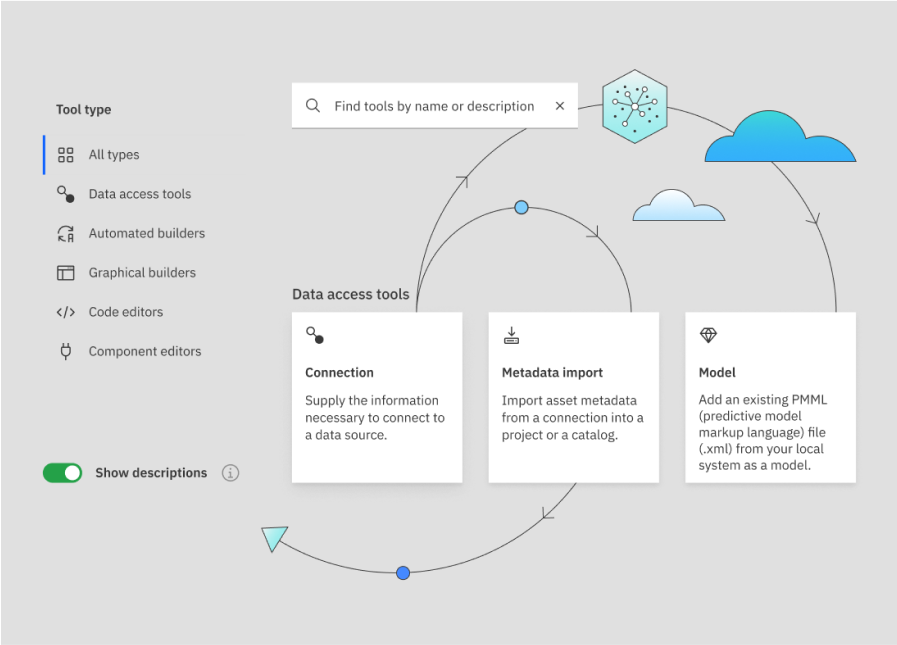
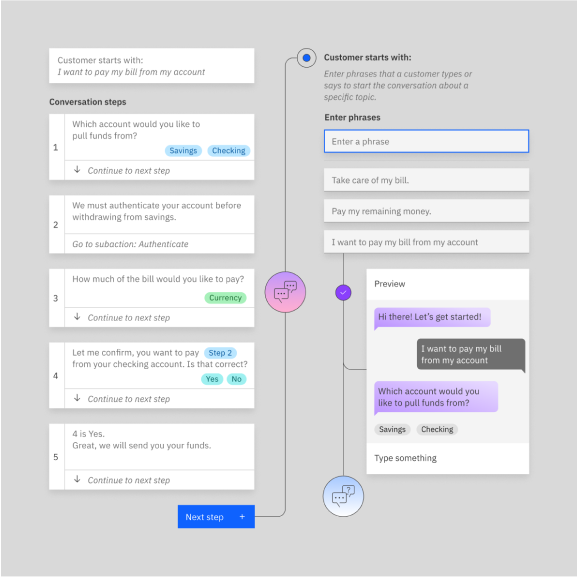
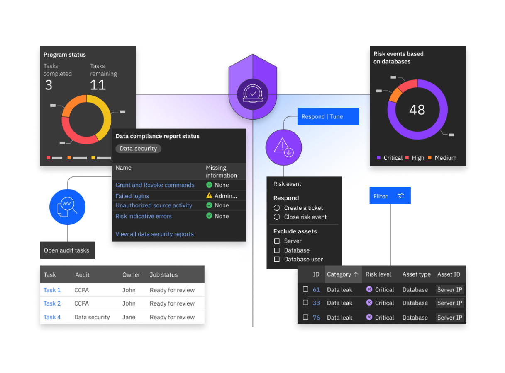
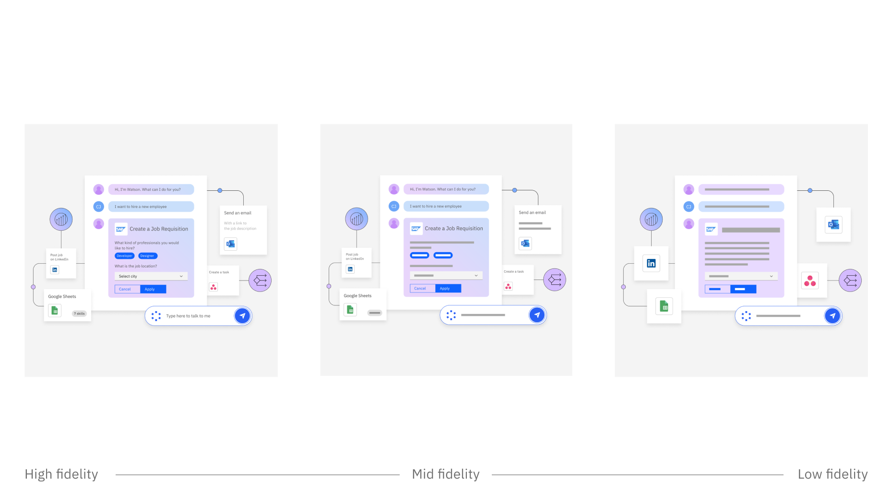
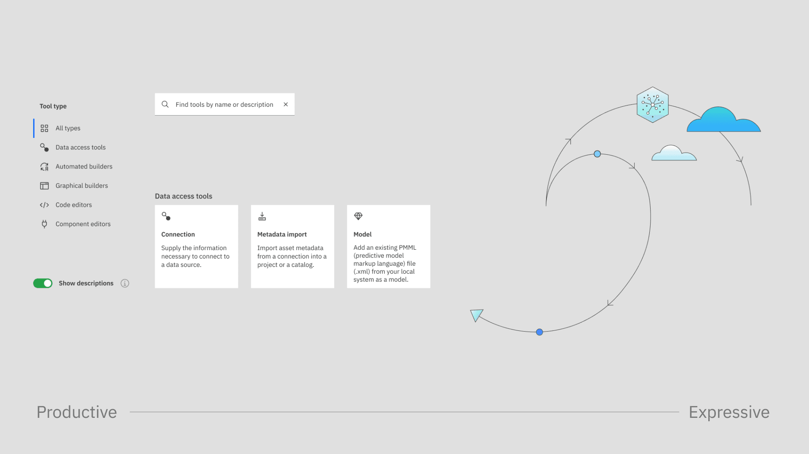
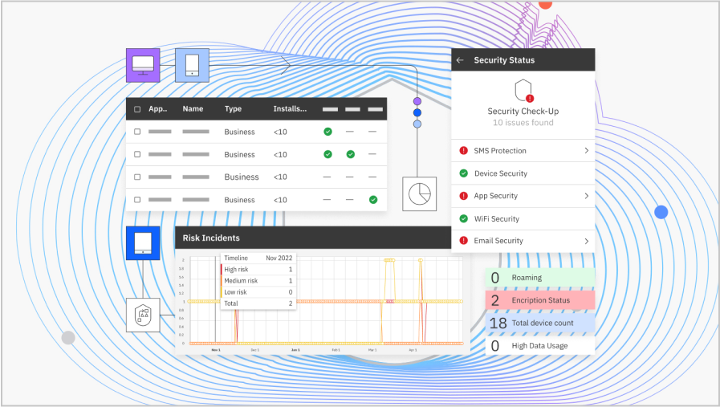

<PageDescription>

The hybrid UI illustration style sits at the intersection of user interface design and conceptual illustration. You can employ this style to depict complex or abstract ideas, outline relationships, convey workflows and more. As always, the goal is to build user understanding and aid clarity as you infuse compositions with elements of the IBM brand.  

</PageDescription>

<AnchorLinks>
  <AnchorLink>Examples</AnchorLink>
  <AnchorLink>Definition</AnchorLink>
  <AnchorLink>Fidelity</AnchorLink>
  <AnchorLink>Grid</AnchorLink>
  <AnchorLink>Typography</AnchorLink>
  <AnchorLink>Iconography and illustration</AnchorLink>
  <AnchorLink>Composition</AnchorLink>
</AnchorLinks>

## Resources

<Row>
<Column colMd={4} colLg={4} noGutterSm>
  <ResourceCard
    subTitle="Hybrid UI Kit (w3id required)"
    aspectRatio="2:1"
    href="https://www.figma.com/file/6rXFn0P9KpSzVbC2DSAEP9/Hybrid-UI-Kit?type=design&node-id=0%3A1&mode=design&t=k35rdB78LlbJqbyz-1"
    actionIcon="launch"
    >

  </ResourceCard>
</Column>
</Row>

## Examples

<Row>

<Column colMd={6} colLg={6}>

</Column>

<Column colMd={6} colLg={6}>

</Column>

</Row>

<Row>

<Column colMd={4} colLg={4}>

</Column>

<Column colMd={8} colLg={8}>

</Column>

</Row>

## Definition

Hybrid UI illustrations are the offspring of user interface design and conceptual illustration. They inherit visual qualities from both, so they’ll feel at home on the same page with product screenshots and illustrations of abstract concepts alike.  They can depict complex or abstract ideas when pictograms and other illustrations are grouped with UI elements extracted from the product itself. They’re never simply decorative and should be used with considered intention. Find more intended usage details on the [Usage](/illustration/hybrid-ui-style/usage) page.

## Fidelity

A hybrid UI illustration isn’t intended to be a fully accurate representation of a product. Because they steer into the conceptual realm, it may be helpful to remove overly detailed information from the UI by “greeking” text or simplifying elements such as CTAs. Greeking is the process of using rectangles to represent text for the purpose of layout simplification. This technique keeps the user focused on the conceptual flow of the illustration, rather than distracted by detail. 

#### Fidelity tuning
Replicate the product UI. Make only slight adjustments for color contrast when the difference would not be jarring, for example, making text slightly darker to pass accessibility. For non-Carbon products, respect the UI of the product, but use IBM Plex®.

Always tune your illustration toward more or less fidelity, depending on the scale of the composition, its intent and the audience. When creating hybrid UI illustrations, we define a scale of fidelity as shown here.

- High fidelity: The elements of the UI are very close to the actual UI, with no greeking or simplification.
- Mid fidelity: There’s some simplification in the UI elements shown and some greeking.
- Low fidelity: All of the UI elements and the composition are simplified and  completely greeked.

## Grid

This style variant sits at the intersection of Carbon UI and the line style of illustration. Building off the [2x grid](/2x-grid) of the IBM Design Language, the underlying grid for hybrid UI illustrations is set at 8px. Consistent spacing between containers and elements should be set using standard spacers: 8px, 16px, 32px, 48px and so on. Aim to use a single spacing measure throughout an illustration. The spacing may vary for different products and compositions, depending on the need to make a composition more or less open. The corner radius for connector lines and containers should also use 8px increments.

<Row>

<Column colMd={8} colLg={8}>

</Column>

</Row>

## Typography

Hybrid UI illustrations use two categories of type: actual legible text and implied greeked text. 

You should greek text that would be illegible at the scale of your illustration and any text not relevant to the composition. As a general rule, you can greek text that’s smaller than the body text, such as labels or annotations. 

Always be mindful of the cost and time involved in translating the illustration into additional languages. The more actual text you display, the harder it is to translate the illustration without breaking the composition. On a global level, greeking is universal. At the same time, actual text brings meaning to the illustration. Find the right balance for your needs. 

#### Actual text

When replicating type from products that use the Carbon Design System, follow the same type style and hierarchy. Increase type sizes to make text as legible as possible. We recommend staying above 14pt when designing at 2x the final minimum artboard size. For acquisitions or products that don’t use the Carbon Design System, use Plex® instead of the product’s fonts, but match the type style and hierarchy.

In terms of color, for a softer look across the entire illustration, use Gray 80 for type instead of Black or Gray 100.

#### Greeked type

When converting text to greeking, the height of the box should approximate the x-height of the type. Spacing between lines of text should be approximately 1.5 times the height of the box.  For example, at 100% scale, 14px text will greek as a 6px rectangle with 9px in between. Simplify as needed, using just a few rectangle heights throughout.

In terms of color, in light themes, regular type will be rendered as Gray 40 rectangles, while semibold and bold type will be Gray 60. Use Blue 40 greeked text to replicate interactive type. In dark themes, use Gray 70 for regular text,  Gray 50 for semibold and bold type, and Blue 70 for interactive type. On mid-tone colored backgrounds, use at least 3 steps between the greeked text and the background for accessibility.

<Column colMd={8} colLg={12}>

| Type scale   | Rectangle heigh | Rectangle spacing |
| ------------ | --------------- | ----------------- |
| 20           | 10px            | 16px              |
| 18           | 8px             | 12px              |
| 16           | 8px             | 12px              |
| 14           | 4px             | 10px              |

</Column>

<Column colMd={8} colLg={8}>
<Tabs>
<Tab label="Light themes">

  

</Tab>
<Tab label="Dark themes">

  

</Tab>
</Tabs>
</Column>

## Iconography and illustration

Hybrid UI illustrations are compositions that employ fragments of product UI, pictograms and illustrations. While the UI elements are literal representations of the products, the pictograms and illustrations add more layers of meaning to the image. Pictograms are used to represent the product benefits or steps in a user’s flow. Abstract and literal line illustrations complement the work by filling out the concept, explaining more about the product and bringing brand elements into the compositions.

<Row>
<Column colMd={8} colLg={8}>
<GifPlayer color='dark' className="video-player">

<Video
  autoPlay
  playsInline
  loop="on"
  muted
  src="/assets/expressive.mp4"
/>

</GifPlayer>
</Column>
</Row>

### Pictograms

Pictograms can represent the benefits of a product, steps in a user flow or expected outcomes. Pictograms can be placed in containers, with a flat color fill or a gradient fill. When creating a composition at 2x, the pictograms should be 48px, in 72px square containers or 84px circle containers. Pictograms never have a drop shadow.

<Row>

<Column colMd={4} colLg={4}>

<Caption>
  For a 48px pictogram, use 72px square containers or 84 px circle containers.
</Caption>

</Column>

<Column colMd={4} colLg={4}>

<Caption>
  Containers can be filled with flat colors or gradients.
</Caption>

</Column>

</Row>

### UI icons

UI icons can appear in a hybrid UI illustration if they are part of the product’s UI. They can be part of a UI container or be shown separately to represent a certain action. UI icons can also be used for expressive purposes, when smaller sizes are useful. Don’t use both UI icons and pictograms for expressive purposes in the same illustration.

<Row>
<Column colMd={8} colLg={8}>

</Column>
</Row>

### Line-style and flat-style illustrations

Developed from pictograms, abstract illustrations can be created to express activities outside of the product that are necessary to the illustration’s process flow or narrative. Draw these line-style illustrations using a 1px line weight. You can combine a primary line style in Gray 80 with a lighter secondary line style in Gray 30. Combine the line illustration with solid or gradient fills, respecting the product’s color palette.

<Row>
<Column colMd={8} colLg={8}>

</Column>
</Row>

## Composition

Designing a hybrid UI illustration should be an exercise in creating a harmonious composition while communicating the right message. 

Start by selecting and positioning the main UI elements. Make sure they are spaced consistently on the grid. Overlaps are possible, and are usually a way to communicate a relationship between parts of the UI, signify an action-result relationship, express a consequential relationship or to zoom in. When overlapping UI fragments, be mindful of what gets covered. Avoid cropping words or covering elements that affect the legibility of the container. You can zoom in to a section of the UI to focus in on a feature. Remember to bump up the fidelity to show all text when you have zoomed in.

Use connector lines, nodes, pictograms and illustrations to balance the composition, create visual flows and convey the product concepts. Respect the product’s color palette when using color throughout the composition.

### Containers

When creating hybrid UI illustrations, a section of the UI can be presented in containers. Containers have a White or Dark Gray background, depending on the respective UI product theme. 

Containers can have straight or rounded corners. The straight corners are tailored to represent the Carbon elements embodying the UI. The rounded corners on containers should be used in accordance with the Carbon for AI guidance. Find more detailed information on how to show AI in our products in the Carbon for AI [AI Essential Kit](https://www.figma.com/file/4aMIX5zjux2LhbW1aI3xgD/Carbon-for-AI---AI-Essentials-Kit?type=design).

When drawing containers, use one of our standard aspect ratios whenever possible.

<Row>
<Column colMd={8} colLg={8}>

<Caption>
  Containers shown at various aspect ratios
</Caption>

</Column>
</Row>

<Row>

<Column colMd={4} colLg={4}>

<Caption>
  Light theme example of a container holding AI-generated content
</Caption>

</Column>

<Column colMd={4} colLg={4}>

<Caption>
  Dark theme example of a container holding AI-generated content
</Caption>

</Column>

</Row>

### Shadows

Hybrid UI illustrations take advantage of drop shadow effects to create levels of depth. Apart from the flat plane, there are two levels that can be used when creating compositions. The default recommended shadow uses a softer and wider shadow. If you need to add a layer closer to the background plane, use the same treatment as floating UI elements are done in Carbon, similar to the context menu. 

The only elements that get a shadow are UI elements and containers showing UI patterns. The more expressive elements like pictograms and illustrations don’t get shadows.

#### Specifications
Drop shadows don’t have the same specifications across design tools. These specifications are what we recommend for the default shadow in our two design tools. 

#### For light containers:
- In Adobe Illustrator: Opacity 20%, X offset 0px, Y offset 8px, Blur 8
- In Figma: Opacity 10%, X offset 0px, Y offset 8px, Blur 16

#### For dark containers:
- In Adobe Illustrator: Opacity 30%, X offset 0px, Y offset 8px, Blur 8
- In Figma: Opacity 20%, X offset 0px, Y offset 8px, Blur 16

In terms of color, default shadows are Black. For more expressive renditions on colored backgrounds, use the same shade as the background in Hue 50 for shadows, otherwise following the same specifications as the default.

<Row>

<Column colMd={6} colLg={6}>

<Caption>
  Black shadows
</Caption>

</Column>

<Column colMd={6} colLg={6}>

<Caption>
  Shadows in the color of the background
</Caption>

</Column>

</Row>

### Connector lines

In a hybrid UI illustration, connector lines can represent a user journey, a conceptual story or a flow of information or data.  

Connectors draw their style from our illustration and technical diagrams  guidelines. They should snap to the 8px grid, and have a default weight of 1px. Use the `align to center` setting. The corner radius should be a multiple of 8px, that is, 8px, 16px, 32px and so on. Stay consistent with the selected radius throughout the illustration.

The default line color should be Gray 80, the same color recommended for default type. Other weights and colors can be used but only with careful consideration and, if needed, to convey a specific meaning.

<Row>
<Column colMd={8} colLg={8}>

</Column>
</Row>

### Background

Hybrid UI illustrations should be drawn on backgrounds that are White, or use hues in 10 or 20. Dark-theme compositions are not recommended. For IBM dotcom leadspaces, the backgrounds are Gray 10,  independent of the color of the product UI. 

By default, the backgrounds should be flat colors. Subtle gradients are allowed if the communication requires it or if it reinforces the brand. Hybrid UI illustrations should not be positioned over photography, busy patterns, other illustrations or renderings.

<DoDontRow>
  <DoDont colMd={6} colLg={6} caption="Use a flat color or a subtle gradient as a background.">

  
  
  </DoDont>
  <DoDont colMd={6} colLg={6} type="dont" caption="Don’t use photography, illustrations or renderings as a background.">

  
  
  </DoDont>
</DoDontRow>

