<PageDescription>

We use hybrid UI illustrations effectively across many formats—from IBM dotcom leadspaces to social media, product demos and presentations that support complex product narratives. These approachable illustrations help explain complicated scenarios and technical concepts about our products in a simple and clear way.

</PageDescription>

<AnchorLinks>
  <AnchorLink>Examples in use</AnchorLink>
  <AnchorLink>When to use this style</AnchorLink>
  <AnchorLink>Creating illustrations</AnchorLink>
  <AnchorLink>AEM usage</AnchorLink>
  <AnchorLink>Motion</AnchorLink>
</AnchorLinks>

## Examples in use

<Row>

<Column colMd={6} colLg={6}>

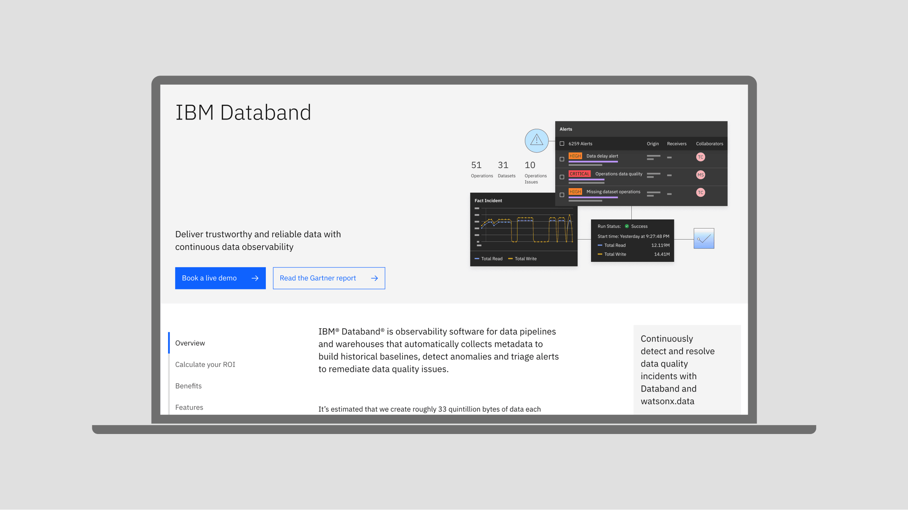

</Column>

<Column colMd={4} colLg={4}>

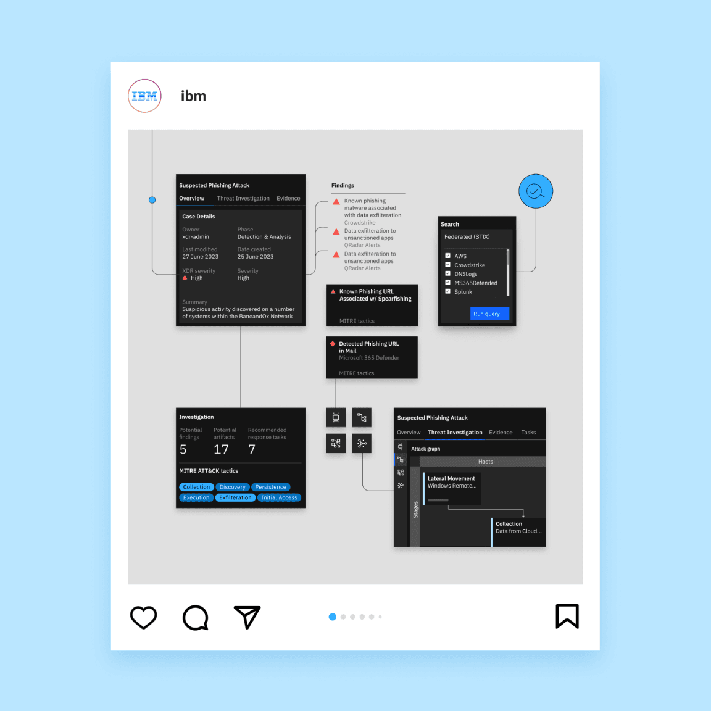

</Column>

</Row>

<Row>

<Column colMd={4} colLg={4}>

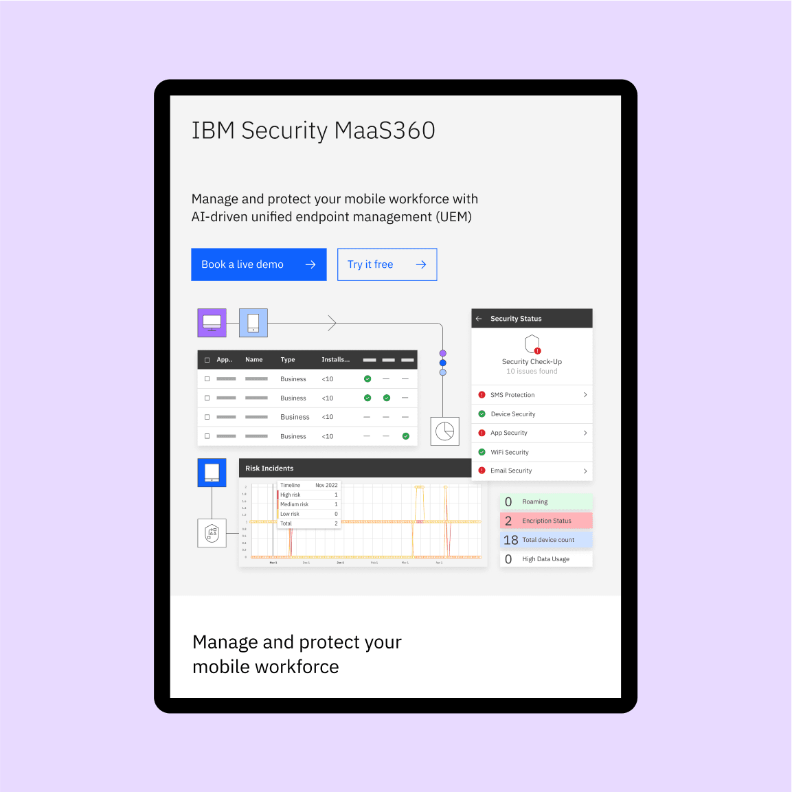

</Column>

<Column colMd={8} colLg={8}>

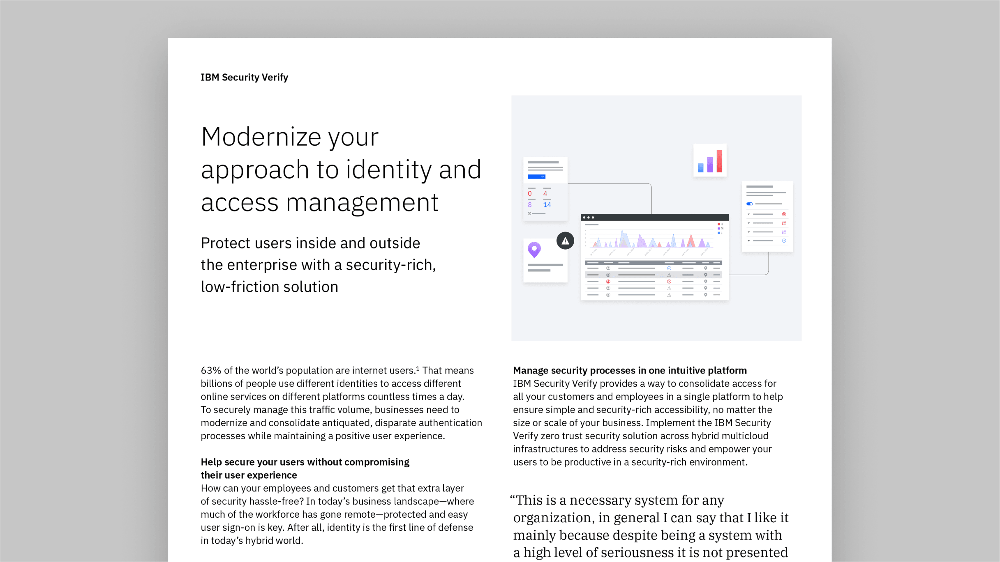

</Column>

</Row>

## When to use this style

Hybrid UI illustrations are used to show a high-level overview of the product’s functionality. They visually communicate complex concepts, and can be used to highlight a particular feature of a product. The style can be used to show our specific differentiators and inspire confidence. They can communicate a vision and reinforce the brand.

In general, hybrid UI illustrations should be used on product pages or assets talking about a specific product, while the actual UI is shown in demos and when you need more detailed information about the product. Hybrid UI illustrations should not be decorative, they should serve a purpose: an introduction to a product’s capabilities and interface. Hybrid UI illustrations are used to show a product’s functionality. They’re not meant for client stories or to highlight a specific use case of a product, but the product as a whole. Use hybrid UI illustrations in top-level communications, websites and marketing materials.

Hybrid UI illustrations should not be used inside the product itself. However, you can use illustrations that reflect the composition style of hybrid UI, focusing on the benefits of the product and the user flow, without inserting high-fidelity elements of the UI.

You can use hybrid UI illustration elements in overview demos of the product. However, in an actual product demo, it’s better to use full product screens to avoid confusion and misrepresentation. 

On IBM dotcom pages, use more expressive imagery, such as hybrid UI illustrations, up top or above the fold, and more productive imagery, such as actual UI, as you go down the page.

## Creating illustrations

Here’s how you get started creating hybrid UI illustrations and understand the approach.

### Getting started

Reach out to the product team to get a better understanding of how the product works, what the user flow is, and what the UI elements are that should be highlighted. The product team can also provide screenshots or editable UI design files if possible. If the only source is non-editable screenshots, scale them to their original size and redraw as close to the original, using the various available libraries and kits where possible.

For guidance about screenshot procurement, visit the [interfaces site](https://pages.github.ibm.com/digital/interfaces/systems/image-procurement/).

### Approach

The first step before starting a hybrid UI illustration is analyzing the product: Is the product using the Carbon Design System? How much visual interest is there throughout the product screens versus the amount of uniformly presented data?

The purpose of hybrid UI illustrations is to create compositions that stay true to the product and, at the same time, are a representation of the IBM brand and in line with the IBM Design Language. There are situations where these purposes clash, and here’s how to approach them.

#### Non-Carbon products
For products not using the Carbon Design System, such as classic products or acquisitions, use the product’s UI elements and make minimal edits to make the illustration consistent with that of other existing hybrid UI illustrations. For example, use IBM Plex® instead of the product’s typeface, while keeping the same size and style. Avoid using elements that contrast greatly with IBM Design Language guidance. Insert brand elements, such as pictograms and illustrations, in the composition.

<Row>

<Column colMd={6} colLg={6}>

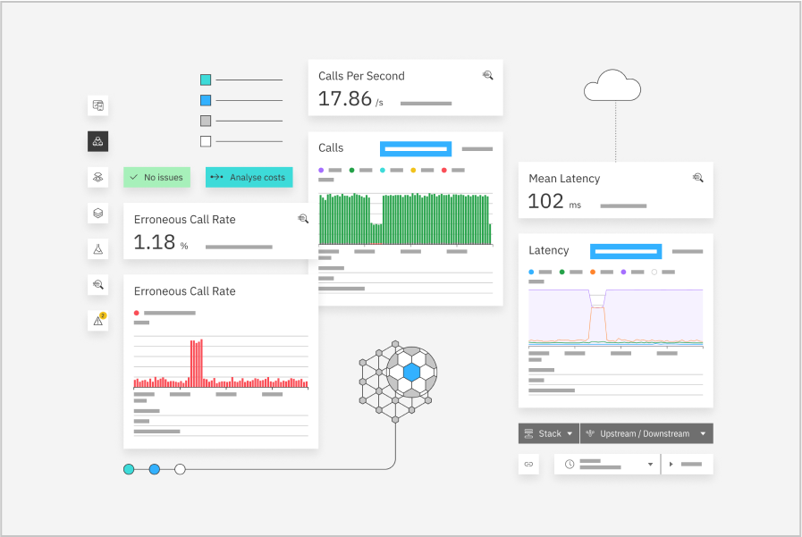

<Caption>
  Illustration for IBM Instana™
</Caption>

</Column>

<Column colMd={6} colLg={6}>

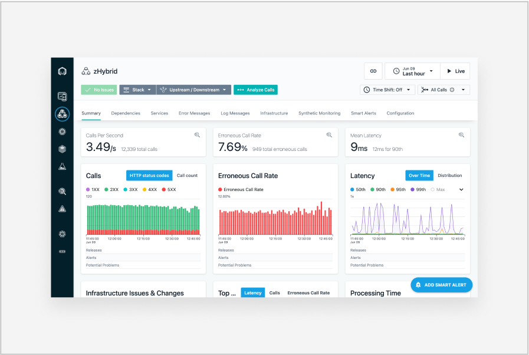

<Caption>
  IBM Instana product UI
</Caption>

</Column>

</Row>

#### Synthax-based products
For products where the UI is synthax-based, add more conceptual elements to the illustration.

<Row>

<Column colMd={6} colLg={6}>

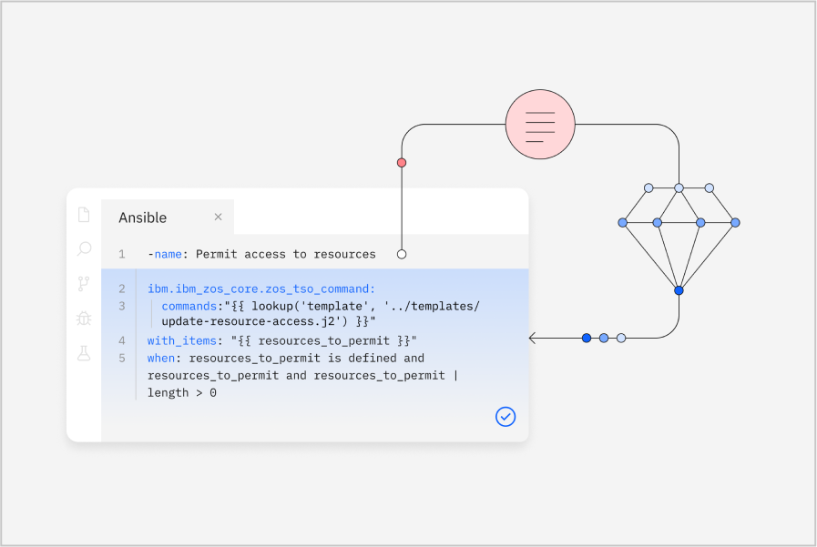

<Caption>
  Illustration for IBM watsonx™ Code Assistant for Red Hat® Ansible® Lightspeed
</Caption>

</Column>

<Column colMd={6} colLg={6}>

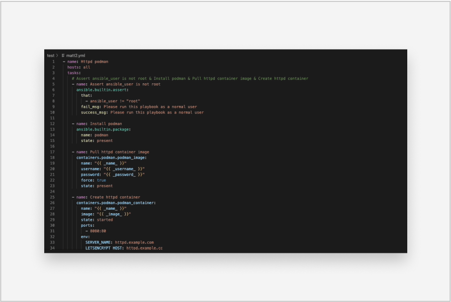

<Caption>
  watsonx™ Code Assistant for Red Hat Ansible Lightspeed product UI
</Caption>

</Column>

</Row>

#### Product suites
Sometimes there’s a need to create a hybrid UI illustration to represent a product suite or a family of products. Sometimes there’s the added complexity of the products looking different, as well. The best way to approach this situation is to steer the illustration toward less fidelity, use a more conceptual approach and focus on the benefits of the products.

<Row>

<Column colMd={6} colLg={6}>

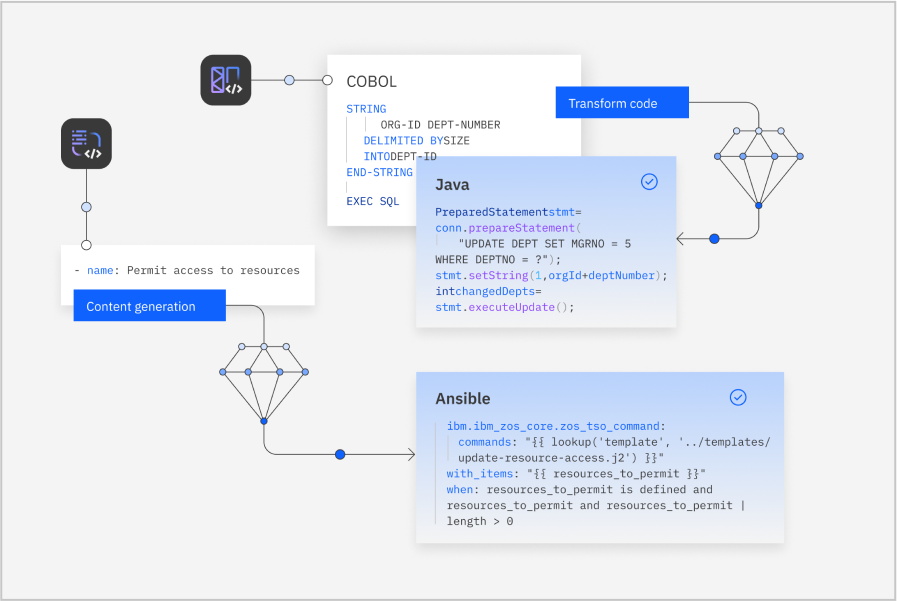

<Caption>
  Illustration for watsonx Code Assistant
</Caption>

</Column>

<Column colMd={6} colLg={6}>

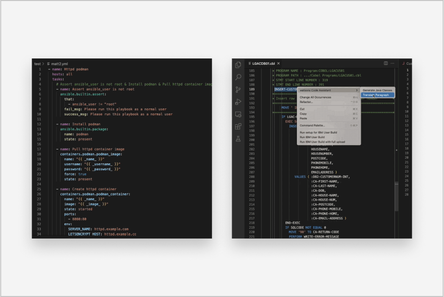

<Caption>
  watsonx Code Assistant products
</Caption>

</Column>

</Row>

### Tips

- Stay faithful to the product.
- Don’t use the same hybrid UI illustration for different products.
- Don’t use a full UI screen in a hybrid UI illustration.
- Keep the ratio of illustration to UI elements balanced: 60% UI, 40% illustration, without tipping the scale in either direction.
- Steer in a conceptual illustrative direction when the product’s UI is complicated to use or when you need to represent a suite of products.
- Use the hybrid UI illustration approach for products where the nature of the UI would not lead to an aesthetically pleasing result.

## AEM usage

When creating a hybrid UI illustration for an AEM leadspace, we recommend using the _Leadspace with foreground asset_ component. For best legibility, draw the artboard twice the size of the needed image on the large breakpoint. 

If you need to use the _Leadspace with background asset_ component, make sure to leave enough clear space around the image so that illustrations don’t overlap with the type or buttons at any breakpoint. 

Find more information about image cropping in the [AEM documentation site](https://pages.github.ibm.com/digital/interfaces/systems/image-crops/#how-to-set-image-crops-in-aem). 

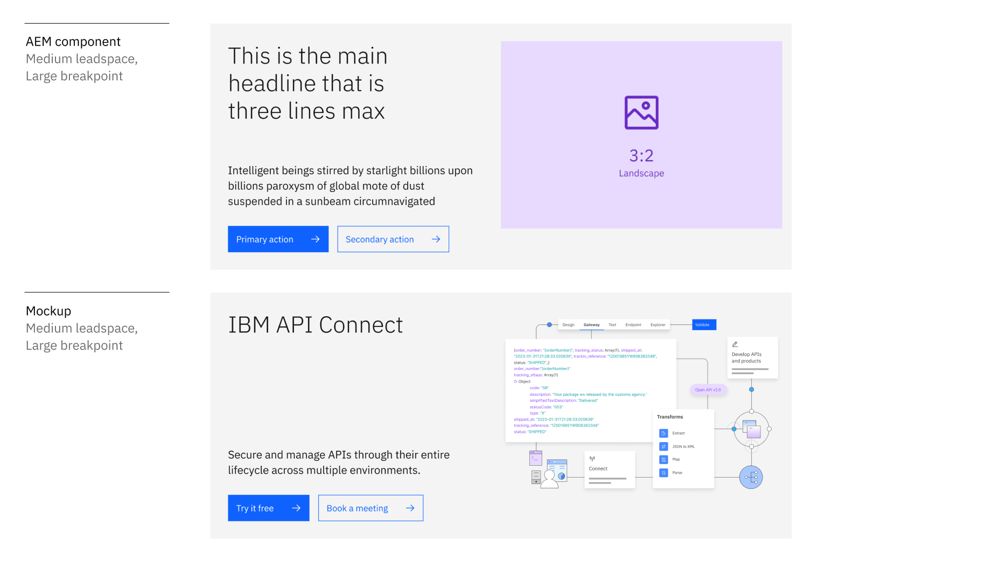

## Motion

Animating a hybrid UI illustration emphasizes a product’s features in a dynamic motion sequence. When animating for IBM dotcom leadspaces, animate the composition in a top-to-bottom motion. 

<Row>
<Column colMd={6} colLg={6}>
<GifPlayer color='dark' className="video-player">

<Video
  autoPlay
  autoStart
  playsInline
  loop="on"
  muted
  src="/assets/usage/motion-section/motion_APIC.mp4"
/>

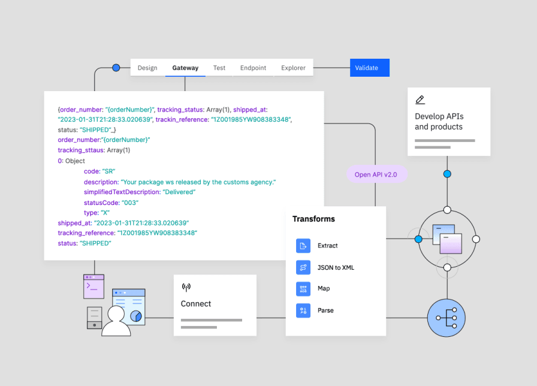

</GifPlayer>
</Column>

<Column colMd={6} colLg={6}>
<GifPlayer color='dark' className="video-player">

<Video
  autoPlay
  autoStart
  playsInline
  loop="on"
  muted
  src="/assets/usage/motion-section/motion_orchestrate.mp4"
/>

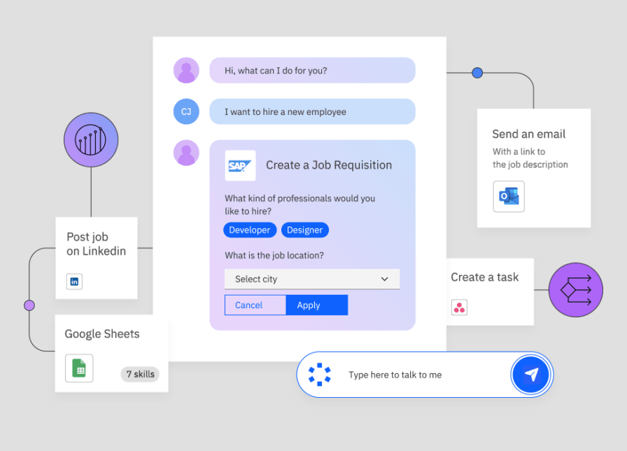

</GifPlayer>
</Column>
</Row>

<Row>
<Column colMd={12} colLg={12}>
<GifPlayer color='dark' className="video-player">

<Video
  autoPlay
  autoStart
  playsInline
  loop="on"
  muted
  src="/assets/usage/motion-section/motion_wastonx_assistant.mp4"
/>

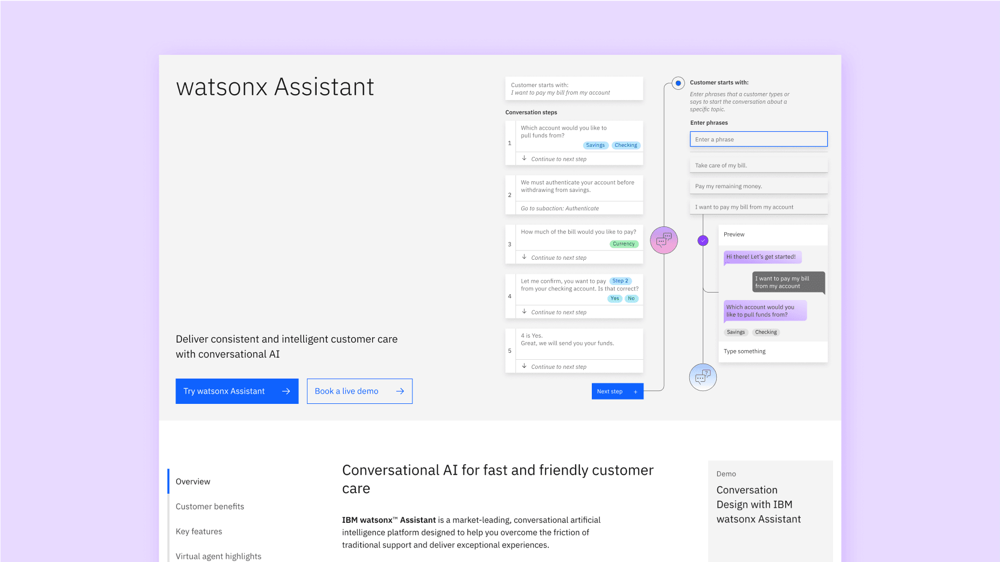

</GifPlayer>
</Column>
</Row>