<PageDescription>

Isometric style is the most spatial and realistic type of illustration at IBM. Isometric style harnesses dimension to create captivating scenes of people and technology at work. Please consider the following guidelines when crafting your Isometric style illustrations.

</PageDescription>

<AnchorLinks>
  <AnchorLink>Resources</AnchorLink>
  <AnchorLink>Volumes</AnchorLink>
  <AnchorLink>Grid</AnchorLink>
  <AnchorLink>Drawing</AnchorLink>
  <AnchorLink>Color</AnchorLink>
  <AnchorLink>Light and shadows</AnchorLink>
</AnchorLinks>

## Resources

<Row>
<Column colMd={4} colLg={4}>

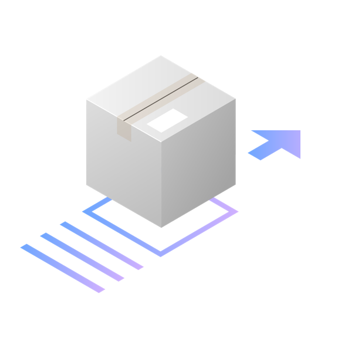

</Column>
<Column colMd={4} colLg={4}>

</Column>
<Column colMd={4} colLg={4}>

</Column>
</Row>

<Row>
<Column colMd={4} colLg={4}>

</Column>
<Column colMd={4} colLg={4}>

</Column>
<Column colMd={4} colLg={4}>

</Column>
</Row>

## Volumes

Isometric style illustrations are visuals that utilize isometric projection, which is a method that creates the illusion of space and dimension on a 2D surface using equal angles. This illustration style is used when it is determined that the aspect of space and dimensions would help better communicate a concept.

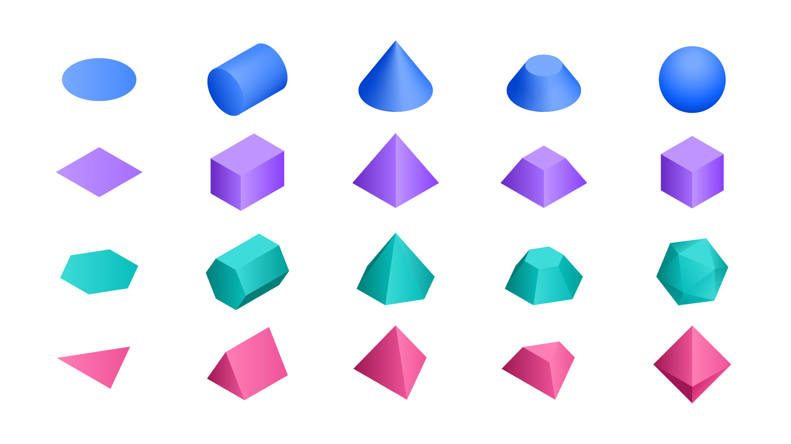

<Row>
<Column colMd={4} colLg={4}>

<Caption>Cylindars combined to make a magnifying glass</Caption>

</Column>
<Column colMd={4} colLg={4}>

<Caption>A cylindar and a rectangular prism combined to make a book</Caption>

</Column>
</Row>

### Behavior

Due to its realism, isometric style is often used to illustrate humans’ relationship with technology. This relationship should be effortless, so everything in the scene should feel light-weight and easy to move with precision. Floating objects, lean dimensions, and precise alignments gives the viewer a sense of airiness and order.

<Row>
<Column colMd={4} colLg={4}>

</Column>
<Column colMd={4} colLg={4}>

</Column>
</Row>

## Grid

Based on the angles of an equilateral triangle, the isometric 2x Grid is essential to creating isometric perspective. To help with alignment, we’ve established an isometric grid layer in Isometric toolkit files.

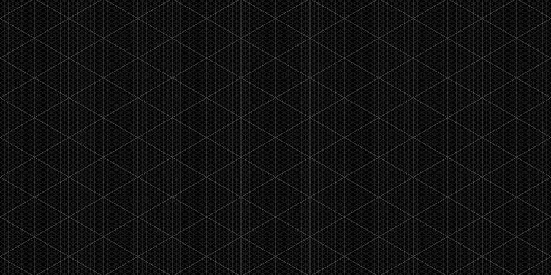

### Snapping to grid

Illustrations should snap to intersections of grid lines in Adobe Illustrator. The grid gives the precise and engineered aesthetic which is vital to any IBM illustration.

<Row>
<Column colMd={4} colLg={4}>
<DoDontExample type="do" caption="Ensure anchor points are snapped to the isometric grid whenever possible.">

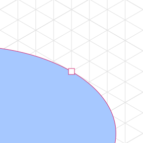

</DoDontExample>
</Column>
<Column colMd={4} colLg={4}>
<DoDontExample type="dont" caption="Don’t place anchor points off-grid unless absolutely necessary.">

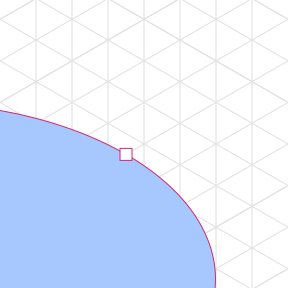

</DoDontExample>
</Column>
</Row>

## Drawing

Objects should be built using basic geometric shapes. An illustrator can effectively draw most any object or scene by artfully combining squares, circles, rectangles and triangles. This example shows the underlying geometry of the drawing.

### Angles

For a consistent look across all Isometric style illustrations it is important that all objects are grounded by these predetermined angles.

### Circular curves

Create curves using the grid as your guide and use quarter, semi and full circles whenever possible to achieve pure and simple curved shapes. Following this guidance will help ensure the engineered aesthetic.

<Row>
<Column colMd={4} colLg={6}>

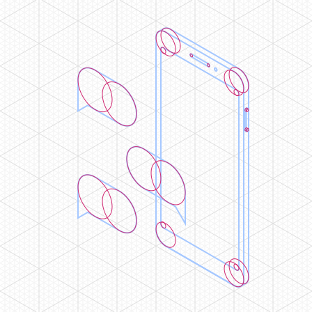

</Column>
<Column colMd={4} colLg={6}>

</Column>
</Row>
<Row>
<Column colMd={4} colLg={4}>
<DoDontExample type="do" caption="Clear and regular curves should be used when possible.">

</DoDontExample>
</Column>
<Column colMd={4} colLg={4}>
<DoDontExample type="dont" caption="Avoid the use of irregular curves when they are not required.">

</DoDontExample>
</Column>
</Row>

### Organic Curves

Organic bexier curves may be used to add more realism and character to your illustration but should be used intentionally and with precision. Basic shapes should always lay the foundation and be used to ground the more irregular curves.

<Row>
<Column colMd={4} colLg={6}>

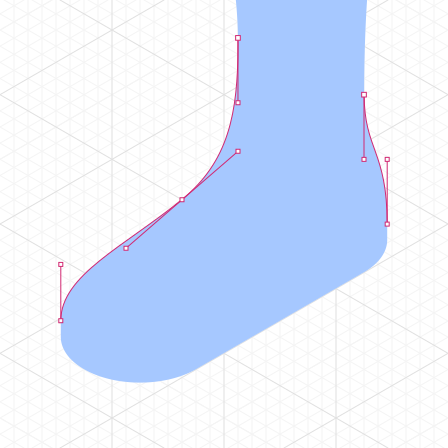

</Column>
<Column colMd={4} colLg={6}>

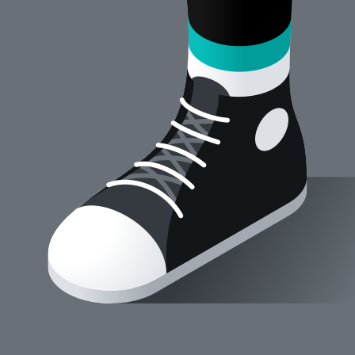

</Column>
</Row>

### Rounded corners and nesting

You can round the corners of angles in Adobe Illustrator for a fluid and controlled look. Here are some specifications for adding radiuses to shape corners.

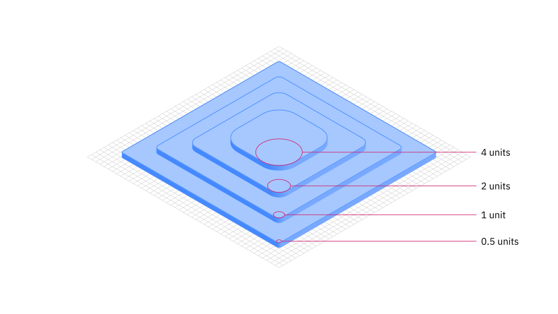

<Row>
<Column colMd={4} colLg={4}>
<DoDontExample type="do" caption="Nested curves should remain equally spaced with increasing radius.">

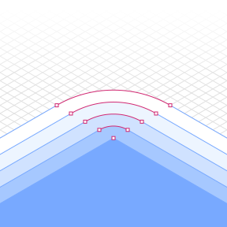

</DoDontExample>
</Column>

<Column colMd={4} colLg={4}>
<DoDontExample type="dont" caption="Avoid nesting curves with equal radiuses.">

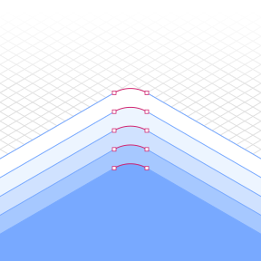

</DoDontExample>
</Column>
</Row>

## Color

Color techniques for isometric illustrations are used to render the scene with more realism than other illustration styles. For general approaches to color, please visit the [tips and techniques](/illustration/tips-and-techniques) page.

### Gradients and shading

Gradients can be an effective way of adding more fidelity to your illustration by implying depth, dimension and movement. It can also be an effective and necessary means of creating definition between neighboring shapes.

<Row>
<Column colMd={4} colLg={4}>

</Column>

<Column colMd={4} colLg={4}>

</Column>
</Row>

### Transparency

Transparency can help determine an object’s materiality and its interaction with light. Whenever possible, use colors from the [IDL color palette](/color) as your starting point, and add transparency only when necessary. Avoid blending modes such as screen, multiply, or overlay.

<Row>
<Column colMd={4} colLg={4}>

</Column>

<Column colMd={4} colLg={4}>

</Column>
</Row>

## Light and shadows

Derrick is working on this section

### Illumination

Light and gradient are used to illuminate what is possible with technology. Illumination communicates technology’s ability to highlight data, reveal insights, and augment human experience.

<Row>
<Column colMd={4} colLg={4}>

</Column>

<Column colMd={4} colLg={4}>

</Column>
</Row>
