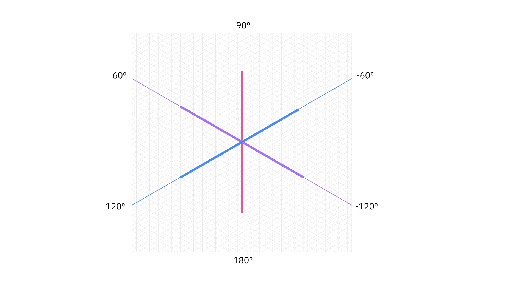
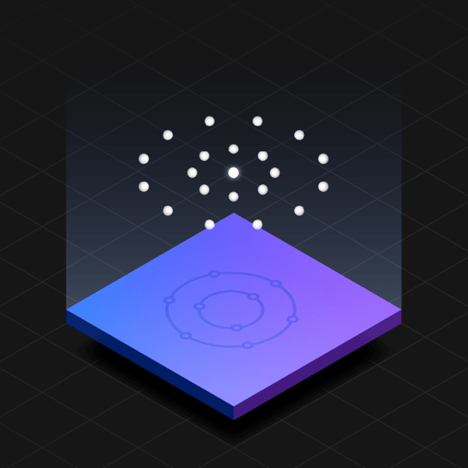

<PageDescription>

Isometric style is the most spatial and realistic type of illustration at IBM. Isometric style harnesses dimension to create captivating scenes of people and technology at work. Please consider the following guidelines when crafting your isometric style illustrations.

</PageDescription>

<AnchorLinks>
  <AnchorLink>Examples</AnchorLink>
  <AnchorLink>Volumes</AnchorLink>
  <AnchorLink>Grid</AnchorLink>
  <AnchorLink>Drawing</AnchorLink>
  <AnchorLink>Color</AnchorLink>
  <AnchorLink>Light and shadows</AnchorLink>
</AnchorLinks>

## Resources

<Row className="resource-card-group">
<Column colMd={4} colLg={4} noGutterSm>
    <ResourceCard
      subTitle="Isometric style starter kit"
      aspectRatio="2:1"
      href="https://github.com/carbon-design-system/carbon/raw/master/packages/pictograms/master/pictogram-master.ai"
      actionIcon="download"
      disabled
      >

  </ResourceCard>
</Column>
</Row>

## Examples

<Row className="mock-gallery">

<Column colMd={4} colLg={4}>

</Column>

<Column colMd={4} colLg={4}>

</Column>

<Column colMd={4} colLg={4}>

</Column>

</Row>

<Row className="mock-gallery">

<Column colMd={4} colLg={4}>

</Column>

<Column colMd={4} colLg={4}>

</Column>

<Column colMd={4} colLg={4}>

</Column>

</Row>

## Volumes

Isometric style illustrations are visuals that utilize isometric projection, which is a method that creates the illusion of space and dimension on a 2D surface using equal angles. This illustration style is used when it is determined that the aspect of space and dimension would help better communicate a concept.

<Row className="mock-gallery">

<Column colMd={4} colLg={4}>

<Caption>Cylinders combined to make a magnifying glass.</Caption>

</Column>

<Column colMd={4} colLg={4}>

<Caption>A cylinder and a rectangular prism combined to make a book.</Caption>

</Column>

</Row>

### Behavior

Due to its realism, isometric style is often used to illustrate humans’ relationship with technology. This relationship should be effortless, so everything in the scene should feel light-weight and easy to move with precision. Floating objects, lean dimensions and precise alignments gives the viewer a sense of airiness and order.

<Row className="mock-gallery">

<Column colMd={4} colLg={4}>

</Column>

<Column colMd={4} colLg={4}>

</Column>

</Row>

## Grid

Based on the angles of an equilateral triangle, the isometric 2x Grid is essential to creating isometric perspective. To help with alignment, we’ve established an isometric grid layer within the [isometric toolkit]() files for Adobe Illustrator.

### Snapping to grid

Illustrations should snap to intersections of isometric grid lines in Adobe Illustrator. The grid gives the precise and engineered aesthetic which is vital to any IBM illustration.

<Row>

<Column colMd={4} colLg={4}>

<DoDontExample type="do" caption="Do make sure the anchor point lands clearly on intersecting grid lines.">

</DoDontExample>

</Column>

<Column colMd={4} colLg={4}>

<DoDontExample type="dont" caption="Don’t place anchor points off-grid unless absolutely necessary.">

</DoDontExample>

</Column>

</Row>

## Drawing

Objects should be built using basic geometric shapes. An illustrator can effectively draw most any object or scene by artfully combining squares, circles, rectangles and triangles. This example shows the underlying geometry of the drawing.

### Angles

For a consistent look across all isometric style illustrations, it is important that all objects are grounded by these predefined angles. 

### Circular curves

Create curves using the grid as your guide and use quarter circles, semicircles and full circles whenever possible to achieve pure and simple curved shapes. Following this guidance will help ensure the engineered aesthetic.

<Row className="mock-gallery">

<Column colMd={4} colLg={6}>

</Column>

<Column colMd={4} colLg={6}>

</Column>

</Row>

<Row className="mock-gallery">

<Column colMd={4} colLg={4}>

<DoDontExample type="do" caption="Do use clear and regular curves when possible.">

</DoDontExample>

</Column>

<Column colMd={4} colLg={4}>

<DoDontExample type="dont" caption="Don't use irregular curves if they can be avoided.">

</DoDontExample>

</Column>

</Row>

### Organic Curves

Organic Bézier curves may be used to add more realism and character to your illustration, but should be used intentionally and with precision. Basic shapes should always lay the foundation and be used to ground the more irregular curves.

<Row className="mock-gallery">

<Column colMd={4} colLg={6}>

</Column>

<Column colMd={4} colLg={6}>

</Column>

</Row>

### Rounded corners and nesting

You can round the corners of angles in Adobe Illustrator for a fluid and controlled look. Here are some specifications to use when applying a radius to your object.

<Row className="mock-gallery">

<Column colMd={4} colLg={4}>
<DoDontExample type="do" caption="Nested lines that curve should remain equally spaced with increasing radius.">

</DoDontExample>
</Column>

<Column colMd={4} colLg={4}>
<DoDontExample type="dont" caption="Avoid the use of different corner radiuses in a nested design.">

</DoDontExample>
</Column>

</Row>

## Color

Color techniques for isometric illustrations are used to render the scene with more realism than other illustration styles. For general approaches to color, please visit the illustration [tips and techniques](/illustration/tips-and-techniques) page.

### Gradients and shading

Gradients can be an effective way of adding more fidelity to your illustration by implying depth, dimension and movement. They can also be applied to various surfaces to imply a point source of light or material qualities.

<Row className="mock-gallery">

<Column colMd={4} colLg={4}>

</Column>

<Column colMd={4} colLg={4}>

</Column>

</Row>

### Transparency

Transparency can help determine an object’s materiality and its interaction with light. Whenever possible, use colors from the [IBM color palette](https://www.ibm.com/design/language/color) as your starting point and add transparency only when necessary. Avoid the use of lighting effects such as screen, multiply and overlay.

<Row className="mock-gallery">

<Column colMd={4} colLg={4}>

</Column>

<Column colMd={4} colLg={4}>

</Column>

</Row>

## Light and shadows

Derrick is working on this section

### Illumination

Light and gradients are used to illuminate what is possible with technology. Illumination communicates technology’s ability to highlight data, reveal insights and augment human experience.

<Row className="mock-gallery">

<Column colMd={4} colLg={4}>

</Column>

<Column colMd={4} colLg={4}>

</Column>

</Row>
