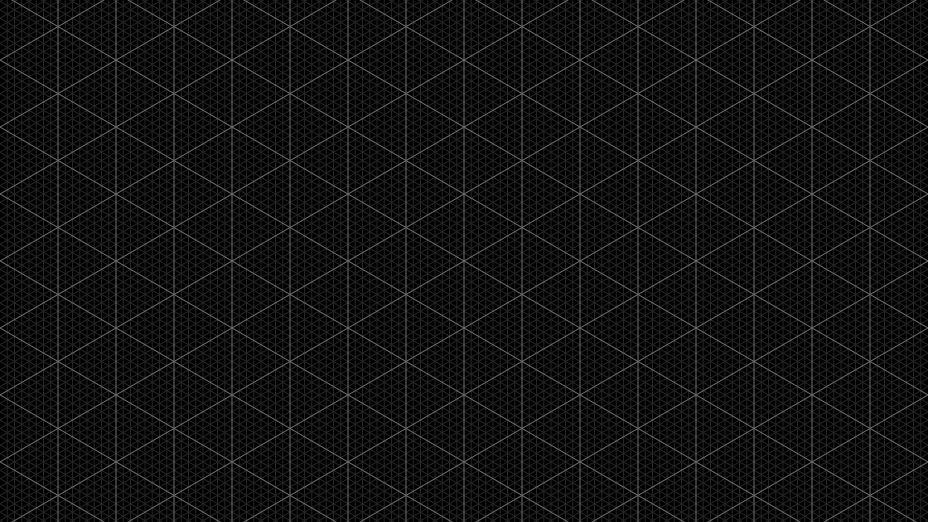
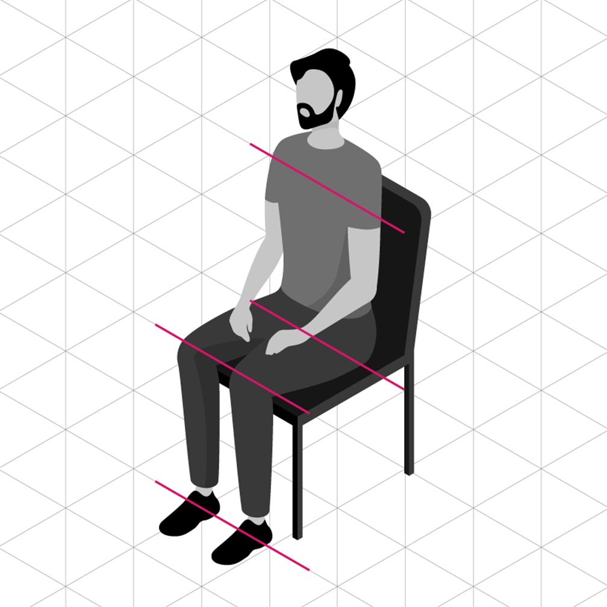

<PageDescription>

Isometric style is the most spatial and realistic type of illustration at IBM.
Isometric style harnesses dimension to create captivating scenes of people and
technology at work. Please consider the following guidelines when crafting your
isometric style illustrations.

</PageDescription>

<AnchorLinks>
  <AnchorLink>Examples</AnchorLink>
  <AnchorLink>Volumes</AnchorLink>
  <AnchorLink>Grid</AnchorLink>
  <AnchorLink>Drawing</AnchorLink>
  <AnchorLink>Color</AnchorLink>
  <AnchorLink>Light and shadow</AnchorLink>
</AnchorLinks>

## Examples

<Row className="mock-gallery">

<Column colMd={4} colLg={4}>

</Column>

<Column colMd={4} colLg={4}>

</Column>

<Column colMd={4} colLg={4}>

</Column>

</Row>

<Row className="mock-gallery">

<Column colMd={4} colLg={4}>

</Column>

<Column colMd={4} colLg={4}>

</Column>

<Column colMd={4} colLg={4}>

</Column>

</Row>

## Volumes

Isometric style illustrations employ the isometric projection method to create
the illusion of space and dimension on a 2D surface using equal angles. Use this
illustration style when the aspect of space and dimension would better help
communicate a concept.

<ArtDirection>

</ArtDirection>

<Row className="mock-gallery">

<Column colMd={4} colLg={4}>

<Caption>Cylinders are combined to make a magnifying glass.</Caption>

</Column>

<Column colMd={4} colLg={4}>

<Caption>
  A cylinder and a rectangular prism are combined to make a book.
</Caption>

</Column>

</Row>

### Behavior

Due to its realism, isometric style is often used to illustrate the relationship
between humans and technology. This relationship should be effortless, and
illustrations should appear lightweight, with actions depicted as easy and
precise. Floating objects, lean dimensions and precise alignments give the
viewer a sense of airiness, ease and order.

<Row className="mock-gallery">

<Column colMd={4} colLg={4}>

</Column>

<Column colMd={4} colLg={4}>

</Column>

</Row>

## Grid

Based on the angles of an equilateral triangle, the isometric 2x grid is
essential to creating isometric perspective. To help you with alignment as you
build illustrations, we’ve established an isometric grid layer within the
[isometric toolkit](https://github.com/carbon-design-system/design-language-website/raw/master/src/pages/illustration/Illustration-isometric-style-kit_v1.ai) files for Adobe Illustrator.

<ArtDirection>

</ArtDirection>

### Snapping to grid

Illustrations should snap to the intersections of the isometric grid lines in
Adobe Illustrator. The grid gives the precise and engineered aesthetic, which is
vital to any IBM illustration.

<DoDontRow>

<DoDont caption="Do make sure the anchor point lands clearly on intersecting grid lines.">

</DoDont>

<DoDont type="dont" caption="Don’t place anchor points off-grid unless absolutely necessary.">

</DoDont>

</DoDontRow>

## Drawing

Objects should be built using basic geometric shapes. An illustrator can
effectively draw almost any object or scene by artfully combining squares,
circles, rectangles and triangles. This example shows the underlying geometry of
the drawing.

<ArtDirection>

</ArtDirection>

### Angles

For a consistent look across all isometric style illustrations, it's important
to ground all objects by these predefined angles.

<ArtDirection>

</ArtDirection>

### Circular curves

Create curves using the grid as your guide and use quarter circles, semicircles
and full circles whenever possible to achieve pure and simple curved shapes.
Following this guidance will help ensure the engineered aesthetic.

<Row className="mock-gallery">

<Column colMd={4} colLg={6}>

</Column>

<Column colMd={4} colLg={6}>

</Column>

</Row>

<DoDontRow>
<DoDont caption="Do use clear and regular curves when possible.">

</DoDont>
<DoDont type="dont" caption="Don’t use irregular curves if they can be avoided.">

</DoDont>
</DoDontRow>

### Organic Curves

Organic Bézier curves may be used to add more realism and character to your
illustration, but should be used intentionally and with precision. Basic shapes
should always lay the foundation and be used to ground the more irregular
curves.

<Row className="mock-gallery">

<Column colMd={4} colLg={6}>

</Column>

<Column colMd={4} colLg={6}>

</Column>

</Row>

<DoDontRow>
<DoDont caption="Always use isometric angles as the foundation when drawing organic curves.">

</DoDont>
<DoDont type="dont" caption="Don’t use non-isometric angles for primary elements that should align to the grid.">

</DoDont>
</DoDontRow>

### Rounded corners and nesting

You can round the corners of angles in Adobe Illustrator for a fluid and
controlled look. Here are some specifications to use when applying a radius to
your object.

<ArtDirection>

</ArtDirection>

<DoDontRow>
<DoDont caption="Nested lines that curve should remain equally spaced with increasing radii.">

</DoDont>
<DoDont type="dont" caption="Avoid the use of different corner radii in a nested design.">

</DoDont>
</DoDontRow>

## Color

Color techniques for isometric illustrations can help render the scene with more
realism than other illustration styles. For general approaches to color, please
visit the illustration [tips and techniques](/illustration/tips-and-techniques)
page.

### Gradients and shading

Gradients can be an effective way of adding more fidelity to your illustration
by implying depth, dimension and movement. They can also be applied to various
surfaces to imply a point source of light or material qualities.

<Row className="mock-gallery">

<Column colMd={4} colLg={4}>

</Column>

<Column colMd={4} colLg={4}>

</Column>

</Row>

### Transparency

Transparency can help determine an object’s materiality and its interaction with
light. Whenever possible, use colors from the
[IBM color palette](https://www.ibm.com/design/language/color) as your starting
point and add transparency only when necessary. Avoid lighting effects, such as
screen, multiply and overlay.

<Row className="mock-gallery">

<Column colMd={4} colLg={4}>

</Column>

<Column colMd={4} colLg={4}>

</Column>

</Row>

## Light and shadow

Light produces shadow which helps create shape and dimension to ground objects
in reality. To achieve a consistent look across isometric style illustrations,
be sure to follow a common set of light and shadow patterns.

### Light source

The key to lighting within the isometric style is consistency. Keep the
direction, or source, of light consistent within your illustration or set of
illustrations. This creates a clear relationship between an object's shape and
the shadow it casts.

<Row className="mock-gallery">

<Column colMd={3} colLg={6}>

</Column>

<Column colMd={3} colLg={6}>

</Column>

</Row>

<DoDontRow>
<DoDont caption="Use a single light source throughout an illustration.">

</DoDont>
<DoDont type="dont" caption="Don’t imply multiple light sources by using various shadow angles.">

</DoDont>
</DoDontRow>

### Shadow types

There are multiple shadow types to choose from, flat shadows have sharp edges,
where gradient shadows fade. It’s important that they’re consistently applied
within a single illustration, or within a particular set of illustrations that
are intended to work together as a group.

<ArtDirection>

</ArtDirection>

<DoDontRow>
<DoDont caption="Use consistent shadow styles throughout an illustration.">

</DoDont>
<DoDont type="dont" caption="Avoid the use of different corner radii in a nested design.">

</DoDont>
</DoDontRow>

### Illumination

Light and gradient can be used to illuminate what’s possible with technology.
Illumination can help communicate technology’s ability to highlight data, reveal
insights and augment human experience.

<ArtDirection>

</ArtDirection>

<Row className="mock-gallery">

<Column colMd={4} colLg={4}>

</Column>

<Column colMd={4} colLg={4}>

</Column>

</Row>
