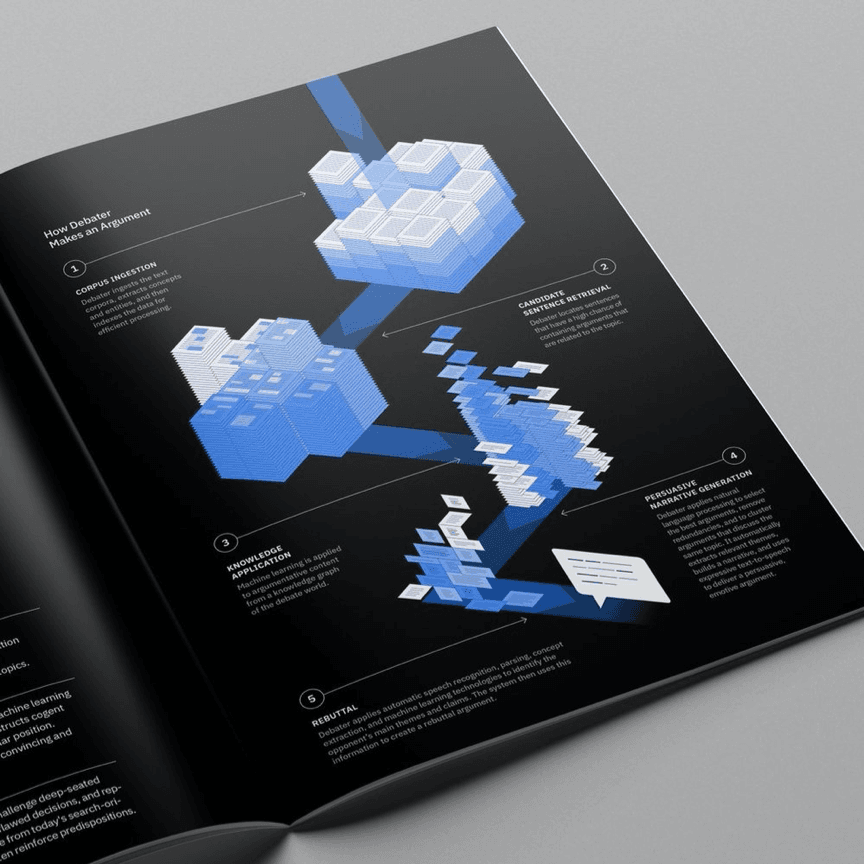
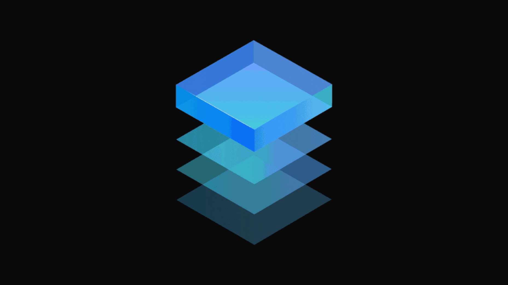
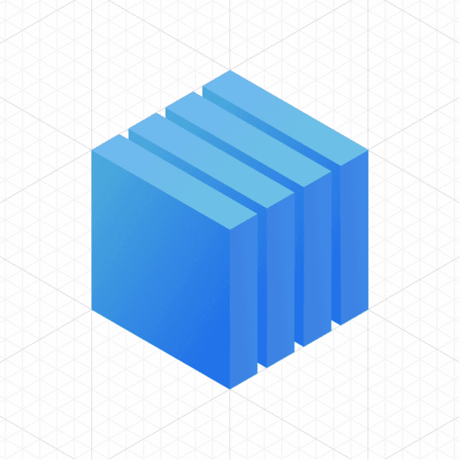
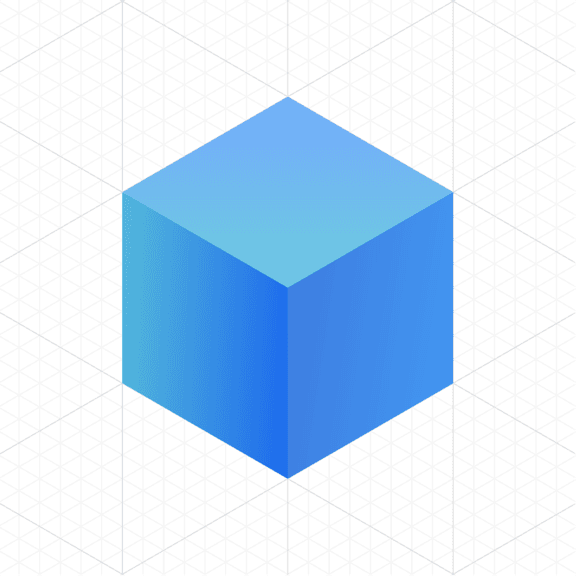
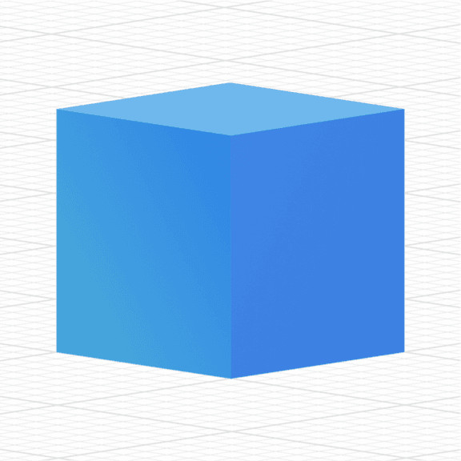

<PageDescription>

Our isometric illustration style does a lot of heavy lifting when it comes to
communicating rich ideas. Use its architectural foundation to express spatial
concepts. Careful use of animation with isometric style creates dynamic
illustrations of environments, objects and concepts.

</PageDescription>

<AnchorLinks>
  <AnchorLink>Examples in use</AnchorLink>
  <AnchorLink>Animation</AnchorLink>
</AnchorLinks>

## Examples in use

<Row className="mock-gallery">

<Column colMd={4} colLg={8}>

</Column>

<Column colMd={4} colLg={4}>

</Column>

</Row>

<Row className="mock-gallery">

<Column colMd={4} colLg={4}>

</Column>

<Column colMd={4} colLg={8}>

</Column>

</Row>

<Row className="mock-gallery">

<Column colMd={4} colLg={8}>

</Column>

<Column colMd={4} colLg={4}>

</Column>

</Row>

<Row className="mock-gallery">

<Column colMd={4} colLg={4}>

</Column>

<Column colMd={4} colLg={4}>

</Column>

<Column colMd={4} colLg={4}>

</Column>

</Row>

## Animation

The isometric illustration style brings a completely unique set of
characteristics that makes animation a distinctly different challenge. The
illusion of depth opens up a wealth of new storytelling options, but care must
be taken to maintain perspective, and animate with a more physical sense of
cause and effect.

<GifPlayer className="video-player video-player__gray">

<Video
  autoPlay
  playsInline
  loop="on"
  muted
  src="/videos/illustration/usage-hero.mp4"
/>

</GifPlayer>

#### Tips

- Maintain perspective when animating forms that are extruded or otherwise
  depict volume in the original design.
- Use rotation selectively as a way to add interest, delight or highlight
  elements of significance.
- Animate to convey weight, mass and precision to emphasize and support the
  physical, volumetric nature of the style.
- Ensure that shadows accurately react to the movement of the objects casting
  them.

### Maintaining perspective

#### Translation

It's incredibly important to follow the IBM isometric grid in animation,
especially when moving objects in space. Objects that don’t behave in accordance
with the 30° incremental angles of their construction immediately break the
illusion of space in this style—elements moving in arcs or diagonally will
quickly break the illusion of space and depth.

<DoDontRow>

<DoDont type="do" caption="Translate objects along the isometric grid on one axis at a time.">
<GifPlayer color="dark" className="video-player">

<Video
  autoPlay
  playsInline
  loop="on"
  muted
  src="/videos/illustration/translation-do.mp4"
/>

</GifPlayer>
</DoDont>

<DoDont type="dont" caption="Avoid overlapping movement on multiple axes simultainiously.">
<GifPlayer color="dark" className="video-player">

<Video
  autoPlay
  playsInline
  loop="on"
  muted
  src="/videos/illustration/translation-dont.mp4"
/>

</GifPlayer>
</DoDont>
  
</DoDontRow>

#### Rotation

Rotation can be selectively added to individual elements as an avenue to create
delight or add interest. However, rotation should only be used if it adheres to
the same rules as 2D objects, applying it to one axis at a time with little to
no overlap.

The animation of each element should typically be treated as you would a purely
2D object, although some designs may lend themselves to more subtly volumetric
and complex animations, such as simple rotations and oscillations.

<DoDontRow>

<DoDont type="do" caption="Keep rotation to one axis at a time.">
<GifPlayer color="dark" className="video-player">

<Video
  autoPlay
  playsInline
  loop="on"
  muted
  src="/videos/illustration/rotation-do.mp4"
/>

</GifPlayer>
</DoDont>

<DoDont type="dont" caption="Avoid overlapping rotation on multiple axes simultainiously.">
<GifPlayer color="dark" className="video-player">

<Video
  autoPlay
  playsInline
  loop="on"
  muted
  src="/videos/illustration/rotation-dont.mp4"
/>

</GifPlayer>
</DoDont>
  
</DoDontRow>

#### Camera

Maintaining the angle of view in an isometric world is extremely important. As
such, the camera should remain locked in place at all times, to not break
perspective. Only on very rare occasions should the construction of a scene
accommodate highly controlled, systematic repositioning of the camera.

<DoDontRow>

<DoDont type="do" caption="Lock the camera to an isometric angle.">
<GifPlayer color="dark" className="video-player">

<Video
  autoPlay
  playsInline
  loop="on"
  muted
  src="/videos/illustration/camera-do.mp4"
/>

</GifPlayer>
</DoDont>

<DoDont type="dont" caption="Avoid changes in perspective.">
<GifPlayer color="dark" className="video-player">

<Video
  autoPlay
  playsInline
  loop="on"
  muted
  src="/videos/illustration/camera-dont.mp4"
/>

</GifPlayer>
</DoDont>
  
</DoDontRow>

### Light, shadow and gradient

Light, shadow and gradient—where possible—should be defined in 2D, not baked
onto 3D surfaces as textures. If more complex objects are required, creating
mattes in a 3D package to accurately depict rotation on an object is the
preferred technique for elements that are brought into a 2D package for
animation.

Even though it presents the illusion of a third dimension, isometric style is
still typically produced in 2D and should be treated as such in motion. Animate
the movement and rotation, and their corresponding shadows, as you would 2D
shapes.

<DoDontRow>

<DoDont type="do" caption="Add color and gradients in 2D.">
<GifPlayer color="dark" className="video-player">

<Video
  autoPlay
  playsInline
  loop="on"
  muted
  src="/videos/illustration/light-do.mp4"
/>

</GifPlayer>
</DoDont>

<DoDont type="dont" caption="Avoid baking gradients on surfaces in 3D.">
<GifPlayer color="dark" className="video-player">

<Video
  autoPlay
  playsInline
  loop="on"
  muted
  src="/videos/illustration/light-dont.mp4"
/>

</GifPlayer>
</DoDont>
  
</DoDontRow>

### Physicality

The introduction of volume creates a whole new avenue to create interest.
However, achieving compelling performances in this perspective requires a
greater emphasis on physically believable motion. It’s vital that we communicate
a sense of mass, weight and momentum, as viewers instinctively expect an object
to move in a natural manner—which is something our animations should attempt to
capture.

<DoDontRow>

<DoDont type="do" caption="Animate with weight and momentum.">
<GifPlayer color="dark" className="video-player">

<Video
  autoPlay
  playsInline
  loop="on"
  muted
  src="/videos/illustration/physicality-do.mp4"
/>

</GifPlayer>
</DoDont>

<DoDont type="dont" caption="Avoid unnatural, exaggerated movements.">
<GifPlayer color="dark" className="video-player">

<Video
  autoPlay
  playsInline
  loop="on"
  muted
  src="/videos/illustration/physicality-dont.mp4"
/>

</GifPlayer>
</DoDont>
  
</DoDontRow>
