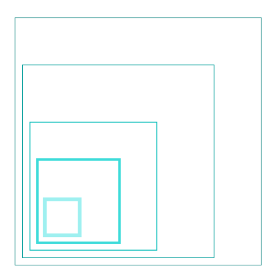
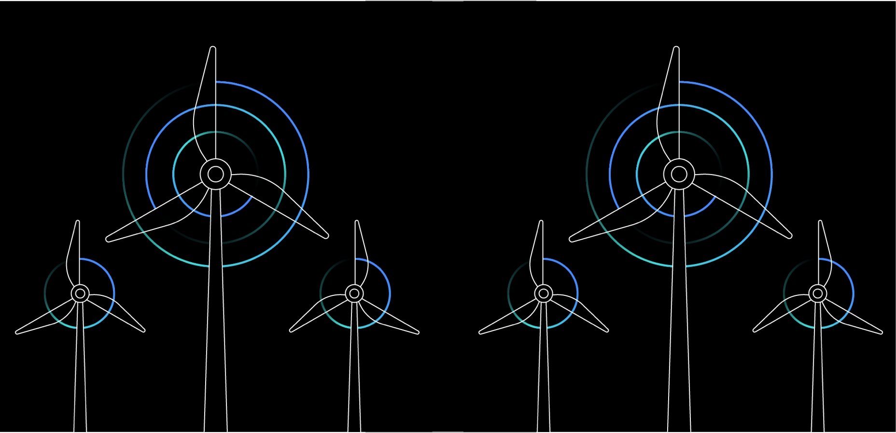
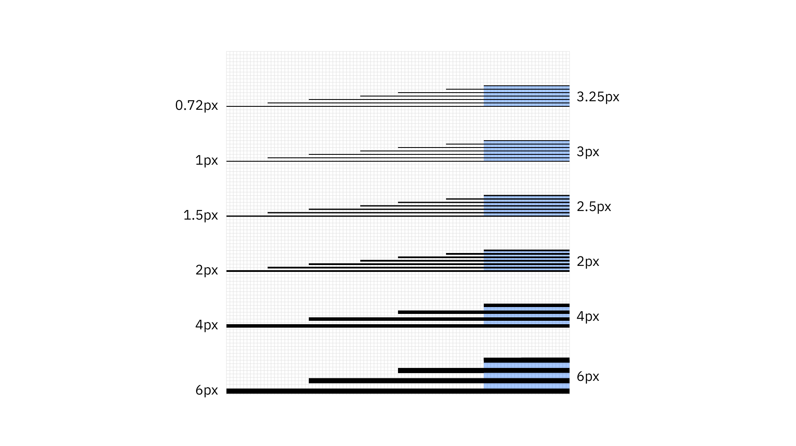

<PageDescription>

Line style is the most basic and immediate type of illustration at IBM. Line style illustrations use a very limited set of line weights, a 4px grid, and simple color rules. Please consider the following guidelines when crafting Line style illustrations.

</PageDescription>

<AnchorLinks>
  <AnchorLink>Lines</AnchorLink>
  <AnchorLink>Grid</AnchorLink>
  <AnchorLink>Drawing</AnchorLink>
  <AnchorLink>Color</AnchorLink>
</AnchorLinks>

## Resources

<Row className="resource-card-group">
<Column colMd={4} colLg={4} noGutterSm>
    <ResourceCard
      subTitle="Line style starter kit"
      aspectRatio="2:1"
      href="https://github.com/carbon-design-system/carbon/raw/master/packages/pictograms/master/pictogram-master.ai"
      actionIcon="download"
      >

  </ResourceCard>
</Column>
</Row>

<Row className="mock-gallery">

<Column colMd={4} colLg={4}>

</Column>

<Column colMd={4} colLg={4}>

</Column>

<Column colMd={4} colLg={4}>

</Column>

</Row>

<Row className="mock-gallery">

<Column colMd={4} colLg={4}>

</Column>

<Column colMd={4} colLg={4}>

</Column>

<Column colMd={4} colLg={4}>

</Column>

</Row>

## Lines

As the name suggests line style uses lines to draw everything. It’s all about the precise nature of the line and the their overall lightness. Using the prescribed set of lines help maintain consistency but also the particular aesthetic of the Line style. The lines suggested in the system use a simple logic that work well with the grid and the Please use these weights.

### Mixing line weights

Mixing line wieghts in an illustration is acceptable as long as you don’t use weights that are too similar. It is also recommended not to use more than four weights within a single illustration.

<DoDontRow>
<DoDont caption="Line weights that are clearly different work very well together. This successful example combines four weights, 1px, 2px, 4px and 6px.">

</DoDont>
<DoDont type="dont" caption="Line weights that are too similar create an unnecessary tension. This example combines three weights, 0.72px, 1px, and 1.5px.">

</DoDont>
</DoDontRow>

### Spacing

It’s very important to have the appropriate space between different line weights. Here is a guide to follow.

<DoDontRow>
<DoDont caption="The space between lines shoule be equal to or greater than the line weights used.">

</DoDont>
<DoDont type="dont" caption="The space between two of the lines is less than the weight of the line weight being used.">

</DoDont>
</DoDontRow>

