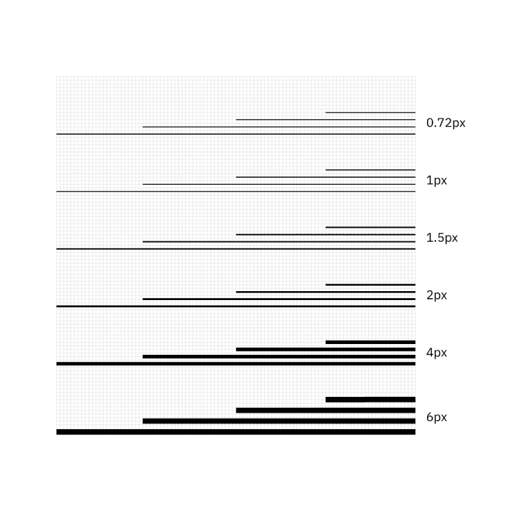
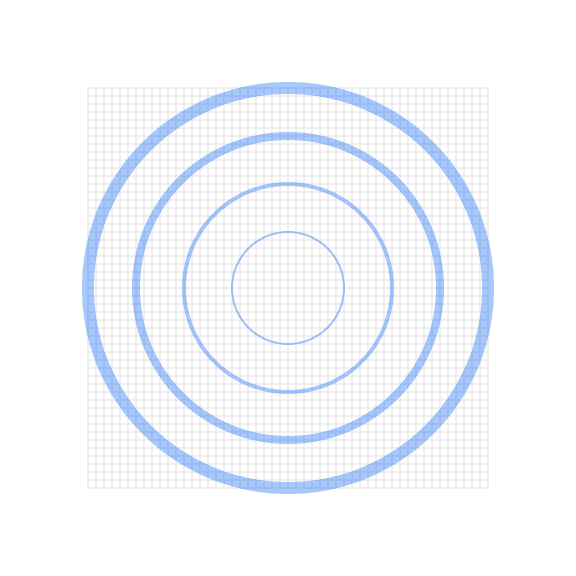
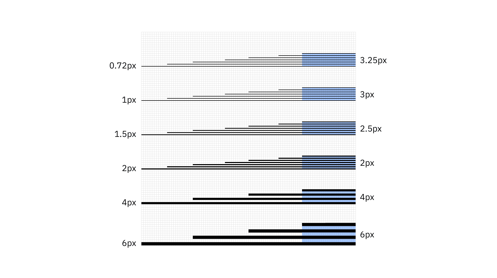
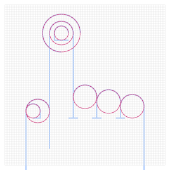
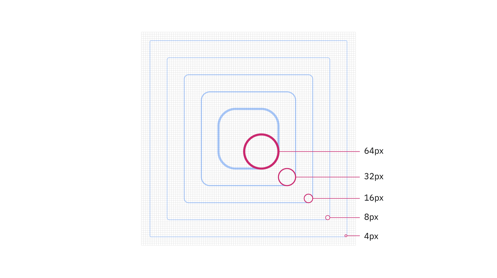

<PageDescription>

Line style is the most basic and immediate type of illustration at IBM. Line
style illustrations use a very limited set of line weights, a 4px grid and
simple color rules. Please consider the following guidelines when crafting line
style illustrations.

</PageDescription>

<AnchorLinks>
  <AnchorLink>Examples</AnchorLink>
  <AnchorLink>Lines</AnchorLink>
  <AnchorLink>Grid</AnchorLink>
  <AnchorLink>Drawing</AnchorLink>
  <AnchorLink>Color</AnchorLink>
</AnchorLinks>

## Examples

<Row className="mock-gallery">

<Column colMd={4} colLg={4}>

</Column>

<Column colMd={4} colLg={4}>

</Column>

<Column colMd={4} colLg={4}>

</Column>

</Row>

<Row className="mock-gallery">

<Column colMd={4} colLg={4}>

</Column>

<Column colMd={4} colLg={4}>

</Column>

<Column colMd={4} colLg={4}>

</Column>

</Row>

## Lines

As the name suggests, the line style uses lines to draw everything. It’s all
about the precise nature of the line and its overall lightness. The lines
prescribed in the system use a simple logic that works well with the
[2x Grid](https://www.ibm.com/design/language/2x-grid) and helps maintain
consistency across the IBM brand.

<ArtDirection>

</ArtDirection>

### Mixing line weights

Mixing line wieghts in an illustration is acceptable as long as you don’t use
weights that are too similar. It’s also recommended to use no more than four
weights within a single illustration.

<DoDontRow>
<DoDont caption="Do mix line weights that have clear purpose and distinction.">

</DoDont>

<DoDont type="dont" caption="Don’t mix line weights that are too similar.">

</DoDont>
</DoDontRow>

### Spacing

It’s very important to have the appropriate space between different line
weights. Here's a guide to follow.

<ArtDirection>

</ArtDirection>

<DoDontRow>
<DoDont caption="Do use line spacing greater than or equal to the line weights being used.">

</DoDont>

<DoDont type="dont" caption="Don’t use line spacing smaller than the line weights being used.">

</DoDont>
</DoDontRow>

## Grid

Building off of the [2x Grid](https://www.ibm.com/design/language/2x-grid), the
line style grid has been optimized to help craft engineered executions of line
work. Since line style illustrations may require very fine detail, a 4px grid
system was chosen as the base unit. The 4px grid should be used for all canvas
sizes. This method will ensure that your illustrations don’t become overly
crowded or busy.

<ArtDirection>

</ArtDirection>

### Snapping to grid

Line style illustrations should be constructed using the “snap to grid” feature
in Adobe Illustrator. This setting ensures that the points along your drawing
can snap to the grid lines underneath your line work. The grid positioning of
the line gives the precise and engineered aesthetic that’s vital to any IBM
illustration.

<DoDontRow>
<DoDont caption="Do make sure the anchor point lands clearly on intersecting grid lines.">

</DoDont>

<DoDont type="dont" caption="Don’t forget to use “snap to grid,” or it may result in misaligned anchor points.">

</DoDont>
</DoDontRow>

## Drawing

To keep your illustrations following an engineered and simplified aesthetic,
please stay away from complex Bézier curves and arbitrary curvature unless the
idea or metaphor requires it to communicate clearly. Angles, curves and rounded
corners should be built using the grid and basic geometries as much as possible.

<ArtDirection>

</ArtDirection>

### Angles

Please use standard angles—15°, 30°, 45°, 60°, 75° and 90° are preferred. Using
these standard angles will help your illustrations appear consistent. Although
you can use any angle, we recommend sticking with the standard angles suggested
here.

<ArtDirection>

</ArtDirection>

### Circular curves

Create curves using the grid as your guide and use quarter circles, semicircles
and full circles whenever possible to achieve pure and simple curved shapes.
Following this guidance will help ensure the engineered aesthetic.

<Row className="mock-gallery">

<Column colMd={4} colLg={6}>

</Column>

<Column colMd={4} colLg={6}>

</Column>

</Row>

<DoDontRow>
<DoDont caption="Do use clear and regular curves when possible.">

</DoDont>

<DoDont type="dont" caption="Don’t use irregular curves if they can be avoided.">

</DoDont>
</DoDontRow>

### Organic curves

Organic Bézier curves may be used to add more realism and character to your
illustration, but should be used intentionally and with precision. Basic shapes
should always lay the foundation and be used to ground the more irregular
curves.

<Row className="mock-gallery">

<Column colMd={4} colLg={6}>

</Column>

<Column colMd={4} colLg={6}>

</Column>

</Row>

### Rounded corners and nesting

You can round the corners of angles in Adobe Illustrator for a fluid and
controlled look. Here are some specifications to use when applying a radius to
your object.

<ArtDirection>

</ArtDirection>

<DoDontRow>
<DoDont caption="Do equally space nested lines with increasing radii.">

</DoDont>

<DoDont type="dont" caption="Don’t use different corner radii when nesting lines.">

</DoDont>
</DoDontRow>

## Color

Each illustration style has a slightly different expression of color based on
the characteristics of the elements being used. Stroked lines, for example, have
the unique quality of allowing gradients and transparencies to follow the path
of the stroke. For general approaches to color, please visit the illustration
[tips and techniques](https://www.ibm.com/design/language/illustration/tips-and-techniques)
page.

### Gradients

Gradients can be an effective way of adding more fidelity to your linework by
implying depth, dimension and movement. For best results, apply the gradient so
that it follows the path of the stroke.

<Row className="mock-gallery">

<Column colMd={4} colLg={4}>

</Column>

<Column colMd={4} colLg={4}>

</Column>

</Row>

### Transparency

In most cases, it’s recommended to use opaque lines and avoid the use of
lighting effects, such as transparency and multiply. This technique helps ensure
consistent colors across all our illustrations. Transparency effects can still
be implied by carefully selecting sequential swatches from the palette or by
using gradients where one of the swatches blends into the background.

<Row className="mock-gallery">

<Column colMd={4} colLg={4}>

</Column>

<Column colMd={4} colLg={4}>

</Column>

</Row>
