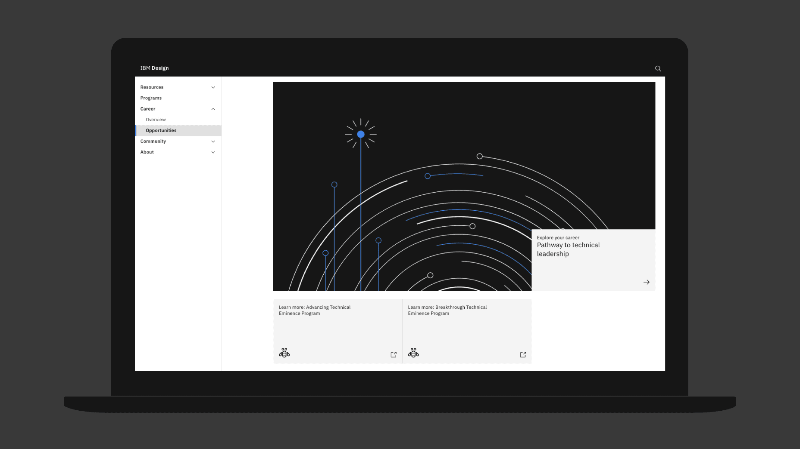
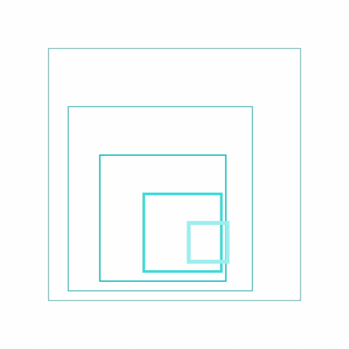

<PageDescription>

We apply line style effectively across many formats—from technical drawings to
spot illustrations to extended multimedia campaigns that support complex
narratives. Its light and airy quality suits more subtle visual expressions,
while its precise and engineered nature ideally expresses diagrams and more
detailed scenarios.

</PageDescription>

<AnchorLinks>
  <AnchorLink>Examples in use</AnchorLink>
  <AnchorLink>Animation</AnchorLink>
</AnchorLinks>

## Examples in use

<Row className="mock-gallery">

<Column colMd={4} colLg={8}>

</Column>

<Column colMd={4} colLg={4}>

</Column>

</Row>

<Row className="mock-gallery">

<Column colMd={4} colLg={4}>

</Column>

<Column colMd={4} colLg={8}>

</Column>

</Row>

<Row className="mock-gallery">

<Column colMd={4} colLg={8}>

</Column>

<Column colMd={4} colLg={4}>

</Column>

</Row>

## Animation

The forthright construction and reduced aesthetic of line-style animations lend
themselves particularly well to deftly applied stroke effects and geometrically
driven animation.

<GifPlayer className="video-player">

<Video
  autoPlay
  playsInline
  loop="on"
  muted
  src="/videos/illustration/ls-usage-hero.mp4"
/>

</GifPlayer>

#### Tips

- Keep shapes true to the original design. Be careful of custom path animation
  and rely on `position`, `rotation` and `scale`.
- Ensure gradients track with strokes as they move through the frame.
- Apply simple camera moves on rare occasions, but only if they further the
  message.
- Utilize shape layers in Adobe After Effects to create rectangles and circles
  to maintain flexibility, while ensuring precision.

### Gradients

Gradients can add interest to uncomplicated animations but can be technically
challenging to execute well. When illustrating for motion, avoid creating or
animating complex gradients unless they’re necessary to convey the message.

<Row className="mock-gallery">

<Column colMd={4} colLg={4}>

<GifPlayer className="video-player">

<Video
  playsInline
  autoPlay
  loop="on"
  muted
  src="/videos/illustration/ls-gradients-1.mp4"
/>

</GifPlayer>

<Caption>Use gradients if they’re relevant to the concept.</Caption>

</Column>

<Column colMd={4} colLg={4}>

<GifPlayer className="video-player">

<Video
  playsInline
  autoPlay
  loop="on"
  muted
  src="/videos/illustration/ls-gradients-2.mp4"
/>

</GifPlayer>

<Caption>
  Avoid complex gradients if the message can be conveyed without it.
</Caption>

</Column>

</Row>

### Offset and overlap

When offsetting the movement of objects, it’s crucial that we prevent
overlapping linework. Closely offset elements feel guided and finely
choreographed. Conversely, overlapping strokes create an impression of busyness
and disorder.

<DoDontRow>

<DoDont type="do" caption="Choreographed offsets on each object create visual interest.">
<GifPlayer color="dark" className="video-player">

<Video
  playsInline
  autoPlay
  loop="on"
  muted
  src="/videos/illustration/ls-offset-do.mp4"
/>

</GifPlayer>
</DoDont>

<DoDont type="dont" caption="Avoid overlapping objects.">
<GifPlayer color="dark" className="video-player">

<Video
  playsInline
  autoPlay
  loop="on"
  muted
  src="/videos/illustration/ls-offset-dont.mp4"
/>

</GifPlayer>
</DoDont>
  
</DoDontRow>

### Design-first performance

In general, line illustrations that depict faces, hands or the anatomy can feel
alien and rigid when animated with realistic movements. Instead, lean into the
graphic nature of each composition, animating the underlying graphic shapes to
gesture at realism, without closely imitating it.

<DoDontRow>

<DoDont type="do" caption="Here’s a graphic interpretation of human performance.">
<GifPlayer color="dark" className="video-player">

<Video
  playsInline
  autoPlay
  loop="on"
  muted
  src="/videos/illustration/ls-design-do.mp4"
/>

</GifPlayer>
</DoDont>

<DoDont type="dont" caption="Overly fluid performances degrade the design.">
<GifPlayer color="dark" className="video-player">

<Video
  playsInline
  autoPlay
  loop="on"
  muted
  src="/videos/illustration/ls-design-dont.mp4"
/>

</GifPlayer>
</DoDont>
  
</DoDontRow>
