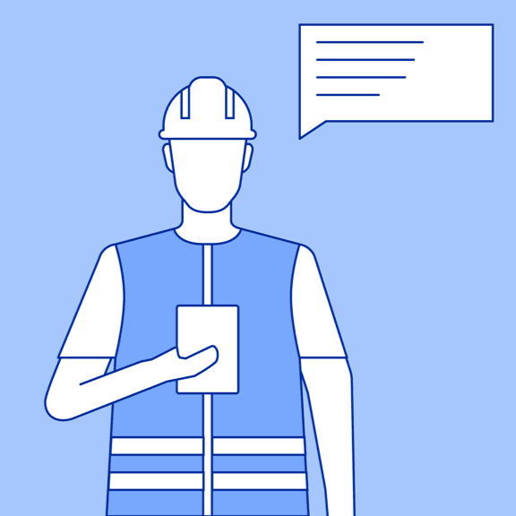
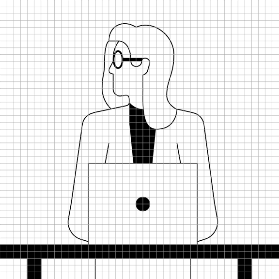
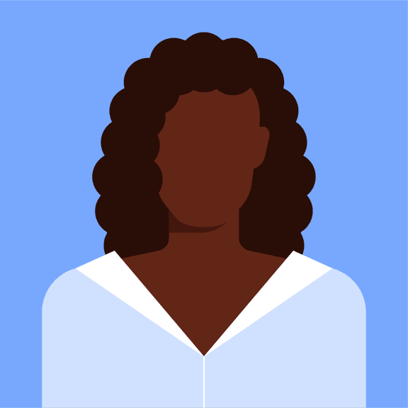
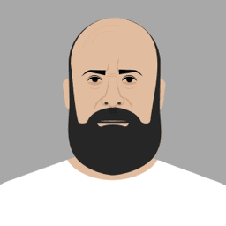
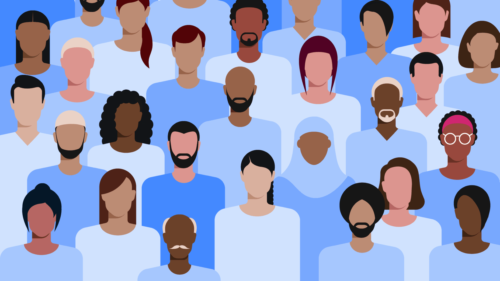
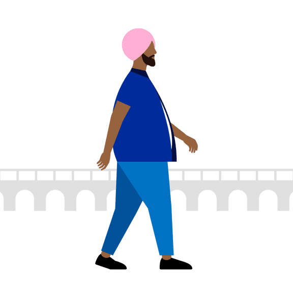

import SwatchPeoplePaletteWidget from '../../../components/SwatchPeoplePaletteWidget';

<PageDescription>

IBM serves a global audience of businesses, as well as social good through sustainability, ethical AI and racial equity initiatives. Our technology sits at the heart of our brand purpose—to be the catalyst that makes the world work better. Humanity is integral to our work, bringing together people and technologies to create outcomes larger than we could accomplish alone. We celebrate the vast diversity of personalities, cultures and abilities in an inclusive way through illustration guidance with an established aesthetic that’s identifiably IBM.

</PageDescription>

<AnchorLinks>

<AnchorLink>Examples</AnchorLink>
<AnchorLink>Character anatomy</AnchorLink>
<AnchorLink>Portraiture</AnchorLink>
<AnchorLink>Diversity and inclusion</AnchorLink>
<AnchorLink>People palette</AnchorLink>

</AnchorLinks>

## Examples

<Row>
<Column colMd={12} colLg={12}>

</Column>
</Row>
<Row>
<Column colMd={4} colLg={4}>

</Column>
<Column colMd={4} colLg={4}>

</Column>
<Column colMd={4} colLg={4}>

</Column>
</Row>
<Row>
<Column colMd={12} colLg={12}>

</Column>
</Row>
<Row>
<Column colMd={8} colLg={8}>

</Column>
<Column colMd={4} colLg={4}>

</Column>
</Row>

## Character anatomy

Our approach to anatomy is honest. We want our audience to see themselves reflected in a simplified, yet realistic way. One of the most thoughtfully crafted principles to underpin our illustration style is respect. Never cross the line to caricature or exaggeration. The essential elements within a design should demonstrate personality and culture with function and purpose. Avoid unnecessary decoration.

### Grid

Everything that uses the IBM Design Language is based on the grid. Illustrating people follows this same discipline. When we use the grid to craft effective, compelling characters that are based on proportions and measurements, it ensures they look at home in our brand expressions, regardless of format. We recommend using realistic proportions with minimal detail, unless the story you’re telling requires otherwise. It may be necessary to make slight deviations from the grid when you need to create more organic features, such as noses or hands.

<Row>
<Column colMd={12} colLg={12}>

</Column>
</Row>
<Row>
<Column colMd={4} colLg={4}>

</Column>
<Column colMd={4} colLg={4}>

</Column>
</Row>

### Skeleton

We build our human figures using an eight-head-high construct. This unit of measurement provides classical proportions yet offers you the flexibility to customize a figure. This structure is geometric and grid-aligned—two features that make this foundational template for human-character building accessible to designers of any skill level. While the grid provides structure, add more natural vitality with organic curves to express personality, style and character that's based on your story’s requirements.

<Row>
<Column colMd={12} colLg={12}>

</Column>
</Row>

### Skeleton progression and examples

<Tabs>
<Tab label="Line and flat">

</Tab>
<Tab label="Isometric">

</Tab>
</Tabs>
<Tabs>
<Tab label="Line and flat">

</Tab>
<Tab label="Isometric">

</Tab>
</Tabs>

## Portraiture

When working with portraiture, it’s important to keep the simplified underlying geometry in mind. Even though faces come in all shapes and sizes, remember that accessibility for your audience is aided by the use of realistic proportions. Keep facial expressions neutral. Avoid exaggerated expressions. You want a portrait, not a cartoon.

<Row>
<Column colMd={12} colLg={12}>

</Column>
</Row>
<Row>
<Column colMd={4} colLg={4}>

</Column>
<Column colMd={4} colLg={4}>

</Column>
<Column colMd={4} colLg={4}>

</Column>
</Row>
<Row>
<Column colMd={8} colLg={8}>

</Column>
<Column colMd={4} colLg={4}>

</Column>
</Row>

### High-fidelity portraits

In certain use cases, your portraiture illustrations may benefit from additional high-fidelity refinements. For example, you may wish to render the likeness of specific individuals. Suppose you have three individuals presenting but only two have good-quality headshots. You can render all three using high-fidelity illustrations for a modern touch. This technique is also successful when creating personas, which may require a specific range of emotions to be conveyed.

<Row>
<Column colMd={4} colLg={4}>

</Column>
<Column colMd={4} colLg={4}>

</Column>
<Column colMd={4} colLg={4}>

</Column>
</Row>
<Row>
<Column colMd={2} colLg={2}>

</Column>
<Column colMd={2} colLg={2}>

</Column>
<Column colMd={2} colLg={2}>

</Column>
<Column colMd={2} colLg={2}>

</Column>
<Column colMd={2} colLg={2}>

</Column>
<Column colMd={2} colLg={2}>

</Column>
</Row>

## Diversity and inclusion

With a global footprint, it’s vital that our designs reflect that diversity and include a wide variety of gender, age, race, accessibility and cultural nuances. While each character should maintain the basic proportions, illustrators should possess the sensitivity to include appropriate elements for every society, such as skin tone and body structure. Consider using props to represent various cultures.

<Row>
<Column colMd={12} colLg={12}>

</Column>
</Row>

### Gender, race, accessibility, geographies and cultures

We aim to reflect various communities and connect people across cultures and continents. It’s important that we represent different races, ages, abilities and body types as accurately as possible. Honest, realistic depictions help us celebrate  our global community with respect and care and as much diversity as we see in the world.

<Row>
<Column colMd={4} colLg={4}>

</Column>
<Column colMd={4} colLg={4}>

</Column>
<Column colMd={4} colLg={4}>

</Column>
</Row>

### Body shapes and sizes

Our human illustrations must reflect the people of our communities in an honest and empathetic manner. Body structure and types vary across cultures, geographies and lifestyles. As you construct your characters, include differently abled individuals, as well. Diversity in various body types and pose depictions will help the audience recognize themselves and more easily assimilate the ideas you are expressing.

<Row>
<Column colMd={4} colLg={4}>

</Column>
<Column colMd={4} colLg={4}>

</Column>
<Column colMd={4} colLg={4}>

</Column>
</Row>

### Clothing, hairstyles, props

Suitable clothing, hairstyles, body language and props can significantly add to the character and idea being expressed. These elements can describe a character’s life stages, occupations or, perhaps, where they are from. Every element adds to the sense of familiarity and understanding for your audience.

As for props, be judicious in their use. Bags, laptop satchels, smart devices, hats—these elements describe the personality of the character. Be thoughtful about the value every prop brings to the overall illustration.

<Row>
<Column colMd={12} colLg={12}>

</Column>
</Row>

## People palette

Our palette is engineered by blending red and green to create two general hues—Rose and Almond. The gradation from light to dark follows the same structure as the IBM Design Language color palette so that the same contrast ratios apply for accessibility purposes. This palette is intended to represent a wide variety of ethnic and geographic diversity and should be reserved specifically for skin, hair and nails. It shouldn’t be considered as an extension of the main IBM color palette.

[Wrong PMS an CYMK values]

<SwatchPeoplePaletteWidget palettes={[['rose', 'almond']]} />

<Row className="resource-card-group">
<Column colMd={4} colLg={4} noGutterSm>
    <ResourceCard
      subTitle="[Missing ZIP] People palette (.ase and .clr)"
      aspectRatio="2:1"
      href="#"
      actionIcon="download"
      >

  </ResourceCard>
</Column>
</Row>