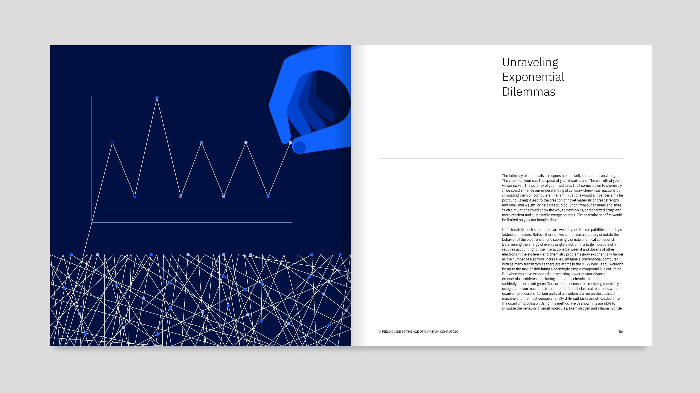
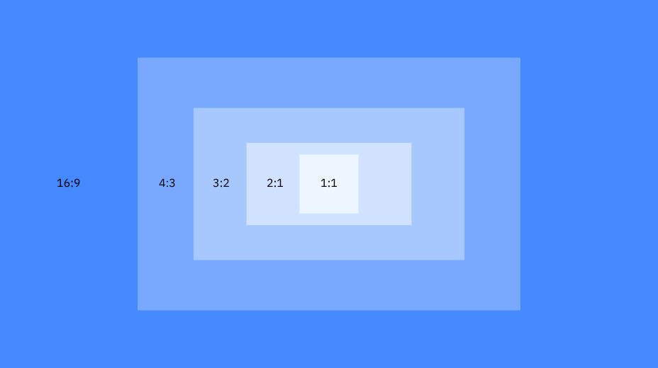
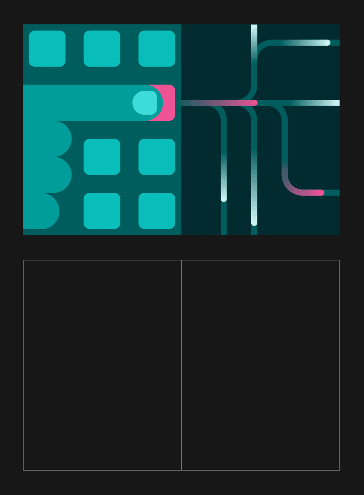
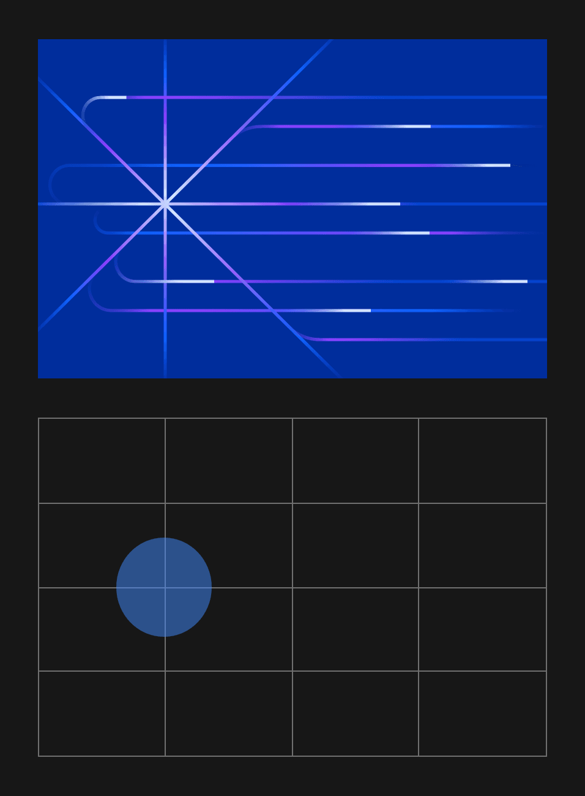
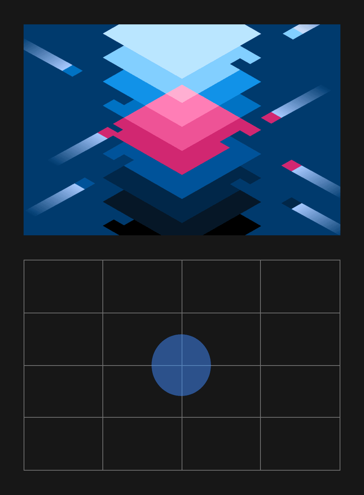
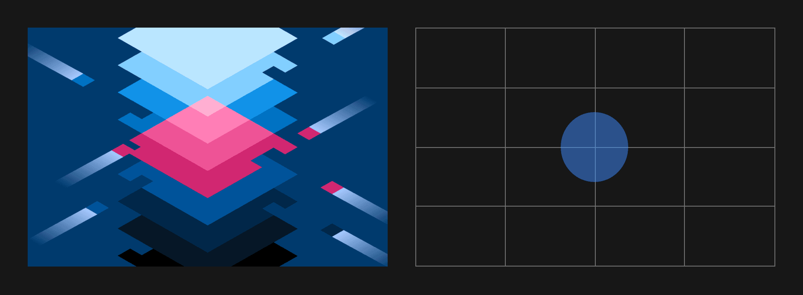

<PageDescription>

Illustrations can move a viewer from one point of view to another instantly.
Ways of seeing them vary from abstract to literal, from micro to macro and more.
The intent of a piece helps determine a framework and canvas, while considered
use of color provides deeper meaning. Use these tips and techniques to build
powerful illustrations.

</PageDescription>

<AnchorLinks>
  <AnchorLink>Ways of seeing</AnchorLink>
  <AnchorLink>Intent</AnchorLink>
  <AnchorLink>Color</AnchorLink>
  <AnchorLink>Canvases</AnchorLink>
  <AnchorLink>Composition</AnchorLink>
</AnchorLinks>

## Ways of seeing

There are many ways of communicating ideas with illustrations. Some are more
literal, some more abstract, some zoomed-in, some zoomed-out while others
require more fidelity to capture and convey the details. Whatever the best
strategy, IBM illustration styles have been developed with this diversity in
mind so that you can determine which approach best depicts the concepts or the
nature of the subject.

### Abstract and literal

Expressing concepts in abstract ways creates interest and exciting compositions,
while literal executions can communicate complicated concepts more clearly. Both
techniques are vital for communications with illustrations.

<Row className="mock-gallery">

<Column colMd={4} colLg={6}>

<Caption>Abstraction is more conceptual and provocative.</Caption>
</Column>
<Column colMd={4} colLg={6}>

<Caption>Literal expressions are more explanatory and utilitarian.</Caption>
</Column>

</Row>

### Micro and macro

IBM has a long and rich history of showing systems in micro and macro scales.
This ability to communicate in both scales allows us to communicate the hard to
see or expansive concepts. These views are critical to illustration techniques
and effectiveness.

<Row className="mock-gallery">

<Column colMd={4} colLg={6}>

<Caption>Micro views zoom into the subject.</Caption>
</Column>
<Column colMd={4} colLg={6}>

<Caption>Macro views show a larger picture.</Caption>
</Column>

</Row>

### Low fidelity and high fidelity

Some illustrations benefit from being simple and direct while others require
more fidelity to capture greater detail or offer a dramatic effect. Illumination
is always an idea to consider with color and detailing techniques, such as
gradients, which can help communicate more vividly.

<Row className="mock-gallery">

<Column colMd={4} colLg={6}>

<Caption>Solid color is more simple and direct.</Caption>
</Column>
<Column colMd={4} colLg={6}>

<Caption>Gradients and tone add depth and drama.</Caption>
</Column>

</Row>

## Intent

Knowing the intent of your illustration helps create the framework for
decision-making. Will it serve as the cover of a brochure, a large wall at an
event or support a series of ideas in a website. Illustrations can live within a
wide variety of sizes and environments whether digital or physical. There are
different types of illustrations used for various purposes at different scales
and complexities.

### Featured

Featured, or hero, illustrations are impactful. These delightful illustrations
tell complex stories. Hero illustrations tend to be more metaphorical and
intricate than other types of imagery and may use more color, space and
elements. While heros are more complex and imaginative, they should remain
focused and balanced. Maintaining a sense of professionalism and organization
through thoughtful composition is key.

### Supportive

Supportive, or spot, illustrations are simplified illustrations that usually
enhance other content. Because they are supporting elements, spot illustrations
must be easily read so viewers grasp concepts at glance. Spot illustrations are
focused, but maintain a feeling of delight and nimbleness, guiding a viewer
through a narrative. Spot illustrations are commonly used in digital empty
states, in composition with other spot illustrations or paired with text.

## Color

Color in illustration sets the tone, gives meaning and reinforces our brand
expression. When choosing colors for your illustrations, consider their
association with your particular product or communication. When chosen
thoughfully, colors can achieve engaging and delightful results.

The starting point for illustrations should always be the
[IBM color palette](https://www.ibm.com/design/language/color). Adherence to
this palette creates brand consistency and distinction. When working on specific
business units within IBM, please reference the individual
[brand guidelines](https://www.ibm.com/brand/systems) for more detailed color
guidance.

### Color schemes

There are many different ways to combine swatches from the IBM color palette,
depending on the style and intent of your illustration. Below are a few common
approaches to consider.

#### Monochromatic

Monochromatic illustrations have a simple and direct quality to them and are
comprised of tints and tones of a single hue. This tehnique has a logical,
systematic and engineered look. Within this scheme, flat or tint techniques can
be applied.

<Row className="mock-gallery">
<Column colMd={4} colLg={4}>

</Column>
<Column colMd={4} colLg={4}>

</Column>
<Column colMd={4} colLg={4}>

</Column>
</Row>

#### Analogous

Analogous colors bring a harmonious quality by using neighboring hues from the
palette. This technique adds subtle depth, movement and fidelity to an
illustration. Two to three hues work best for this technique. Additional colors
will likely add unnecessary complexity and should be avoided.

<Row className="mock-gallery">
<Column colMd={4} colLg={4}>

</Column>
<Column colMd={4} colLg={4}>

</Column>
<Column colMd={4} colLg={4}>

</Column>
</Row>

#### Complementary

The opposing nature of complementary colors create vibrancy and tension, which
can be quite effective when you want to draw attention to an element. Large
fields of complementary colors can be quite jarring, so it’s best to use them as
accents that bring just the right amount of contrast and life to an
illustration.

<Row className="mock-gallery">
<Column colMd={4} colLg={4}>

</Column>
<Column colMd={4} colLg={4}>

</Column>
<Column colMd={4} colLg={4}>

</Column>
</Row>

### Use of blue

Be cautious when using blues in an illustration that could potentially compete
with other elements that are also blue, such as UI buttons and other focal
points.

<DoDontRow>
<DoDont caption="Do choose colors that maintain clear delineation around focal points.">

</DoDont>
<DoDont type="dont" caption="Don’t use an abundance of blue that may obscure important UI elements.">

</DoDont>
</DoDontRow>

### Additional colors

In some cases, additional colors will be required to achieve a more realistic
illustration. In general, orange and yellow tones are reserved for UI alert
colors, but may be used, if required. Additional colors should be limited to
specific use cases, such as skin tones.

<DoDontRow>
<DoDont caption="Specific blends of IBM red and green swatches may be used for skin tones.">

</DoDont>
<DoDont type="dont" caption="Yellow is not required to represent the pencil and should be avoided in this case.">

</DoDont>
</DoDontRow>

### Accessibility

IBM firmly believes that all of our experiences should be accessible for
everyone, regardless of abilities or impairments. If an illustration conveys
information not entirely captured in accompanying text, the main concepts must
meet [3:1 AA accessibility](https://link) standards. Always be conscious when
choosing colors to give every user the same experience, regardless of ability.

<DoDontRow>
<DoDont caption="Colors pass with 3.9:1 contrast ratio.">

</DoDont>
<DoDont type="dont" caption="Colors fail with 2.1:1 contrast ratio.">

</DoDont>
</DoDontRow>

## Canvases

Use common aspect ratios, such as 16:9, 4:3, 3:2, 2:1 and 1:1, for illustrations
unless otherwise dictated by specific platform requirements. These helpful
aspect ratios also correspond well to the resolution, scale and line weights.
These common aspect ratios work well with our 2x Grid, creating a visual rhythm
across everything created using IBM Design Language, from our components and
formats to signage and event spaces and more.

## Composition

IBM has very specific guidance around composition. The following tips show how
to best compose your ideas into distinct and successful illustrations. Visit
[IDL Layout guidance](https://www.ibm.com/design/language/layout/overview) for
more detailed information about composition.

### Framing

The [2x Grid](https://www.ibm.com/design/language/2x-grid) can be a useful guide
when composing illustrations. Images should leverage divisions of two. Either
horizontal or vertical, these divisions create zones for different kinds of
representations. For example, one area could show a literal object while the
adjacent area could reveal what’s happening digitally or behind the scenes.

<ArtDirection>

</ArtDirection>

<Caption>Two sides</Caption>

<ArtDirection>

</ArtDirection>

<Caption>Horizons</Caption>

### Focal points

Use the [2x Grid](https://www.ibm.com/design/language/2x-grid) to establish
clear focal points. It may seem prescriptive, but when seen together, this
approach acts as connective tissue between IBM illustrations. The same approach
is used to create delightful animated experiences.

<ArtDirection>

</ArtDirection>

<ArtDirection>

</ArtDirection>
