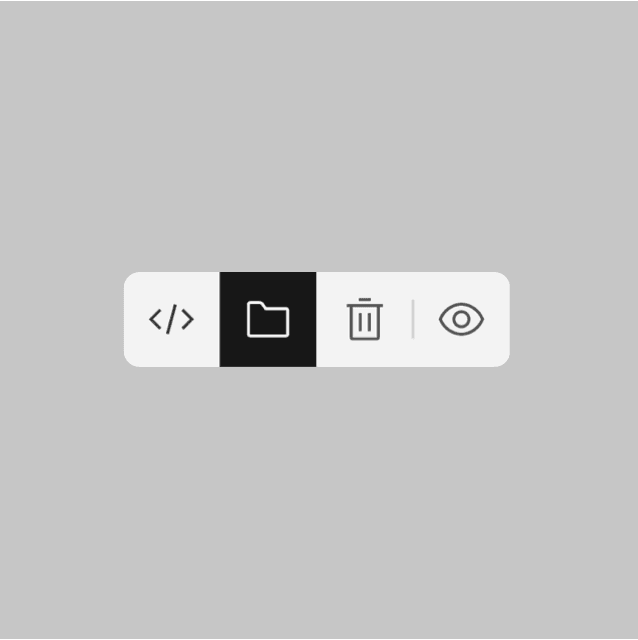
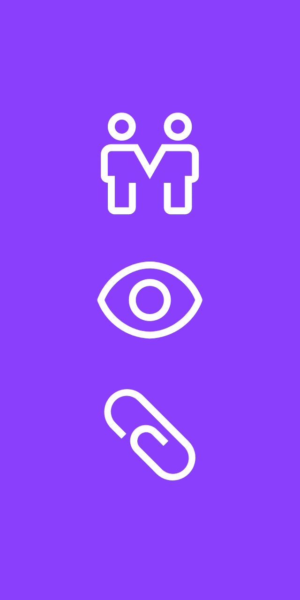
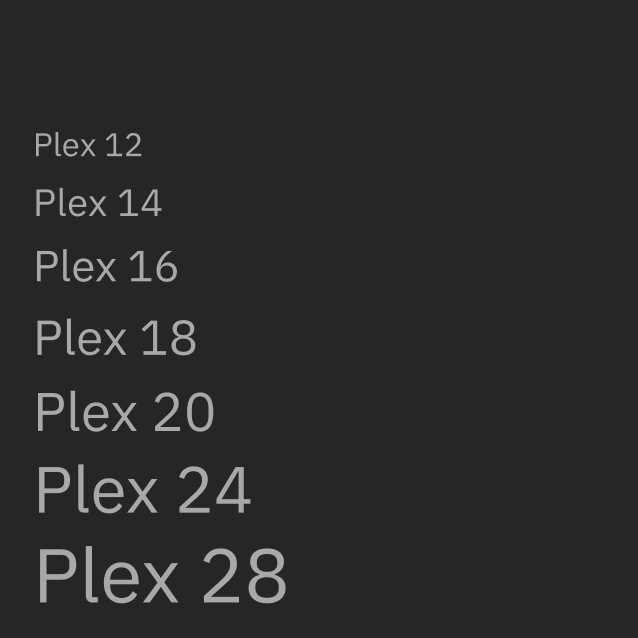

import HomepageTemplate from 'gatsby-theme-carbon/src/templates/Homepage';
import HomepageTile from '../components/HomepageTile';
import Carousel from '../components/Carousel';
import Helmet from '../components/Helmet';

export default HomepageTemplate;

import divers from '../images/homepage/divers.jpg';
import diversMobile from '../images/homepage/divers-2-1.png';

import windmills from '../images/homepage/windmills.jpg';
import windmillsMobile from '../images/homepage/windmills-2-1.png';

import { noGutterSm } from '../styles/Grid.module.scss';

<Helmet />

<Row classname='homepage-row'>
  <Column colLg={4} colMd={4} noGutterSm>
    <ImageCard
      title="Carbon components"
      href="https://www.carbondesignsystem.com/components/overview"
      actionIcon="launch"
      titleColor="dark"
      iconColor="dark"
      hoverColor="dark"
      className="card-background"
      >

   </ImageCard>
    <ImageCard
      title="Typeface"
      href="/typography/typeface"
      actionIcon="arrowRight"
      titleColor="light"
      iconColor="light"
      className="card-background"
      >

   </ImageCard>
  </Column>
  <Column colLg={4} colMd={4} noGutterSm>
    <ImageCard
      title="2x Grid"
      href="/2x-grid"
      actionIcon="arrowRight"
      titleColor="light"
      iconColor="light"
      className="card-background"
      >

   </ImageCard>
    <HomepageTile
      ratio="1:1"
      theme="dark"
      title="Carbon repo"
      actionIcon="resources"
      identityIcon="images/GitHubIcon.svg"
      link="https://github.com/carbon-design-system/carbon"
      target="_blank"
    />

  </Column>
  <Column colLg={4} colMd={4} noGutterSm>
    <ImageCard
        title="UI icons"
        aspectRatio="1:2"
        href="/iconography/ui-icons/design"
        actionIcon="arrowRight"
        iconColor="light"
        >

   </ImageCard>
  </Column>
  <Column colLg={4} colMd={4} noGutterSm>
    <ImageCard
        title="Type specs UI"
        aspectRatio="1:1"
        href="/typography/type-specs-ui"
        actionIcon="arrowRight"
        iconColor="light"
        className="card-background"
        >

   </ImageCard>
    <HomepageTile
      ratio="2:1"
      theme="dark"
      title="Sketch design kits"
      actionIcon="resources"
      identityIcon="images/SketchIcon.svg"
      link="https://www.carbondesignsystem.com/get-started/design/sketch/"
      target="_blank"
    />
  </Column>
  <Column colLg={8} noGutterSm>
  <HomepageTile
    ratio="1:1"
    image="images/product-gallery.jpg"
    actionIcon="no-icon">
    <HomepageTile
      ratio={{ default: '2:1', md: '4:1', }}
      theme="dark"
      title="Gallery"
      actionIcon="article"
      link="/gallery/"
      target="_blank"
    />
    </HomepageTile>
  </Column>
  <Column colLg={8} noGutterSm>
    <ImageCard
        title="Color"
        aspectRatio="1:1"
        href="/color"
        actionIcon="arrowRight"
        iconColor="light"
        className="card-background"
        >

   </ImageCard>

  </Column>
  <Column colLg={4} colMd={4} noGutterSm>
    <ImageCard
        title="Philosophy"
        aspectRatio="1:1"
        href="/philosophy/pov"
        actionIcon="arrowRight"
        iconColor="dark"
        titleColor="dark"
        className="card-background"
        >

   </ImageCard>

  </Column>
  <Column colLg={12} colMd={12} noGutterSm>
    <HomepageTile
      ratio={{ default: '1:2', md: '16:9' }}
      actionIcon="no-icon">
      <Carousel id="c1" count="1 2" nav={false} fade={true} autoPlay>
        
        
      </Carousel>
      <HomepageTile
        ratio={{ default: '2:1', md: '4:1', lg: '6:1' }}
        theme="dark"
        title="Photography"
        actionIcon="article"
        link="/photography/overview"
        target="_blank"
      />
    </HomepageTile>
  </Column>

</Row>

