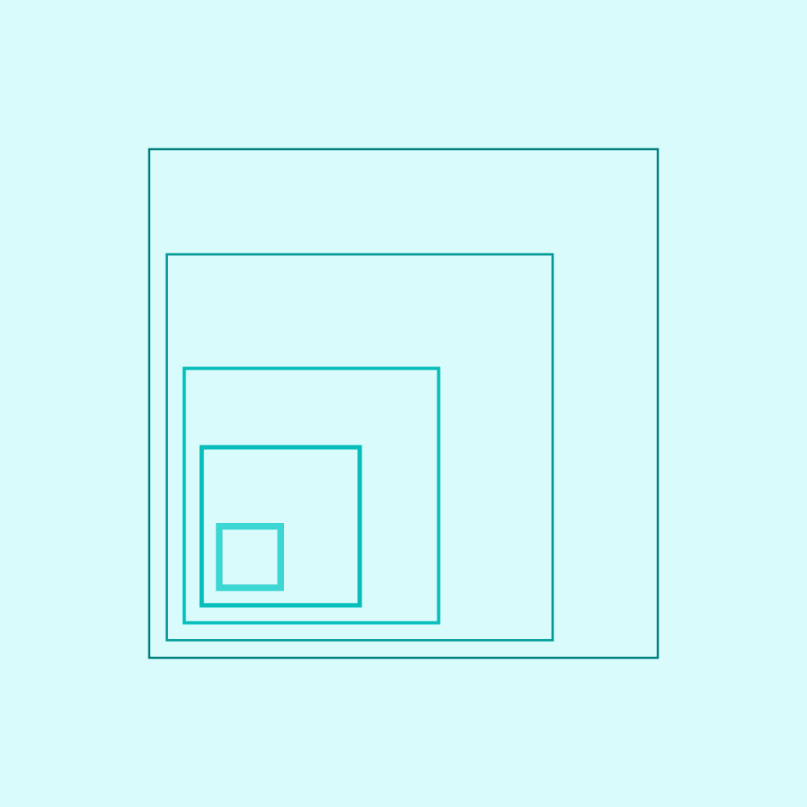

import HomepageTemplate from 'gatsby-theme-carbon/src/templates/Homepage';
import { h3 } from 'gatsby-theme-carbon/src/components/markdown/Markdown.module.scss';
import HomepageTile from '../components/HomepageTile';
import Carousel from '../components/Carousel';
import Helmet from '../components/Helmet';
import '../styles/index.scss';

export default HomepageTemplate;

<Helmet />

<Row className="image-card-group">
  <Column colLg={4} colMd={4} noGutterSm>
    <ImageCard
      title="Typeface"
      href="/typography/typeface"
      actionIcon="arrowRight"
      titleColor="dark"
      iconColor="dark"
      className="card-background"
      >

  </ImageCard>
  </Column>
  <Column colLg={4} colMd={4} noGutterSm>
    <ImageCard
        title="Philosophy"
        aspectRatio="1:1"
        href="/philosophy/pov"
        actionIcon="arrowRight"
        iconColor="dark"
        titleColor="dark"
        className="card-background"
        >

  </ImageCard>
  </Column>
  <Column colLg={4} colMd={4} noGutterSm>
    <ImageCard
        title="Color"
        aspectRatio="1:1"
        href="/color"
        actionIcon="arrowRight"
        iconColor="dark"
        titleColor="dark"
        className="card-background"
        >

  </ImageCard>
  </Column>
  <Column colLg={8} noGutterSm>
    <ImageCard
        title="Photography"
        aspectRatio="1:1"
        href="/photography/overview"
        actionIcon="arrowRight"
        iconColor="light"
        titleColor="light"
        className="card-background"
        >

  </ImageCard>
  </Column>
  <Column colLg={4} colMd={4} noGutterSm>
    <ImageCard
        title="Illustration"
        aspectRatio="1:1"
        href="/illustration/overview"
        actionIcon="arrowRight"
        iconColor="dark"
        titleColor="dark"
        className="card-background"
        >

  </ImageCard>
  <ImageCard
    title="2x Grid"
    href="/2x-grid"
    actionIcon="arrowRight"
    titleColor="dark"
    iconColor="dark"
    className="card-background"
    >

</ImageCard>
</Column>
</Row>

<h2 classname={h3}>Tools, templates and assets</h2>

<Row className="homepage-cards resource-card-group">
  <Column colMd={4} colLg={4} noGutterSm>
    <ResourceCard
      href="/typography/typeface#resources"
      title="IBM Plex® typeface latest release"
      actionIcon="arrowRight"
      aspectRatio="2:1"
      color="light"
    />
  </Column>
  <Column colMd={4} colLg={4} noGutterSm>
    <ResourceCard
      href="/color#specifications"
      title="IBM color specifications"
      actionIcon="arrowRight"
      aspectRatio="2:1"
      color="light"
    />
  </Column>
  <Column colMd={4} colLg={4} noGutterSm>
    <ResourceCard
      href="/2x-grid#2x-grid-for-video"
      title="2x Grid for video"
      actionIcon="arrowRight"
      aspectRatio="2:1"
      color="light"
    />
  </Column>
  <Column colMd={4} colLg={4} noGutterSm className="no-left-border">
    <ResourceCard
      href="/iconography/ui-icons/design#resources"
      title="UI icon resources"
      actionIcon="arrowRight"
      aspectRatio="2:1"
      color="light"
    />
  </Column>
  <Column colMd={4} colLg={4} noGutterSm className="left-border">
    <ResourceCard
      href="/iconography/pictograms/design#resources"
      title="Pictogram resources"
      actionIcon="arrowRight"
      aspectRatio="2:1"
      color="light"
    />
  </Column>
  <Column colMd={4} colLg={4} noGutterSm>
    <ResourceCard
      href="/resources#illustration"
      title="Illustration starter kits"
      actionIcon="arrowRight"
      aspectRatio="2:1"
      color="light"
    />
  </Column>
  <Column colMd={4} colLg={4} noGutterSm>
    <ResourceCard
      href="https://carbondesignsystem.com/designing/kits/figma"
      title="Carbon design kits"
      actionIcon="launch"
      aspectRatio="2:1"
      color="light"
    />
  </Column>
  <Column colMd={4} colLg={4} noGutterSm>
    <ResourceCard
      href="/help/support#questions"
      title="Questions?"
      actionIcon="arrowRight"
      aspectRatio="2:1"
      color="light"
    />
  </Column>
</Row>

<h2 classname={h3}>What’s new</h2>

<Row>
  <Column colMd={4} colLg={4} noGutterMdLeft>
    <ArticleCard
      title="IBM Plex Math"
      date="August 2024"
      href="/whats-new#ibm-plex-math"
      actionIcon="arrowRight"
      color="light"
    >

  </ArticleCard>
  </Column>
  <Column colMd={4} colLg={4} noGutterMdLeft>
    <ArticleCard
      title="IBM Plex Sans Chinese"
      date="August 2024"
      href="/whats-new#ibm-plex-sans-chinese"
      actionIcon="arrowRight"
      color="light"
    >

  </ArticleCard>
  </Column>
  <Column colMd={4} colLg={4} noGutterMdLeft>
    <ArticleCard
      title="Hybrid UI illustration style"
      date="April 2024"
      href="/whats-new#hybrid-ui-illustration-style"
      actionIcon="arrowRight"
      color="light"
    >

  </ArticleCard>
  </Column>
</Row>
